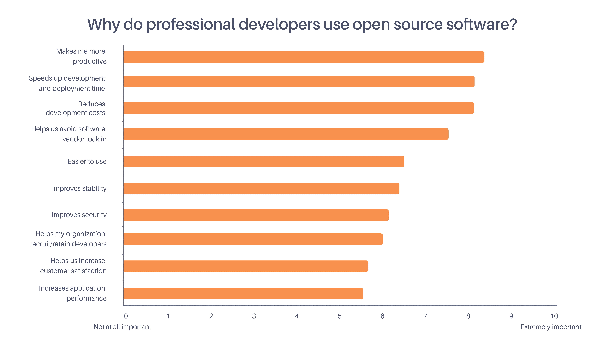
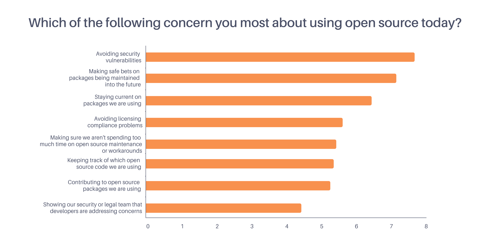
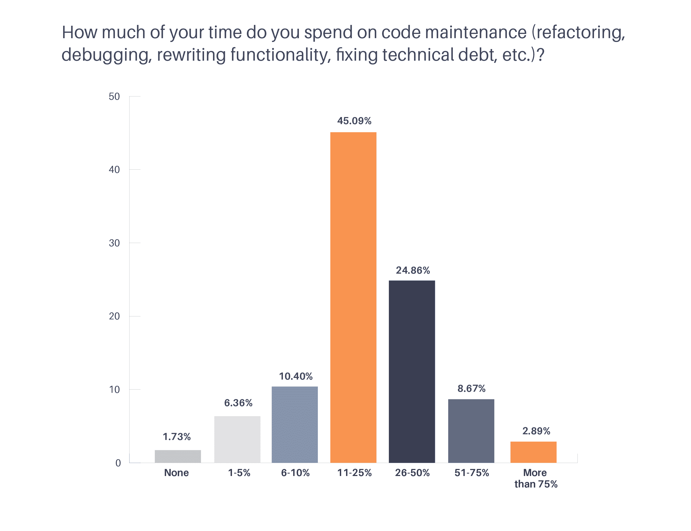

# 300 名开发人员在一项调查中发现的一些意外

> 原文：<https://thenewstack.io/a-few-surprises-300-developers-revealed-in-a-survey/>

 [克里斯克

克里斯是 Tidelift 的营销主管。Chris 在创建开源技术公司方面拥有超过 20 年的经验，包括在 Red Hat 和技术品牌代理 New Kind 各工作了 10 年，在那里他帮助创建了 Ansible、NGINX 和 Anaconda 等品牌。](https://tidelift.com/) 

对于应用开发者来说，开源已经成为开发过程中不可或缺的一部分。事实上，我们发现超过 90%的专业开发人员在构建他们的应用程序时使用开源软件。

为什么？专业开发人员认为使用开源的最大好处是什么？反过来说，最大的弊端是什么？开发人员在与他们使用的开源包相关的维护任务上花费了多少时间？

在最近的一项调查中，近 300 名专业开发人员帮助我们发现了一些令人惊讶的关于专业开发团队中开源使用趋势的新数据。以下是一些最有趣的发现。

### 发现#1:开发人员喜欢开源，因为它可以更快、更经济地完成工作

我们的调查列出了使用开源的十大理由——从*让我更有效率*到*提高应用程序性能*——并要求开发人员将它们从根本不重要(0)到极其重要(10)进行评级。我们列出的十个原因没有一个低于五分——也就是说，没有一个被认为是不重要的。在开源好处列表中名列前茅的是*让我* *更有生产力*，*加快开发和部署时间*，*降低* *开发成本*。

### 调查结果#2:对使用开源软件的担忧依然存在

尽管开发人员热爱开源，但仍有许多他们担心的地方。在我们调查的开发人员中，有三个关键领域非常突出:

1.  避免安全漏洞；
2.  对将来维护的包进行安全下注；
3.  及时了解他们正在使用的软件包。

此外，我们发现，拥有 1，000 人或更多开发团队的组织中的受访者比来自较小开发商店的受访者更关心跟踪正在使用的开源代码。

## 发现#3:代码维护花费了开发人员平均一周的 30%

我们的数据显示，开发人员平均花费 30%的时间在代码维护上(包括重构、调试、重写功能、偿还技术债务等任务),而开源贡献了大约 25%的工作量。

大型团队的开发人员比小型团队的开发人员在代码维护上花费更多的时间。虽然对于大多数开发人员来说，开放源代码只占代码维护工作的很小一部分，但近 10%的受访者表示，他们的大部分代码维护都与开放源代码有关。

## 结论

开源已经彻底改变了当今软件开发的方式，因为它帮助开发人员更快更经济地完成工作。但是尽管它很有影响力，仍然有机会让它对专业开发团队来说更有用，维护起来更容易。

想了解专业开发人员为什么使用开源软件，以及怎样才能让它变得更好？[ [下载包含所有调查结果的完整报告](https://tidelift.com/about/professional-open-source-key-insights-survey-report) ]。

<svg xmlns:xlink="http://www.w3.org/1999/xlink" viewBox="0 0 68 31" version="1.1"><title>Group</title> <desc>Created with Sketch.</desc></svg>