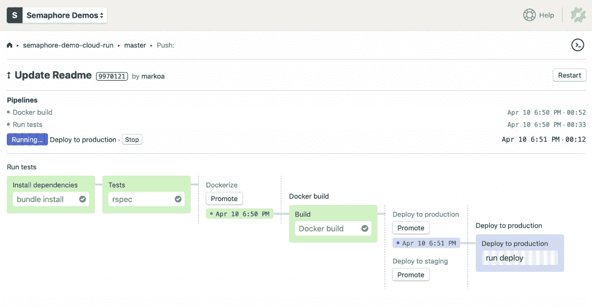
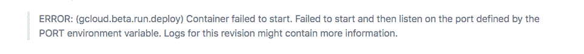
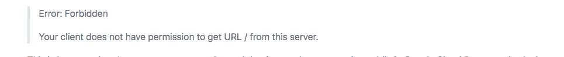
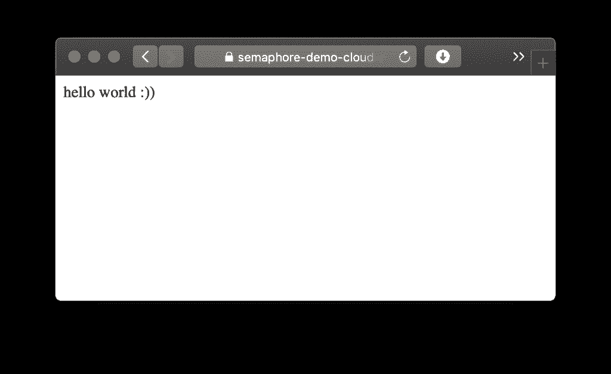

# 谷歌云运行初探

> 原文：<https://thenewstack.io/a-first-look-at-google-cloud-run/>

谷歌在本周的[Cloud Next’19](https://cloud.withgoogle.com/next/sf)大会上发布了 [Cloud Run](https://cloud.google.com/run/) ，这是一个基于 Docker containers 运行无服务器应用的新解决方案。我们现在可以说的是，这是无服务器计算的重要一步——部署到[云运行](https://thenewstack.io/comparison-aws-fargate-vs-google-cloud-run-vs-azure-container-instances/)比在 Kubernetes 上运行容器要容易得多。它也没有 Lambda 函数所具有的架构限制。

## Google Cloud Run 是什么？

 [马尔科·阿纳斯塔索夫

Marko 是一名软件开发人员，也是 Semaphore 的联合创始人，Semaphore 是一个 CI/CD 平台，为一些世界上最好的工程团队提供支持。他写了支持持续改进的实践和工具。](https://semaphoreci.com/) 

[Google Cloud Run](https://cloud.google.com/run/) 是一个完全托管的平台，它采用 Docker 容器映像，并将其作为无状态、自动扩展的 HTTP 服务来运行。

Cloud Run 与第一代无服务器平台(如 AWS Lambda、 [Google Cloud functions](https://cloud.google.com/functions/) 或 Azure functions)的区别在于，它允许您运行服务于多个端点的任意应用程序，而不是具有特定接口的小功能。

Cloud Run 基于 [Knative](https://www.knative.dev/) ，这意味着类似的解决方案可能会出现在其他托管的 Kubernetes 平台上。

## 我的项目在 Google Cloud 上运行会运行吗？

Google 发布了一个[容器运行时契约](https://cloud.google.com/run/docs/reference/container-contract)，列出了对容器的要求，包括:

*   该容器是为 64 位 Linux 编译的；
*   容器在端口 8080 上侦听 HTTP 请求；
*   可容纳高达 2GB 的内存；
*   容器实例必须在收到请求后的四分钟内启动 HTTP 服务器；
*   当容器从 0 自动缩放到多个运行实例时，您的应用程序应该可以工作；
*   所有的计算都是无状态的，并且只限于一个请求。

只要你的项目符合上面的一般要求，你就可以在 Cloud Run 上运行用任何编程语言编写的任何应用。

请注意，云运行目前处于测试阶段，因此这些要求可能会随着时间的推移而变化。

## 没有工作流程，这是一件好事

已经熟悉 Docker 或 Heroku 等传统 PaaS 解决方案的开发人员将会对 Cloud Run 如鱼得水。

一旦您的应用程序被打包到 Docker 中，您需要做的就是:

*   将容器图像推送到 Google 容器注册表；
*   运行 gcloud beta 运行部署。

几分钟之内，Cloud Run 将在您可以自定义和公开的域下提供新的应用程序。

### 示例:使用信号量的连续部署

在下面的演示中，我们将为执行以下任务的微服务配置一个带有[信号量](https://semaphoreci.com/)的[无服务器 CI/CD 管道](https://thenewstack.io/why-cloud-native-success-depends-on-high-velocity-ci-cd/):

*   运行自动化测试；
*   构建 Docker 容器；
*   将容器图像推送到 Google 容器注册表；
*   提供一键式手动部署到临时云运行环境；
*   在主 Git 分支上每次成功构建之后，自动部署到生产云运行环境。



你可以在 GitHub 上找到[该项目的完整源代码。](https://github.com/semaphoreci-demos/semaphore-demo-cloud-run)

## 启用云运行

Google 的官方[快速入门指南](https://cloud.google.com/run/docs/quickstarts/build-and-deploy)提供了开始使用 Cloud Run 的路线图。

第一步是:

*   [在你的账户上启用云运行 API](https://console.cloud.google.com/apis/library/run.googleapis.com)；
*   安装谷歌云 SDK
*   使用 gcloud components 安装测试版组件安装测试版，或者如果您之前已经使用 gcloud components update 安装了测试版组件，请对其进行更新。

## 将你的申请归档

在我们的例子中，我们将使用一个简单的 Sinatra web 应用程序，它打包了以下 docker 文件:

```
FROM ruby:2.5

RUN apt-get update  -qq  &amp;&amp;  apt-get install  -y  build-essential

ENV APP_HOME  /app
RUN mkdir  $APP_HOME
WORKDIR  $APP_HOME

ADD Gemfile*  $APP_HOME/
RUN bundle install  --without development test

ADD  .  $APP_HOME

EXPOSE  8080

CMD  ["bundle",  "exec",  "rackup",  "--host",  "0.0.0.0",  "-p",  "8080"]

```

在修改您现有的 docker 文件时，确保应用程序在端口 8080 上运行可能是您需要做的唯一更改。如果不这样做，您可能会看到如下错误:



## 向 Google 云和容器注册中心认证(GCR)

为了在 CI/CD 管道中自动将 Docker 图像推送到 GCR，Semaphore 需要通过 Google Cloud 认证。为了安全地做到这一点，我们需要基于 Google 云服务帐户的认证密钥创建一个信号量秘密。

一旦你[获得了你的认证密钥](https://cloud.google.com/iam/docs/creating-managing-service-account-keys#iam-service-account-keys-list-gcloud)，使用信号量 CLI 将它作为秘密上传到信号量上。这个秘密应该定义一个文件，姑且称之为‌.secrets.gcp.json:

```
sem create secret google-cloud-stg  --file  ~/Downloads/account-name-27f3a5bcea2d.json:.secrets.gcp.json

```

## 定义交付管道

我们现在可以编写一个信号量管道，它构建、标记并推送一个 Docker 容器到 GCR:

```
# .semaphore/docker-build.yml
# This pipeline runs after semaphore.yml
version:  v1.0
name:  Docker build
agent:
  machine:
    # Use a machine type with more RAM and CPU power for faster container
    # builds:
    type:  e1-standard-4
    os_image:  ubuntu1804
blocks:
  -  name:  Build
    task:
      # Mount a secret which defines an authentication key file.
      # For info on creating secrets, see:
      # - https://docs.semaphoreci.com/article/66-environment-variables-and-secrets
      # - https://docs.semaphoreci.com/article/72-google-container-registry-gcr
      secrets:
        -  name:  google-cloud-stg
      jobs:
      -  name:  Docker build
        commands:
          # Authenticate using the file injected from the secret
          -  gcloud auth activate-service-account  --key-file=.secrets.gcp.json
          # Configure access to container registry, silence confirmation prompts with -q
          -  gcloud auth configure-docker  -q

          -  checkout

          # Tag your images with gcr.io/ACCOUNT_PROJECT_NAME/SERVICE_NAME pattern
          # Use Git SHA to produce unique artifacts
          -  docker build  -t  "gcr.io/semaphore2-stg/semaphore-demo-cloud-run:${SEMAPHORE_GIT_SHA:0:7}"  .
          -  docker push  "gcr.io/semaphore2-stg/semaphore-demo-cloud-run:${SEMAPHORE_GIT_SHA:0:7}"

promotions:
  # Deployment to staging can be trigger manually:
  -  name:  Deploy to staging
    pipeline_file:  deploy-staging.yml

  # Automatically deploy to production on successful builds on master branch:
  -  name:  Deploy to production
    pipeline_file:  deploy-production.yml
    auto_promote_on:
      -  result:  passed
        branch:
          -  master

```

deploy-staging . yml 和 deploy-production.yml 中定义的管道运行相同的步骤，不同之处在于服务的名称。

下面是生产部署的运行方式:

```
# .semaphore/deploy-production.yml
# This pipeline runs after docker-build.yml
version:  v1.0
name:  Deploy to production
agent:
  machine:
    type:  e1-standard-2
    os_image:  ubuntu1804
blocks:
  -  name:  Deploy to production
    task:
      secrets:
        -  name:  google-cloud-stg
      jobs:
      -  name:  run deploy
        commands:
          -  gcloud auth activate-service-account  --key-file=.secrets.gcp.json
          -  gcloud auth configure-docker  -q

          # Deploy to Cloud Run, using flags to avoid interactive prompt
          # See https://cloud.google.com/sdk/gcloud/reference/beta/run/deploy
          -  gcloud beta run deploy markoci-demo-cloud-run  --project semaphore2-stg  --image gcr.io/semaphore2-stg/markoci-demo-cloud-run:${SEMAPHORE_GIT_SHA:0:7}  --region us-central1

```

## 上线

本地终端或信号量作业中部署日志的最后一行将包含新应用程序所在的 URL，例如:

```
https://semaphore-demo-cloud-run-ud2bmvsmda-uc.a.run.app.

```

第一次打开网址时，您会看到:



这是因为还有一个步骤要做，那就是[在 Google Cloud Run 控制台中公开](https://cloud.google.com/run/docs/securing/managing-access#making_a_service_public)您的服务。瞧:



## 包扎

希望这篇文章已经启发了你用一个良好的 CI/CD 管道来构建和发布一些东西到 Google Cloud Run。下一步就看你的了。

<svg xmlns:xlink="http://www.w3.org/1999/xlink" viewBox="0 0 68 31" version="1.1"><title>Group</title> <desc>Created with Sketch.</desc></svg>