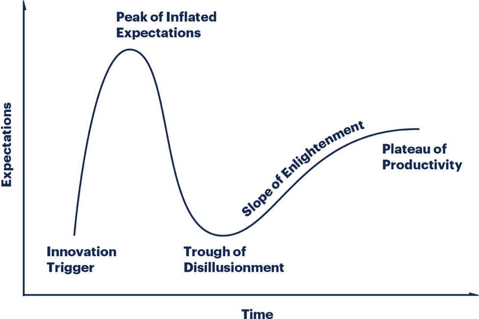

# SREs 和 Kubernetes 什么时候值得，什么时候不值得

> 原文：<https://thenewstack.io/a-google-engineer-on-when-an-sre-and-kubernetes-are-and-not-worth-it/>

[Wojtek cicho](https://semaphoreci.com/)

[Wojtek 正在 Semaphore 连接营销和客户关系之间的点。在职业上，他喜欢与现代技术的创造者和动摇者密切合作。在业余时间，他写并表演口语诗。](https://semaphoreci.com/)

Seth Vargo 是谷歌的开发者关系工程师。他之前在 HashiCorp、Chef Software、CustomInk 和一些匹兹堡的初创公司担任软件开发职务。瓦戈热衷于减少技术上的不平等，他也是《学习厨师》的作者。

在这次采访中，我们讨论了谷歌的网站可靠性工程(SRE)，Kubernetes 炒作，以及在大规模部署可靠软件时应该关注什么。

**你花了很多时间解释和宣扬 SRE、开发运维工程师和系统管理员之间的角色差异。在谷歌 SRE 登陆页面上，人们可以读到，“当你把运营当作软件问题来对待时，你就会得到 SRE”，以及“我们的工作是一个在行业其他地方找不到的组合。”SRE 仅仅是谷歌的事情吗？SRE 在其他公司是如何表现的(如果有的话)？**

每个人都有自己的神奇数字。对我来说，是 25。我认为任何超过 25 名员工的[软件]公司可能都需要 SRE 的支持。在公司生命周期的某个时刻，维护正常运行时间和可用性成了某人的全职工作。因此，当你是一家小型初创公司时(我曾为其中许多公司工作过)，你会做一些运营或系统管理工作，开发或营销——你差不多什么都做。随着组织规模的扩大，在某个点上你必须专业化，在这个点上你不再是一个多面手。显然，在像你提到的脸书和谷歌这样的大公司，这是非常正确的。但即使在中型创业公司也是如此——一旦你达到 25-50 人的规模，你就必须有专注于营销的人；你必须有一个关注正常运行时间和可用性的人。当你有两三个全职人员致力于正常运行时间和可用性时，你必须开始考虑像 SRE 这样的东西。当只有一个人时，他们拥有整个事情，他们不必与利益相关者合作，因为他们是主要的决策者。但是，当你开始得到两个、三个、五个或五千个时，你就需要有一个框架，这就是像 SRE 这样的公司可以帮忙的地方。

在你加入谷歌之前工作过的公司里，工程和运营团队与产品和销售等其他团队合作是自然的吗？是这样吗？

在真正的小公司里，每个人都做所有的事情。当你开始进入 20-30 人的公司时，开发运维几乎是自然而然的事情。因为没有历史知识，几乎是被迫的合作——尤其是在初创公司，因为你是第一次做所有的事情。随着公司的发展，采用自动化和代码化变得越来越重要，而且关注可靠性和客户比交付下一个功能更重要。

你还必须记住，许多初创公司专注于收入驱动的开发或用户获取驱动的开发，因为他们得到了一些资金，他们有那么多钱来建立一些东西或证明一些东西。然后，他们要么需要变得有利可图，要么需要证明他们值得获得更多的钱——特别是在美国，但这在任何地方都很常见。当一家初创公司启动时，让这笔钱持续下去是非常重要的。如果你是一家自助创业公司，你可能负担不起全职 SRE，因为你没有足够的用户来真正保证它。

> 我认为任何超过 25 名员工的[软件]公司可能都需要 SRE 的支持。

我总是喜欢问这样一个问题，“如果你在你的用户所在的时区一夜之间宕机，有多少用户会注意到？“如果脸书或谷歌半夜宕机，人们会注意到，因为它们是全球性公司。但是，如果您的所有用户都在一个时区，而您在凌晨 4:00 大家都睡着了的时候进行维护，那么有多少用户会申请支持票呢？如果答案是少于你的用户群的百分之一，那么你可能不需要一个全职的 SRE。在工作时间，人们可以解决事件，所以你不需要有人在晚上待命。一旦您的服务扩展，或者一旦您有一个 SLA 说，“我们将 100%的时间可用”，这就是您必须将这些类型的 SRE 角色引入组织的地方。

在你的职业生涯中，你曾为 DevOps 领域的技术领导者工作过:HashiCorp、Chef Software 和现在的 Google。我在 [Semaphore](https://semaphoreci.com/) 工作，在那里我们经常强调我们“为快乐而优化”,我们从我们的客户那里听到一个灵活和可配置的 CI/CD 管道如何改善整个团队的生活，并且是一个实际的推动者。当处理被称为测试/部署/维护的软件开发周期中的步骤时，还有什么是重要的？

我认为最重要的是“可观察性”传统的监控、日志记录和警报基于“写一些日志和收集一些指标”我们现在在行业中看到的是围绕可观察性的标准化，例如[开放普查](https://opencensus.io/)，在这种情况下，尤其是在微服务中，仅仅抛出一些日志消息是不够的。当一个用户向你的服务发出请求时，可能会有 10 个不同的后端服务需要做不同的操作。想象你在做一些在线电子商务网站。用户来到主页，需要点击订单推荐系统、登录他们的认证系统，需要调出他们的用户偏好，需要挑选他们最近购买的商品，这可能涉及 30、40 甚至 100 项微服务。你需要测量它们之间的延迟。您可能需要测量这些微服务中的单个函数调用，以找出性能问题发生在哪里，当这种情况反馈给用户时，您需要测量这会对用户产生多长时间的影响。

在这里，仅仅在数据库中添加几行日志是不够的，我们需要一个标准的度量标准。我们需要一种标准的方式来谈论可观察性，然后我们需要将它放在一个可以快速进行过滤和分析的系统中，这样，如果有支持票，或者如果我们开始遇到 SLI 和 SLA 障碍，很明显这就是系统的漏洞所在。如果你有一个五分钟的错误预算，它不可能花你 10 分钟去发现问题；如果你花了 10 分钟，你已经大大超过了你的误差预算。当您超出 SLA 时，只要其中一个警报响起，您就需要能够非常快速地向下钻取以找到根本原因，以便您可以快速恢复，因为否则，您只是在消耗您的错误预算。

**所以，可观察性也是关于这个反馈循环的，你可以快速获得信息，并且对你用系统做的事情感到安全？**

是的—金丝雀测试和蓝绿色部署，以及 A/B 测试。想象一下，你正在推出一个新特性，你感到害怕，因为它可能是一个模式迁移或引入一些可能使数据库过载的新功能。在这种情况下，您可以做一个蓝绿色的部署，其中只有 10%的用户获得了该功能，然后您可以使用可观察性来查看这是一个活跃的实验；它只增加了 1%的数据库使用量，所以如果我们在每个人身上都增加，那只会增加 9%的整体使用量，所以我们很可能会继续这个实验。但是如果你没有那种可观察性，那么做蓝绿色部署并不能真正帮助你。

我认为很多顾客认为理所当然的第三件事是社交媒体。有些情况下，社交媒体会在原始监控之前提醒我们注意某个问题。这通常是我们没有监控或观察到的情况…

**或者通常你的营销团队就是这样做的，他们认为如果有什么东西坏了，基础设施团队已经知道并会解决它？**

我给你举一个最近在 2018 年谷歌发生的非常好的例子。一家互联网服务提供商意外导致 BGP 泄漏。任何通过互联网服务提供商解决问题的人都无法访问 Gmail、Google Drive 或云服务。谷歌并不控制下游的互联网服务提供商，但这种错误的配置导致世界各地和不同地区的许多用户无法访问谷歌服务。虽然谷歌对此类事件有内部监控和警报，但社交媒体让事件的规模和影响更加清晰。

**真有意思。你花了多长时间才真正找到原因？**

我们很快就找到了原因。我们所要做的就是跟踪实际发生的数据包，并查看它们没有到达我们的服务器的地方。尤其是对于刚起步的中小公司，你不知道观察什么；你不知道要监控什么。社交媒体实际上是你建立品牌和让你的用户接触到你的一个非常好的方式，但它也是你的用户告诉你什么时候坏了的一个非常好的方式。你所有的正常运行时间可能都很好，但是如果你的 CDN 宕机了，你的用户会有不好的体验，社交媒体是他们告诉你这一点的好方法。

**在[你 2015 年在](https://www.youtube.com/watch?v=oT7-L6Oe4Tg)克拉科夫的演讲中，你讨论了 DevOps 是一种时尚还是被市场营销和人力资源利用的时髦词汇。在这样做的时候，你提到了 [Gartner 炒作周期](https://www.gartner.com/en/research/methodologies/gartner-hype-cycle)。考虑到这个图表，你认为我们可以在 2019 年将 Kubernetes 放在哪里？**

这是一个棘手的问题。我认为对于大型企业来说，Kubernetes 现在真的处于启蒙阶段。他们经历了定制、安装和更新应用程序的痛苦。Kubernetes 还有另一部分，那就是仅仅有 Kubernetes 是不够的；你还必须拥有我们所说的“云原生应用”你必须拥有在容器化世界中表现良好的应用程序。我认为大企业现在真的开始看到这样做的好处了。他们花了两三年的时间来构建云原生应用(或将现有应用改写为云原生应用)，并真正大规模了解 Kubernetes。我认为对于中小型创业公司来说，他们仍然处于膨胀的期望的顶峰，即将触及幻灭的低谷。

我看到[这条惊人的推文](https://twitter.com/dexhorthy/status/856639005462417409)在一辆巨大的平板卡车后面有一辆小玩具卡车，上面写着“这是我在 Kubernetes 上的博客。”我觉得真的很准。我认为有很多初创公司正在关注这个问题，他们认为他们需要 Kubernetes。你还没有达到有意义的规模。如果你有两个微服务，Kubernetes 会带来 100 个。你增加了 2000%的服务数量，却没有任何实际收益*(注意:夸张)*。如果你看看 Gartner 的炒作周期，我会说大型公司从中获得了很多好处，中小型公司慢慢意识到维护集群的负担不一定值得正常运行时间和自动重启，以及随之而来的所有东西。

这又回到了我们之前的对话:什么时候拥有 SRE 有意义？我认为 Kubernetes 没有意义，除非有专门的 sre 也有意义。总得有人维持 Kubernetes 的运营。如果你使用的是云提供商——一些受管理的、有正常运行时间的东西——我认为这会把 Kubernetes 推向右边一点，即使你是一个小的创业公司。同样值得注意的是，这些服务的成本很高。对于一家小公司来说，跨所有云的 Kubernetes 集群的平均月成本至少为 300 美元，而您可以在一台虚拟机上运行，其成本仅为该成本的三分之一。还是那句话，回到预算和资金上来，有好处，但是你真的要搞清楚是否值得。

**作为一名开发者倡导者，你会和很多从业者交谈，但我相信你也会从高级软件开发人员和从事业务相关工作的人那里得到很多反馈。当谈到软件的可交付性、维护和可伸缩性时，你从他们那里听到的最普遍的担忧是什么？**

产品团队通常很难理解可靠性。许多产品负责人倾向于“我的功能在哪里？”态度。修复漏洞和提高可靠性并不是他们关注的重点。这就是误差预算和 SRE 模型的由来。如果产品所有者有他们的方式，你会一直发布你的特性。但是 SREs 需要能够反过来说，“你交付的最后 10 个特性很棒，但是它们有一些 bug。如果你一直交付有缺陷的特性，最终系统会变得太不可靠。”

[https://www.youtube.com/embed/oT7-L6Oe4Tg?feature=oembed](https://www.youtube.com/embed/oT7-L6Oe4Tg?feature=oembed)

视频

<svg xmlns:xlink="http://www.w3.org/1999/xlink" viewBox="0 0 68 31" version="1.1"><title>Group</title> <desc>Created with Sketch.</desc></svg>