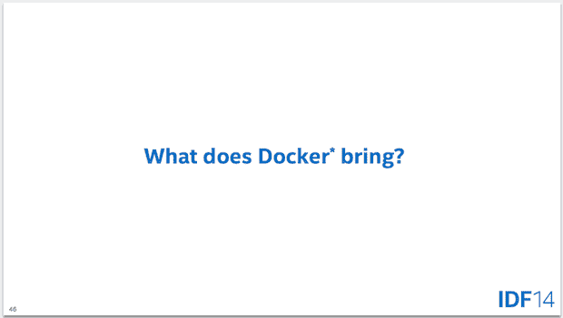
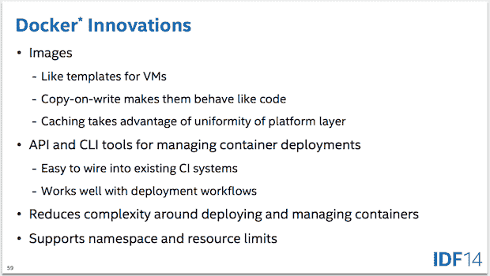

# Docker 的精彩介绍，以及它的发展方向

> 原文：<https://thenewstack.io/a-great-introduction-to-docker-and-where-its-all-going/>

自从 2013 年 3 月项目发布后不久，我就一直关注着 [Docker](https://github.com/docker/docker) 的发展。我最早与 Docker 相关的记忆，尽管是模糊的记忆，是在项目发布后的一个月，在 Cloud Connect Santa Clara 听取了该项目的创始人所罗门·海克斯(Solomon Hykes)的简报。我提到所有这些只是想说，我已经参加了我的一部分 Docker 演示和简报，包括最近在公司的举行的 [Docker 的几次，有史以来第一次](https://www.docker.com/) [DockerCon](http://www.dockercon.com/) 。

正是有了这样的经历，或者说尽管有这样的经历，我还是在上周的英特尔开发者论坛上聆听了英特尔云平台事业部首席云架构师 Nicholas Weaver 的 Docker 演讲。只要说我的时间是值得的就够了；Nick 的演讲“裸机、Docker 容器和虚拟化:云应用的增长选择”可能是我迄今为止听到的关于 Docker 和容器的最好的演讲，我学到了很多。

我认为尼克解释得特别好的一件事是我称之为“码头工人的思想史”如果您关注 Docker 的时间很短，那么您可能听说过 Docker 是“Linux 容器”VMware、Red Hat 和其他没有发明 Docker 的大公司似乎有意将这个想法灌输到你的头脑中。

然而，很明显，Docker *事实上不仅仅是 Linux 容器。但是，如果你不是一个铁杆 Linux 管理员，像我一样，你可能不知道如何准确区分。*

Nick 很好地解释了 Linux 容器到底是做什么的，它们擅长什么和不擅长什么，以及导致 Docker 发明的一些基于容器的创新，包括 Google 的`lmctfy`项目(让我来为你包含它)，这是我以前没有听说过的。

有了对 Linux 容器的概述，以及对它们的优点(更快的生命周期和有限的开销)和缺点(配置复杂性和较弱的安全隔离)的理解，我们就可以开始钻研并真正理解 Docker 带来了什么。幸运的是，尼克有一张幻灯片，或者十张。

他继续解释说，尽管大肆宣传，Docker 真正做的并不是魔术，而是一些非常简单但非常有用的创新，使普通开发人员也能使用容器。

尼克以一个关于集装箱和安全的讨论结束了他的演讲。(如果您参加了他的演讲，您现在应该知道不应该谈论“Docker 和安全性”，以及如何通过在租户之间提供更坚固的隔离来使用虚拟机来补充容器。

最后，他简要讨论了英特尔希望增强容器使用体验的一些方法，包括通过确保容器可以利用其高级加密标准新指令(AES-NI)、可信执行技术(TXT)和软件保护扩展(SGX)来增强安全性，以及通过允许容器利用其虚拟化技术(VT)扩展来提高性能和灵活性，从而实现更好的容器性能和更简单的容器实施。

你可以在这里下载 Nick 的演示，但是如果没有笔记，它就没有现场演示有用。你应该[在推特](https://twitter.com/lynxbat)上关注他，让他发布一个配音版。

或者，更好的是，你应该和我一起参加即将在纽约市 Interop 举行的云连接峰会，我将担任主持人，并邀请他发表演讲！

Nick 将于 10 月 2 日星期四上午在**“后云时代:Google、DevOps 和 Docker 汇聚之地”**发表主题演讲，他将分享他对未来发展的愿景。以下是他演讲的概述:

> 云技术的前景正在改变。我们有死胡同和新路的混合体。容器、DevOps、PaaS 等新概念正在改变我们看待云计算的方式。Nicholas Weaver 将揭开神秘面纱，讲述这些概念如何揭示私有云的下一次发展。这是一个建立在谷歌等超大规模公司的经验教训基础上的，但私有云 99%可以实现。

如果你能加入我们，我相信你不会失望的。如果您决定参加，请成为我们的客人，使用促销代码 **SPEAKERDISCOUNT** 享受 25%的现场外注册费。

<svg xmlns:xlink="http://www.w3.org/1999/xlink" viewBox="0 0 68 31" version="1.1"><title>Group</title> <desc>Created with Sketch.</desc></svg>