# OpenStack 千开发者贡献指南

> 原文：<https://thenewstack.io/a-guide-openstack-kilo-developer-contributions/>

**Editor’s Note**

:OpenStack 是近期历史上最大的开源项目之一。它是用 Python 编写的，以六个月的发布周期工作，项目的每个组件都以自己的速度开发。Github 展示了 OpenStack 的广度，超过 100 个项目是整个生态系统的一部分。涵盖所有这些项目远远超出了我们的范围。相反，新的堆栈专注于 OpenStack 生态系统中的 12 个集成项目，它们是

[Kilo](http://www.openstack.org/software/kilo/press-release)

，2015 年 4 月 30 日发布。我们的社区经理兼数据研究主管 Atul Jha 分析了

[blueprints](https://wiki.openstack.org/wiki/Blueprints)

从这些集成中展示 OpenStack 的一些最重要的发展。

本周，OpenStack 将在不列颠哥伦比亚省的温哥华举办一年两次的活动。在此次活动中，设计峰会重点关注 OpenStack 的技术方向。从这些讨论中，开发人员开始制定蓝图，将新特性集成到未来的版本中。他们还讨论了需要的错误和修复。 [Liberty](https://wiki.openstack.org/wiki/Liberty_Release_Schedule) 是下一个版本，计划于 2015 年 10 月 15 日发布。

Atul 在 OpenStack 上有几年的工作经验。他是最早的文档核心贡献者之一。他在 2011 年 4 月第三版 [Cactus](https://wiki.openstack.org/wiki/ReleaseNotes/Cactus) 发布后，就在 [Bexar](https://wiki.openstack.org/wiki/ReleaseNotes/Bexar) 发布后，开始从事 OpenStack 的工作。他是印度的社区领袖之一。在此分析中，他研究了社区添加的一些更有趣的功能，以及那些为项目健康提供最大整体优势的功能，并与之前的版本 OpenStack 的 Juno 进行了比较。

## 新星

*   [Nova](https://wiki.openstack.org/wiki/Nova) 是 OpenStack 的计算部分。
*   它的蓝图表明该项目已经增加了 45 项新功能。
*   在以前的版本中，Juno，Nova 增加了 50 个功能。

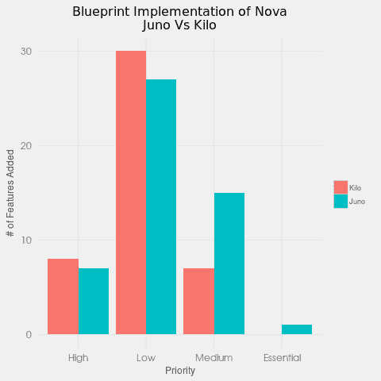
兴趣的新特性:

*   启用 EC2 API 独立服务的附加功能。
*   Nova REST API 的微版本支持。
*   它尊重关于移民和疏散的反亲缘政策。

点击这里查看完整的[蓝图](https://blueprints.launchpad.net/nova/kilo)列表。

## 闪光

*   [Glance](https://wiki.openstack.org/wiki/Glance) 是 OpenStack 项目的图像库。
*   根据 Glance 蓝图，已经实现了 21 项新功能。
*   在以前的版本中，Juno，Glance 仅增加了 5 项功能。

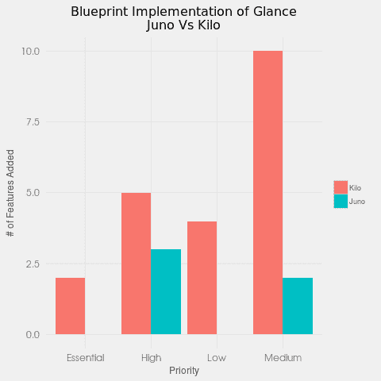
感兴趣的新功能:

*   扫视排序增强。
*   用于 API 改进的目录索引服务。
*   增加了存储驱动程序的功能。

点击这里查看完整的[蓝图](https://blueprints.launchpad.net/glance/kilo)列表。

## 迅速发生的

*   [Swift](https://wiki.openstack.org/wiki/Swift) 是 OpenStack 的对象存储组件。
*   这是 OpenStack 最初推出时的核心项目之一。
*   需要注意的是，Swift 遵循自己的发布周期。
*   根据 Swift 的蓝图，仅实施了 3 项新功能。
*   在之前的版本中，Juno Swift 增加了 15 项功能，其中大多数功能集的优先级未定义。

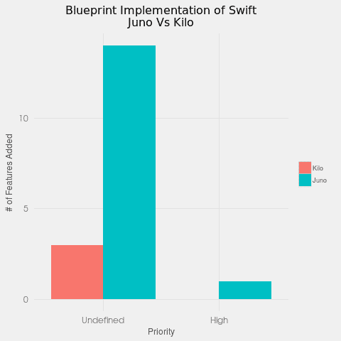

有趣的新功能:

*   迅捷环过载概念。
*   将 ratelimit 黑/白列表更改为使用 sysmeta。
*   修复大型不同步、过时的容器。

点击这里查看完整的[蓝图](https://blueprints.launchpad.net/swift/kilo)列表。

## 地平线

*   [Horizon](https://wiki.openstack.org/wiki/Horizon) 是 OpenStack 仪表盘，用于管理和配置整个生命周期管理。
*   它是用 Python/Django 框架编写的。
*   根据 Horizon 蓝图，已经实施了 39 项新功能。
*   在之前的版本 Juno 中，Horizon 增加了 53 项功能。

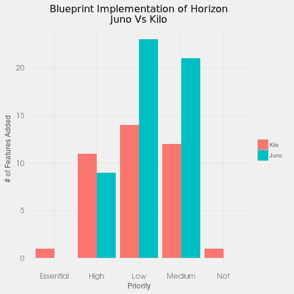

有趣的新功能:

*   通过 WebSSO 的联合身份。
*   支持域管理员登录。
*   启用将租户中的路由器与防火墙资源相关联。

点击此处查看完整的[蓝图](https://blueprints.launchpad.net/horizon/kilo)列表。

## 拱顶石

*   [Keystone](https://wiki.openstack.org/wiki/Keystone) 是 OpenStack 的认证组件。
*   根据 Keystone 蓝图，已经实现了 25 项新功能。
*   在以前的版本 Juno 中，Keystone 增加了 23 项功能。

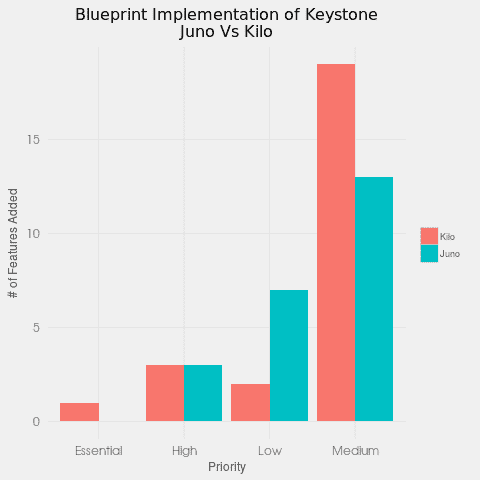

有趣的新功能:

*   在 LDAP 后端实现列表过滤。
*   支持在 SQL 中存储特定于域的配置的扩展。
*   分层多租户。

点击此处查看完整的[蓝图](https://blueprints.launchpad.net/keystone/kilo)列表。

## 中子

*   [中子](https://wiki.openstack.org/wiki/Neutron)驱动 OpenStack 的联网组件。
*   根据中子蓝图，已经实现了 44 项新功能。
*   在以前的版本中，Juno，Neutron 增加了 53 个功能。

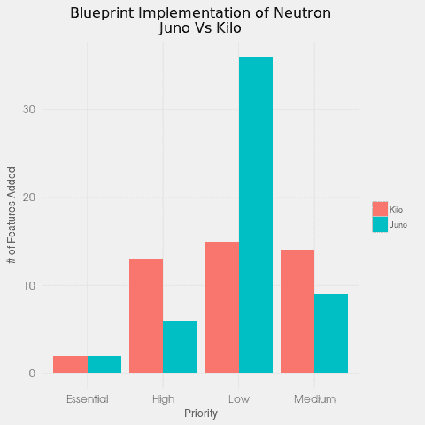

有趣的新功能:

*   允许特定的浮动 IP 地址。
*   向 ML2 OVS 机制驱动程序添加端口安全支持。
*   DHCP 服务负载平衡计划程序。

点击这里查看完整的[蓝图](https://blueprints.launchpad.net/neutron/kilo)列表。

## 煤渣

*   Cinder 项目旨在为实例提供持久存储。
*   根据 Cinder 的蓝图，已经实现了 75 项新功能。
*   在以前的版本中，Juno，Cinder 增加了 30 个功能。

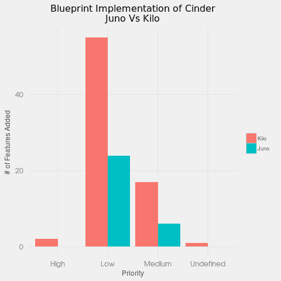

有趣的新功能:

*   加密卷的备份支持。
*   煤渣物体介绍。
*   将单个卷连接到多个主机。

点击这里查看完整的[蓝图](https://blueprints.launchpad.net/cinder/kilo)列表。

## 遥感勘测

*   [遥测](https://wiki.openstack.org/wiki/Ceilometer)项目旨在为各种 OpenStack 组件提供计量服务。
*   根据遥测蓝图，已经实现了 24 项新功能。
*   在以前的版本 Juno 中，遥测增加了 26 项功能。

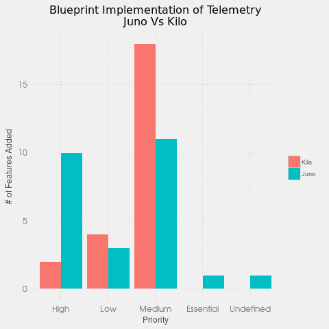

感兴趣的特征:

*   添加磁盘计数器:容量、使用和分配。
*   为卷/快照添加了新的通知类型。
*   能够在云高仪中设置警报的严重级别。

点击这里查看完整的[蓝图](https://blueprints.launchpad.net/ceilometer/kilo)列表。

## 热

*   [Heat](https://wiki.openstack.org/wiki/Heat) 旨在为 OpenStack 组件提供基于模板的编排以及组件的整体生命周期管理。
*   根据 Heat 蓝图，已经实现了 42 项新功能。
*   在之前的版本中，Juno，Heat 增加了 30 个功能。

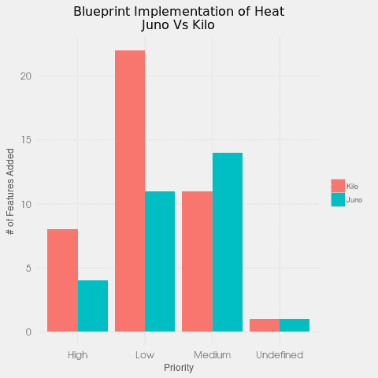

有趣的新功能:

*   快速多区域散热支持。
*   重试失败的 API 调用。
*   支持 Cinder API 版本 2。

点击这里查看完整的[蓝图](https://blueprints.launchpad.net/heat/kilo)列表。

## 有价值的藏品

*   [Trove](https://wiki.openstack.org/wiki/Trove) 项目旨在为关系和非关系数据库引擎提供云数据库即服务供应功能。
*   根据 Trove 蓝图，已经实现了 11 项新功能。
*   在之前的版本中，Juno，Trove 增加了 14 个特性。

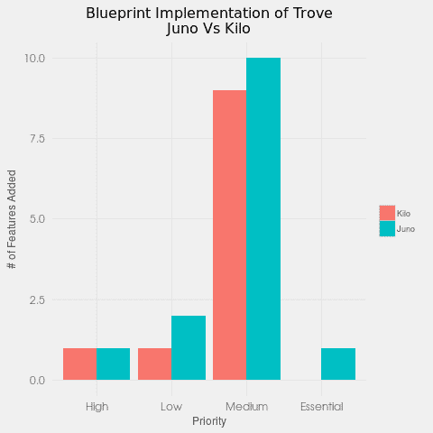

有趣的新功能:

1.  从 Oslo RPC 迁移到 oslo.messaging
2.  复制 V2 功能:手动故障转移、从属计数和增量快照。
3.  将实例名称作为参数添加到各种 CLI 命令中。

点击这里查看完整的[蓝图](https://blueprints.launchpad.net/trove/kilo)列表。

## 撒哈拉沙漠(位于非洲北部)

*   Sahara[项目提供了一种在 OpenStack 上配置数据密集型应用集群(Hadoop 或 Spark)的简单方法。](https://wiki.openstack.org/wiki/Sahara)
*   根据撒哈拉蓝图，已经实施了 52 项新功能。
*   在以前的版本中，Juno，Sahara 增加了 32 个功能。

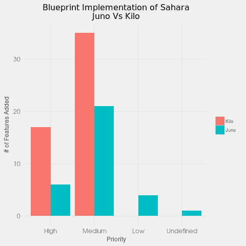

有趣的新功能:

*   像其他 OpenStack 项目一样支持 auth 策略。
*   撒哈拉 HTTPS 支持。
*   为 smth 的无限轮询添加超时。

点击此处查看完整的[蓝图](https://blueprints.launchpad.net/sahara/kilo)列表。

## 讽刺的

*   [讽刺](https://wiki.openstack.org/wiki/Ironic)旨在提供裸机而非虚拟机，从 Nova 裸机驱动程序派生而来。
*   它作为一个集成项目被添加到 OpenStack 的 Kilo 版本中。
*   我们将该特性集与 Juno 版本进行了比较，当时它还是一个孵化项目。
*   根据撒哈拉蓝图，已经实施了 26 项新功能。
*   在之前的版本中(虽然它是一个孵化项目)，Kilo，Ironic 增加了 23 个特性。

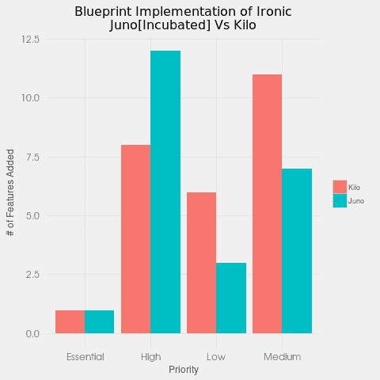

有趣的新功能:

*   使用节点集供应状态发现节点属性。
*   讽刺的驱动程序支持分区镜像的本地引导。
*   允许司机有自己的定期任务。

点击这里查看完整的[蓝图](https://blueprints.launchpad.net/ironic/kilo)列表。

## 定论

[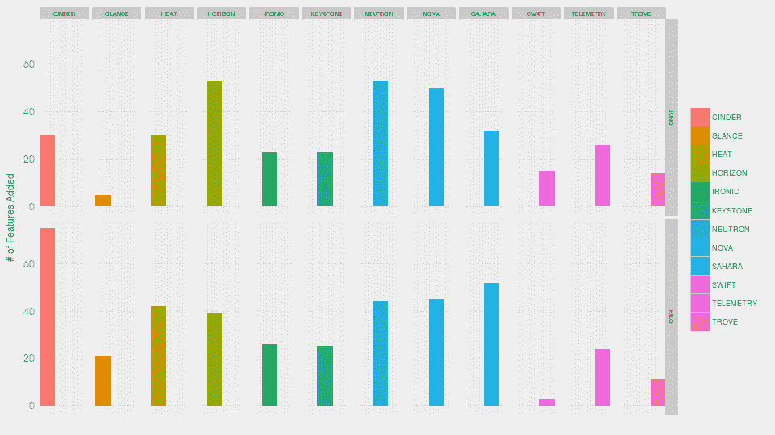](https://thenewstack.io/wp-content/uploads/2015/05/Total.png)

Cinder 在 OpenStack 的 Kilo 版本中添加了最多的功能，而 Swift 显示了最少的功能。

特色图片[通过](https://www.flickr.com/photos/footloosiety/3167485721/in/photolist-5PUc9M-93We9q-93ThvB-93WkNL-93ThdZ-93Tdm6-7GMzHk-7GMdMM-7GM6kD-7EhSFj-fboay8-9Jf5Fj-7GPFsB-78ifeY-7GMkEn-7GzXXt-7FfGw4-eX8w2q-8HeLsV-7GPsKX-eSBnPL-7GTtPy-btrJFT-7GKcPg-7GTxyh-pQx3Ac-6REUsT-7GDpGq-7EAwC1-frYHZe-8VJNDr-93Wk1A-7Eb7nY-7GP683-92j41f-93TcZg-easUAU-7GkAYj-7FgnUx-frYJAp-fses1A-7GRoSh-93T958-ophdEw-8VMRdU-8SdoJ3-cNDFfU-7GPb6m-7Hmjhj-8GvCNc) Flickr 知识共享。

<svg xmlns:xlink="http://www.w3.org/1999/xlink" viewBox="0 0 68 31" version="1.1"><title>Group</title> <desc>Created with Sketch.</desc></svg>