# OpenStack Juno 蓝图中的开发人员贡献指南

> 原文：<https://thenewstack.io/a-guide-to-developer-contributions-in-the-openstack-juno-blueprints/>

**Editor’s Note**

:

*OpenStack is one of the largest open source projects in recent history. It is written in Python and works on a six-month release cycle with each component of the project getting developed at its own pace. Github shows the breadth of OpenStack with more than 100 projects being part of the overall ecosystem.  It would be well beyond our scope to cover all of these projects. **Instead, The New Stack focused on the 11 integrated projects in the OpenStack ecosystem that are part of [Juno](http://www.openstack.org/software/juno/press-release),  released October 16\. Atul Jha, our community manager and data research lead, analyzed the [blueprints](https://wiki.openstack.org/wiki/Blueprints)  from these integrations to give a picture of some of OpenStack’s most significant developments. *

OpenStack 现在在巴黎举行一年两次的活动，本周的活动中，有一个开发者峰会，重点关注 OpenStack 的技术方向。从这些讨论中，开发人员开始制定蓝图，将新特性集成到未来的版本中。他们还讨论了需要的错误和修复。 [Kilo](https://wiki.openstack.org/wiki/Kilo_Release_Schedule) 是下一个版本，计划于 2015 年 4 月 30 日发布。

*Atul 在 OpenStack 上有几年的工作经验。他是最早的文档核心贡献者之一。在 2011 年 4 月发布的第三版 [Cactus](https://wiki.openstack.org/wiki/ReleaseNotes/Cactus) 之后，他开始从事 OpenStack 的工作，就在 [Bexar](https://wiki.openstack.org/wiki/ReleaseNotes/Bexar) 之后。他是印度的社区领袖之一。他利用关于 OpenStack 的知识来定义他认为社区添加的最有趣的新功能，这些功能总体上有益于项目的健康发展。*

开源云计算平台 OpenStack 背后的管理机构 OpenStack Foundation 宣布发布 Juno。对于那些不熟悉 OpenStack 的人来说，这是一个提供基本软件的技术堆栈，允许用户挑选和选择如何构建自己的公共/私有/混合云。

### **新星**

[Nova](https://wiki.openstack.org/wiki/Nova) 是 OpenStack 的计算部分。它的蓝图表明该项目已经增加了 50 项新功能。

[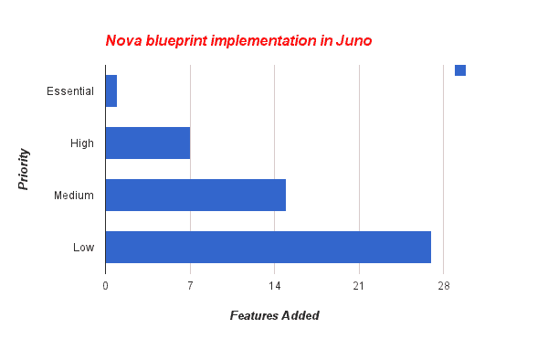](https://thenewstack.io/wp-content/uploads/2014/11/novaBP.png)

有趣的新功能:

1.  允许多个接口连接到同一个网络。
2.  Nova 调度程序已与 Nova 分离。现在它的新项目叫做甘特。
3.  安全组规则重构以更可伸缩的方式处理 RPC 调用。
4.  从虚拟机向 Openstack 用户提供串行端口。

完整的蓝图清单。

### **一瞥**

[Glance](https://wiki.openstack.org/wiki/Glance) 是 OpenStack 项目的图像库。根据 Glance 蓝图，已经实现了五个新功能。

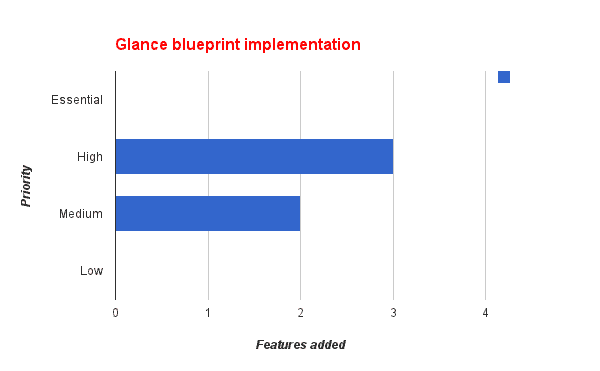

有趣的新功能:

1.  基于策略限制用户下载图像。
2.  元数据定义目录的实现。

全[蓝图](https://blueprints.launchpad.net/glance/juno)列表。

### **迅捷**

[Swift](https://wiki.openstack.org/wiki/Swift) 是 OpenStack 的对象存储组件。这是 OpenStack 最初推出时的核心项目之一。需要注意的是，Swift 遵循自己的发布周期。根据 Swift 蓝图，仅实施了 15 项新功能

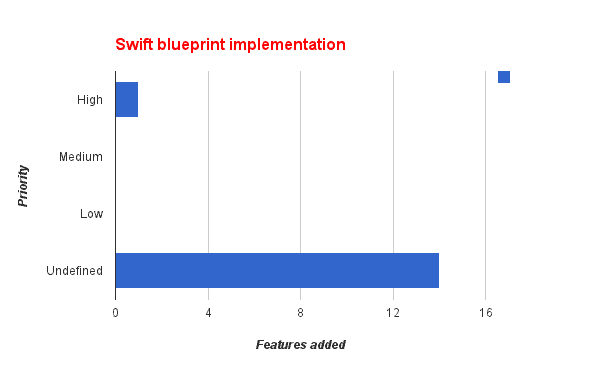

有趣的新功能:

1.  存储策略已实施。
2.  支持 Keystone V3 API。
3.  实现了并行对象审计功能。

完整的[蓝图](https://blueprints.launchpad.net/swift/juno)列表。

### **地平线**

[Horizon](https://wiki.openstack.org/wiki/Horizon) 是 OpenStack 仪表盘，用于管理和配置整个生命周期管理。它是用 Python/Django 框架编写的。已经实现了 51 项新功能。

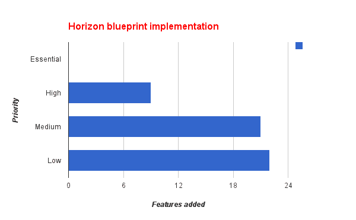

有趣的新功能:

1.  撒哈拉仪表板已合并。
2.  基于角色的 Nova 访问控制支持的实现。
3.  支持快速卷备份
4.  从主机上迁移所有实例的功能(撤离主机)

完整的[蓝图](https://blueprints.launchpad.net/horizon/juno)列表。

### **梯形**

[Keystone](https://wiki.openstack.org/wiki/Keystone) 是 OpenStack 的认证组件。根据 Keystone 蓝图，已经实现了 23 项新功能。

**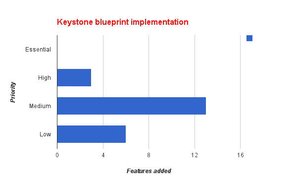**

有趣的新功能:

1.  按用户 id 筛选凭据。
2.  拱顶石呼叫拱顶石联盟。
3.  端点策略分配。

完整[蓝图](https://blueprints.launchpad.net/keystone/juno)列表。

### **中子**

[中子](https://wiki.openstack.org/wiki/Neutron)驱动 OpenStack 的联网组件。根据中子蓝图，已经实现了 53 个新特性。

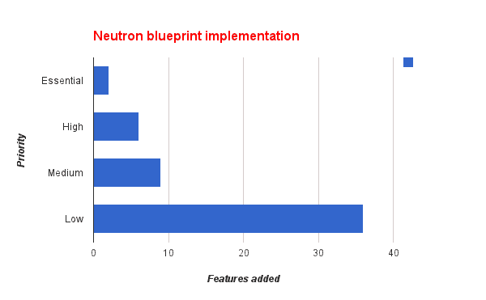

有趣的新功能:

1.  改进的安全组实现。
2.  通过 oslo 的 RPC 消息传递
3.  虚拟路由器上的高可用性功能。
4.  支持 ML2 中的扩展

完整的[蓝图](https://blueprints.launchpad.net/neutron/juno)列表。

### **煤渣**

Cinder 项目旨在为实例提供持久存储。根据 cinder 蓝图，已经实施了 29 项新功能。

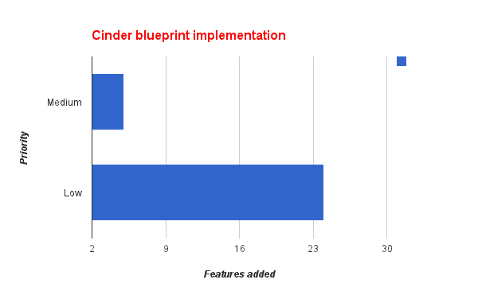

有趣的新功能:

1.  i18n-启用，日志可以用许多不同的语言查看
2.  限制卷复制的带宽以获得更好的实例性能。
3.  备份重置状态已启用。
4.  对 cinder 卷的复制支持。

完整的[蓝图](https://blueprints.launchpad.net/cinder/juno)清单。

### **遥测**

[遥测](https://wiki.openstack.org/wiki/Ceilometer)项目旨在为各种 OpenStack 组件提供计量服务。根据遥测蓝图，已经实施了 26 项新功能。

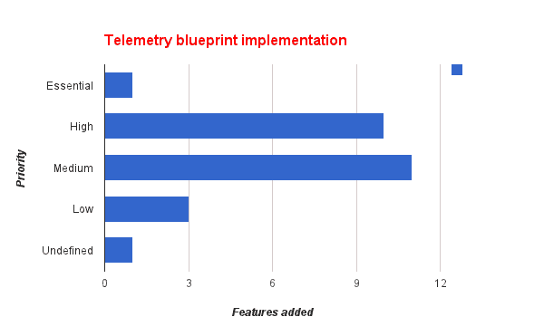

感兴趣的特征:

1.  遥测消耗的离子通知。
2.  SNMP 检查器的改进。
3.  在资源元数据中包含实例的状态。

完整的[蓝图](https://blueprints.launchpad.net/ceilometer/juno)清单。

### **加热**

[Heat](https://wiki.openstack.org/wiki/Heat) 旨在为 OpenStack 组件提供基于模板的编排&组件的整体生命周期管理。根据 heat 蓝图，已经实施了 27 项新功能。

**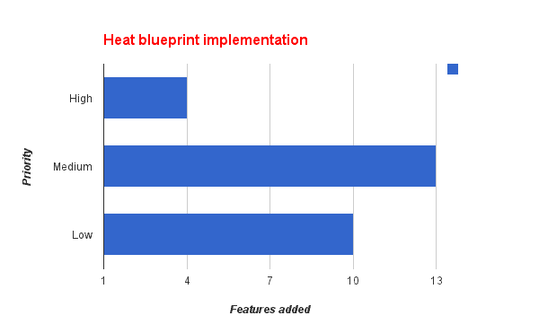**

有趣的新功能:

1.  Swift TempURL 部署元数据轮询。
2.  让 Heat 了解可用的网络服务。
3.  将配置部署到服务器集合的资源。

完整的[蓝图](https://blueprints.launchpad.net/heat/juno)列表。

### **Trove**

[Trove](https://wiki.openstack.org/wiki/Trove) 项目旨在为关系和非关系数据库引擎提供云数据库即服务供应功能。根据 trove 蓝图，已经实施了 14 项新功能。

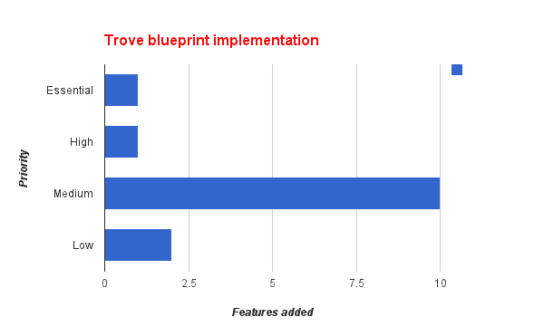

有趣的新功能:

1.  MySQL 的复制 V1 实现。
2.  可插拔的 trove 导体管理器。
3.  使用装卸器动态加载扩展。
4.  用 PostgreSQL 补充现有的 MySQL 实例。

完整[蓝图](https://blueprints.launchpad.net/trove/juno)列表。

### **撒哈拉**

[Sahara](https://wiki.openstack.org/wiki/Sahara) 项目提供了一种在 OpenStack 上配置数据密集型应用集群(Hadoop 或 Spark)的简单方法。根据撒哈拉蓝图，已经实施了 32 项新功能。

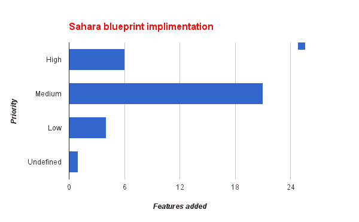

有趣的新功能:

1.  支持多区域安装
2.  与遥测技术集成
3.  在集群对象中保持撒哈拉配置

完整的蓝图清单。

通过 Flickr 知识共享[的专题图片。](https://www.flickr.com/photos/henry_marion/15493484625/in/photolist-pB7acg-nakZds-nrSMuy-nakTsB-nakRxB-npMTFA-nrSLLQ-nakRQa-nry9xb-5TaiQs-5TaiUJ-fyM9mT-poTFWJ-5T5XMi-5TaiL3-5TaiFm-nVAbQi-7VSwC-64vjyN-4vDm7o-7mTaat-7bkYUu-6cqDk8-4QpEBQ-7nBMm5-6f46ig-jpZey2-6f8gdE-6f8god-im7ddp-5Ax6B8-omfaBA-hDbg65-omaC4k-omaEhP-ojphDs-o4XgM4-omr1L8-7VSxg-fyMbuz-4GmQj7-bnqmne-ghCwXg-6o2mGH-6o6swL-6q597E-6o2hwF-g6K8PN-8jHz8X-7VSvo)

<svg xmlns:xlink="http://www.w3.org/1999/xlink" viewBox="0 0 68 31" version="1.1"><title>Group</title> <desc>Created with Sketch.</desc></svg>