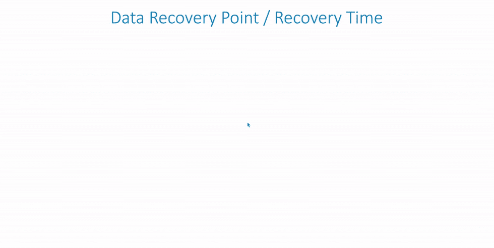

# 在 Kubernetes 中运行有状态应用程序的指南

> 原文：<https://thenewstack.io/a-guide-to-running-stateful-applications-in-kubernetes/>

Kubernetes 是一个开源编排平台，旨在部署、管理和自动化容器化的应用程序。在 Kubernetes 的早期，该平台主要支持和运行无状态应用程序，无状态应用程序被定义为当容器重启时，不需要从一个会话到下一个会话保留数据的应用程序。这个用例造成了一种误解，认为 Kubernetes 只适合无状态应用程序。但是随着 Kubernetes 的采用和社区贡献的增加，它已经发展成为各种应用程序的领先平台之一，包括可伸缩和高度可用的有状态应用程序的部署和管理。

然而，即使有了对有状态应用程序的完整编排支持，Kubernetes 中仍有各种各样的缺口(尤其是与存储相关的缺口)需要供应商去填补。Kubernetes 在有状态应用程序中的使用越来越多，推动了云原生存储解决方案的发展，这些解决方案可以提供有状态应用程序所需的可用性和弹性。

## Kubernetes 存储演变

 [阿尔温德·古普塔

Arvind 是云原生专家、问题解决者和传道者，对学习和教学充满热情。Arvind 在一系列计算机学科中担任过各种技术职务。在开始他的软件测试职业生涯后，Arvind 在 Redback Networks 公司的 ASIC 行业呆了几年，随后在爱立信公司工作，在那里他构建了高级网络芯片。他于 2015 年 10 月加入 Diamanti，在负责解决方案和营销之前，他在将 Diamanti 的硬件平台投入生产方面发挥了重要作用。Arvind 拥有普渡大学的硕士学位。](https://www.linkedin.com/in/guptaarvindk/) 

最初，Kubernetes 为特定的云提供商(如 GKE 和 AWS)提供基本支持，使用共享存储驱动器(如 NFS 和 ISCSI)将卷静态连接到 pod。但是向 Kubernetes 添加任何新的存储解决方案都需要将代码检查到核心的 Kubernetes 代码库中，这使得存储成为一个复杂的过程。

[Diamanti](https://diamanti.com/) 为 Kubernetes 贡献了 [FlexVolume](https://kubernetes.io/docs/concepts/storage/volumes/#flexVolume) 插件，开启了 Kubernetes 的卷供应新时代。它使存储供应商能够创建定制的存储插件，而无需将它们添加到 Kubernetes 存储库中。这反过来又为 Kubernetes 用户提供了从不同存储解决方案中选择更好的管理和数据服务的灵活性。多年来，Kubernetes 社区引入了一些丰富的存储功能，例如:

FlexVolume 插件进一步发展，为名为[容器存储接口](https://kubernetes.io/blog/2019/01/15/container-storage-interface-ga/) (CSI)的更高级存储插件铺平了道路。该插件标准化了 Kubernetes 与任何第三方存储解决方案的集成，并在 Kubernetes 中提供了对本地数据服务的支持。

### 在生产环境中运行有状态 Kubernetes 应用程序的注意事项

即使有了这些社区驱动的改进，当在 Kubernetes 中使用有状态应用程序时，组织仍然面临着与存储相关的挑战。随着组织采用包含重要知识产权的容器化数据库和其他应用程序，他们意识到需要提供一组更高级的存储功能。其中包括:

*   **易于使用的持久存储**
    Kubernetes 提供对持久卷和有状态应用程序的全面支持。但是，公司仍然必须使用第三方 CSI 插件提供商来执行卷的实际配置。例如，大多数公共云将 Kubernetes 与其现有的存储架构相集成，以便向用户提供这种设施，但这些架构通常在选择和性能方面受到限制。就私有云而言，有许多第三方选项可用，但很难找到一种存储解决方案能够提供强大的功能集，提供最佳性能，并且经济高效。最重要的是，市场上许多现有的存储解决方案旨在支持虚拟化工作负载，然而在裸机上运行容器已被证明更具可扩展性和性能，并减少了不必要的抽象层。很难找到适用于裸机容器的好的存储解决方案。
*   **高可用性选项**
    有状态应用程序的本质要求更多地考虑应用程序如何从不同的故障模式中恢复，但并非所有第三方 Kubernetes 存储解决方案都是高可用性的。为了解决这个问题，许多供应商提供了共享存储，但这些解决方案通常缺乏性能和可管理性。存储可用性服务通常用恢复点目标(RPO)和恢复时间目标(RTO)来衡量。RTO 衡量恢复数据所需的时间，RPO 衡量数据将恢复到多远。下表演示了对有状态应用程序至关重要的各种数据服务。

*   **混合云数据可移植性**
    在当今的云世界中，组织正在采用混合云方法来结合公共云和内部云的优势。虽然跨多个云迁移无状态应用程序很容易，但是将数据从一个云迁移到另一个云却非常困难。
*   **性能**
    市场上的大多数存储解决方案都缺乏当今数据密集型应用所需的性能，使得存储设备成为应用服务的主要瓶颈。像 NVMe(非易失性内存高速)和固态硬盘这样的新存储技术的出现意味着存储不再是瓶颈。因此，在选择存储供应商时，除了吞吐量之外，考虑最坏情况下的延迟也很重要。
*   **服务质量(QoS)保证**
    Kubernetes 为容器本身预留 CPU 和内存。然而，Kubernetes 不支持存储或网络带宽预留，这仍然是一个问题，并会导致嘈杂的邻居问题。为了防止关键的有状态应用程序出现这种缺点，为存储资源提供 QoS 级别的保证非常重要。
*   **存储和数据共享网络**
    大多数传统存储解决方案都依赖主机网络来存储数据流量。这种数据流量会与常规网络流量竞争，并带来安全风险。寻找隔离存储和集装箱运输的解决方案。
*   **安全性/加密**
    考虑存储解决方案的安全性和加密方面非常重要。大多数企业都需要安全协议，如自加密磁盘、卷级加密和密钥管理等，以防止数据丢失和安全漏洞。

## 独特的储物方式

云原生存储环境需要具备所有这些优势:

*   简单易用
*   高度可用
*   混合云就绪
*   高性能
*   一致的性能
*   安全的

它还需要具有成本效益，并且是为 Kubernetes 建造的。

Diamanti 是一个裸机、超融合的 Kubernetes 平台，它将运行容器所需的一切都包含在一个保护伞下，包括软件优化的基于 NVMe 的 SSD 存储。Diamanti 通过 FlexVolume 插件开创了 Kubernetes 的存储功能，并一直在该领域不断创新，支持备份、灾难恢复、快照和镜像。低延迟架构支持跨节点、区域甚至数据中心的扩展集群。其获得专利的 I/O 卸载架构也有助于提供一流的性能，与标准服务器或 HCI 环境相比，性能提高了 10 到 30 倍。最后，Diamanti 还带来了真正的混合云功能，允许跨云迁移有状态的应用程序。

## 结论

Kubernetes 已经发展成为编排有状态应用程序的最佳平台。您可以使用 Kubernetes 构造(如 StatefulSets 和持久性卷)轻松管理和扩展有状态应用程序。但是，如果没有底层存储基础设施，还不足以充分发挥 Kubernetes 的潜力。在决定第三方存储供应商时，请牢记这些挑战，并寻找能够为您的应用程序部署最关键的问题提供解决方案的供应商。

<svg xmlns:xlink="http://www.w3.org/1999/xlink" viewBox="0 0 68 31" version="1.1"><title>Group</title> <desc>Created with Sketch.</desc></svg>