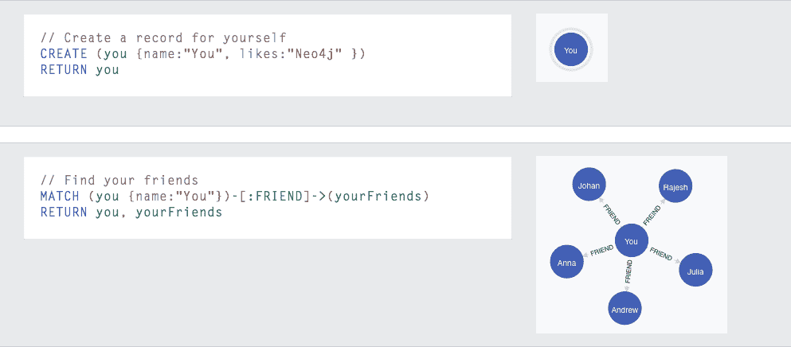
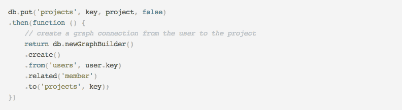

# 用 Orchestrate & Node.js 构建一个黑客新闻风格的投票 App

> 原文：<https://thenewstack.io/a-hacker-news-style-voting-app-built-with-an-orchestrate-graph-builder-and-node-js/>

波特兰的数据库即服务公司 Orchestrate 发布了他们用 Node.js 构建的黑客新闻式投票应用的第二部分。

Orchestrate 在我们正在做的数据新闻项目中探索图形数据库的使用时，与新的堆栈一起工作了一点。我们最初看到了 Neo4j。它拥有强大的图形数据库功能，但其 Cypher 查询语言使用起来很复杂，而且缺乏支持，这让我们不得不寻找替代方案。

【T2

我们求助于 Orchestrate，因为我们知道它没有 Neo4j 的图形数据库功能集，但它确实具有 NoSQL 即服务的图形数据库功能。它最近发布了一个 API 来处理来自不同 NoSQL 数据库的呼叫。它还具有复制功能，这使得它可以跨多个数据中心使用。

图形数据库对我们来说很有吸引力，但最终我们不得不转向使用 Ruby on Rails 和 Postgres 的定制开发流程。Rails 拥有我们需要的所有不同部分，我们可以将它们编织在一起。这对我们更好，主要是因为我们自己的限制。Rails 只是让我们在做小项目时更加灵活。我们认为 Neo4j 和 Orchestrate 很棒，喜欢他们的作品。我们只是有不同的需求。

但是回到编排。在第一部分中，Orchestrate 建立了“应用程序结构，通过 GitHub 进行身份验证，并存储用户数据。”在第二部分中，他们为人们构建了创建和查看项目的功能。

构建 app，Orchestrate 使用了  [Node.js](http://nodejs.org/ "Node.js") 、 [Express](http://expressjs.com/ "Express.js") 、 [Passport](http://passportjs.org/ "Passport") 。Express 是 Node 的 web app 框架，Passport 是作为 [Node.js](http://nodejs.org/) 的中间件认证中间件。

在 Orchestrate 博客上有一个完整的操作方法，它一步一步地引导用户完成这个过程。从外行的角度来看，也许最有价值的是 Orchestrate 如何将其图形功能与键/值联系起来。这是一个复杂的用例，但是展示了如何将图形数据库应用到复杂的场景中，比如多个用户的管理。

这个博客系列正在进行中。下一篇文章将介绍如何集成事件 API 来进行实际的投票。

图片由 Orchestrate.io 提供

<svg viewBox="0 0 68 31" version="1.1" xmlns:xlink="http://www.w3.org/1999/xlink"><title>Group</title> <desc>Created with Sketch.</desc></svg>