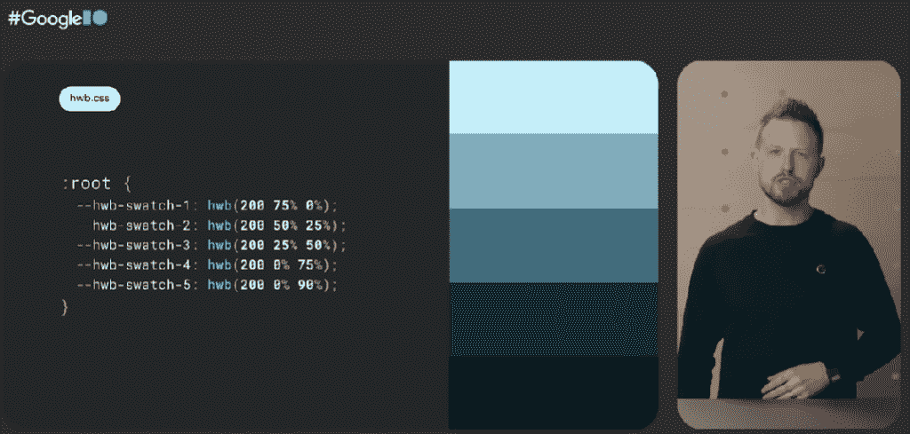
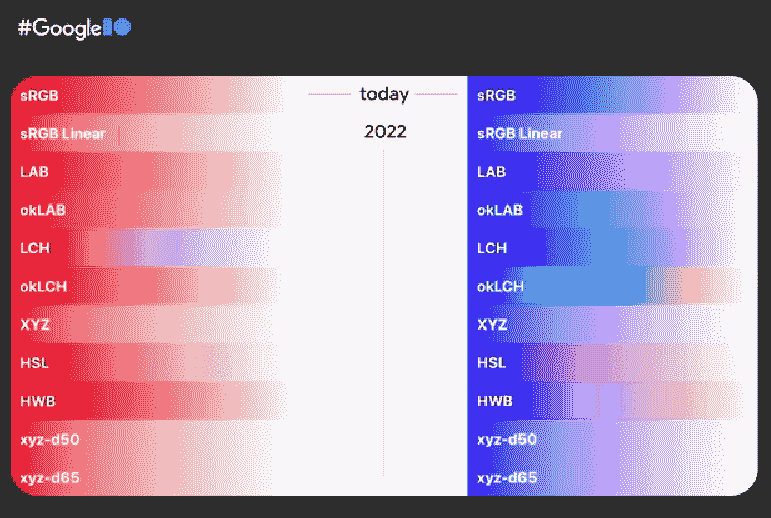

# 更热的粉红色:CSS 获得了新颜色的“爆炸”

> 原文：<https://thenewstack.io/a-hotter-pink-css-devs-get-an-explosion-of-new-colors/>

正如电视在 20 世纪 50 年代和 60 年代戏剧性地从黑白画面转向彩色画面一样，层叠样式表(CSS)也在经历类似的革命。每个人都喜欢的样式表语言正在获得一系列新功能，这些功能将允许开发人员和设计人员使用更广泛、更细致的颜色。

“2022 年，色彩将呈现爆炸式增长。我们有新的色彩空间，更多的颜色，内置的颜色处理和自动对比功能，”谷歌 Chrome CSS 开发者倡导者[亚当·阿盖尔](https://nerdy.dev/)在本月早些时候为[谷歌 I/O](https://io.google/2022/) 准备的“CSS 状态”视频演讲中指出。

这些特性中的许多目前只被大多数浏览器的开发版本支持。但是随着时间的推移，它们应该是全面可用的。

## 更多色彩空间

也许最重要的是，新的 [CSS 颜色选项](https://www.w3.org/TR/css-color-4/)不再依赖于标准的 sRGB(标准的红色、绿色和蓝色)光谱[，这是微软和惠普](https://www.tomshardware.com/reference/what-is-srgb-a-basic-definition)为 PC 设计的颜色空间，开发人员在过去 25 年中一直依赖它来选择颜色。现在支持 10 种新的颜色空间，所有颜色的范围都更广。

例如，一个颜色空间， [display-p3](https://www.w3.org/TR/css-color-4/#valdef-color-display-p3) 提供了多 50%的颜色，几乎所有这些颜色都已经被现代笔记本电脑、电视和智能手机所支持。

这个想法是，开发者现在可以使用更鲜艳的颜色，例如 Adobe Photoshop 已经支持的那种颜色。但是，这些颜色将由浏览器本身直接呈现在页面上。

“你以为你在你的颜色选择器中选择了粉红色。但是如果你改变你选择的色彩空间，“你可以为你的设计得到更鲜艳的粉红色，”Argyle 指出。

不同的色彩空间以不同的方式划分各自的光谱，提供了更易于处理的新渐变。基于数学，sRGB 有许多无趣、模糊的颜色“死区”，而 [lch()](https://developer.mozilla.org/en-US/docs/Web/CSS/color_value/lch) 和 [Lab()](https://developer.mozilla.org/en-US/docs/Web/CSS/color_value/lab) 提供了更完整的渐变，由人类可以看到的所有颜色组成。目前，Safari 浏览器支持这两者。下面是 lch 中“粉红”颜色的语法:

```
#lch {
rad-pink:  lch(50%  200  230);
}

```

在 lch 中，第一个数字“CIE 明度”代表颜色(l)的明度，从 0 的黑色到 100 的白色。第二个值是色度(c)，是颜色的数量，第三个值是色调(h)。这里的 CIE 亮度是 50%,基于一个感性的，而不是数学的色彩空间，没有泥泞的死区。

[CSS Media](https://css-tricks.com/a-complete-guide-to-css-media-queries/) 查询提供了一种方式来查询浏览器以查看是否接受 HD 颜色，而 [CSS Support](https://developer.mozilla.org/en-US/docs/Web/CSS/@supports) 查询检查浏览器是否支持色彩空间。

虽然产生颜色的方法是通过调整色调。

[HWB()](https://developer.mozilla.org/en-US/docs/Web/CSS/color_value/hwb) 可以根据色相、白度和黑度的平衡来合成颜色。“这是一种国际人文主义的思考颜色的方式，”阿盖尔说。在下面的演示中，Argyle 展示了具有相同色调的五个样本，但是具有不同的黑白比例。



五个样本具有相同的色调设置，但黑白部分不同。

## 自动生成的颜色

你也可以用新的 [color-mix()](https://developer.mozilla.org/en-US/docs/Web/CSS/color_value/color-mix) 来混合苍蝇的颜色。这个函数符号在你选择的颜色空间中混合两种颜色(默认在 lch 中)。您还可以通过百分比来指定颜色在混合中的主导程度。元素实际上让浏览器根据预先选择的主题色调为网页选择合适的颜色。它甚至可以将它们混合成满足可访问性标准所需的 [AA 对比度](https://usecontrast.com/guide)。这个想法是，将“自动良好的对比”，为可访问性和品牌。

相对颜色语法是浏览器帮助品牌化和易访问性的另一种方式。阿盖尔说，它可以从现有的颜色中提取新的颜色。阿盖尔指出，这也有利于品牌的一致性，所有的颜色都必须与品牌颜色相协调。“它给了我用非常非常少的代码创建感知线性调色板的能力，”Argyle 指出。

CSS 也将提供许多新的[渐变](https://xd.adobe.com/ideas/principles/web-design/gradient-color-definition/)，或者颜色如何相互混合的规则。今天，渐变操作仅适用于 sRGB，尽管一组用于为其他色彩空间选取渐变的新控件将很快推出。不同的色彩空间将显示不同的过渡色在渐变中移动。



在 HSL 颜色空间中，从黑到白逐渐变淡的背景颜色将被渲染成这样:

```
background-image:  linear-gradient(
 to right in HSL,
 black,  white
);

```

字体本身也多了一些颜色。新的 [Colrv1 字体](https://developer.chrome.com/blog/colrv1-fonts/)——除 Firefox 之外的所有浏览器都支持——允许开发人员向字体定义添加渐变、合成和混合。“这可能是图标字体的巨大胜利，”阿盖尔说。

也可以对复选框和网页的其他元素进行颜色更改。 [accent-color](https://developer.mozilla.org/en-US/docs/Web/CSS/accent-color) 属性允许你对内置元素进行着色，这可以使网页在主题上更加细致入微。Argyle 说:“用一行 CSS 将你的品牌颜色带到你的表单中，浏览器会确保你的颜色和复选框以及音轨之间有适当的对比。”强调色可以应用于整个网站，也可以只应用于选定的元素。它还可以用于根据用户偏好的亮暗模式来调整网页。

要查看完整的概要，请点击此处查看整个演示:

[https://www.youtube.com/embed/Xy9ZXRRgpLk?feature=oembed](https://www.youtube.com/embed/Xy9ZXRRgpLk?feature=oembed)

视频

<svg xmlns:xlink="http://www.w3.org/1999/xlink" viewBox="0 0 68 31" version="1.1"><title>Group</title> <desc>Created with Sketch.</desc></svg>