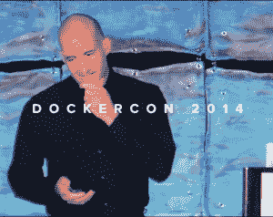

# 一部 Kubernetes 纪录片分享了谷歌的开源故事

> 原文：<https://thenewstack.io/a-kubernetes-documentary-shares-googles-open-source-story/>

这是一个伟大的开源成功故事——它被浓缩成了一部简短的口述历史。

Honeypot.io 自诩为欧洲最大的科技类求职平台，也提供了一个面向程序员的视频网站，并称之为“开发者的网飞”上周，该公司与[红帽](https://www.openshift.com/try?utm_content=inline-mention)、谷歌和[云原生计算基金会](https://cncf.io/?utm_content=inline-mention) (CNCF)合作，发布了“ [Kubernetes](https://thenewstack.io/category/kubernetes/) :纪录片”，这是一部长达一小时的纪录片(分为[两个](https://www.youtube.com/watch?v=BE77h7dmoQU) [部分](https://www.youtube.com/watch?v=318elIq37PE))。

根据 YouTube 上的描述，该视频“直接从经历过它的人那里捕捉故事”，主要是对开发该软件并做出关键决策以实现其增长的工程师和经理的采访。

在推特上，CNCF 的首席技术官 [Chris Aniszczyk](https://www.linkedin.com/in/caniszczyk/) ，[回忆道](https://twitter.com/cra/status/1484575619186716672?s=11)“在疫情期间有一个电影摄制组出现，有点令人紧张。”

但他补充说，他很高兴终于可以分享完成的纪录片:“我们需要更多这些开源的“技术”风格的电影！”

[https://www.youtube.com/embed/BE77h7dmoQU](https://www.youtube.com/embed/BE77h7dmoQU)

视频

## 谷歌的大胆举措

甚至还有一个官方预告片，其中有一个早期 Kubernetes 创始人乔·贝达(Joe Beda)回忆“如何改变现状——我们如何摇动雪球”的镜头。…[我]增量主义实际上不会让谷歌在 GCE 上取得成功。”

然而，贝达在纪录片中未经编辑的较长引文给了这种想法一些重要的背景。“如何改变现状——我们如何以一种不完全针对谷歌的方式撼动雪球，但至少给谷歌一个争取的机会，能够开始抓住一些客户，并开始平衡 AWS 当时的主导地位。”

这是贯穿整个项目的主题。在 Twitter 上，Honeypot 分享了电影中的一段话，引起了反响:“谷歌必须在云领域迈出大胆的一步，才能成为长期的赢家。”

“这句话是我说的，”[谷歌基础设施副总裁埃里克·布鲁尔](https://www.linkedin.com/in/eric-brewer-1031254/)回应道，“我在 2013 年就相信了，现在依然如此。Kubernetes 是一次精彩的旅程，有高潮也有低谷，但最终，它改变了云计算的游戏规则。”

这部纪录片的新闻稿指出，在 2010 年，亚马逊网络服务(AWS)“拥有看似不容置疑的领先优势。”这部纪录片以旧金山的航拍镜头开始，镜头扫过服务器的网络电缆，同时回顾了一个时代，正如前谷歌员工克雷格·麦克卢奇回忆的那样，“云正在以一种非常物质的方式变得真实。”

但接下来，他补充道，“我们开始看到亚马逊的优势，这肯定会成为主流企业技术。”

如今，现任 VMware 研发副总裁的 McCluckie 被认为是 Kubernetes 的创始人之一，但他并不是唯一一个记得 2010 年令人生畏的情景的人。

谷歌的另一位早期 Kubernetes 工程师蒂姆·霍金(Tim Hockin)也在影片中说，“AWS 是每个人心中的庞然大物。”

> 谷歌团队完成 Kubernetes 的第一个 DockerCon 开源版本所花的时间比获得谷歌批准开源所花的时间还要少。

根据 YouTube 上的视频描述，这部纪录片随后记录了谷歌具有前瞻性思维的工程师如何“克服技术挑战、来自内部的开源阻力、反对者以及来自业内其他大公司的激烈竞争”。

故事从谷歌杰出的工程师布莱安·葛兰特开始，他提到谷歌有自己的内部基础设施专业知识，并希望在云中利用它。

但是另一个正在思考这个问题的人是 Clayton Coleman，他是 Red Hat 的容器化应用基础设施的设计师。

在纪录片的第二部分，科尔曼首先说了一件显而易见的事情:没有 Docker 就不可能有 Kubernetes。但随后他补充说，谷歌也需要赶上 AWS，而红帽的 CoreOS 团队认为 Linux“需要好好踢一下云”，并已经开始考虑 Linux 之后的下一步。

“有很多假设，”科尔曼说。“现在回想起来，这似乎是不可避免的。根本没有那种感觉。”

这部纪录片还回顾了 Kubernetes 的早期先驱，McLuckie 回忆了 Brendan Burns 第一次“拼凑出一些东西”的那一刻，这些东西实际上可以将谷歌的内部专业知识输出给大众。“这只是剧本什么的，但我能感觉到这一点。

“对我来说，”麦克卢奇说，“那一刻我意识到这里有些东西。”

## 决定开源

在纪录片中，Beda 承认“通过开源构建社区将是我们建立事实标准的最佳方式。”但这并不像听起来那么简单。

事实上，这部纪录片的一个亮点是受访者对他们第一次从谷歌管理层那里收到的怀疑反应的记忆——以及 Kubernetes 是如何接近不被批准的。

Hockin 回忆起团队在与谷歌技术基础设施高级副总裁[Urs hlz le](https://en.wikipedia.org/wiki/Urs_H%C3%B6lzle)就开源 it 进行接洽后，对其原型的第一反应。“乌尔斯非常善于分析，他说，‘为什么？我们从中能得到什么？这对谷歌有什么好处？所以他最初的反应是:‘我不认为我们需要这样做。"

> “Kubernetes 获胜的部分原因是它背后有一大批贡献者。它一直在前进，每天都有大量的提交。这种变化速度比其他任何东西都要快。”

—谷歌基础设施副总裁埃里克·布鲁尔

还有许多更加丰富多彩的故事，McLuckie 最终回忆说，他们花了更少的时间来完成*建筑* Kubernetes 为 DockerCon 发布的第一个开源版本，而不是获得谷歌批准开源它。

但在纪录片的结尾，谷歌的酿酒商辩称，“Kubernetes 获胜的部分原因是它背后有一大批贡献者。它一直在前进，每天都有大量的提交。这种变化速度比其他任何东西都要快。”

## 创建一个社区

这部纪录片包括 Kubernetes 在 2014 年 DockerCon 上宣布的镜头，同时也是开源的。布鲁尔告诉观众，“这是另一个最重要的编排，”并很快补充道，“这不是一件坏事……有很多这样的编排，因为这是一个令人兴奋的重要领域，也是我们需要达成一致的领域。”

“之所以现在在这个领域发布开源软件，是因为它关乎理念。”

谷歌的 Eric Brewer 在 DockerCon 2014 上宣布 Kubernetes。

他们不是唯一的。科尔曼记得，“我觉得，每个大型创业公司都有一个容器编排项目，其中一半是在 2014 年 DockerCon 上宣布的。”

但是正如凯尔西·海托华所说，“如果你有足够的时间和经验，Kubernetes 就是你要建造的东西。我怀疑没有人有谷歌那样的经验。”(Hightower 是一位受欢迎的会议演讲者，现在是谷歌的首席工程师，从事谷歌云平台的工作。)

这部纪录片没有回避 Kubernetes 的宣布所激起的感情。Beda 坦率地承认，“当我们开始寻找合作伙伴参与进来时，尽管我们谈论它是开源的，但该项目仍然由谷歌主导，这一事实仍然让人们犹豫不决。”

或者，正如莎拉·诺沃特尼在电影中所说，“许多大公司不喜欢他们的员工签署竞争对手的贡献者许可协议。”

诺沃特尼在电影中被称为微软 Azure 的“开源专家”，尽管她过去的工作包括领导谷歌云平台的开源战略小组，在 CNCF 成立期间代表谷歌，该组织旨在解决这些问题。

麦克卢奇告诉电影制作人，“这可能是我做过的最有压力的事情…试图引导和导航多供应商的兴趣，让像 CNCF 这样的东西起飞。”

但 Novotny 回忆道，“随着我们开始将事情向更开放的治理转移，随着我们将版权和知识产权转移到 CNCF，更大的公司能够参与进来。在这一点上，这真的成了如何培养下一代领导者的一次练习。”

这部纪录片还记录了库伯内特周围社区的发展。格兰特回忆道，在 Kubernetes 的头两年，“我的收件箱里收到了 20 万条来自 GitHub 的通知。”

Novotny 补充说，“到 2016 年底，我们有 700 到 1000 人对每个版本做出贡献。”

## 当竞争对手拥抱 Kubernetes

在纪录片的结尾，Beda 对 Docker 在 DockerCon 2017 上宣布他们将支持 Kubernetes 和 DockerSwarm 进行了反思。

“我认为他们认识到这是他们不能忽视的事情，”贝达说。"所以布兰登和我在那里，你知道，说祝贺."

正如他回忆的那样，“那真是一个很酷的时刻，我终于感觉到我们不再互相对抗，而是团结在一起。”

不仅仅是多克。格兰特记得，在 2017 年，许多竞争对手都采用了 Kubernetes-包括 Mesos 到那年年底，甚至亚马逊也宣布了一款 Kubernetes 产品。

贝达说:“很长一段时间以来，亚马逊一直坚持这一点。“因此，看到它兜了一圈，就像有亚马逊支持它一样，这是最大的信号之一——至少对我来说 Kubernetes 会留在这里。”

然而，Hightower 分享了他自己的观点，即集装箱战争“受益于大量风投资金推动这场竞赛的事实——但事实是，没有零和游戏。”

相反，他补充说，最好的想法被整合到“最新的检查点，这就是 Kubernetes——但事实是，将会有一些东西取代 Kubernetes。”

<svg xmlns:xlink="http://www.w3.org/1999/xlink" viewBox="0 0 68 31" version="1.1"><title>Group</title> <desc>Created with Sketch.</desc></svg>