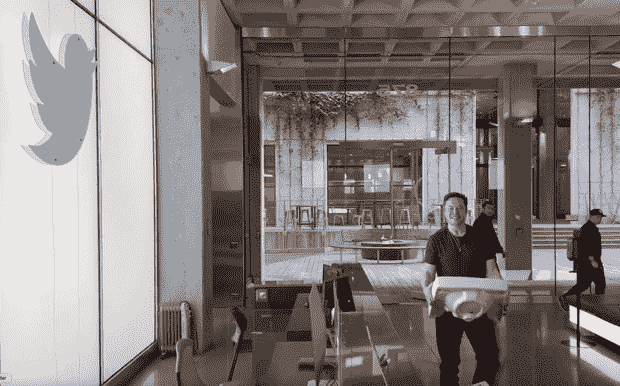
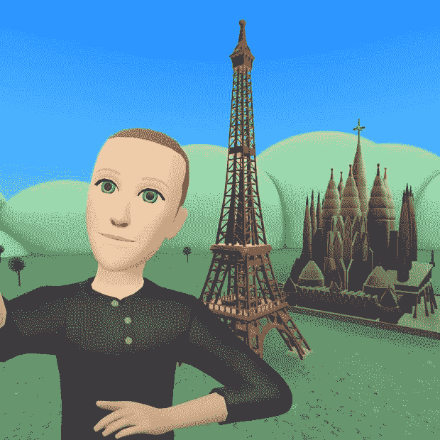
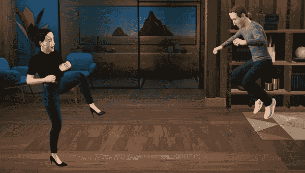

# 岁末之年:2022 年五大互联网科技故事

> 原文：<https://thenewstack.io/a-leg-endary-year-top-5-internet-technology-stories-of-2022/>

上周，我展示了我的年度顶级互联网技术。本周我将回顾今年的头条新闻。信不信由你，没有太多的重叠。科技行业有新闻价值的故事往往不是关于最好的技术。它可能是炒作或争议，使它成为一个大故事，它可能是一大笔钱被移交，或者它可能是一个无意中令人捧腹的故事。这篇文章涵盖了所有这些基础！另外，我有一个象征性的新闻故事，实际上是庆祝一项有价值的技术成就。

又及:希望标题在帖子结束时有意义！

让我们从今年最大的新闻开始，当然是在噪音方面…

## 1.埃隆·马斯克对 Twitter 的收购

关于这场正在发生的火车事故，还有什么可说的？自从[埃隆·马斯克(Elon Musk 月下旬带着一个厨房水槽走进 Twitter 总部](https://thenewstack.io/twitter-turmoil-we-need-an-open-protocol-for-public-discourse/)(出于 meme 的目的)，Twitter 新房东的 Techmeme 头条就源源不断。

埃隆·马斯克和他令人捧腹的厨房水槽笑话。

我们可能会在未来几年回顾马斯克收购案，并将其视为联合社交媒体的[引爆点。但此时此地，很难忽视这对大量人群的负面影响:Twitter 的大多数员工被解雇，](https://thenewstack.io/devs-are-excited-by-activitypub-open-protocol-for-mastodon/) [Twitter 的第三方开发者](https://thenewstack.io/developers-twitter-wants-your-bots-and-other-read-write-apps/)被搞砸了(又一次)，大量在 Twitter 上找到自己声音的历史上被低估的人被赶出了平台。

不要介意厨房的水槽，那么，这个故事在许多方面都是一个悲剧——当然不是伊隆·马斯克试图让它成为的蒙蒂·派森式的喜剧。

## 2.山姆·班克曼-弗里德:无助于网络 3 事业

我们许多人都预见到了 2022 年的到来:一家大型加密货币公司肯定会在某个时候被发现在做一些不靠谱的事情。但这是一个小说家很难让人相信的故事。

大致情况是这样的:一个在蒂姆·伯纳斯·李发明网络时还未出生的年轻人，毕业于麻省理工学院，获得了物理学学位，在 2017 年创办了一家加密对冲基金，然后在 2019 年创办了一家加密交易所，成为一名名义上的亿万富翁，宣布效忠于一种名为“有效利他主义”的慈善时尚，穿着短裤赤脚参加商务会议……然后突然，他的公司因被指控“不当处理客户资金”而内爆，最终导致他在巴哈马被捕。

如果你把这个故事作为年终作业交给你的创意写作学校，你会被嘲笑出这个项目。

班克曼-弗里德的垮台会对[的网络 3 生态系统](https://thenewstack.io/web3-developer-ecosystem/)产生什么影响，该生态系统的价值今年也直线下降？对我们平台的信任非常重要，我们也从埃隆马斯克的惨败中学到了这一点，SBF 的故事进一步侵蚀了许多人对加密货币(Web3 的基础)的信任。

## 3.以太坊的合并

不过，今年对 Web3 来说，也不全是坏消息。9 月，第二大最有价值的加密货币以太坊(Ethereum)从破坏环境的工作证明(PoW)共识机制转向节能的利益证明(PoS)。在一个昵称为“[合并](https://thenewstack.io/ethereums-big-day-how-the-merge-will-impact-web3-developers/)的项目中，以太坊首先将两种共识机制结合在一起，然后在 PoS 接管后完全放弃 PoW。

这是一个长期运行的项目，也是多年来各种迷因的主题，大多数是针对以太坊古怪的创造者 Vitalik Buterin。但值得称赞的是，该项目顺利地完成了以太坊技术架构中的高风险开关。你可能仍然不喜欢 crypto 或 Web3，但你不得不佩服新的解决方案对环境的破坏要小得多。

## 4.被 Adobe 以 200 亿美元收购的 Figma

9 月份，Adobe 以大约 200 亿美元的价格收购了流行的基于网络的协作设计工具 Figma，这是过去 20 年来最重要的互联网并购交易之一。

【Figma 实现的这种交互性过去只能使用 Flash 这样的插件工具，当然 Adobe 在 2005 年收购 Macromedia 时也收购了 Flash。但是，Flash 是一种作为浏览器插件运行的专有技术，而 Figma 是使用 web 标准构建的；尤其是 WebGL (Web 图形库)来处理渲染。

未来最大的问题是开源设计工具能否崛起并与 Adobe 竞争。这个消息也很重要，因为它增加了其他 web 标准兼容工具的风险，特别是在开发人员 IDE 产品类别中(也称为云 IDE)。

## 5.梅塔的腿有问题

我喜欢用一个不太严肃的故事来结束这些帖子——还记得去年扫描你视网膜以换取加密的金属球吗？它来自一家名为 WorldCoin 的公司，由 OpenAI 的 Sam Altman 共同创立。今年，他明智地转向了更大的产品发布会。的确，奥特曼上一次在推特上提到 WorldCoin 是在 2021 年 10 月。

另一位希望明年尴尬的产品发布会被掩盖的创始人是马克·扎克伯格。八月，他[在脸书](https://www.facebook.com/zuck/posts/pfbid0239ErWnxLdBKcn81sip2psu4sf8AWNwEAeobFLKsKjVC2wu1Ni2JGo2Mxbk5nTzNBl?__cft__%5B0%5D=AZVBCjN-O1cmqd3sVdpHoRPtvBE3YIR72rMfyDA0_6I1rUjpqnwn_GRR5nfVohlnkDQfOrnxnv-SbchCYa76d3qdU6GmmOVxE8g9vWpD-U_x-Aw5mb2Byfdd4yvloW4PB69v41Uz6h-A65pjCBMDdf8H2QZkIgFjyQDH4UNsm4QwGQ&__tn__=%2CO%2CP-R)上发布消息称 Meta 将在法国和西班牙推出其虚拟现实世界 Horizon Worlds。他的帖子附有一张无腿头像的图片，看起来像是在 20 世纪 90 年代创作的，还有埃菲尔铁塔和圣家堂的基本图纸。

扎克最先进的 90 年代风格的头像。

扎克伯格在网上遭到了全面的嘲笑，特别是因为 Horizon 的无腿头像，不久前他[承诺](https://www.facebook.com/zuck/posts/pfbid0qdkJp61pRmG75n4vHe4W7PSquycbRPmKrfCY6hP7jgPCUkksBXcJw1n25W6EWMU4l?__cft__%5B0%5D=AZU1lTKtsbdkaAKmc2CVuEPIQVJ9IB2NiPX1xaF8FBWUs3JrJl_qHYZTx-f2KnJ_VlMrrmSDTcEzES84V34EThfI4e81His5D5tGyqG7_DAS-C_eBuIKiyb90rzzSiclnr1XZa90b_9tTk7g13wClG9wDPUk3cXaqD8hcbpNjT1mww&__tn__=%2CO%2CP-R)将很快对 Meta 的头像图形进行“重大更新”。这一更新似乎发生在 10 月，在 Meta 的年度开发者大会上，扎克伯格[展示了](https://www.theverge.com/2022/10/11/23390503/meta-quest-horizon-avatars-legs)一段视频，视频中的角色都有腿。然而，他不清楚这些将会在什么时候发布到地平线世界。后来，发现这个视频不是真的。该公司[证实了](https://uploadvr.com/meta-avatar-legs-connect/)“它以动作捕捉创造的动画为特色”。

《黑客帝国》中的扎克，用他的电影合成腿。

## 结束语双关语

因此，今年的头条新闻是埃隆向 Twitter 用户伸出靴子，一位不穿鞋的加密(前)亿万富翁，以太坊改善其碳足迹，Figma 寻求退出，Meta 努力在其头像上画腿。

我恨不得跳到 2023 年；让我们希望上面的一些技术人士加快他们的游戏。

<svg xmlns:xlink="http://www.w3.org/1999/xlink" viewBox="0 0 68 31" version="1.1"><title>Group</title> <desc>Created with Sketch.</desc></svg>