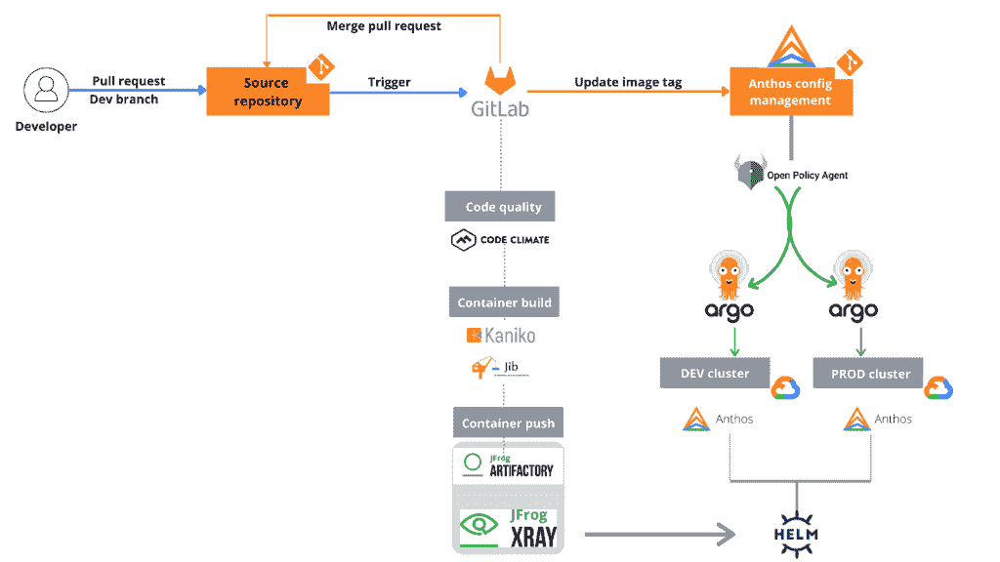

# 面向现代企业的 GitOps

> 原文：<https://thenewstack.io/a-look-at-gitops-for-the-modern-enterprise/>

[GitOps](https://www.getambassador.io/learn/kubernetes-glossary/gitops/) 是一种现代的云本地方法，用于持续部署，它利用 [Git](https://git-scm.com/) 版本控制/源代码控制系统作为所有配置、基础设施和操作程序的单一事实来源。在这种方法中，变更是通过源代码控制系统本身自动完成的。GitOps 被认为是一种将基础设施作为代码的进化方法。

GitOps 与其他方法的不同之处在于，它将开发和运营过程集中化，这样您就有了一条使用单一真理来源的方法的单一路径。

GitOps 赠款:

*   通过节省时间和精力提高开发人员的生产力和体验。通过推送代码，而不是容器。
*   通过持续的部署自动化提高速度。
*   改进的 CI/CD 耐用性，因为它提供了一种简单的跟踪机制。
*   高可用性和低停机时间的成本效益。
*   更高的安全性，因为 Git 被用作真实的单一来源。
*   端到端工作流的一致性和统一性。
*   更健壮的工作流，因为 Git 用于跟踪和管理变更。

GitOps 作为 DevOps 的[组成部分，自动化开发过程并加速发布过程。它利用自动化的优势，在整个应用程序生命周期管理中减少人工干预的必要性。](https://jfrog.com/user-conference/modernizing-ops-with-gitops/)

DevOps 和 GitOps 可能有共同的目标；可以说 DevOps 是一种文化哲学，而 GitOps 更像是一种绑定到特定工具的现代云原生方法。DevOps 不与任何工具或角色相关联。

使用 GitOps，可以更好地划分流程。Git 为 Kubernetes 和整个云原生栈提供了一个操作过程模型。它定义了一组围绕部署、监控和容器化集群管理的原则。

在非 GitOps 工作流中，您需要 API 调用或鼠标点击来启动事件，但是在 GitOps 工作流中，任何定义的 Git 提交都会自动触发事件——构建、部署和其他生命周期事件。

GitOps 与现代 DevOps 实践完美地结合在一起，因为一切都被视为代码，代码存储在 Git 中。一切都源于并连接回 Git，一个真理的单一来源。它允许你在这里扩展你对*一切*的定义，以包括操作和基础设施动作。一切都是可以观察和监控的。环境变化可以通过 Git 进行审计。

在 GitOps 工作流中，系统所需的配置保存在一个源文件中，该文件与代码一起存储在 git 存储库中。工程师将对代表所需状态的配置文件进行更改，而不是通过 CLI 直接对系统进行更改。

 [帕万·贝拉加蒂

Pavan Belagatti 是印度增长黑客领域的先驱之一，他也是 DevOps 的影响者和谷歌认证的数字营销人员。他已经就 DevOps 主题写了 100 多篇文章。他通常写 DevOps、市场营销和增长黑客。他是世界上一些顶级网站的客座撰稿人。](https://www.linkedin.com/in/pavan-belagatti-growthmarketer/) 

审查和批准这样的变更可以通过标准的过程来完成，例如——拉请求、代码审查和合并到主分支。当更改被批准并随后被合并到主分支时，操作员软件过程负责基于存储在最新更新的源文件中的配置将系统的当前状态切换到期望的状态。

在典型的 GitOps 实现中，不允许手动更改，对配置的所有更改都应该在 Git 中的文件上进行。在严重的情况下，改变系统的权限仅给予操作员软件过程。

在 GitOps 模型中，基础设施和运营工程师的角色从实施基础设施修改和应用程序部署转变为开发和支持 GitOps 的自动化，并通过 Git 协助团队审查和批准变更。

总而言之，GitOps 管道是这样运行的:

*   从用户(主要是开发人员)修改 Git 中的代码开始。
*   之后，构建一个容器映像，并像 JFrog 容器注册中心一样将其推送到容器注册中心。
*   然后它被更新到一个配置更新器中。
*   一旦开发人员创建了一个拉请求，它就被部署到相关的分支。
*   然后，它测试工作流是否都是正确的，或者是否有任何复杂性。
*   一旦一切看起来不错，审查者将能够合并它。
*   在合并之后，下一步是它进入测试分支。
*   一旦任何人创建了一个拉请求，它将自动部署到那个测试分支。

具有 Anthos 和 JFrog Artifactory 的云原生 gitop([JFrog](https://www.youtube.com/watch?v=HSjm6-ACmWQ&t=188s))

## GitOps 的可能缺点

虽然 GitOps 看起来很直观，但是部署起来有多可行呢？以下是一些缺点:

*   **可伸缩性问题:**虽然 GitOps 承诺对工作流的完全可见性，但对于拥有许多 GitOps 存储库和/或配置文件的大企业来说，这可能是不真实的。GitOps 似乎只适用于相对简单的设置，其中一些 GitOps 存储库包含可管理数量的配置文件。
*   **危险的秘密:**在 Git 存储库中保存/存储秘密并不是最佳实践，在 GitOps 工作流中，这是一个很自然的地方。一旦你在 Git 中存储了秘密，这些秘密可能会被永远记住。随着存储库的增长，管理和维护这些机密也是不可行的，而且可能会有风险。
*   **复杂的工作流程:**在 GitOps 中，所有的部署都由。yaml 文件提取请求。当我们开始为我们的管道运行多个集群时，每个集群将拥有自己独特的配置值。我们知道脚本是必不可少的，它不能根据环境自动调整。这表明每个环境需要不同的部署脚本。随着我们在工作流设置中引入更多的环境——集群和名称空间，这一难度会增加。
*   **没有解决完整的开发生命周期:**GitOps 方法和工具只关注应用程序的部署部分。GitOps 对端到端软件开发没有帮助。

## 结论

GitOps 提供了各种好处，也有一些缺点。由于这种方法仍然相对较新，所以仍然存在一些主要差距，我们仍然在寻找市场中的“大赢家”。这取决于各个公司对 GitOps 方法的试验，并看看它如何与他们的可靠方法一起帮助 DevOps。

<svg xmlns:xlink="http://www.w3.org/1999/xlink" viewBox="0 0 68 31" version="1.1"><title>Group</title> <desc>Created with Sketch.</desc></svg>