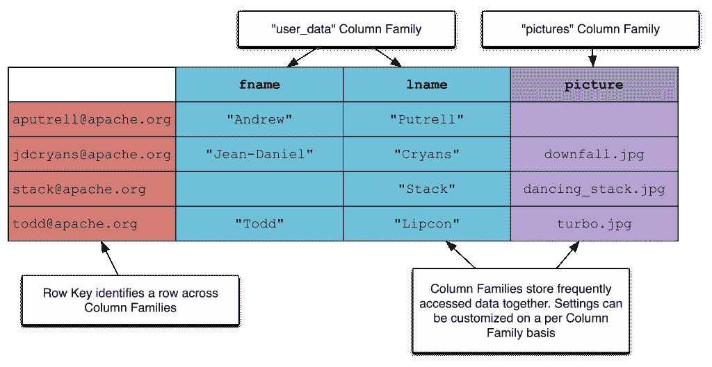

# 看看基于 Hadoop 的 NoSQL 数据库 HBase

> 原文：<https://thenewstack.io/a-look-at-hbase/>

新的书库欢迎解释开源技术的故事。有没有你愿意解释的开源技术？请与我们联系你的职位，我们将考虑出版。

世界正朝着 NoSQL 的方向发展。它要求我们学习处理数据的新技术和方法。我们不得不花更多的时间来设计模式。最后，我们必须比关系数据库更了解数据库的工作方式。

这让我们想到了 NoSQL 和 HBase 的第一个困难——缺乏知识。HBase 是什么？它是如何工作的？我为什么要用它？

## HBase 是什么？

Apache HBase 是一个基于 Hadoop(确切地说是 HDFS)的面向列的 NoSQL 数据库。它是 Google 的 Bigtable paper 的开源实现。HBase 是一个顶级的 Apache 项目，经过多年的开发，刚刚发布了它的 1.0 版本。

用户表

HBase 中的数据被分解成表格。在这些表中，行的数据被分成称为列族的分组。这些列族将相似或经常访问的数据组合在一起。行关键字唯一标识行的数据。

在上图中，“用户数据”和“图片”都是“用户”表中的列族。我们在这两个列族之间划分数据，因为“user_data”列存储关于用户的文本数据，比如他们的姓名、密码和电子邮件。“图片”列族存储用户的个人资料照片。为了检索这些行中的一行，我们将使用一个行键，比如“stack@apache.org”。

## 它是如何工作的？

我喜欢用扑克牌来展示 HBase 的工作原理。看看我制作的这个视频。我鼓励你拿出你自己的一副牌，一起玩。

[https://www.youtube.com/embed/9CREwiemvT0?feature=oembed](https://www.youtube.com/embed/9CREwiemvT0?feature=oembed)

视频

## 我为什么要用它？

HBase 对于大数据问题很有用——当你需要随机读取、随机写入或者两者都做的时候。有许多公司在生产中使用 HBase 和数 Pb 的数据库，将它们作为任务关键型数据存储来运行。

HBase 还有许多其他不同的使用案例，每年在 HBaseCon，[用户都会谈论](http://hbasecon.com/sessions/)他们如何使用 HBase。Google 最初的用例是为互联网及其用户存储大量数据库。Pinterest 使用 HBase 存储图形数据(不是图表)。Flipboard 使用它来存储内容，并为用户个性化内容。FINRA 使用 HBase 来存储交易图表。一些公司使用 HBase 进行点击流数据存储和分析，还有一些公司使用它进行时间序列分析。Hadoop MapReduce 与 HBase 一起使用，以高效的方式处理数据。

## 后续步骤

有很多地方可以了解 HBase 的更多信息。本周， [HBaseCon](http://hbasecon.com/) 将于 5 月 7 日运行。还有票。我将发言并介绍 HBase。

这篇简短的文章向您提供了有关 HBase 的一些信息。与大多数大数据技术一样，在使用它来创建有效的解决方案之前，您需要更好地了解它。在开始这种转变之前，你真的需要一些培训。

在您探索 NoSQL 解决方案时，HBase 是一个不错的选择。为解决方案选择正确的工具通常意味着成功与失败的区别。

<svg xmlns:xlink="http://www.w3.org/1999/xlink" viewBox="0 0 68 31" version="1.1"><title>Group</title> <desc>Created with Sketch.</desc></svg>