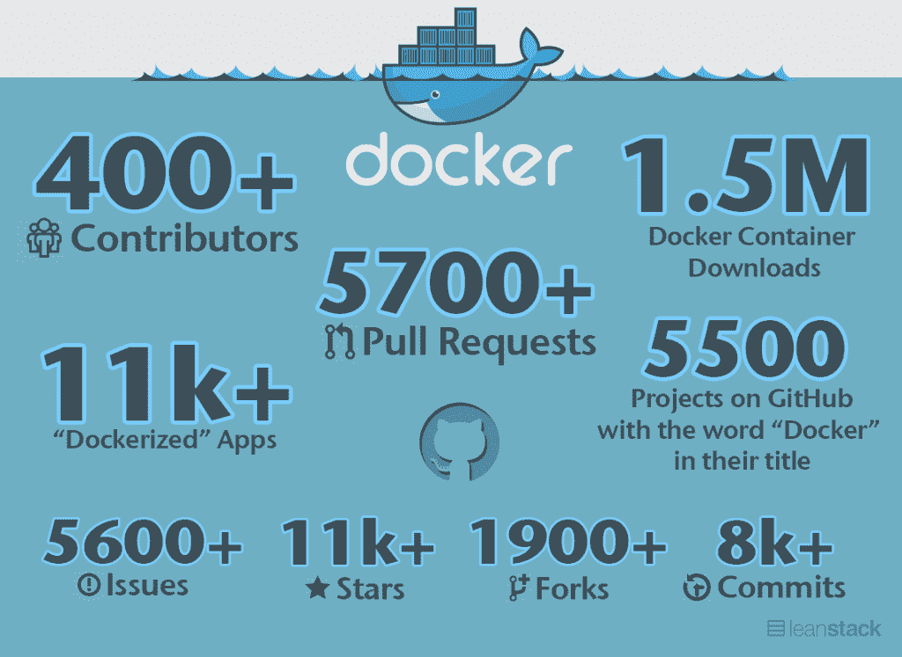

# 看看 Docker 是如何管理其开源项目的

> 原文：<https://thenewstack.io/a-look-at-how-docker-manages-its-open-source-project/>

2014-05-15 10:11:31

看看 Docker 是如何管理其开源项目的

# 看看 Docker 是如何管理其开源项目的

May 15th, 2014 10:11am by [Alex Williams](https://thenewstack.io/author/alex/ "Posts by Alex Williams")

Leanstack 发布了对 Docker 高级工程师 jérme Petazzoni 的第三次采访。

以下是这篇文章的一些亮点——非常值得一读。

*   Petazzoni 表示，他们将不得不开发新的工具来管理 Docker 上的大量拉取请求。维护人员会花一半的时间在拉请求上，但是旧的请求仍然会出现在需要注意的地方。管理拉取请求的新工具正在开发中。
*   有一些关于完美的 Docker 黑客环境的讨论。正如在采访中所说的，一些团队成员正在考虑离开一个普通的发行版，转而使用 boots Docker。

> 那么所有的东西都会在一个容器里。您的图形环境将在一个容器中。你的编辑器会在一个容器里。所有东西都在一个容器里。

*   Docker 是用 Go 写的。DotCloud，平台即服务(PaaS)最初是用 Python 写的。码头工人喜欢去。
*   整个开发过程是通过拉请求来完成的。从一开始就是这样。
*   Docker 正在积极寻找[的维护者。](https://github.com/dotcloud/docker/blob/master/CONTRIBUTING.md#how-can-i-become-a-maintainer)
*   在 0.6 版本中，“Docker 中的 Docker”已被添加到构建中，然后以可预测的方式测试 Docker。例如，它解决了与不同的 Go 版本或不同的库版本不兼容的问题。
*   IRC 机器人用于请求通知。
*   Docker 有一个新的托管平台，构建于 Docker 之上，由物理机器上的容器组成。
*   Docker 使用 [Pingdom](http://leanstack.io/pingdom) 和[page duty](http://leanstack.io/pagerduty)进行监听。
*   Docker 移动到 [boot2docker](http://boot2docker.github.io/) ，因为移动部件比[vagger 少。](http://www.vagrantup.com/)

在 Leanstack 的文章中还有很多内容要看。如果没有别的，采访显示了 Docker 如何适应，建立新的工具，并深入到自己的社区，以保持项目的流动。

<svg xmlns:xlink="http://www.w3.org/1999/xlink" viewBox="0 0 68 31" version="1.1"><title>Group</title> <desc>Created with Sketch.</desc></svg>

TNS 所有者 Insight Partners 是 Docker 的投资者。

新堆栈更新一份时事通讯摘要，对本周最重要的新闻进行分析&。

新的堆栈不会出售您的信息，也不会与无关的第三方共享。如果继续，您同意我们的

[Terms of Use](/terms-of-use/)

和

[Privacy Policy](/privacy-policy/)

.