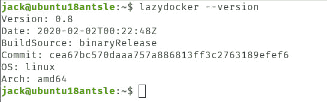
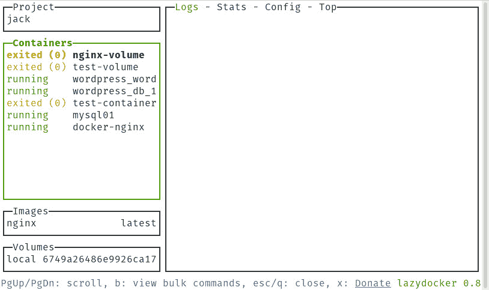
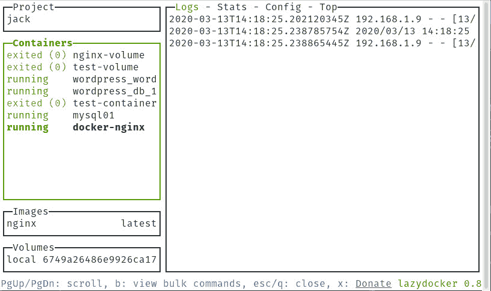
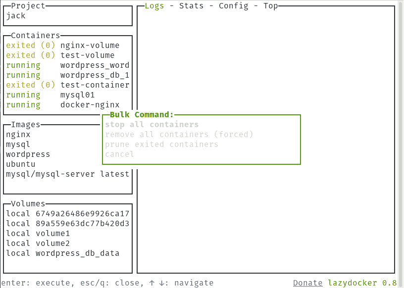
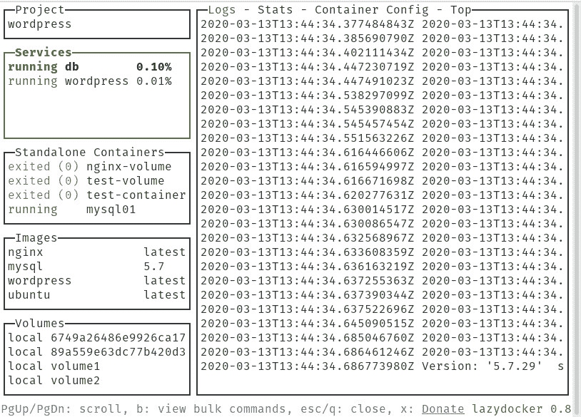

# 看看 Lazydocker，一个基于光标的 docker 管理工具

> 原文：<https://thenewstack.io/a-look-at-lazydocker-a-cursor-based-docker-management-tool/>

对于任何管理 docker 容器的人来说，拥有合适的工具确实可以让管理会话变得更好。另一方面，没有合适的工具会让你的一天变成沮丧的练习。

有了 **docker** ，如果你习惯命令行，你可能会觉得你已经拥有了充分利用这些容器所需的一切。但是当你看到众多可用的图形用户界面中的一个时，你希望你有更多，但是不需要走完全图形化的路线。比方说，您的 **docker** 容器是从一个无头的 Linux 服务器上管理的，并且您不希望必须安装一个基于 web 的 GUI 来获得更多信息并更容易地管理这些部署的容器。

你是做什么的？什么工具存在于控制台和 GUI 之间？

[懒人](https://github.com/jesseduffield/lazydocker/)怎么样？

Lazydocker 是由[杰西·达菲德](https://github.com/jesseduffield)创建的，目的是让管理 **docker** 容器变得更加容易。简单地说，Lazydocker 是一个终端 UI(用 Golang 和 [gocui](https://github.com/jroimartin/gocui) 库编写),用于 **docker** 和 **docker-compose** 命令。Lazydocker 允许您查看项目、容器、图像、卷，以及正在运行的容器的日志、统计、配置和 top。

Lazydocker 还允许您运行批量命令来停止、删除和清理容器。

最重要的是，Lazydocker 非常容易安装和使用。我将带你经历这样做的过程。我将在 Ubuntu Server 18.04 上演示，但是你应该可以在任何支持 docker 引擎的 Linux 发行版上安装 Lazydocker。

## 如何安装 docker

在你安装 Lazydocker 之前，你必须先安装好 **docker** 本身。很可能你已经做了。如果是这种情况，请跳到 Lazydocker 安装部分。要不然就装 docker 吧。

打开终端窗口，发出命令:

`sudo apt-get install docker.io -y`

该命令完成后，使用以下命令启动并启用 docker 守护程序:

`sudo systemctl start docker`

`sudo systemctl enable docker`

启动并启用服务后，您需要将您的用户添加到 docker 组。如果你不这样做，你使用 docker 命令的唯一方式就是通过 **sudo** ，这是一个安全风险。要避免这种情况，请发出以下命令:

`sudo usermod -aG docker $USER`

完成后，注销并重新登录。

你可能还想安装 **docker-compose** 。为此，发出以下命令:

`sudo curl -L "https://github.com/docker/compose/releases/download/1.23.1/docker-compose-$(uname -s)-$(uname -m)" -o /usr/local/bin/docker-compose`

`sudo chmod +x /usr/local/bin/docker-compose `

## 如何安装 Lazydocker

现在您已经安装了 docker 和 docker-compose，是时候安装 Lazydocker 了。首先要做的是访问 [Lazydocker 发布页面](https://github.com/jesseduffield/lazydocker/releases)，看看开发者有什么最新版本。截至 2020 年 3 月 13 日，最新发布版本为 0.8。使用以下命令下载该版本(假设您的架构是 64 位的):

`wget https://github.com/jesseduffield/lazydocker/releases/download/v0.8/lazydocker_0.8_Linux_x86_64.tar.gz`

下载完成后，使用以下命令将其解包:

`tar xvzf lazydocker*.tar.gz`

您现在应该会看到三个新文件:

*   许可证
*   README.md
*   懒人

使用以下命令安装 lazydocker 二进制文件:

sudo 安装 lazydocker /usr/local/bin

要验证安装，请运行命令:

`lazydocker --version`

您应该会看到 Lazydocker 的所有相关发布信息(**图 1** )。



**图 1:** Lazydocker 已成功安装。

## 如何配合 docker 使用 Lazydocker

现在您已经安装了 Lazydocker，让我们部署几个容器，看看它是如何工作的。首先，我们将使用以下命令部署 NGINX 容器:

`docker run --name docker-nginx -p 8080:80 -d nginx`

接下来，我们将使用以下命令部署 MySQL 容器:

`docker run --name=mysql01 -d mysql/mysql-server:latest`

现在，让我们创建一个卷，然后将其附加到容器。使用以下命令创建卷:

`docker volume create --name volume1`

现在，使用以下命令创建一个目录来装载卷:

`mkdir ~/container-data`

接下来，使用以下命令部署容器:

`docker run -d -P --name test-container -v ~/container-data:/data nginx`

上面的命令将打印出一个容器 ID。复制该 ID，然后使用以下命令附加该卷:

`docker attach ID`

其中 ID 是您复制的容器 ID。

创建完这些容器后，发出以下命令:

`lazydocker`

将出现 Lazydocker 界面(**图 2** )。



**图 2:** Lazydocker 运行显示所有相关信息。

用你的鼠标，你可以点击任何窗格或窗格中的任何列表。例如，单击 docker-nginx 条目，然后单击右窗格中的 Logs 选项卡。您将看到正在运行的容器的所有日志条目(**图 3** )。



**图 3:** 正在运行的 NGINX 容器的日志条目。

您还可以单击 Stats、Config 或 Top 选项卡来查看更多信息。

如果你在键盘上输入“ **b** ”(无引号)，你会看到批量命令菜单(**图 4** )。



**图 4:** 批量命令菜单。

从该菜单中，您可以停止、删除和清理所有容器。

通过键入“ **q** ”(没有引号)退出 Lazydocker。

## 通过 docker-compose 使用 Lazydocker

现在我们将基于 WordPress 创建一个 **docker-compose** 项目。使用以下命令创建一个新目录:

`mkdir wordpress`

使用以下命令切换到该目录:

`cd wordpress`

使用以下命令创建 YAML 文件:

`nano docker-compose.yml`

在该文件中，粘贴以下内容:

```
version:  '3.3
services:
db:
image:  mysql:5.7
volumes:
-  db_data:/var/lib/mysql
restart:  always
environment:
MYSQL_ROOT_PASSWORD:  somewordpress
MYSQL_DATABASE:  wordpress
MYSQL_USER:  wordpress
MYSQL_PASSWORD:  wordpress

wordpress:
depends_on:
-  db
image:  wordpress:latest
ports:
-  "8000:80"
restart:  always
environment:
WORDPRESS_DB_HOST:  db:3306
WORDPRESS_DB_USER:  wordpress
WORDPRESS_DB_PASSWORD:  wordpress
WORDPRESS_DB_NAME:  wordpress
volumes:
db_data:  {}

```

保存并关闭文件。

用命令部署 WordPress 容器:

`docker-compose up -d`

一旦容器部署完毕，从~/wordpress 文件夹中发出 *lazydocker* 命令，工具将打开，并显示该项目的所有信息(**图 5** )。



图 5: Lazydocker 正在使用我们的 wordpress 项目。

现在，您可以为 wordpress 项目检出与部署的 docker 容器相同类型的信息。

## 结论

Lazydocker 可能不适合所有人，但是对于那些寻找存在于命令行和 GUI 之间的解决方案的人来说，这个工具是无可匹敌的。尝试一下，看看它是否能很快成为您的首选 docker 容器管理器。

<svg xmlns:xlink="http://www.w3.org/1999/xlink" viewBox="0 0 68 31" version="1.1"><title>Group</title> <desc>Created with Sketch.</desc></svg>