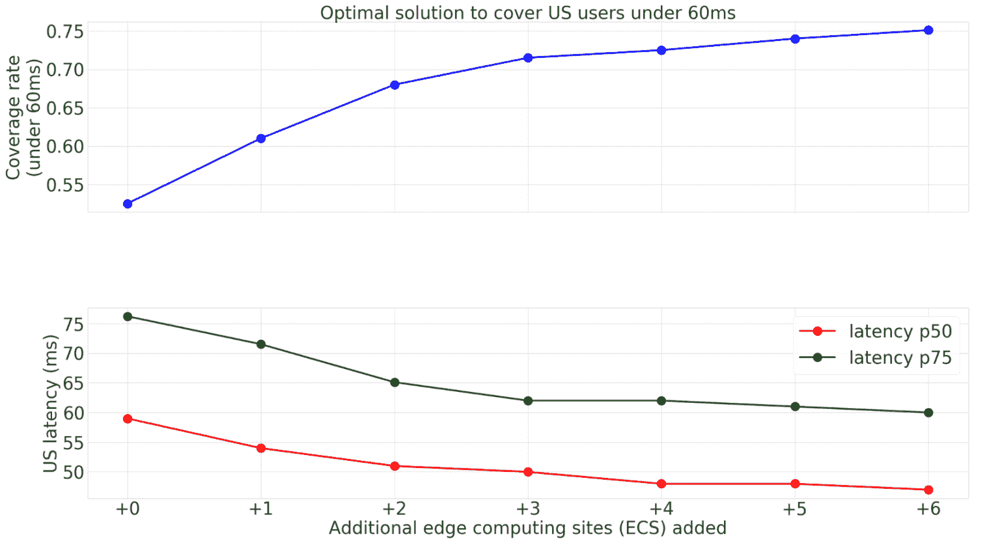
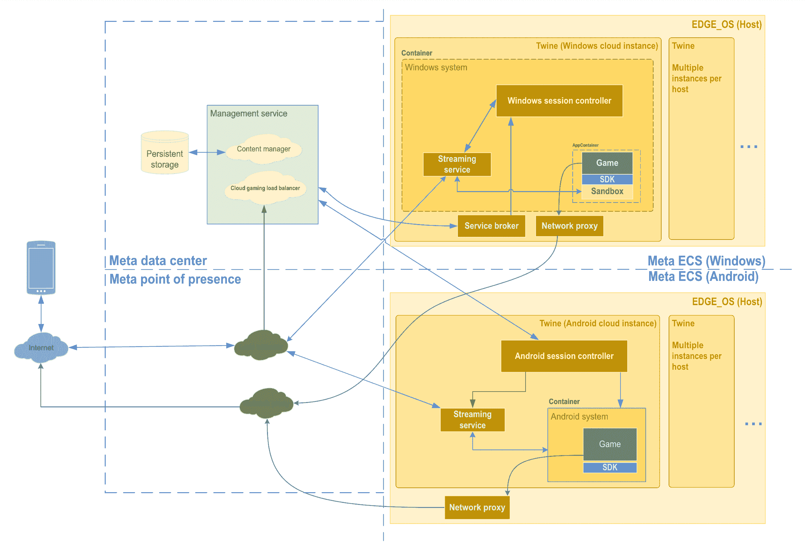
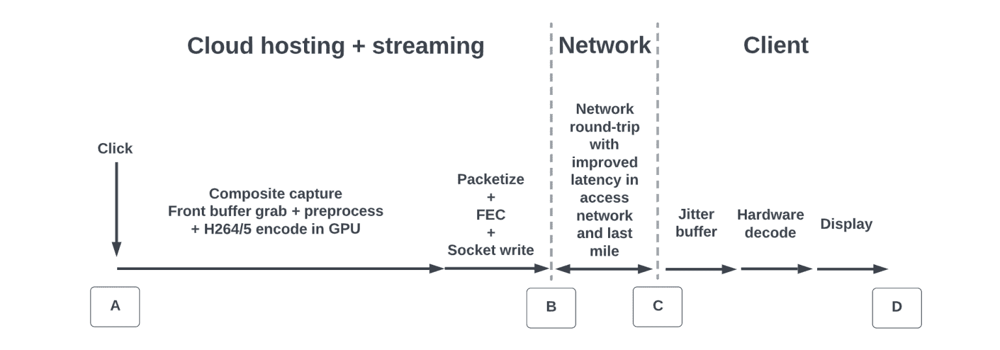

# 看看 Meta 的低延迟云游戏基础设施

> 原文：<https://thenewstack.io/a-look-at-metas-low-latency-metaverse-infrastructure/>

社交媒体巨头 [Meta](https://about.facebook.com/) 在周四的一篇博客文章中宣称，为了解决提供快速、流畅、无抖动和超低端到端延迟游戏的挑战，公司软件工程师[创造了一个能够在单个服务器上运行多个游戏的基础设施——为了经济效益——同时保持数据安全。](https://engineering.fb.com/2022/06/09/web/cloud-gaming-infrastructure/)

他们断言，这种低延迟游戏平台也可以作为基础 Meta 的待定元宇宙。

脸书在 2020 年推出了云游戏平台，让用户可以在所有浏览器上快速访问原生 Android 和 Windows mobile 游戏。伴随着大量的消费者访问而来的是大量的开发者和工程挑战。

## **网络、托管和集群管理**

Meta 在提供低端到端延迟方面采取的第一步是物理步骤，以缩短云游戏基础设施和玩家之间的距离。为此，Meta 使用了边缘计算，并部署在靠近大量玩家的边缘。边缘计算的目标是“有一个统一的主机环境，以确保我们能够尽可能流畅地运行尽可能多的游戏，”Meta 工程师[张](https://www.linkedin.com/in/qunshu-zhang-6a443522/)和[朱晓星](https://www.linkedin.com/in/xiaoxing-zhu-12911311/ "Posts by Xiaoxing Zhu")写道。

边缘计算站点越多，用户延迟越低。

工程师们写道，接下来，Meta 的目标是“确保我们能够尽可能流畅地运行尽可能多的游戏”。

为此，Meta 与 Nvidia 合作，在他们使用的 GPU 上构建了一个托管环境。Meta 认为，这一步骤将提供“我们加载和流式传输游戏所需的高保真和低延迟。”

集群管理是端到端延迟降低挑战的最后一环。为此，Meta 使用了其内部的 [Twine 集群管理](https://engineering.fb.com/2019/06/06/data-center-engineering/twine/)。Twine 在 edge 上协调游戏服务器，而定制构建编排服务管理流信号。Windows 和 Android 都有不同的托管解决方案，这提供了更多的灵活性。

Meta 的云游戏基础设施(Meta)

## **音频和视频流**

高质量的音频和视频可以说是云游戏最重要的东西。人物可以跳，但是音频和视频绝对不可以。Meta 工程师选择了使用[安全实时传输协议](https://developer.mozilla.org/en-US/docs/Glossary/RTP) (SRTP)的 [WebRTC](https://webrtc.org/) 来传输用户输入和视频/音频帧。

工程师们仔细研究了他们目前使用的工作流程:

*玩家执行一个动作(让角色跳转)——>点击事件被捕获并发送到服务器——>游戏仿真器接收到该事件——>游戏渲染一个包含动作结果(角色跳转)的帧——>Meta 捕获渲染的帧，使用视频编码器复制并编码——>帧被打包成用户数据报协议(UDP)数据包——>通过网络发送到玩家——>数据包被解码成帧并为玩家渲染。*

尽管每个操作都被快速执行，但是所有这些操作加起来可能会导致看似缓慢的性能。

修订后的工作流程现在包括更少的步骤:

GPU 编码有助于减少视频和音频流的延迟。

现在，当游戏渲染一帧时，它会在 GPU 中渲染，直到编码后才会离开 GPU 内存。因此，新的进程不会使用 GPU 和主服务器之间的大量 PCI 总线。为了进一步提高效率，该过程还创建了最终比原始帧小的编码帧。

> Meta 可以利用播放器的计算机显示器或电话屏幕的固有延迟，使用帧之间难以察觉的间隔来帮助吸收一些抖动并平滑视频。

为了继续改善延迟，在解码时，视频先于音频发送，这与当前音频和视频一起发送的做法相反。Meta 还可以利用播放器的计算机显示器或电话屏幕的固有延迟。屏幕以特定速率(例如，30fps 或 60fps)一个接一个地渲染帧。Meta 可以利用这些难以察觉的帧间间隔来帮助吸收一些抖动并平滑视频。对于支持更高 FPS 的设备，延迟可以进一步降低。

## **安全**

该系统服务于基于 Windows 和 Android 的系统，固有地承担了这些环境的安全挑战，并且还需要防御 DDOS 攻击等威胁。

为了确保安全，Meta 的云游戏基础设施与其核心数据完全分离。就如何保护云游戏基础设施而言，安全威胁在开发的每个阶段都要经过测试，从设计开始，一直到实施和测试。这包括威胁建模、安全代码审查、模糊测试和安全测试。Meta 还让外部公司执行安全评估，作为额外的一层保护。

## **云游戏的下一步是什么？**

在技术改进方面，Meta 目前正在与移动网络运营商合作，以改善移动网络的延迟，并与芯片组网络合作，以改善用户设备的延迟。工程团队也在研究新的容器技术，以提供更好的流效率，并继续确保安全措施与所有增长领域保持同步。

开发人员还可以期待即将到来的重大系统兼容性改进，以及更好的开发、测试、调试和分析工具。

<svg xmlns:xlink="http://www.w3.org/1999/xlink" viewBox="0 0 68 31" version="1.1"><title>Group</title> <desc>Created with Sketch.</desc></svg>