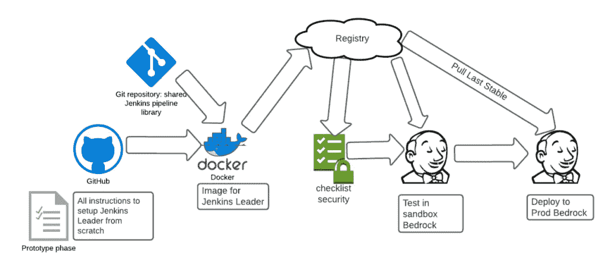
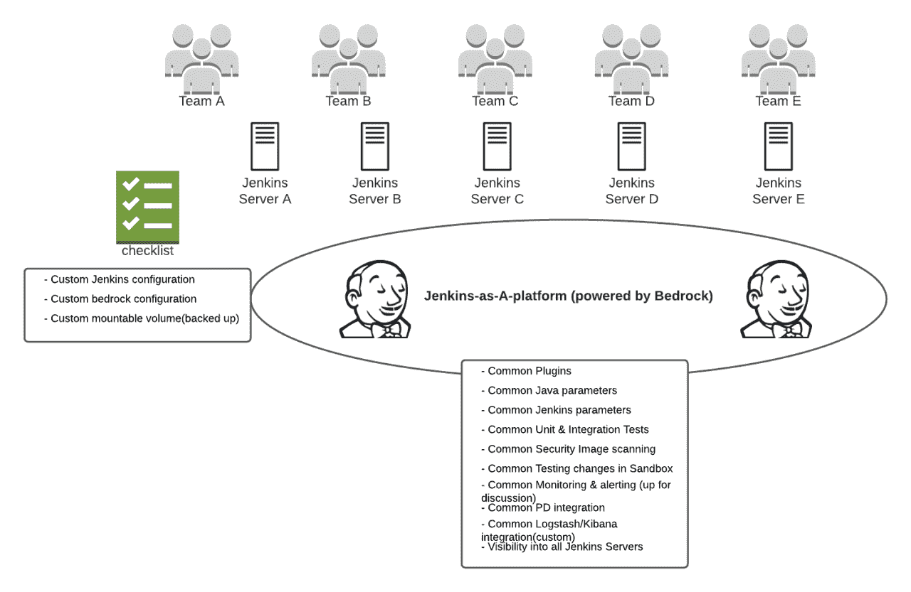
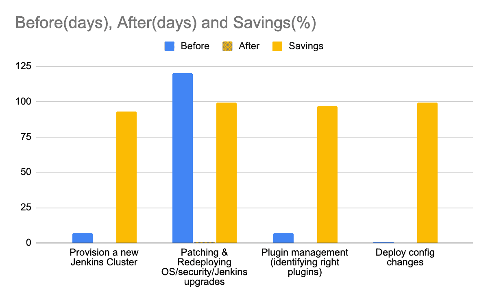

# 看看 Slack 新的基于 GitOps 的构建平台

> 原文：<https://thenewstack.io/a-look-at-the-slacks-new-gitops-based-build-platform/>

企业消息巨头 [Slack](https://slack.com/) 已经对其构建平台进行了现代化改造，放弃了单个 [Jenkins](https://www.jenkins.io/) 集群，采用更加标准化的模型来提高开发人员的效率和用户体验。

这是一个必要的举措:Slack 正在快速增长，其收入[自 2014 年以来基本上每年翻一番](https://www.businessofapps.com/data/slack-statistics/#:~:text=Business%20communication-,Slack%20revenue,-Slack%20made%20%24902)。随着公司以这样的速度发展，曾经有效的解决方案现在可能不是最好的。在这种情况下，它是 Slack 的构建平台。

Slack 工程师团队最近写的一篇博客文章详细讨论了这个话题。

Slack 从早期就开始使用 Jenkins 作为它的构建平台。允许每个团队创建他们自己定制的 Jenkins 集群，称为“雪花集群”，这是 2014 年的一个好主意。但随着高速增长，产品服务对 Jenkins 的依赖性也在增加，不同的团队开始使用 Jenkins 来满足自己的独特需求，如插件、证书、安全实践、备份策略、管理作业、升级包等。

简而言之，考虑到每个独特的集群都有自己丰富的生态系统，其中包含要升级的插件、要处理的漏洞以及管理它们的流程，因此有足够多的“雪花集群”来导致雪崩般的复杂性。

那里。曾经是。挑战。一长串挑战。虽然每家公司都有一长串独特的技术挑战，但 Slack 的挑战列表总体上看起来与公司决定实现技术现代化的普遍原因相似:*目前的代码是有效的，但对未来来说不是最佳的，并导致生产力的损失。还有技术债务。没有人想要技术债务。*

尽管这个系统不是最佳的，但完全重写是不必要的。现代化的目标是解决关键问题，现代化部署的集群，并标准化 Jenkins 库存。

在高层次上，构建团队将为“构建即服务”提供一个平台，该平台具有足够的自定义 Jenkins 集群的旋钮。

## **从哪里开始？**

Slack 做了我们所有人都在做的事情……他们对大规模公司使用什么构建系统进行了研究。Slack 工程师确实有机会与多家公司会面，讨论他们的构建系统。这些会议帮助他们学习和复制(如果可能的话)其他构建系统。

从一个每周阅读许多工程博客帖子的人那里，我看到了不断出现的相同的构建系统需求。

以下是 Slack 实现的功能和概念的不完整列表([团队的帖子](https://slack.engineering/buildrock-a-build-platform-at-slack/)要全面得多):

**无状态和不可变的 CI 服务:**将业务逻辑从底层构建基础设施中分离出来使得 CI 服务成为无状态的。这导致了更快和更安全的构建和构建基础设施的部署，涉及左移策略的选项，以及可维护性的改进。所有与构建相关的脚本都被转移到独立于业务逻辑所在位置的 repo 中。该团队使用 [Kubernetes](https://kubernetes.io/) 来帮助构建 Jenkins 服务，该服务有助于解决不可变基础设施、资源高效利用和高可用性等问题。每个服务都是从零开始构建的，因此消除了剩余状态。

**安全运营是服务部署管道的一部分:**在当今永无止境的网络攻击中，这一点显而易见。Slack 为每个集群制定了身份和访问管理(IAM)以及基于角色的访问控制(RBAC)策略。每次构建 Jenkins 服务时都会进行漏洞扫描。

**更多的左移以避免以后发现问题:** 这里测试肯定是移动的。这个问题越来越突出。在开发中发现 bug 总是比在生产中发现 bug 要好。

Slack 使用了一个全面的测试集群和预试运行区域来测试对 CI 系统的小/大影响更改，甚至在它们影响到试运行环境的其余部分之前。这也允许高风险的变更在将变更推向生产之前，在一段较长的时间内进行酝酿。额外的测试带来了更好的开发效率和改进的用户体验，这与在其他左移文章中发现的结果相似。

## **除了新功能，集群也必须标准化**

标准化在这种情况下意味着一个单一的修复可以统一适用于詹金斯库存。为此，Slack 使用了詹金斯的配置管理插件 [Casc](https://plugins.jenkins.io/configuration-as-code/) 。

中央存储确保所有 Jenkins 实例使用相同的插件来避免雪花状剥落。这允许自动升级，并减轻了任何手动干预或版本不兼容的需要。

## **GitOps 风格管理**

Git 成为了真理的唯一来源。没有什么是建立或运行在詹金斯控制器。这是通过 [GitOps](https://thenewstack.io/what-is-gitops-and-why-it-might-be-the-next-big-thing-for-devops/) 执行的。通过使用模板来管理配置，使用户可以轻松创建集群，重用现有配置来轻松更改配置。

整个构建基础设施可以从头开始重新创建，每次都有完全相同的结果，因为所有的基础设施操作都来自使用 GitOps 模型的 Git。

## **配置管理**

在每个集群上启用度量、日志记录和跟踪有助于调试。现在，在适用的集群上可以重用凭据。升级 Jenkins 操作系统、软件包和插件很快，因为所有东西都包含在 Dockerfile 文件中。

这里列出的特性以及原始文章中包含的其他特性组成了这个图表，它代表了新构建系统的流程。

## **分布式所有权**

构建团队管理构建平台基础设施中的系统，其余系统将由使用构建平台的服务所有者团队管理。

## **挑战与总结**

正如我们提到的，有一长串的挑战。但是总的来说，现代化工作带来了大量的学习、教学、调试和一流的文档编写。下图详细描述了一个值得努力的过程。

以安全可靠的方式快速构建和部署单个服务。  解决安全漏洞的时间缩短，Jenkins 库存的标准化减少了维护车队所需的多个代码路径。如果需要，可以快速推出和回滚基础架构更改。

迁移从他们现有的几个生产构建集群开始，速度很慢。目前，新的集群正在使用新系统构建，这有助于改进上面显示的交付时间表。目前，所有服务向新构建系统的迁移正在进行中，新的功能正在增加。

技术瞬息万变，可操作性和最佳性是有区别的，有时是时候开始改变了。

<svg xmlns:xlink="http://www.w3.org/1999/xlink" viewBox="0 0 68 31" version="1.1"><title>Group</title> <desc>Created with Sketch.</desc></svg>