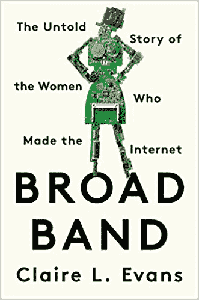

# 时光倒流:被遗忘的兰姆达姆名声

> 原文：<https://thenewstack.io/a-look-back-in-time-the-forgotten-fame-of-lambdamoo/>

上周，Undark 杂志[回顾了 LambdaMOO](https://undark.org/article/wilo-evans-broad-band/) ，这是一个基于文本的虚拟世界，于 1990 年 11 月首次开放。显然，它已经连续运行了近 28 年——尽管这些天来它更多的是一种好奇，而不是未来的预兆，因为在 20 世纪 90 年代初对许多人来说它似乎是这样的。

这是一个迷人的机会，看看我们在预测我们的技术将带我们走的方向方面有多好——对昨天的一个在线现象的有益观察——因为在一开始，LambdaMOO 似乎提供了网络空间将会是什么样子的暗示。

登录的用户会看到虚拟地点的文字描述。他们可以从一个地方导航到下一个地方，并与其他登录的用户聊天。用户也可以通过输入@emote 命令让人们知道他们在做什么，或者用@describe me 控制对他们自己的描述。除了定制他们的虚拟化身的文本描述，高级用户还可以添加额外的命令和行为，使这个虚拟世界的主干成为一个大规模的代码项目，至少有一些编程是由一个小组完成的。

 LambdaMoo 在三月份出版的新书《宽带:互联网女性的不为人知的故事》中被提及这本书的一部分重点讲述了朱迪·安德森在斯坦福大学攻读计算机科学硕士学位时遇到了 MOO 的创始人，并于 1990 年结束了 MOO 的早期编程工作。这本书的作者克莱尔·l·埃文斯(Claire L. Evans)为《Undark》杂志撰写了这篇文章，该杂志是在麻省理工学院新闻奖学金项目的赞助下出版的，是名为“我遗漏了什么”的经常性专题的一部分。

在文章中，埃文斯访问了“大厦的大厅，这实际上只是一串代码，人们曾经住在这里，现在仍然以这样或那样的方式生活，因为有人必须这样，直到服务器眨眼。”

它还包括对 1990 年一个灾难性的夏天的回忆，当时 MOO 的创始人年轻的 Pavel Curtis 仍然是一名研究员，在施乐 PARC 位于帕洛阿尔托的传奇建筑中工作。她写道:“就像那些日子里许多能接触到电脑的人一样，他研究了早期的互联网。”。

当然，当时空气中弥漫着某种东西，人们怀着极高的野心看待他们的虚拟世界。在 1994 年的一篇文章中，作者 Howard Rheingold 称 Curtis 的工作是“将非正式的，甚至是有趣的交流带回组织的一种方式”，因为 Curtis 和一位名叫 Dave Nichols 的合作者开始思考 MOOs 是否可以成为远程办公的替代方案，特别是如果它们包含视频聊天的话。施乐公司副总裁约翰·西利·布朗当时是 PARC 的主管，他在 1991 年的《哈佛商业评论》上写道，“未来来自公司研究实验室的最重要的发明将是公司本身。”

莱茵戈德热情地总结了 MOOs 似乎适合这一切的地方。“在一个鼓励讲故事、即兴创作和非正式交流的环境中使用基于计算机的工具，是利用硅来放大思想和工作社区的力量的一种方式。”他描述了那些以故事的形式创造了“一个看不见的、非正式的、潜在不朽的解决方案知识库”的工人。

但是当然，很多人只是用它们来找乐子。

## 参观虚拟世界

在同一年的[另一篇*连线*文章中，Josh Quittner 描述了在 LambdaMOO 找到一个有虚拟火箭船的虚拟场地，然后将它飞向一个虚拟的卫星(有自己的月球定居者殖民地)。“我来这里是因为我听说在互联网终结的地方正在发生奇怪而奇妙的事情。”](https://www.wired.com/1994/03/muds-3/)

Quittner 引用“成百上千的泥巴、污泥、糊状物和 M-whatevers 在网络上传播，就像长耳大野兔 warrens，”Quittner 指出，“你可以住在其中的一些地方，在某种意义上，你可以在那里度过你醒着的大部分时间，在一个计算机模拟的空间里。很多人都是这样。”

“虚拟现实是未来的潮流，”一位 MOO 用户在这篇 1994 年的文章中告诉他，“但我们现在正以面向对象的文本格式体验它，在那里我们的想象力占据了控制权。”事实上，该用户认为，在某些方面，多媒体虚拟现实将不会那么引人注目，因为“用文本更容易让事情发生，因为你只需键入你想要‘发生’的事情”。没有定义好的图片来强迫你和其他人分享相同的虚拟图像。”

这篇文章探讨了一个严肃的问题:创作的快感——当然，还有在网上与真人分享的快感——似乎正在变成一种瘾。在 MOO 推出四年后，朱迪·安德森仍然是 MOO 的管理员之一，她坚持认为自己是 MOO 的“上瘾”用户之一。

作家霍华德·莱茵戈德在他 1993 年的书《虚拟社区》中提到了这个主题，并引用了柯蒂斯在伯克利的一次小组讨论中的话。Curtis 讲述了一个用户的故事，这个用户本该在假期拜访他们的家人。午夜后到达，用户转而去了剑桥大学的计算机实验室，这样他可以在 Moo 上查看两个小时。“他凌晨 2:30 到家，发现警察和一些惊慌失措的父母，然后开始怀疑也许他没有控制住自己。”

但奎特纳显然过得很愉快，他可能至今仍深情地记得这段时光，他写道:“我上床睡觉时，眼睛布满了血丝。”最终，他亲自拜访了帕维尔·柯蒂斯，并提出了一个问题。“我认为许多人对此完全没有准备。这几乎类似于迷幻药。”

“我怀疑这些东西会消失，”奎特纳总结道。

但是本世纪的数字颠覆即将发生:网络浏览器的到来。甚至到了 1998 年，MOOs 在很大程度上还是过去的产物。

## 我们现在在哪里？

尽管专家们预测了一个企业 MOOs 的世界，但我们最终还是得到了 Slack 精简后的聊天功能。脸书找到了一种将每个人的现实世界社区导入网络世界的方法，所以也许我们的社交能量现在只是对我们朋友在脸书和推特上分享的链接或随机 Reddit 用户的帖子进行机智的评论。再过四分之一个世纪，人们会惊叹于它们吗，就像 20 世纪 90 年代初基于文本的虚拟热水浴缸一样？

当然，现在有大预算的虚拟世界，为一个多用户视频游戏的万神殿而创造。去年《无人天空》发布了一个更新版本，超过 100 万玩家前来尝试。黑客新闻上的一位[评论者记得在 20 世纪 90 年代末玩过类似 D & D 的 MUDs(多用户地下城)——直到他的大多数虚拟朋友转向了像魔兽争霸和第二人生这样的多媒体游戏。“这两个我都进不去。它们对我来说有点超载，而且，坦率地说，不太有趣。出于某种原因，我的大脑只对 MUDs 提供的简单文本工作得最好。”](https://news.ycombinator.com/item?id=17582792)

柯蒂斯后来怎么样了？去年，Ars Technica 指出，他后来成为了微软的一名软件架构师。尽管 lambda moo[仍然在线](http://www.moo.mud.org/)，Curtis 已经将近 20 年没有登录他的作品了。(“你回不去了，”他告诉克莱尔·埃文斯。)但是这么多年过去了，朱迪·安德森还在登录。“她不再和很多人说话，当我们调出 50 多个活跃用户的名单时，她只认出了六个名字。”

现在剩下的是一个分散的人类社区，更老，也许更聪明，试图理解这一切的意义。“与其哀悼它的逝去，我更愿意记住所有的美好时光，珍惜我结交的所有朋友(其中许多人我至今仍保持联系)，”黑客新闻的那位评论者回忆道。

“游戏可能会消失，但记忆将永远伴随着我们……我很高兴我成为了那个时代的一部分，也为我建立的友谊感到高兴。”

* * *

# WebReduce

<svg xmlns:xlink="http://www.w3.org/1999/xlink" viewBox="0 0 68 31" version="1.1"><title>Group</title> <desc>Created with Sketch.</desc></svg>