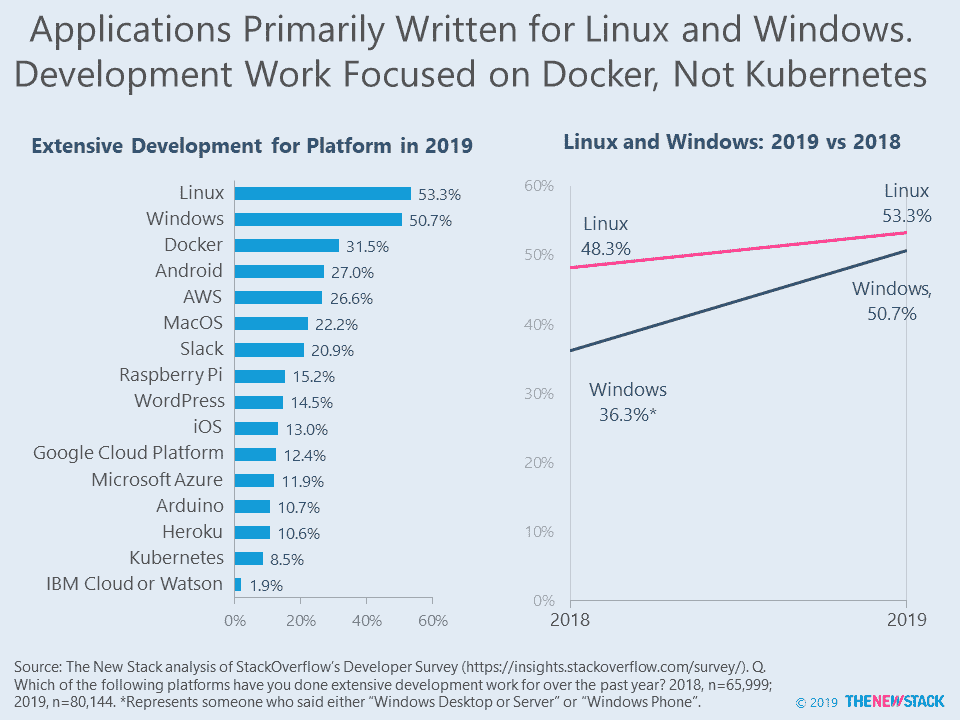
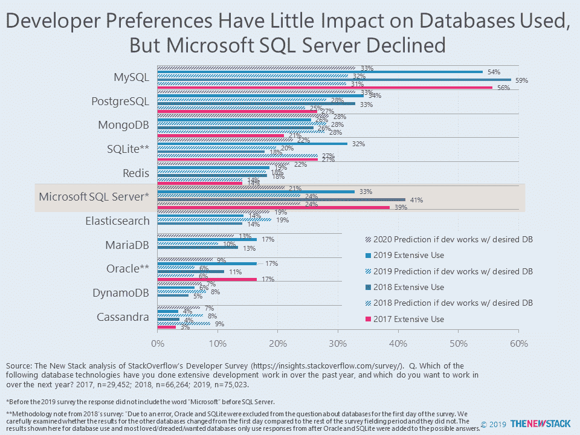

# 微软 Windows 的复兴，而 SQL Server 的衰落

> 原文：<https://thenewstack.io/a-microsoft-windows-resurgence-while-sql-server-declines/>

与 2018 年相比，2019 年有 40%的开发人员广泛使用微软 Windows。根据最新的[堆栈溢出调查，](https://insights.stackoverflow.com/survey) 51%的开发人员在去年广泛使用 Windows，而在 2018 年的调查中，这一数字仅为 36%。有成千上万的参与者，这不是抽样误差。或许微软的核心业务正如该公司在最新财报中所说的那样表现良好。

为什么 Windows 会出现如此大的峰值？一个原因是，在过去一年中，参与桌面或企业应用程序的受访者比例从 17%上升到了 21%。这并不是因为开发人员将它作为他们的主要台式机/笔记本电脑，只有 48%的人这样做，这比前一年下降了 2 个百分点。这些结果表明，尽管企业应用程序是作为 SaaS 交付的，但许多程序仍然是为 Windows 编写的。开发者活动的复苏并没有减缓 Linux 的发展，因为其采用率在 2019 年上升了 10%。这种情况是否会继续，将取决于 Docker 或另一种技术作为跨操作系统平台是否会更加突出。

对于微软来说，一切都不顺利，因为针对 SQL Server 进行广泛开发的比例从 2018 年的 41%下降到 2019 年的 33%。我们不确定为什么会出现这种下降。一个无伤大雅的解释是，很少有人检查这个类别，因为最近的调查在产品名称前添加了“微软”一词。或者，可能有很大一部分 SQL Server 2008 用户在今年计划的支持结束之前就弃用了。如果是这样的话，我们想知道有多少开发者会使用微软 Azure 的数据库产品。

解释堆栈溢出调查时要小心。无数博客和公关广告大肆宣传一项技术有多“受欢迎”、“令人畏惧”或“受欢迎”。“我们发现，开发人员的愿望对他们全年使用的实际数据库几乎没有影响。如果开发人员使用他们想使用的数据库，那么 MySQL 和 Oracle 的采用率将会直线下降，但与两年前相比，它们相对保持不变。同样，Cassandra 的使用量每年都会翻倍，而实际结果却显示没有任何增长。

## 从推特上

*[@LawrenceHecht](https://twitter.com/LawrenceHecht) 活跃在 Twitter 上，经常涉及他文章中没有提到的话题。下面是三条推文，强调了关于 Kubernetes、SQLite 和数据库市场的所谓重组的额外分析。*

通过 Pixabay 的特征图像。

<svg xmlns:xlink="http://www.w3.org/1999/xlink" viewBox="0 0 68 31" version="1.1"><title>Group</title> <desc>Created with Sketch.</desc></svg>