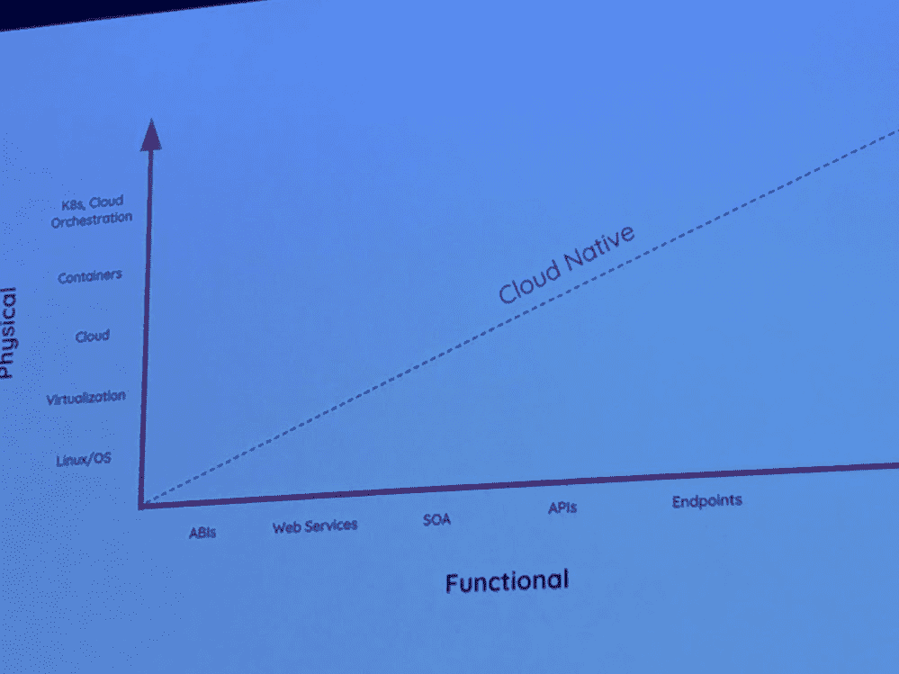
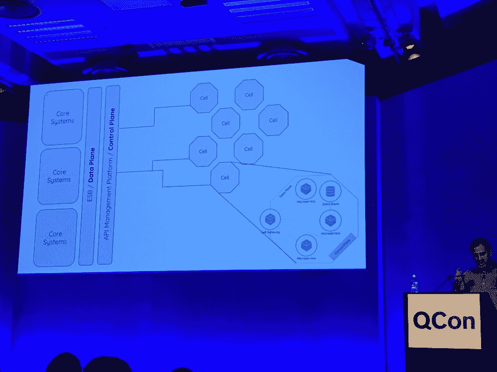

# 蜂窝自组织团队中的微服务管理模型

> 原文：<https://thenewstack.io/a-model-for-managing-microservices-in-cellular-self-organized-teams/>

我们已经说过很多次了——现代系统是复杂的。现在，康威定律——技术系统的设计反映了一个组织的文化和沟通——是否可取还有待讨论，但毫无疑问，它几乎是一个常数。分布式系统的风险在于，每个人和每件事都是如此的分散，以至于没有一个清晰的路径来说明事情是如何连接的，以及谁负责什么代码以及负责多长时间。

WSO2 的联合创始人 Paul Fremantle 向 QCon London 的[观众讲述了他如何试图将简化的数学和物理模型应用于分布式系统。他发现分布式系统不断变化的复杂性更类似于不断进化的细胞生物学。](https://qconlondon.com/london2019/presentation/cell-based-approach-microservices-architecture)

“生物学不是试图让一切都超级简单，而是学习如何处理复杂性，”他说。

人体和现代分布式架构都是类似的复杂系统。

今天，我们将分享 WSO2 基于单元的微服务方法，其中代码被重新聚合以反映分散的敏捷组织。

## 是什么阻碍了企业敏捷性成为现实？

“过去 50 年发生的事情是，我们正在分解我们的系统——越来越小，无服务器和微服务，”弗里曼特尔说。

他说，扩大规模和加快发展速度的需求是这一趋势的驱动力。然而，他引用了[第 12 次年度敏捷状态报告](https://stateofagile.versionone.com/)指出，虽然 58%的组织使用敏捷实践来支持这一点，但只有 4%的组织认为他们的组织作为一个整体是敏捷的，能够适应市场条件。

在团队中引入敏捷性并建立一个团队— [像一群群的 scrum](https://thenewstack.io/scaling-agile-build-scrum-scrums/)一样——将敏捷性提升到企业级别，似乎是一个巨大的挑战。

弗里曼特尔认为，在一个统一的、跨组织的战线上保持敏捷的困难是因为有太多的分散。从 API 和端点到功能组件，再到运行时的碎片化和平台，再到 Kubernetes 和微服务，我们离硬件编排越来越远。作为云原生的本质上使事情变得更加分散和复杂。

他继续吹捧诸如复杂的面向服务的架构(SOA)过程——以及错误的技术堆栈——如何通过过多的步骤中断流程等问题。分层架构使您无法控制需要控制的事情。

Fremantle 认为，虽然我们已经分离了很多架构，但我们还没有分离组织。提到[敏捷宣言](http://agilemanifesto.org)对自组织团队的关注，他说我们也需要“可组合”的企业。

对他来说，这个企业是由自组织团队组成的，这些团队:

*   管理自己的工作
*   拉动工作
*   不需要命令和控制
*   团队内部有效沟通
*   不怕问问题
*   不断发展技能和能力
*   有一个仆人式的领导者或促进者，而不是项目经理和领导者

弗里曼特尔主张将团队成员限制在 10 人以下。他说，根据下面的公式，如果一个团队有 10 个人，那就已经有 45 个联系了。十一？五十五个连接。20 个人导致 90 个连接。就像软件一样，这些相互关联的部分让事情变得非常复杂，导致[关系损失](https://www.sciencedirect.com/science/article/pii/S0749597811001105)。

n(n-1)
______
2

但是一旦你的组织结构看起来像这样，你如何确保技术反映它？([也读作:微服务:名字可怕，定义模糊)](https://thenewstack.io/microservices-terribly-named-ambiguously-defined/)

## 康威法则如何为您的堆栈提供更多控制和可见性

Fremantle 提供 API 作为自然边界，因为它们具有:

*   预期的、必需的身份验证
*   批准
*   速率限制和节流
*   分析和可观察性
*   假设其他人会使用它:
    *   开发人员友好的门户，如 SDK、示例和论坛
    *   开发人员友好的治理，如版本控制和折旧通知

许多人在 API 网关后放置了一组微服务，以提供更多的版本控制。但请记住，你需要知道谁在使用你的 API，他们用它们做什么，他说。

他比喻说[控制平面](https://searchnetworking.techtarget.com/definition/control-plane-CP)充当生物神经系统，而[数据平面](https://searchnetworking.techtarget.com/definition/data-plane-DP)充当循环系统。他还指出，如今没有棕色地带和绿色地带之分，只有两者都有。

“我们的核心系统在棕色地带，分散服务和微服务在绿色地带。大多数人都在使用某种 API 平台，某种将后端系统与服务隔离的方式，这给了我们扼杀部分架构的可能性。”

如果一个由 10 个开发人员组成的团队负责 200 个微服务，没有人能够知道所有的微服务，但是可以有集体知识。考虑到这一点，Fremantle 认为任何部署中 90%的微服务都不应该对部署它的团队以外的任何人可见。否则，除了构建服务的人之外的其他人做出了更改，一切都会中断。

“我们需要治理和界限，”弗里曼特尔说。“[它]让你在团队中保持敏捷，让你能够自我组织。”

他继续说，我们需要重新整合那些微服务——不是一直回到 monoliths，而是整合到团队所拥有的东西中。

他分享了以下海绵再聚合的延时视频，来说明他所说的微服务的自然再聚合。

[https://www.youtube.com/embed/SvtDMo7fjAc?feature=oembed](https://www.youtube.com/embed/SvtDMo7fjAc?feature=oembed)

视频

> “API 实现了边界，而边界实现了自组织团队。”保罗·弗里曼特尔，世界安全组织 2

继续这个比喻，他说应该有有状态和无状态的单元，一些包装遗留的东西，以及团队想出如何对这些单元或微服务组进行分类。

在 WSO2，作为一个 API 管理系统，他们希望用工具和系统在技术上模拟这种细胞再聚合。他们试图自动可视化 Kubernetes 和微服务的组织。([也可理解为:微服务:微服务的现实替代方案)](https://thenewstack.io/miniservices-a-realistic-alternative-to-microservices/)

## 一个单元就像一个更高层次的抽象

[WSO2 敏捷方法论](https://wso2.com/wso2_resources/wso2-reference-methodology-for-agility-version-0.5.pdf)指出，几乎每一个新的应用都涉及到跨越一组爆炸式增长的端点的集成。

“集成必须从代码中学习，变得不可变、类型安全、可测试、持续构建和部署，以便它们更健壮、更有弹性，最重要的是——更敏捷，”这篇论文写道。

它成为康威组织法则的现代化，建立在持续改进的基础上:

*   对于人和过程来说，基础是组织的文化。
*   对于技术来说，基础是由组织设计和实现的架构。

“我们需要更高层次的抽象——这才是真正的细胞，”弗里曼特尔说。

考虑到这一点，Fremantle 为微服务和一般技术提供了三个指导方针，以赶上团队敏捷性:

*   拥有清晰的全球数据和控制平台—提供 API 管理平台来实现这一目标
*   确保团队通过控制平面提供清晰的边界—版本化的 API
*   让团队在这些边界内自由发展——就像这些微服务组周围的单元一样

> “应该改变人性还是写代码？更容易写代码。我们应该围绕康威定律来构建我们的系统。”保罗·弗里曼特尔，世界安全组织 2

他继续说，每个人都在迈向敏捷的旅途中，但是集成敏捷还没有赶上项目敏捷的速度。为了实现这种集成敏捷性，您必须用细胞结构重新聚合代码，以反映自组织团队，然后这些团队负责度量每个团队细胞的健康状况。

继续围绕你的团队重构你的代码这个主题，他说，这是关于在开发运维、云基础设施和单元内通信的流程中将解耦的组件重新耦合到新的敏捷团队中，确保单元内的每个敏捷步骤都是版本化的，并且在边界的网关之后。

“生物系统已经进化成了复杂性。我认为真正有趣的是企业系统已经进化成了复杂性，”弗里曼特尔说。

点击此处了解更多关于细胞重组的信息。

WSO2 是新堆栈的赞助商。

<svg xmlns:xlink="http://www.w3.org/1999/xlink" viewBox="0 0 68 31" version="1.1"><title>Group</title> <desc>Created with Sketch.</desc></svg>