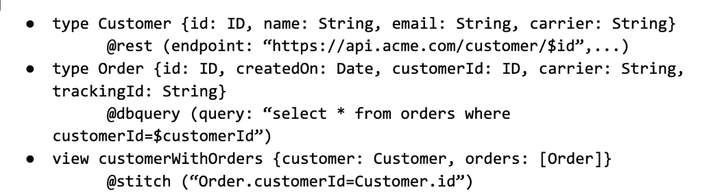
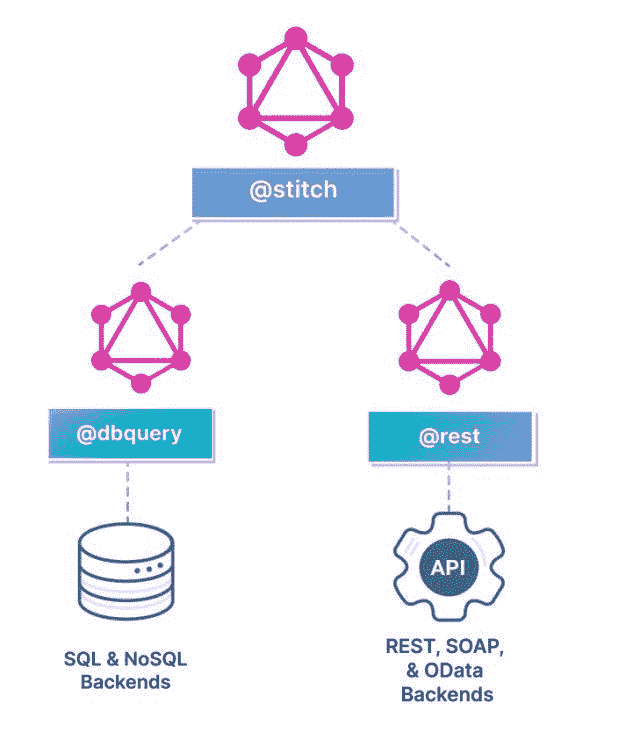
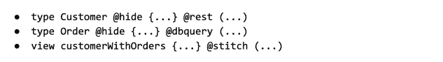
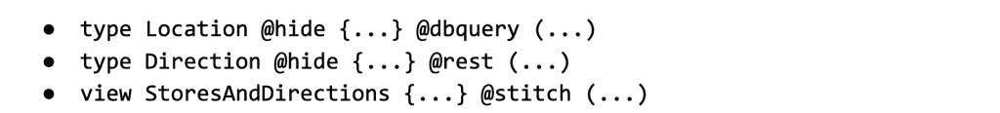
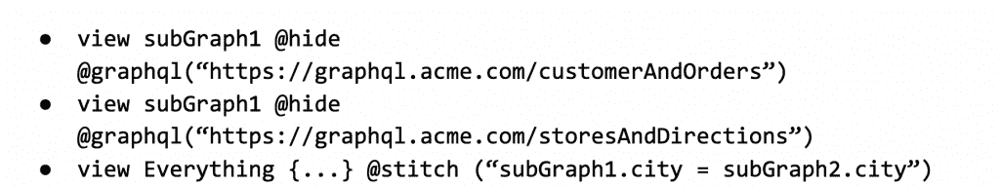
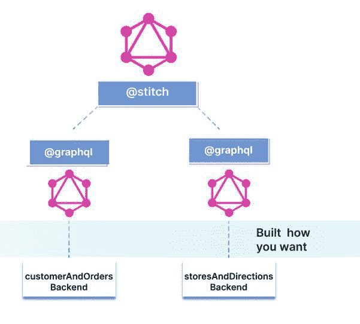
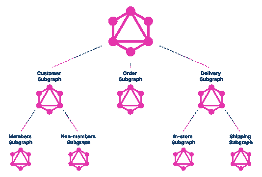

# API 的新架构第二部分——声明式实现

> 原文：<https://thenewstack.io/a-new-architecture-for-apis-part-ii-declarative-implementation/>

我们最近写了一篇关于[新 API 架构](https://thenewstack.io/a-new-architecture-for-apis/)的文章——组合是内置的。GraphQL 很自然地采用了这种架构，但是支持这种架构的实现却大相径庭。在本文中，我们讨论了这种 API 架构的声明性方法。

## 图的声明性说明和组装

让我们以数据库系统为例，数据库的所有者可能会创建两个表和一个视图，将这两个表“缝合”起来，如下所示:

这里有两个以声明方式指定的表，customer 和 order(它们的实现留给数据库系统)。然后定义一个视图，通过链接`customer.id`和`order.customerId`，再次声明性地“组装”这两个表。

不仅规范简单明了，而且因为数据库系统理解实现，所以像下面这样提交的查询可以优化执行。
`select * from customerWithOrders where email=”john.doe@example.com”`

 [阿南特·金格兰

Anant 是 StepZen 的创始人兼首席执行官，step Zen 是一家初创公司，采用新的方法来简化开发人员访问数据的方式，以增强数字体验。](https://www.linkedin.com/in/anantjhingran) 

例如，如果 customer 表很小，它可能是表扫描的。如果它很大，并且在`customer.email`上存在一个索引，那么它可能会被使用。并且存在若干其他这样的选择；数据库决定正确的执行计划。

GraphQL 的声明性方法采用了类似的方法，但有一个特殊的变化:上面的表是“虚拟表”，指向一些后端，可能是 REST API、SOAP API、真实数据库，甚至是另一个 GraphQL 后端。在现实世界中，GraphQL 并没有抛弃投资，而是建立在投资的基础上。

因此，在声明性 GraphQL 实现中(这是伪语法，不是真正的语法)，上述内容的等效内容应该是这样的:

除了虚拟表的实现规范之外，您可以立即发现与数据库的一一对应关系。从根本上说，您正在用一系列声明性构建块组装您的 GraphQL API 每个构建块针对一个域或后端生成一个小图——并将它们与另一段声明性代码拼接在一起。

现在假设有一个规范，比如说@hide:

通过只显示视图，隐藏了*所有*实现细节。从这个角度来看，API 可以外化到其他团队或第三方。这个 API 可能会被部署到`https://graphql.acme.com/customerAndOrders`。

作为拼图的最后一块，您可以将这些视图组合成一个更高层次的构造，但是虽然这可以由一个团队完成，有趣的是它也可以跨团队完成。想象一下另一个团队，比如商店团队，构建一个关于实体店及其时间安排等的 GraphQL API。它可能会从实体店位置的数据库中构建自己的 API，并使用谷歌地图提供方向。它可能看起来像这样:

这个 API 可能会被部署到`https://graphql.acme.com/storesAndDirections`。

就像每个`customerAndOrders`和`storesAndDirections`API 内部都有一些拼接一样，我们可以将它们拼接起来。

上面(又是伪代码)说有两个 GraphQL 后端，而且是缝合在一起的。对于这一层，如何构建这些子图并不重要。

正如您所看到的，使用上述方法，您可以为图或图中的图声明性地构建和组合 Lego 块。后者就是所谓的联邦。

当然，以上可以在任何级别上实现——这完全取决于团队的自治程度，以及团队中的团队想要的自治程度:

## 这完全是选择的问题

系统的声明性越强，性能、代码简单性和治理就越好。但是 GraphQL 和声明式方法的好处在于，它不是“全有或全无”。这意味着大型组织不必在一种技术上标准化。它跨图联合的方式可能与单个团队构建图的方式不同。

然而，非常清楚的是:

*   图的声明性组装是联邦的正确方法，现在是联邦层的标准实践，尽管有各种各样的联邦拼接模型。
*   虽然构建图的编程或命令性方法很常见(各种语言中都有开源库)，但声明性方法提供了实现速度和内置的性能优化，这通常是任何命令性开源库无法比拟的。

不祥之兆是:GraphQL 将以声明方式构建和组装。从哪里或如何开始您的声明之旅并不重要——无论是联邦图，还是团队如何构建他们的图。速度的提高、更好的性能、代码复杂性的降低以及更好更快的发展带来的好处将会导致更快地进入“这是 API 经济，笨蛋！”

<svg xmlns:xlink="http://www.w3.org/1999/xlink" viewBox="0 0 68 31" version="1.1"><title>Group</title> <desc>Created with Sketch.</desc></svg>