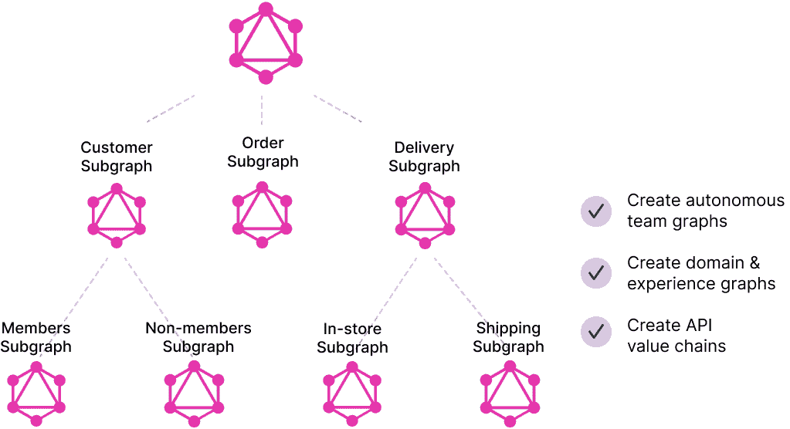

# API 的新架构

> 原文：<https://thenewstack.io/a-new-architecture-for-apis/>

我在 API 领域已经呆了十年(在 Apigee，Google，现在是 StepZen)，并且在此之前已经做了二十年的数据库(在 IBM 和我在伯克利的论文期间)，我可以有把握地说，有两个技巧数据库做得很好，这将彻底改变 API 的构建和管理方式。

 [阿南特·金格兰

Anant 是 StepZen 的创始人兼首席执行官，step Zen 是一家初创公司，采用新的方法来简化开发人员访问数据的方式，以增强数字体验。](https://www.linkedin.com/in/anantjhingran) 

1.  首先是数据库以声明方式运行。这意味着您告诉数据库做什么，而不是如何做。无论是创建数据还是查询数据，都要遵循这个原则。另一方面，API 大多是以编程方式创建的。
2.  第二，同样重要的是，许多数据库知道如何联合，这意味着如果您的数据分散在两个数据库系统中，那么可以对两个数据库系统执行查询，就好像它来自一个数据库系统一样。您提交的查询被分散到多个后端数据库，并且结果被收集起来呈现，就好像它们来自一个集中的系统。

在本文中，我们将讨论后者，我们以前写过关于前者的[篇文章](https://thenewstack.io/what-graphql-can-learn-from-databases/)。

## API 联合会

我第一次听到这个概念是在听网飞谈论他们的 API 层时，特别是从现在在《纽约时报》工作的[丹·雅各布森](https://www.linkedin.com/in/danieljacobson/)那里。网飞的“领域 API”反映了后端如何查看和呈现他们的数据，他们的“体验 API”反映了应用程序希望如何访问数据。每个体验 API 对一组域 API(分散的)进行正确的调用，然后将结果(聚集的)组合成一个。

但是分散/聚集并不容易。在传统的 API 中，它被硬连线到每个 API 的构建方式中。如果 experience API 需要更多的数据，就会有人进去对 API 进行编程，让它分散到另一个后端。如果后端 API 改变了它的实现，就会有人进去重新编写体验 API。来自后端的错误？程序。执行问题？程序(添加缓存)等。等。

再者，为什么有两个层次，只有两个层次有意义吗？如果你看万维网，它是网页的互联，组合在一起成为站点，组合在一起成为域，等等。互联性(href)的结构是相同的，它允许形成任意复杂的关系。

这需要成为 API 的新世界。然而，为了这个世界的形成，还有一个更基本的转变需要发生。分散和聚集，当每个后端产生任意结构几乎是不可能的。必须有某种形式的“标准化”。这个标准化就是 GraphQL。

GraphQL 代表图形查询语言，它有两个很棒的特性。

1.  它允许将数据拼接在一起:

```
 {
      customer  (email:  “john.doe@example.com”)  {
 orders  {
            status
 }
      }
 }

```

在一个查询中返回客户和订单数据，就像联邦数据库查询一样。

2.  它按照请求的形式返回数据。不多不少。

现在想象一个 GraphQL APIs 的图表:



任何一层的 GraphQL 查询都可以分散到下一层的子图中。来自它们的响应与发送给它们的子图子查询的形状完全相同。收集(缝合)它们是琐碎的，没有形状要处理，没有逻辑要写。这可以继续下去。

如您所见，这是一个全新的 API 架构。它是一个 API 的联合图，可以用来构建一个大的超级图——或者一个图的图——以及许多更小的图的图，这些图的范围可以是组织的任何合适的结构。这是一个非常干净、简单的概念。而且是未来。

然而，这还不是全部。这种架构对性能、治理和多云有着巨大的积极影响。

## 表演

通过联合和向下发送 GraphQL 子查询，您不会在超图中上下传送不必要的数据。在数据库术语中，这被称为下推—您让每个子系统尽最大努力，并且只将计算结果发送回收集阶段。这就是通过获取所有订单并将其发送到客户子图(并让其计算总数)来计算成员的总订单量与在成员的子图中计算总数并仅将总数发送到客户子图之间的区别。好的 GraphQL 系统理解每个子图能做什么，并试图做最大的下推。在传统的 API 架构中，这样的知识必须被硬连线到更高层次的 API 中。

## 管理

使用这种联合模型，数据不会离开子图，除非它必须离开。假设你有一个欧盟子图和一个美国子图。分散阶段确保 EU 子图在其域中被要求某些东西，并且它可以决定它可以向上游发送什么数据。像“客户的总金额是多少”这样的查询可以返回总金额，而不会违反任何隐私问题或泄露特定的订单数据。或者子图可以决定模糊一些数据以保护隐私。

除了隐私问题之外，联合模型对于治理来说更好。每个小组决定它的子图是什么样子。它可以有一个更详细的子图供内部使用，并暴露更少的上游功能。当然，由于返回的数据必须有意义，这并不排除对子图进行轻量级治理的需要，但这比整个事情是一堆混乱的编程逻辑要少得多。

## 多云朵

想象一下，如果你的一些服务在 Google Cloud 上，一些在 AWS 上，一些在内部。您可能希望分别针对治理和性能来管理它们。在那种情况下，这种联合 API 结构是唯一的出路。

## 摘要

API 很棒。然而，API 架构并没有发展。有了 GraphQL，一种形成图的图的新方法正在出现。这种架构带来了更简单的设计、更好的性能、更简单的管理和向云的优雅迁移。这是前进的道路。

<svg xmlns:xlink="http://www.w3.org/1999/xlink" viewBox="0 0 68 31" version="1.1"><title>Group</title> <desc>Created with Sketch.</desc></svg>