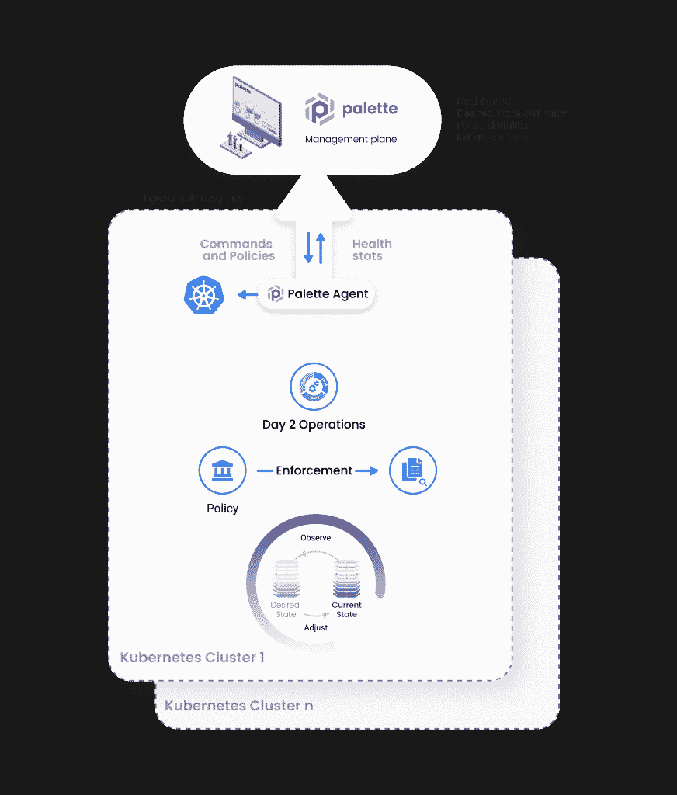

# 一个新的 Kubernetes 边缘架构

> 原文：<https://thenewstack.io/a-new-kubernetes-edge-architecture/>

[Tenry Fu](https://www.linkedin.com/in/tenryfu/)

[Tenry 在科技行业和软件开发领域拥有 20 多年的经验。在共同创立 Spectro Cloud 之前，他领导了思科的云计算管理和私有云产品组合的架构，这是他之前的合资企业 CliQr Technologies 被收购的结果。过去的经验包括 VMware 和 McAfee。他在可扩展分布式系统、企业系统管理和安全性领域拥有超过 18 项专利。他是一个铁杆音响发烧友，喜欢和家人一起徒步旅行。](https://www.linkedin.com/in/tenryfu/)

Edge 正在成为下一个阶段的多云。

容器和不断增长的 Kubernetes 生态系统现在已经成为虚拟行业标准。但是，根据 DevOps 2021 报告的[状态，去年容器化首次正式成为开发者的首选。](https://t.yesware.com/tt/c85bbed8eeff81a3ec1df499c015012080af1a9d/da5b549a5df51187c29f30fc2123061b/256835989cdfd5cb09d69e3dacd6c21d/services.google.com/fh/files/misc/state-of-devops-2021.pdf)

Kubernetes (K8s)是企业向数字优先业务转型的关键驱动力之一。K8s 继续获得发展势头，并在许多行业蓬勃发展。Kubernetes 的可移植性使得采用该平台对于转向多云环境的企业来说是显而易见的。

[边缘位置](https://thenewstack.io/category/edge-iot/)代表着加速创新的下一个前沿，集装箱化是各种垂直行业和组织的合理选择——尤其是在离用户更近的地方产生更多数据。出于几个原因，这是多云前景的合理下一步:消除了将数据发送到云或数据中心进行处理的需要，从而节省了成本；易于集装箱化核心网络基础设施操作；到用户体验的改善和性能的提高，都是因为应用程序离消费者更近了。

智能零售和餐饮、医疗保健、石油和天然气、制造和电信等行业已经存在常见的用例。突显这一趋势的是， [Linux 基金会](https://training.linuxfoundation.org/training/course-catalog/?utm_content=inline-mention)的 2021 年[边缘状态报告](https://t.yesware.com/tt/c85bbed8eeff81a3ec1df499c015012080af1a9d/da5b549a5df51187c29f30fc2123061b/0d0b38dda89d9f52ee64692915287161/stateoftheedge.com/reports/state-of-the-edge-report-2021/)预测，从 2021 年到 2028 年，边缘计算市场将同比增长 70%。

随着 Kubernetes 现在成为容器基础设施的事实上的标准，对下一代解决方案和生态系统的需求变得显而易见，以解决边缘的大规模容器管理。

## 传统的边缘经济学不起作用

让我们明确一点:边缘计算并不容易。根据定义，相对于传统的数据中心和公共云环境，边缘位置是具有挑战性的环境。对于大多数组织来说，典型的边缘场景意味着存在数百甚至数千个位置。零售连锁店公司和医院通常会达到这些总数。大多数时候，这些实体缺乏现场 IT 人员。更糟糕的是，这些地方可能只有有限的、断断续续的、不可靠的或没有互联网连接。出于成本原因，这些位置的配置通常基于单个商用服务器，或者在某些情况下，在高可用性至关重要的情况下，最多三个服务器。

缺乏可扩展的集中管理意味着组织必须定期派出现场工程师，以确保数千个位置的运行。这种花费违背了范式转换的全部目的。那些仅由一台服务器组成的位置随时都面临着升级带来的停机风险。在大多数情况下，这直接转化为财务损失。

## 推动建筑进化

然而，成本可能不是最大的障碍。相反，它可能是我们实现边缘架构的方法。在数据中心，IaaS 接口或控制器，如 [VMware vCenter](https://tanzu.vmware.com?utm_content=inline-mention) 、OpenStack、 [Canonical MAAS](https://t.yesware.com/tt/c85bbed8eeff81a3ec1df499c015012080af1a9d/da5b549a5df51187c29f30fc2123061b/a6efd267f62a692cfe06598dca497a14/maas.io/) ，甚至是硬件堆栈，如[亚马逊 Web 服务的](https://aws.amazon.com/?utm_content=inline-mention)[outpost](https://t.yesware.com/tt/c85bbed8eeff81a3ec1df499c015012080af1a9d/da5b549a5df51187c29f30fc2123061b/d5b52c42d5c78f8c37e077efa2d1d744/docs.aws.amazon.com/outposts/latest/userguide/what-is-outposts.html)或 [Azure Stack HCI](https://t.yesware.com/tt/c85bbed8eeff81a3ec1df499c015012080af1a9d/da5b549a5df51187c29f30fc2123061b/8d68cc25a8e3d51f0cf12db62cb8ff06/azure.microsoft.com/en-us/products/azure-stack/hci) ，通过设计为端点实现 API 驱动、软件定义的编排。对于 edge，这并不适用。

同样重要的是，采用中央管理平台来协调和管理所有集群的传统边缘架构的一个关键限制是无法扩展到超过数百个位置。对于传统的边缘架构，添加的位置越多，管理平面的性能下降越多。这就产生了一个架构瓶颈。

## Edge K8s 的挑战不在于分销，而在于规模化管理

任何边缘计算解决方案都会面临这些类型的障碍——不管是不是 Kubernetes。有了 K8s，一个集群的韧性其实可以更好，轻量级；存在边缘适合的 Kubernetes 分布，包括 Canonical 的 [MicroK8s](https://t.yesware.com/tt/c85bbed8eeff81a3ec1df499c015012080af1a9d/da5b549a5df51187c29f30fc2123061b/2c9893fba3407e7a8d780b7a7fd8681a/microk8s.io/) 或 SuSE 的 [K3s](https://t.yesware.com/tt/c85bbed8eeff81a3ec1df499c015012080af1a9d/da5b549a5df51187c29f30fc2123061b/0b16d3a4767f9027658c7a0fb50b4140/rancher.com/docs/k3s/latest/en/) 。

但是，处于边缘的 K8s 带来了另一个问题:持续可靠地部署和更新“完整堆栈”的能力，不仅仅是 K8s 基础架构，还包括 K8s、存储和网络接口、主机操作系统，以及应用程序和辅助 K8s 服务和集成(监控、日志记录、服务网格等)。).最后，由于缺乏额外的硬件，对典型的“经济高效”的单个服务器进行滚动更新是不可能的。

## 来自开源社区的创新

在 [Spectro Cloud](https://www.spectrocloud.com/) 这里，我们一直专注于支持我们的客户扩展到多个位置，包括裸机和边缘环境，作为他们集装箱化和 K8s 旅程的一部分。我们一直是由开源社区推动的声明式管理的倡导者，使用[云本地计算基金会](https://cncf.io/?utm_content=inline-mention)的集群 API 是跨多个集群和位置进行大规模现代 K8s 管理的唯一方式。我们的重点首先是在公共云和内部数据中心提供声明式“全栈”管理，统一基础架构和应用之间的管理，并最大限度地降低配置偏差带来的风险。去年夏天，我们通过我们的[开源集群 API provider for Canonical MAAS](https://t.yesware.com/tt/c85bbed8eeff81a3ec1df499c015012080af1a9d/da5b549a5df51187c29f30fc2123061b/1ea1f0fbfd50eb4c3e408be2736750b5/thenewstack.io/provision-bare-metal-kubernetes-with-the-cluster-api/) 扩展了集群 API 以支持裸机数据中心环境。对于 edge，我们现在通过与 Docker Engine 集成来进一步扩展集群 API，以完全支持单服务器或多服务器配置上的容器化多节点 k8。

## “自主”边缘架构蓝图

我们的架构依靠引导主机操作系统和调色板管理代理来维护一个没有 IaaS 控制器的轻量级方法。打开电源，连接到互联网。一旦边缘服务器启动，它就使用唯一的机器 ID 自动与 Palette 中央管理平台配对，并报告其硬件信息以进行管理。在边缘服务器变得可用之后，可以启动全栈集群配置。对群集定义的任何更新(我们称之为群集配置文件的功能)都将被视为所需状态的更改，并在不同于先前所需状态的任何层上触发更新。

通过遵循管理平面和控制平面分离的[设计原则，控制平面保持“at-cluster”。每台独立的边缘服务器都具有足够的智能来独立实施策略，而不会给管理平面增加更多压力，从而能够跨数千个边缘位置实现几乎无限的扩展。](https://t.yesware.com/tt/c85bbed8eeff81a3ec1df499c015012080af1a9d/da5b549a5df51187c29f30fc2123061b/f0d39aee04477ed4b29dc948927264db/www.spectrocloud.com/blog/the-subtle-difference-between-management-and-control-plane-in-kubernetes/)

本地调色板代理还可以充当反向代理，以提供零信任安全和远程故障排除。为了允许客户在单服务器边缘位置执行不可变的主机操作系统升级，操作系统被“A-B”分区。这意味着如果出现问题，IT 团队可以应用更新和简单的回滚。因为 K8s 集群是由多个 CP 和 Worker 节点组成的容器，所以可以在零宕机的情况下应用滚动升级。我们不仅支持容器，还支持虚拟机，两者都通过 K8s 进行管理。

除了对边缘位置的特定要求之外，Palette 在我们的客户在其 K8s 堆栈上部署的技术组合方面保持了其完整的可选性。这使他们的开发团队能够支持特定的用例，但不会牺牲对第 0 天、第 1 天以及更重要的第 2 天运营的控制。

作为设计合作伙伴与客户密切合作，使我们能够理解 edge K8s 对他们意味着什么。这种全新的下一代 edge K8s 架构反映出我们整个行业需要超越流行词汇和趋势，通过关注客户成果，从开源生态系统提供的影响和力量中获取知识。

<svg xmlns:xlink="http://www.w3.org/1999/xlink" viewBox="0 0 68 31" version="1.1"><title>Group</title> <desc>Created with Sketch.</desc></svg>