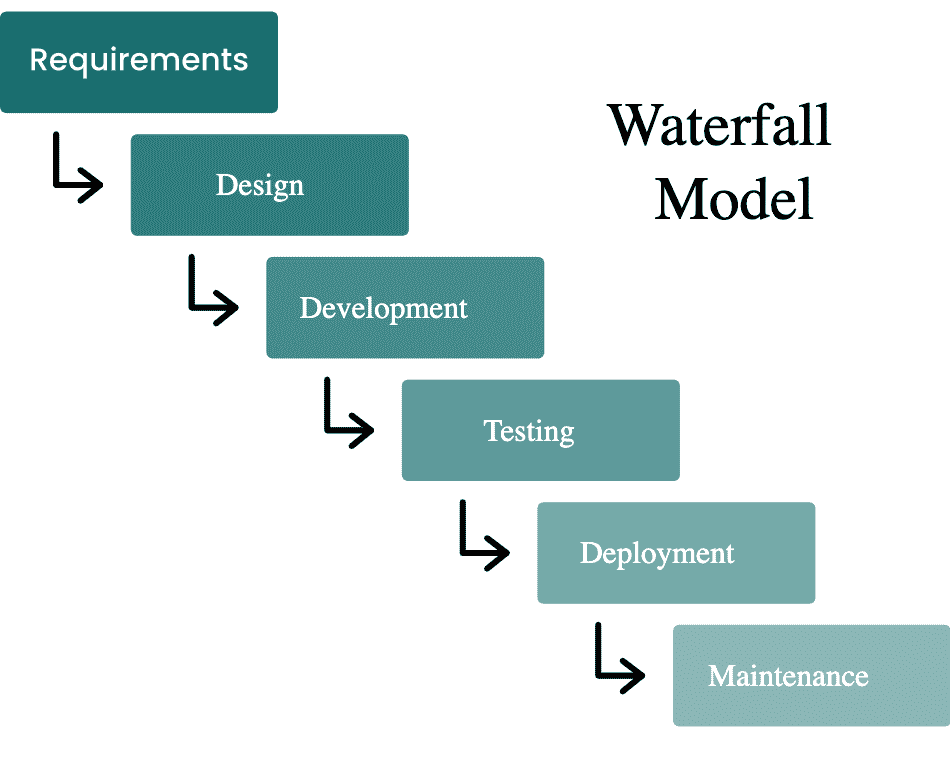
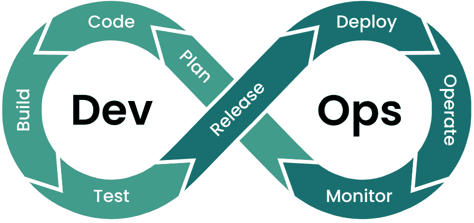

# 云原生应用的全新性能思维

> 原文：<https://thenewstack.io/a-new-performance-mindset-for-cloud-native-applications/>

 [里奇·宾利

里奇是 StormForge 公司产品营销高级总监。他在 IT 管理领域营销产品已经超过 20 年，在此之前，他是一名系统工程师和软件开发人员。](https://www.linkedin.com/in/rich-bentley-b88121/) 

许多组织已经从根本上改变了他们构建软件应用程序的方式。他们已经在云原生应用、容器化和云架构的敏捷开发上全力以赴。这改变了开发团队日常工作的许多任务。

围绕这些不同的活动和工作流程，新的工作文化已经涌现。然而，这些文化的某些方面——以及开发者的想法——并没有像他们如何构建应用程序那样向前飞跃。开发人员处理部分工作的方式看起来很像几年前，那时敏捷和云还没有占据主导地位。

这方面的一个例子是确保应用程序的性能。尽管现在的现代应用程序非常动态，只需几秒钟就可以根据需要加速或减速，但性能管理远没有这么通用。在许多商店中，应用程序性能的处理方式仍然只能被描述为传统的、被动的方法和“老派”思维。

这种不匹配会导致一系列运营、财务和团队问题。让我们来看看为什么会存在这种文化脱节，以及组织可以做些什么来修复它。

## 旧方法产生的新问题

这个问题可以部分追溯到传统的软件开发方法。这些较老的方法，如“瀑布”模型，基本上是线性和顺序的。项目被组织成详细的和预先定义的阶段。在开发过程的开始、中间和结束都有活动的桶，几乎没有重叠。

例如，QA 阶段出现在开发工作大部分或全部完成之后。它本质上是一个单独的、孤立的事后职能。QA 中的性能测试是这些团队独立且独特的工作流程的一部分。这些团队职责的独立性质导致了 QA 职能部门独立和独特的工作文化的产生，包括 it 部门的绩效管理。

一旦 QA 过程结束，应用程序将被移交给生产，这是另一个世界。生产是一个真实的世界，真实的业务是与真实的客户一起完成的。这一现实导致了围绕应用程序性能管理的另一种文化或思维模式的创建和建立，它有自己单独的规则和要求。

线性的、顺序的软件开发方法将性能测试视为一项孤立的任务。

应用程序必须工作才能投入生产。因此，基本的期望是事情会像宣传的那样进行。作为后盾，团队主要依靠被动的、监控和警报方法来发现和修复性能问题。其他的性能评估只是在随机的性能测试中偶尔进行。

在传统的软件开发模型下，应用程序性能测试和管理只在开发的后期进行，在不同的阶段偶尔发生，并且几乎总是在遇到问题后才被动地进行。

这些应用于绩效管理的文化特征、思维方式或“肌肉记忆”做事方式似乎已经延续到了我们都生活的现代应用时代。问题是云原生应用的发展太快了。任何一种分离的、条块分割的、被动的绩效管理方法在这个新世界都行不通。

## 新的团队结构，新的挑战

随着软件开发的“瀑布”时代迅速消失，DevOps 方法现在是应用程序正常开发和交付的方式。然而，DevOps 这个术语对不同的人来说意味着稍微不同的东西，所以为了清楚起见，我们将使用 [Gartner 的定义](https://www.gartner.com/en/information-technology/glossary/devops):

“DevOps 是文化理念、实践和工具的结合，可提高组织高速交付应用和服务的能力，比使用传统软件开发和基础设施管理流程的组织更快地发展和改进产品。这种速度使组织能够更好地服务客户，并在市场中更有效地竞争。”

请注意 Gartner 明确提到了这种方法的文化方面。(抱着那个想法；我们会回来的。)

“DevOps”是一个组合词，两个词组合成一个新词。它也很准确，因为它描述了实际发生的事情。独立的开发和运营团队合并成一个单位。我们的想法是摆脱孤岛，让开发和运营人员在应用的整个生命周期中与应用一起工作。从设计和开发，通过测试和质量保证，在生产中，一直到生命的终结，DevOps 人坚持使用他们的应用程序。他们构思它们，建造它们，并从头到尾管理它们的性能。

DevOps 是一种有效的方法，因为正如 Gartner 指出的那样，它可以更快、更有效地交付创新。

然而，重新设计以前孤立有序的开发和运营职能确实给组织带来了一些文化挑战。

DevOps 承诺更快的创新，但它需要文化变革。

拓宽角色并要求 DevOps 团队成员承担新的责任不是问题。然而，文化遗留问题会阻碍文化变革。他们可能会导致 DevOps 团队成员回复到旧的做事方式。或者，随着时间的推移，你的团队可能会开始把他们工作的新部分视为枯燥的琐事，而不是有趣的挑战。当这样的事情发生时，团队会发现他们自己在效率低下的滑坡上。

## 建立新的绩效管理文化

组织可以做些什么来避免这些问题，让开发人员从头到尾都参与进来？企业如何在应用投入生产的第一天到使用的最后一天促进应用性能的提升？

以下是一些领先公司为改变建立绩效文化而采用的策略:

*   **让事情变得简单:**让团队成员每天做一点积极主动的绩效管理，以避免重大问题。
*   **给员工授权:**给他们流程和工作流的所有权，以及推动积极成果的荣誉。
*   **支持自助服务:**为他们提供所需的工具和技术，让他们自始至终真正掌握绩效。
*   **自动化关键功能:**软件推动云原生应用的供应，并需要对其性能进行管理。

## 技术准备好了:你呢？

对于 DevOps 团队和他们的组织来说，好消息是有技术可以帮助他们采取我们概述的步骤。通过在数据科学等领域引入新的先进技术，并在基于人工智能和机器学习的创新基础上利用它们，新类别的平台和应用已经到来。这些新工具使团队能够重新思考和定义他们如何处理应用程序性能。

基于人工智能和人工智能的系统特别适合解决复杂的问题，例如分析和计算正确的设置，以从云原生应用程序获得最佳性能，并持续实时地自动化这些变化。StormForge 的[应用优化解决方案](https://www.stormforge.io/application-optimization/)就属于这一类。

有了这种类型的功能，组织和他们的 DevOps 团队可以采用一种绩效文化。

他们不仅可以发展对绩效管理价值的看法，还可以在以云为中心的环境的挑战性背景下发展对绩效管理进行编排的声望。他们可以重塑他们的绩效管理方法，从被动和缓慢转变为主动、智能和快如闪电。他们还可以使用主动的性能管理来停止追踪问题，而是预防问题。

这是我们正在帮助任何组织实现的新的绩效文化。为了实现这一目标，他们需要将性能作为发布流程和 CI/CD 工作流不可或缺的一部分。他们需要重组工具，以便能够自动配置应用程序，从而优化性能、稳定性和成本。此外，他们需要始终主动测试、分析和优化他们的应用程序。

未来就在我们面前。要实现这一点，需要了解新的绩效管理需求及其重要性。

这项技术已经准备就绪，并且可以在市场上买到。要迈出关键的第一步，唯一的先决条件是你要带着新的绩效管理心态。你能做到的，对吗？

*如需进一步指导，请查看我们的免费电子书，[跨越 Kubernetes 应用性能差距的 3 个步骤](https://www.stormforge.io/ebook/3-steps-to-crossing-the-kubernetes-application-performance-gap/?utm_medium=paid&utm_source=tns)。*

<svg xmlns:xlink="http://www.w3.org/1999/xlink" viewBox="0 0 68 31" version="1.1"><title>Group</title> <desc>Created with Sketch.</desc></svg>