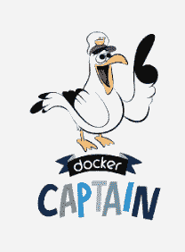

# 窥视超独家码头船长社区

> 原文：<https://thenewstack.io/a-peek-into-the-ultra-exclusive-docker-captains-community/>

也许你已经开始在 sig 文件中看到“码头船长”的称谓，并且和我们一样，想知道这到底是什么意思。

根据[Docker](https://www.linkedin.com/in/davidmessina)营销和社区副总裁大卫·梅西纳的说法，这是 Docker 超级用户的一个新的精英群体。Messina 在最近的一次电话采访中说，从一开始，社区就一直是 Docker 开源项目的关键部分。这个社区正在飞速发展。虽然从商业角度来看这很好，但一家公司只能做这么多来满足对演讲者、组织者和客座博文的需求。

已经有社区领袖写博客，开 Docker 见面会，做关于 Docker 功能的演示。因此，公司决定利用他们的能量和热情来帮助解决社区的需求，于是码头工人队长就诞生了。

这个项目在几个月前刚刚启动，包括来自世界各地的 67 个人，他们被 Docker 的工程师们认为是 Docker 社区中举足轻重的人物。

墨西拿说，主要的想法是“通知和宣传码头工人”。在节目的结构上花了很多心思。该公司创造了与码头工程师接触的直接途径和船长之间接触的直接途径。一个私人 slack 频道允许参与者聚集在舆论法庭之外，用于传递发言请求、发布博客帖子、在网络上宣布成就和提供鼓励。

通过定期简报和与工程师的高质量交流，船长们可以了解最新的技术和路线图。例如，许多船长是 Mac 版[Docker](https://thenewstack.io/dockers-unikernel-experiment-begins-paying-off-mac-os-libraries/)的早期用户，并在发布前提供了 Docker 工程师能够整合的反馈。这扩展了他们对 Docker 的理解，并允许他们将信息传播给用户社区。

北卡罗莱纳州罗利的博思艾伦汉密尔顿公司战略创新组的码头工人队长兼首席技术专家,[尼尔马·梅塔](https://www.linkedin.com/in/nirmalkmehta)说,[很少有公司为 MVP 或中小企业制定过这样的计划。他说，该公司在这方面投入了大量的心血和精力，并且做得非常出色。](http://www.boozallen.com)

他说，这就像一个 Docker 读书俱乐部，一群技术专家聚集在一起分享信息，庆祝成就，相互支持，没有公开评论。

来自德国柏林的 [Codeship](https://codeship.com) 码头船长兼高级软件工程师劳拉·弗兰克，在这个项目存在之前就已经开始担任船长了。

她在 2013 年开始“摆弄 Docker”，那时 Fig 和 Docker for Mac/Windows“要么还不存在，要么仍处于早期阶段。”当时她在 CentryLink 工作，那里鼓励写博客，她“为开发人员制作了很棒的内容，供他们在开始使用 Docker 时使用。”她成为了 Docker 博客和 Docker 演讲者团体的一员，所以她很自然地加入了队长计划，她说“我们只是一个快乐的书呆子家庭。”

像梅塔一样，她喜欢接触志同道合的人，并获得和提供支持。她说，很难找到一大群人专注于互相帮助，而不是互相竞争。这“不仅揭示了船长项目的独特性，也揭示了更大的码头工人群体。”

另一位天生适合该项目的人是来自伦敦的码头船长兼独立基础设施专家奈杰尔·波尔顿。他在 [Pluralsight](http://www.pluralsight.com/) 创建视频培训课程，并共同主持“我们信任的技术”播客。他“非常支持整个集装箱运动”，并在过去几年里为 Docker Docs 做出了贡献。

## 目前为止最好的事？

该计划只有几个月的历史，但船长们已经对结果感到兴奋。

对 Poulton 来说，这是站在工程发布最前沿的能力。他最想做的是创造“有价值和有见地的内容(培训视频、博客帖子、Twitter 对话……)，帮助人们使用容器推进他们的职业和业务。”

他已经为 Docker 1.12 中的所有[新内容开发了一个](https://thenewstack.io/docker-engine-1-12-will-come-built-orchestration-capabilities/)[视频培训课程](https://app.pluralsight.com/library/courses/docker-getting-started/table-of-contents)。随着新 Docker 引擎的发货，视频开始直播。"如果我不是队长，事情会更难。"

对弗兰克来说，这是改变 Docker 用户生活的能力。

“我在 DockerCon 的演讲结束后，有人走过来，问了我几个关于开始编程生涯的问题，”她说。她对 Docker 的技术复杂性感到有点害怕和不知所措，以及周围似乎有如此多的高级用户。她在当天早些时候听说了船长计划，知道我们是最合适的接触群体。成为一名队长不仅仅意味着对项目有深入的技术知识，还意味着成为一名社区领袖。如果我能让 Docker 看起来更容易被所有类型的开发人员使用，从而让更多人对它感兴趣，我会很高兴。”

嗯，那和判断 [Docker 1.12 黑客马拉松](https://blog.docker.com/tag/docker-1-12-hackathon/)。

想成为队长？

有兴趣申请成为码头队长吗？抱歉，仅限受邀者。根据墨西拿的说法，成为码头船长的最好方法，更多地参与社区，公开谈论码头工人，并帮助他人。你想利用你未来的船长身份在码头工作吗？墨西拿说，这不太可能。船长们重视他们的独立性，Docker 喜欢让 Docker 传播者遍布整个技术社区，目前没有计划让任何一位船长进来。与此同时，梅西纳说，高质量的内容和社区参与的演讲和博客会让你受到关注。

与大多数参与开源社区的其他队长不同，Mehta 的重点更多地是在企业端。他在 Booz Allen 和美国政府采购办公室之间牵线搭桥，这种关系使 Booz 成为 Docker 的第一家美国供应商。

作为合伙人，他获得了许多现在给予其他船长的关于接触码头工程师的额外津贴。他说，区别在于船长们关注的是社区。

他受邀在 DockerCon 2015 上做一个[主题演讲](http://www.slideshare.net/Docker/dockercon-sf-2015-how-to-build-a-secure-devops-environment-for-the-government)，并做了一个 Booz Allen 如何使用 Docker 的现场演示。他做了很多演讲，部分得益于船长计划的好处。

虽然梅塔很高兴在最近的 DockerCon 上得到陌生人的认可，但他最喜欢的是“从根本上来说，拥有一个相同水平的小社区，能够与志同道合的人进行对话，找到新的解决方案，听到他们在谈论什么，获得并给出反馈。我遇到了这么多伟大的人，第二、第三级关系是亮点。”

## 未来看起来很光明

现在，在船长中建立团体是最重要的。该公司希望随着项目规模的扩大来控制增长，以保持热情和同样的成功水平。为此，他们将参加 DockerCon2016 的船长召集在一起，集思广益，探讨如何让该计划更好地运作。

梅塔称这个项目是独一无二的。他说，微软等其他公司也有 MVP 项目，但这在初创企业群体中是独一无二的。它在传播福音和确保内容的高质量方面提供了相当大的竞争优势。

“我们都有自己独特的视角，”他谈到船长社区时说，“独特的客户和对码头生态系统的独特看法。”他坚持认为，其结果大于各部分的总和。“它更亲密、更敏捷，同时又温暖舒适。”

“我希望这是一种其他公司可以模仿的模式，”他说。

Docker 是新堆栈的赞助商。

专题图片:来自[皮克斯科夫](http://www.pixcove.com/tag/sun-hat/)的船长帽，照片获得 CC0 许可。

<svg xmlns:xlink="http://www.w3.org/1999/xlink" viewBox="0 0 68 31" version="1.1"><title>Group</title> <desc>Created with Sketch.</desc></svg>