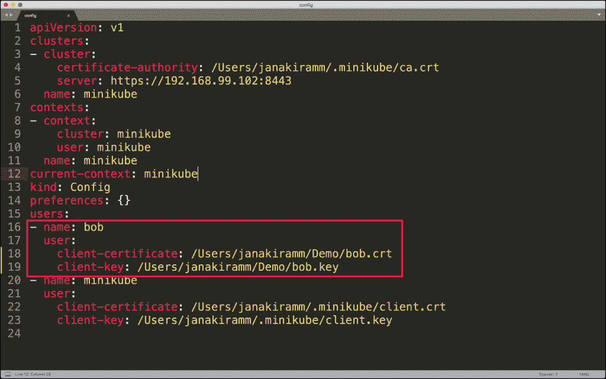

# 理解 Kubernetes 认证的实用方法

> 原文：<https://thenewstack.io/a-practical-approach-to-understanding-kubernetes-authentication/>

编者按:本文是上周开始的 Kubernetes 安全系列的一部分。上一篇文章介绍了 Kubernetes 访问控制的概述和背景。在这一部分中，我们将通过动手实践来理解身份验证的概念。

在生产环境中，Kubernetes 管理员使用名称空间来隔离资源和部署。名称空间作为一个逻辑边界来实施基本的访问控制。

假设我们有 Bob，他是新加入 DevOps 团队的管理员，负责管理工程组的 Kubernetes 部署。我们现在必须为他提供足够的权限来管理工程名称空间。假设您是具有管理全局资源和对象权限的集群管理员，您将让 Bob 参与进来，并帮助他获得访问 Kubernetes 集群所需的凭证。

这个场景是基于 Minikube 的，但是它应该适用于您是集群管理员的任何其他配置。

创建一个名为 cred 的目录，并运行以下命令为 Bob 生成一个私钥。

```
openssl genrsa  -out bob.key  2048
Generating RSA private key,  2048  bit long modulus
..................................................................................................................+++
................................................+++
e  is  65537  (0x10001)

```

我们还需要一个可以从密钥生成的证书签名请求。

```
openssl req  -new  -key bob.key  -out bob.csr  -subj  "/CN=bob/O=eng"\n

```

将密钥移动到父文件夹，并用 Base64 编码。

```
cp  bob.key  ..
cd  ..
cat  cred/bob.csr  |  base64  |  tr  -d  '\n'
LS0tLS1CRUdJTiBDRVJUSUZJQ0FURSBSRVFVRVNULS0tLS0KTUlJQ1lqQ0NBVW9DQVFBd0hURU1NQW9HQTFVRUF3d0RZbTlpTVEwd0N3WURWUVFLREFSbGJtZHVNSUlCSWpBTgpCZ2txaGtpRzl3MEJBUUVGQUFPQ0FROEFNSUlCQ2dLQ0FRRUEzSU9oUTArMFJUakpqZjBKTkd2Rmo0YWFlN1hYCkkrZWkzTzZWTEpqMHNKNDBvengyUTVndXBmeFc5b0lEYTJETnhVZjZkNHVMOUJ3V2lhdFdQdnBDNm80MHJQc2EKTjBUdEhEekFYeWppc0E5VXVRMVNKMWg5Mkg0TU9XWEpWNWJWaTlXYjBKU3hLbXVrSUVtaERJcW9TcEh6MU5xaApQMWNXOFFpNXpoVVBmWlpnOUhSaWVUQ2xEMmR3bWRtS1JjbU9uenNGVWhJWmZWanVZNzZJUm9KbksyaHNzVjZoCmMyY1JNTVNEdFA0ZDArYkxOY1BKdExpS3JjQkdwUGxLUEdrSHovM2NNbVhpVi8wY2xqUlppMzJCb3B4NlI1NUIKc0Z6cXZwcWgzNWxLNUVOUGxPZy9sdURFdllGeUtzOUY2aERBRFhDNzQxU0ZCQTI0TERzcTFiWWtVUUlEQVFBQgpvQUF3RFFZSktvWklodmNOQVFFTEJRQURnZ0VCQUxTejgxL2N3bjQxbVRrUDhabWhhUUx3MkpIRkN4ZUlaOFdpCkZOV0U1cnRVd3hrSjJGWVJKRlFUL1hJN0FoL0pXTkhqeHlhOUNyN3c0OThmanN3bDF2ZzQ1QUgrR29DeVEwTWkKOU1MMHl0WmZyaG5jYmtpRG9oSUpuaWhJTjlCUGpHVkw2SG1USytGc0sybG1ZZ1JDdk9Cclg3Rkh6ZjgwM0ZFNAp4ZkgrZlFsdGxDdEZTSEhuaUlzZTFEQ2J4cFVTdnRISXpYMFcyb2hXV3RPVkRpOTAzOW8zY2VaWmdVK3VRYno0Cmp2djJoeVdRNDhORFl3RWF1UUU2S3NBQTFLT0IyUkI2dE45bjFTVWoxU1B2WnBsQkVieDZ5MTkzaUJSVFJRM2wKM2JhdFRNUUEzelBsdk01ZEE2Vy8rQWcwVm0xMk1SR091VFRLSEU2bE5INE1DbHQvRGZZPQotLS0tLUVORCBDRVJUSUZJQ0FURSBSRVFVRVNULS0tLS0K

```

我们需要将生成的 base64 编码的字符串嵌入到 YAML 文件中，并将其作为证书签名请求提交给 Kubernetes。这一步实际上将 Bob 的私钥与 Kubernetes 集群相关联。

```
apiVersion: certificates.k8s.io/v1beta1
kind: CertificateSigningRequest
metadata:
  name: bob-csr
spec:
  groups:
  -  system:authenticated

  request: LS0tLS1CRUdJTiBDRVJUSUZJQ0FURSBSRVFVRVNULS0tLS0KTUlJQ1lqQ0NBVW9DQVFBd0hURU1NQW9HQTFVRUF3d0RZbTlpTVEwd0N3WURWUVFLREFSbGJtZHVNSUlCSWpBTgpCZ2txaGtpRzl3MEJBUUVGQUFPQ0FROEFNSUlCQ2dLQ0FRRUEzSU9oUTArMFJUakpqZjBKTkd2Rmo0YWFlN1hYCkkrZWkzTzZWTEpqMHNKNDBvengyUTVndXBmeFc5b0lEYTJETnhVZjZkNHVMOUJ3V2lhdFdQdnBDNm80MHJQc2EKTjBUdEhEekFYeWppc0E5VXVRMVNKMWg5Mkg0TU9XWEpWNWJWaTlXYjBKU3hLbXVrSUVtaERJcW9TcEh6MU5xaApQMWNXOFFpNXpoVVBmWlpnOUhSaWVUQ2xEMmR3bWRtS1JjbU9uenNGVWhJWmZWanVZNzZJUm9KbksyaHNzVjZoCmMyY1JNTVNEdFA0ZDArYkxOY1BKdExpS3JjQkdwUGxLUEdrSHovM2NNbVhpVi8wY2xqUlppMzJCb3B4NlI1NUIKc0Z6cXZwcWgzNWxLNUVOUGxPZy9sdURFdllGeUtzOUY2aERBRFhDNzQxU0ZCQTI0TERzcTFiWWtVUUlEQVFBQgpvQUF3RFFZSktvWklodmNOQVFFTEJRQURnZ0VCQUxTejgxL2N3bjQxbVRrUDhabWhhUUx3MkpIRkN4ZUlaOFdpCkZOV0U1cnRVd3hrSjJGWVJKRlFUL1hJN0FoL0pXTkhqeHlhOUNyN3c0OThmanN3bDF2ZzQ1QUgrR29DeVEwTWkKOU1MMHl0WmZyaG5jYmtpRG9oSUpuaWhJTjlCUGpHVkw2SG1USytGc0sybG1ZZ1JDdk9Cclg3Rkh6ZjgwM0ZFNAp4ZkgrZlFsdGxDdEZTSEhuaUlzZTFEQ2J4cFVTdnRISXpYMFcyb2hXV3RPVkRpOTAzOW8zY2VaWmdVK3VRYno0Cmp2djJoeVdRNDhORFl3RWF1UUU2S3NBQTFLT0IyUkI2dE45bjFTVWoxU1B2WnBsQkVieDZ5MTkzaUJSVFJRM2wKM2JhdFRNUUEzelBsdk01ZEE2Vy8rQWcwVm0xMk1SR091VFRLSEU2bE5INE1DbHQvRGZZPQotLS0tLUVORCBDRVJUSUZJQ0FURSBSRVFVRVNULS0tLS0K

  usages:
  -  digital  signature
  -  key  encipherment
  -  server  auth

```

```
kubectl create  -f  signing-request.yaml
certificatesigningrequest.certificates.k8s.io/bob-csr created

```

使用以下 *kubectl* 命令验证 CSR:

```
kubectl get  csr
NAME      AGE REQUESTOR CONDITION
bob-csr 41s minikube-user Pending

```

请注意，该请求仍处于待定状态。集群管理员必须批准它才能将其激活。

```
kubectl certificate approve bob-csr
certificatesigningrequest.certificates.k8s.io/bob-csr approved

```

```
kubectl get  csr
NAME      AGE    REQUESTOR CONDITION
bob-csr 104s minikube-user Approved,Issued

```

现在证书已经被批准和颁发，我们需要从集群中获取签名证书。这是 Bob 入职最关键的一步。

```
kubectl get  csr bob-csr  -o  jsonpath='{.status.certificate}'  |  base64  --decode  >  bob.crt

```

文件 *bob.crt* 是用于认证 bob 的客户端证书。我们现在有了来自 Kubernetes 的私钥( *bob.key* )和批准证书( *bob.crt* )的组合。只要 Bob 拥有这两项资产，他就可以通过集群进行身份验证。

是时候将 Bob 添加为 Kubernetes 的用户了。

```
kubectl config set-credentials bob  --client-certificate=bob.crt  --client-key=bob.key
User  "bob"  set.

```

打开 *~/。kube/config* 文件来验证凭证是否已设置。

[](https://thenewstack.io/a-practical-approach-to-understanding-kubernetes-authentication/k8s-auth-0-2/)

让我们也创建一个名为 engineering 的新名称空间，Bob 是该名称空间的管理员。

```
kubectl create namespace engineering
namespace/engineering created

```

```
kubectl get  namespace
NAME              STATUS AGE
default Active 37m
engineering Active 0s
kube-node-lease Active 37m
kube-public Active 37m
kube-system Active 37m

```

*ku bectl*CLI 有一个非常有用的开关，形式为 *auth* ，可以验证特定用户的权限。让我们检查作为管理员的当前用户是否有权访问工程名称空间。鉴于您是集群管理员，看到输出并不奇怪。

```
  kubectl auth can-i  list pods  --namespace engineering
yes

```

我们还可以检查 Bob 是否有权访问工程名称空间。

```
kubectl auth can-i  list pods  --namespace engineering  --as bob
no

```

很明显，Bob 无权访问该名称空间。这是因为我们已经创建了凭证，但是没有明确授权 Bob 对任何对象执行任何特定的操作。

在本系列教程的下一部分中，我将带您完成授权 Bob 所涉及的步骤。这也给了我们一个学习角色和角色绑定的机会。敬请期待！

贾纳基拉姆·MSV 的网络研讨会系列“机器智能和现代基础设施(MI2)”提供了涵盖前沿技术的信息丰富、见解深刻的会议。在 [http://mi2.live](http://mi2.live/) 注册参加即将举行的 MI2 网络研讨会。

<svg xmlns:xlink="http://www.w3.org/1999/xlink" viewBox="0 0 68 31" version="1.1"><title>Group</title> <desc>Created with Sketch.</desc></svg>