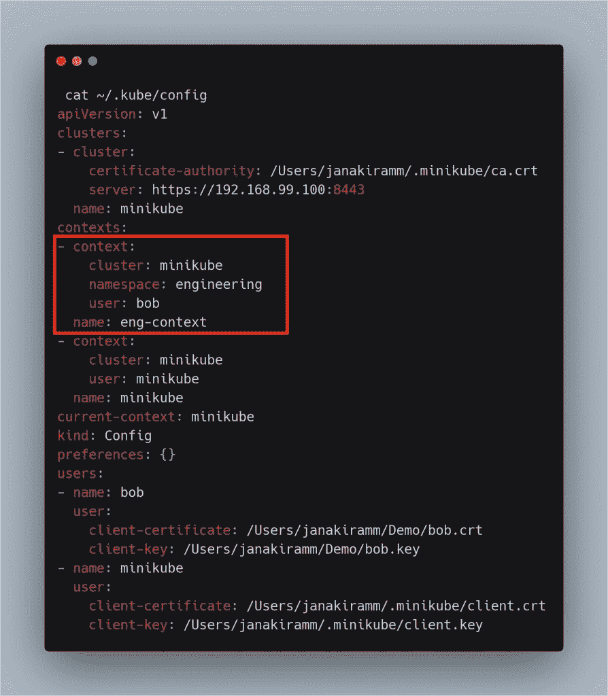

# 理解 Kubernetes 授权的实用方法

> 原文：<https://thenewstack.io/a-practical-approach-to-understanding-kubernetes-authorization/>

让我们先快速回顾一下环境和场景。我们正在处理一个运行在生产环境中的集群，其中每个部门都与一个名称空间相关联。Bob 是 DevOps 团队的新员工，我们刚刚将其作为工程命名空间的管理员加入到集群中。他已经获得了访问 Kubernetes 集群的密钥和签名证书。

如果您还没有这样做，请运行上一教程中的命令来完成 Bob 的环境设置和凭证配置。

是我们授权 Bob 控制属于工程命名空间的资源的时候了。

我们将首先为 kubectl 创建一个上下文，它可以方便地在不同的环境之间切换。

```
kubectl config set-context eng-context  \
  --cluster=minikube  \
  --namespace=engineering  \
  --user=bob
Context  "eng-context"  created.

```

上面的命令在 minikube 集群中创建了一个指向工程名称空间的新上下文，其中包含 Bob 的凭证。这会在~/中添加一个新部分。kube/配置文件。

【T2

我们现在将在工程命名空间中创建一个简单的 pod:

```
apiVersion:  v1
kind:  Pod
metadata:
  name:  myapp
  namespace:  engineering
  labels:
    app:  myapp
spec:
  containers:
  -  name:  myapp
    image:  busybox
    command:  ["/bin/sh",  "-ec",  "while :; do echo '.'; sleep 5 ; done"]

```

```
  kubectl create  -f  myapp.yaml
pod/myapp created

```

```
kubectl get  pods  -n=engineering
NAME    READY STATUS    RESTARTS AGE
myapp 1/1 Running 0          89s

```

虽然您作为集群管理员能够在工程命名空间中创建和操作 pod，但是 Bob 可能甚至无法在同一命名空间中列出 pod。

```
kubectl get  pods  --namespace engineering  --as bob
Error from server  (Forbidden):  pods is forbidden:  User  "bob"  cannot list resource  "pods"  in API group  ""  in the namespace  "engineering"

```

为了允许 Bob 访问工程命名空间中的资源，我们需要授权他。这是通过创建一个具有适当权限的角色，然后将其绑定到用户 Bob 来实现的。本质上，我们使用基于角色的访问控制(RBAC)来明确地允许 Bob 对工程名称空间中的某些 Kubernetes 资源执行特定的操作。

创建一个名为 eng-reader 的 Kubernetes 角色，该角色有权在工程名称空间中列出 pod。

```
kind:  Role
apiVersion:  rbac.authorization.k8s.io/v1
metadata:
  namespace:  engineering 
  name:  eng-reader
rules:
-  apiGroups:  [""]  # "" indicates the core API group
  resources:  ["pods",  "services",  "nodes"]
  verbs:  ["get",  "watch",  "list"]

```

```
kubectl create  -f  role.yaml
role.rbac.authorization.k8s.io/eng-reader created

```

```
kubectl get  roles  --namespace=engineering
NAME AGE
eng-reader 58s

```

请注意，该角色没有任何对 Bob 的引用。我们将通过创建角色绑定，将角色中指定的权限应用于 Bob。下面的步骤将为我们做到这一点。

```
kind:  RoleBinding
apiVersion:  rbac.authorization.k8s.io/v1
metadata:
  name:  eng-read-access
  namespace:  engineering
subjects:
-  kind:  User
  name:  bob  # Name is case sensitive
  apiGroup:  rbac.authorization.k8s.io
roleRef:
  kind:  Role  #this must be Role or ClusterRole
  name:  eng-reader  # this must match the name of the Role or ClusterRole you wish to bind to
  apiGroup:  rbac.authorization.k8s.io

```

```
kubectl create  -f  role-binding.yaml
rolebinding.rbac.authorization.k8s.io/eng-read-access created

```

```
kubectl get  rolebindings  --namespace=engineering
NAME              AGE
eng-read-access 31s

```

让我们检查 Bob 现在是否能够访问 pod。

```
kubectl get  pods  --namespace engineering  --as bob
NAME    READY STATUS    RESTARTS AGE
myapp 1/1 Running 0          11m

```

由于他现在与 eng-reader 角色相关联，他获得了 pod 列表权限。

此时，Bob 在集群中的访问权限非常有限。他所能做的就是在工程命名空间中列出 pod。这本身对鲍勃来说不是很有用。他好奇地检查集群中的节点数量，令他失望的是，迎接他的是一个被禁止的错误。

```
kubectl get  nodes  --as bob
Error from server  (Forbidden):  nodes is forbidden:  User  "bob"  cannot list resource  "nodes"  in API group  ""  at  the cluster scope

```

Kubernetes 中的角色和角色绑定既可以在名称空间级别应用，也可以在集群级别应用。我们现在可以为 Bob 创建一个集群角色和一个关联的绑定，使他能够列出节点。

```
kind:  ClusterRole
apiVersion:  rbac.authorization.k8s.io/v1
metadata:
  # "namespace" omitted since ClusterRoles are not namespaced
  name:  cluster-node-reader
rules:
-  apiGroups:  [""]
  resources:  ["nodes"]
  verbs:  ["get",  "watch",  "list"]

```

```
kubectl create  -f  cluster-role.yaml
clusterrole.rbac.authorization.k8s.io/cluster-node-reader created

```

```
kubectl get  clusterroles cluster-node-reader
NAME                  AGE
cluster-node-reader 49s

```

```
kind:  ClusterRoleBinding
apiVersion:  rbac.authorization.k8s.io/v1
metadata:
  name:  read-cluster-nodes
subjects:
-  kind:  User
  name:  bob  # Name is case sensitive
  apiGroup:  rbac.authorization.k8s.io
roleRef:
  kind:  ClusterRole
  name:  cluster-node-reader
  apiGroup:  rbac.authorization.k8s.io

```

```
kubectl create  -f  cluster-role-binding.yaml
clusterrolebinding.rbac.authorization.k8s.io/read-cluster-nodes created

```

```
kubectl get  clusterrolebindings read-cluster-nodes
NAME AGE
read-cluster-nodes 35s

```

现在，Bob 已经准备好列出集群中的节点。

```
kubectl get  nodes  --as bob
NAME STATUS ROLES    AGE VERSION
minikube Ready    master 52m v1.15.2

```

本演练的目的是帮助您理解 Kubernetes 中角色和角色绑定的工作方式。在本系列的最后一部分，我们将探索服务帐户。敬请关注。

*贾纳基拉姆·MSV 的网络研讨会系列“机器智能和现代基础设施(MI2)”提供了涵盖前沿技术的信息丰富、见解深刻的会议。在 [http://mi2.live](http://mi2.live/) 上注册参加即将举行的 MI2 网络研讨会。*

<svg xmlns:xlink="http://www.w3.org/1999/xlink" viewBox="0 0 68 31" version="1.1"><title>Group</title> <desc>Created with Sketch.</desc></svg>