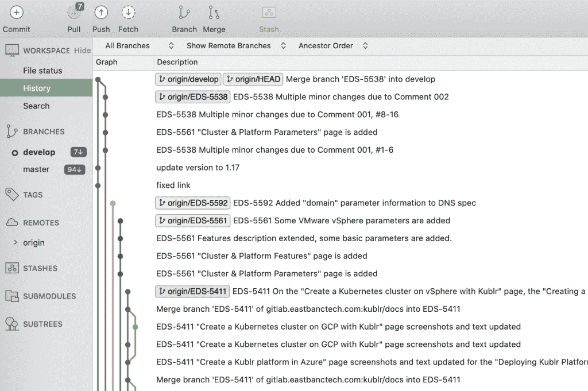
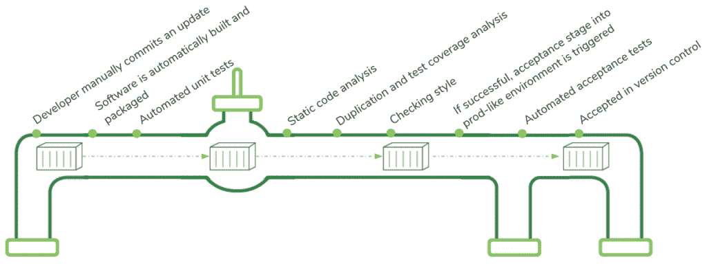

# 初级读本:持续集成和持续交付(CI/CD)

> 原文：<https://thenewstack.io/a-primer-continuous-integration-and-continuous-delivery-ci-cd/>

这篇文章是

[ongoing series](https://thenewstack.io/primer-how-kubernetes-came-to-be-what-it-is-and-why-you-should-care/)

来自凯瑟琳帕格尼尼，专注于为商业领袖解释 IT 概念。

 [凯瑟琳·帕格尼尼

凯瑟琳·帕格尼尼在 Kublr 领导营销工作。从战略到战术，Catherine 帮助 Kublr 宣传云原生技术的无限力量，塑造品牌，并与增长保持同步。在加入这家科技初创公司之前，凯瑟琳曾在博思艾伦汉密尔顿(Booz Allen Hamilton)和华盛顿邮报(Washington Post)等知名机构推广 B2B 服务。](https://www.linkedin.com/in/catherinepaganini/en/) 

持续集成和持续交付(CI/CD)是 DevOps 背后的驱动力之一。如果您的组织正在考虑 DevOps 方法，CI/CD 将是其中的一部分。但是它到底意味着什么？为什么它如此重要？要对您的 DevOps 工具包制定策略并推广它，理解 CI/CD 的基本概念是关键。在本文中，我们将探讨 CI/CD 解决方案的难点、您将需要的工具以及您可以预期的好处。

先说大局。DevOps 的目标是创建一个从左到右的工作流，尽可能少的交接和快速的反馈循环(关于 DevOps 的[介绍，请参考我们之前的文章)。但这意味着什么呢？在我们的代码中，工作应该向前移动(从左到右),如果可能的话，永远不要向后移动。应该在问题出现的时间和地点识别和解决问题。为了实现这一点，开发者需要快速的反馈循环。反馈是通过**快速自动化测试**提供的，这些测试将在代码进入下一阶段之前验证代码是否正常工作。](/demystifying-devops-a-peek-behind-the-digital-transformation-curtain/)

为了减少移交，小团队将致力于**更小的功能**(相对于整个特性)并且**拥有整个过程**:创建请求、提交、QA 和部署——从开发到运营或开发运维。重点是快速推出小块代码。为什么？因为投入生产的变更越小，诊断、修复和补救就越容易。

这种从左到右的快速流程是通过持续集成(CI)实现的，并通过持续交付(CD)扩展到实际的生产部署。我们看到这通常被称为 CI/CD。这是 10，000 英尺的视野，现在让我们潜得更深。

## **持续集成:更深入的探索**

首先，我们将关注 CI/CD 的持续集成部分。这是你首先需要掌握的。其实大部分公司只做 CI。对于 CD，您需要已经是一个成熟的 DevOps 企业。

所以，持续集成。对于集成，我们指的是将程序员在本地机器上开发的代码(更新或新功能)集成到代码库(应用程序的其余部分)中。这导致了三个挑战:

1.  跟踪所有更改，这样，如果发生错误，您仍然可以恢复到以前的状态，以避免或最大限度地减少服务中断。
2.  多个开发人员同时处理同一个项目时的冲突管理
3.  在将新代码添加到代码库之前捕获错误

我们将讨论解决这些棘手问题的三种工具。

### **1。版本控制**

随着代码从开发转移到运营，它会根据测试结果不断调整。所有这些变更都必须在版本控制系统中被捕获。版本控制是一个软件工具，帮助开发人员管理源代码随时间的变化。它跟踪一种特殊类型的数据库中的所有变化。

理想情况下，软件系统的所有部分都应该在这里被捕获。这包括:

*   源代码
*   资产
*   环境
*   软件开发文档
*   对系统中存储的文件的任何更改

### **2。主分支和开发分支**

通常，多个开发人员会在同一个项目上工作。这些人可能从少数到数百名程序员不等——这是一种潜在的混乱状态。为了减少不稳定的风险或向版本控制主数据库中引入错误，每个开发人员并行处理系统的不同部分。他们通过本地机器上的“分支”做到这一点。

但是处理分支本身并不是一个解决方案，每个开发人员正在处理的代码仍然必须集成到代码库中，代码库是不断发展的。

开发人员在一个分支中工作的时间越长，而不致力于主分支，那么在主分支中集成和融合每个人的变化就变得越困难。难度随着分支的数量和每个分支的变化而增加。因此，由于开发人员在没有提交的情况下工作的时间越长，工作就越困难，所以合乎逻辑的答案是增加频率。更好的是，让它连续。这就对了，这就是持续集成。

下图举例说明了不同分支的可视化方式。蓝色是主分支，所有其他颜色是独立开发人员在他们自己的分支上工作，最终合并到主分支中。

**ku BLR 文档页面的不同分支**:蓝色是主分支，其他都是单独的开发分支。开发人员在他们自己的工作站上工作，并在一天中或一天结束时多次合并他们的更改。

不过，也不全是阳光。即使开发人员每天提交代码，冲突仍然会发生。其他团队成员将已经完成并提交了他们自己的变更，而其他团队没有考虑到这些变更。事实上，集成问题经常需要返工，包括手工合并冲突的变更。然而，在一天的工作中找出并解决冲突比开发团队整个星期或整个月都在工作要容易得多。因此，虽然集成问题是不可避免的，但 CI 显著减少了这些问题。

### **3。部署管道和自动化测试**

捕捉错误并确保代码处于可部署状态是质量保证(QA)的一部分。传统上，只有在开发完成后，QA 才由单独的团队处理。通常一年只执行几次测试，开发人员在引入变更后几个月才发现错误。到那时，因果之间的联系可能已经消失，导致诊断越来越困难。自动化测试解决了这个问题。

使用部署管道这种软件工具，每次将代码添加到版本控制时都会触发一系列测试。管道自动构建和测试代码，以确保它按预期工作，并在集成到代码库后继续这样做。虽然代码可以在测试环境中完美地工作，但是一旦进入生产环境，环境和所有的依赖关系都会影响代码性能，它仍然会悲惨地失败。依赖项是不属于应用程序的组件，但却是运行应用程序所必需的。示例包括数据库、数据/对象存储以及应用程序可能通过 API 调用的服务。这就是为什么开发和测试环境必须模拟生产环境。此外，代码必须通过所有依赖项进行测试。

*代码提交到版本控制时的各个步骤*

简而言之，在部署代码时有三个测试阶段，每个阶段都增加了额外的复杂性:(1)验证代码本身是否按预期工作，(2)它是否在代码库中继续工作，以及(3)在具有所有依赖项的类似生产的环境中性能是否持久。

如果代码每天都被提交到版本控制，那么它可以被自动测试，任何构建、测试或集成错误都会在引入的当天被标记出来，从而可以立即修复。这确保了代码总是处于可部署和可发布的状态，称为**绿色构建**。

自动化测试允许开发人员将测试和**集成**的频率从周期性增加到**连续**，并在约束最少的情况下发现问题。最坏的情况是，损失一整天的工作。

### 旁注:版本控制争议

对于诸如访问令牌、密钥和密码等敏感信息是否应该存储在版本控制中有一些讨论。一方面，有些人认为包括秘密在内的一切都应该存储在这里，将这种方法推到了极限。还有一些人认为这是不好的做法，并认为敏感信息应该分开存储。这两种方法都有各自的优缺点、支持者和反对者，以及使它们可行和安全的技术。版本控制系统中的所有变更都被称为**提交**或**修订**。

版本控制允许开发人员比较、合并和恢复过去的修订。它允许他们在出现问题时快速将生产中的系统恢复到以前的版本，从而将风险降至最低。为了做到这一点，所有的*更新和变更，无论多小，都必须在版本控制中被跟踪。如果不是这样，生产中的代码将与开发和测试环境中的代码不匹配，从而导致不一致和问题。*

简而言之，版本控制是一个真实的单一来源，它包含了系统精确的预期状态以及所有先前的状态。通过将所有的产品工件放入版本控制中，开发人员可以重复地、可靠地重现工作软件系统的所有组件。这是实现所谓的不可变基础设施的关键，我们稍后将回到这一点。

## **持续交付:扩展 CI 以实现平稳的代码部署**

即使在持续集成的情况下，将代码部署到产品中仍然可能是手动的、乏味的并且容易出错。如果是这样的话，这种情况显然会减少。就像其他人一样，它会尽可能避免困难和危险的任务。这导致要部署的代码和生产中运行的代码之间的差异越来越大，助长了危险的恶性循环。答案是持续交付，即 CI/CD 的 CD 部分。

CD 扩展了 CI，以确保在将代码推广到整个用户群之前，代码能够在生产中顺利运行。最常见的 CD 方法是淡黄色和蓝绿色部署。

在**蓝绿色部署期间，**它会在当前版本的基础上部署新的组件或应用程序版本。新版本(绿色)被部署到生产环境中并进行测试，而当前版本(蓝色)仍然处于活动状态。如果一切顺利，所有用户都会切换到新版本。

Canary 部署是相似的，因为我们有两个版本:当前版本和更新版本。它开始将一小部分用户请求路由到新版本。代码和用户行为被持续监控。如果错误率或用户投诉没有增加，路由到新版本的请求的份额会逐渐增加(例如，最初的 1%、10%、50%和 100%)。一旦所有请求都被发送到新版本，旧版本就会被淘汰或删除。

## 通过按需创建环境实现自助服务

现在我们已经探讨了 CI、CD 及其各自的工具和方法，让我们来讨论一下环境和基础架构。CI/CD 需要一种新的方法。

正如我们所见，自动化测试使开发人员能够自己执行 QA。为了确保在生产中一切正常，他们必须在整个开发和测试过程中使用类似生产的环境。

传统上，开发人员必须向运营团队请求(手动)设置的测试环境。这个过程可能需要几周，有时甚至几个月。此外，手动部署的测试环境通常配置错误，或者与生产环境差异太大，以至于即使代码通过了所有预部署测试，仍然会导致生产环境出现问题。

为开发人员提供他们可以在自己的工作站上运行的按需生产环境是 CI/CD 的一个关键部分。为什么这很重要？开发人员只有在相同的条件下部署和测试代码，才能知道代码在生产中的行为。如果他们在不同的环境中测试代码，当代码最终被部署到生产环境中时，他们可能会发现不兼容性，然后在不影响客户的情况下修复问题就太晚了。

### **不变的基础设施:牛对宠物**

基础设施作为代码

基础设施作为代码意味着特定的环境在版本控制中被编码，因此它可以在几分钟内启动和复制。虽然这种方法是从虚拟机和云开始的，但是如果使用了正确的堆栈，它也可以成功地在内部和私有云中使用。Kubernetes 在这里起着关键作用。它不仅能够为应用部署提供有效的 DevOps 实践，还允许供应商提供支持特定环境(如云管理的 Kubernetes(如 AWS EKS、Azure AKS、谷歌 GKE)或多云、本地和混合环境(如 Kublr 或 PKS))的基础设施即代码方法的产品。

当讨论版本控制系统时，我们提到了将环境与所有其他应用程序工件编码的需要，让我们更具体地讨论那些环境。

当环境细节在版本控制中被定义和编码时，当容量增加(水平扩展)时复制环境就像按一个按钮一样简单(尽管今天很可能通过 Kubernetes 自动完成[)。](https://thenewstack.io/primer-how-kubernetes-came-to-be-what-it-is-and-why-you-should-care/)

随着云的弹性，扩展变得越来越重要。扩展意味着在高峰时段增加计算能力。例如，网飞的使用率在每周五晚上达到峰值，然后在午夜后的某个时候再次正常化。为了确保无缓冲的视频享受，网飞复制其流媒体组件，在版本控制中编码，以满足需求。然后，所有所谓的副本都被销毁，使流容量恢复正常。

为了实现这一点，关键是无论何时实施基础设施或应用程序更新，都要自动复制到其他任何地方 ***和*** 进行版本控制。这将确保无论何时创建一个新环境，它都将与整个流程中的环境相匹配(从开发到 QA 到生产)。例如，如果网飞要更新其流媒体服务，但忘记了捕捉版本控制的变化，它将在高峰时段复制有故障或过时的组件，从而导致问题，甚至可能导致服务中断。

由于掌握了版本控制中的环境编码，手动改变环境并不是最佳实践，因为任何手动操作都容易出错。相反，变更被放入版本控制中，环境(和代码)被从头重新创建。这被称为**不可变基础设施。**这些原则与 CI/CD 部分讨论的原则相同，适用于基础设施。

你可能听过牛和宠物的类比。这是它适合的地方。以前，基础设施被视为宠物。如果有问题，你会尽你所能去解决它，让它继续存在。今天，基础设施被当成了牛。如果它不能正常工作或者需要更新，你就把它关掉，然后建立一个新的环境。这非常强大，极大地降低了问题潜入系统的风险。

### **从发布中分离部署**

传统上，软件发布是由市场发布日期驱动的。因此，要发布的新特性会在发布日期的前一天部署到产品中。然而，我们知道将功能或更新发布到产品中总是有风险的，尤其是如果您一次发布整个功能的话。因此，将部署与发布捆绑在一起会导致失败。想象一下，如果在产品发布前一天出现了重大问题，IT 团队会有多恐慌，因为产品发布得到了广泛宣传，在客户和媒体中产生了很高的期望。

更好的方法是将部署与发布分离。虽然经常互换使用，但它们是两个独立的过程。部署意味着将软件版本安装到任何环境中，包括生产环境。它不一定要与版本相关联。另一方面，发布意味着为你的客户群提供一个新的特性。在整个特性开发过程中频繁的产品部署的目标是降低风险，这是一个由 IT 拥有和驱动的过程。另一方面，何时向客户公开新功能应该是一项业务，而不是技术决策。

较长的部署交付周期将决定新功能发布的频率。如果 IT 可以按需部署，那么以多快的速度公开新功能就成了业务和营销决策。

## **结论**

总之，CI 要求将代码持续集成到代码库中，以便在错误发生时捕捉它们，从而最大限度地减少重复工作。要实现这样的方法，需要三个工具:版本控制，跟踪所有的变更，并使最新的源代码版本对整个团队可用；一个主分支，开发人员在他们自己的分支上工作，每天合并更新；以及将触发一系列测试的部署管道——基本上是自动化 QA。

CD 扩展 CI 来验证代码是否处于可部署状态，如果是，就自动将其发布到产品中。实现这一点需要一个成熟的 DevOps 组织，一个在涉足 CD 之前已经掌握了 CI 的组织。

如果实施得好，CI (/CD)将显著提高您的 IT 团队的生产力。您的系统或应用程序在不断改进的同时，部署风险被降至最低，从而强化了生产力和员工满意度的良性恶性循环。随着新功能和更新的快速推出，为用户带来更快、更频繁的价值，创新得到了推动。好处是无穷无尽的。很明显，随着越来越多的组织采用这些 DevOps 方法，那些不采用这些方法的组织面临的压力也会增加，因为传统方法不可能与 CI/CD 竞争。

### 附录:部署管道测试套件

*   **集成测试**检查应用程序如何与其他应用程序和服务交互，确保代码正确地与这些依赖项交互。远程服务的虚拟或模拟版本可用于准确地重建生产环境。
*   **验收测试**验证业务需求是否得到满足，确保特性或应用向最终用户交付期望的价值。
*   **性能测试**验证在类似生产的负载下，应用如何在整个堆栈(代码、数据库、存储、网络、虚拟化)中工作。由架构决策或网络、数据库、存储或其他系统的不可预见的限制引起的问题应该在这里被捕获。
*   **非功能性测试**包括可用性、可扩展性、性能、容量、安全性等。这些要求依赖于环境的正确配置。测试将验证环境的构建和配置是否正确。
*   **冒烟测试**验证应用程序可以连接到所有支持系统，如数据库、服务或消息系统；烟雾测试通常是手动的。

还有自动化的**安全测试**以及**探索性的**和其他手动或资源密集型测试。目标是在早期捕捉尽可能多的错误，并使用这些更耗时的测试来验证高级需求，并在尽可能接近生产的环境中完全集成产品。"

*像往常一样，非常感谢 [Oleg Chunikhin](https://www.linkedin.com/in/olegch/) ，他的每篇文章都让我对云原生技术有了更多的了解。*

<svg xmlns:xlink="http://www.w3.org/1999/xlink" viewBox="0 0 68 31" version="1.1"><title>Group</title> <desc>Created with Sketch.</desc></svg>