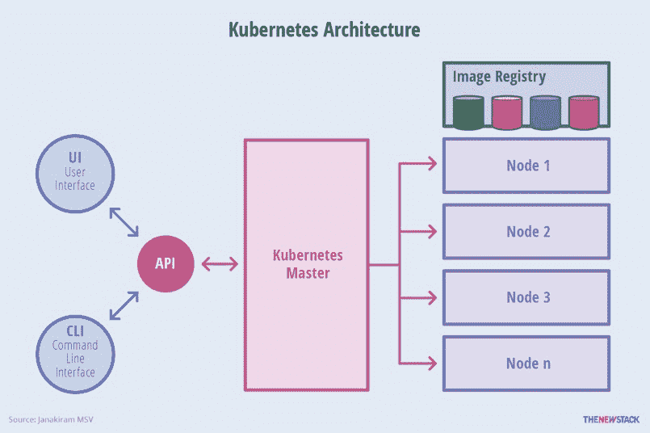
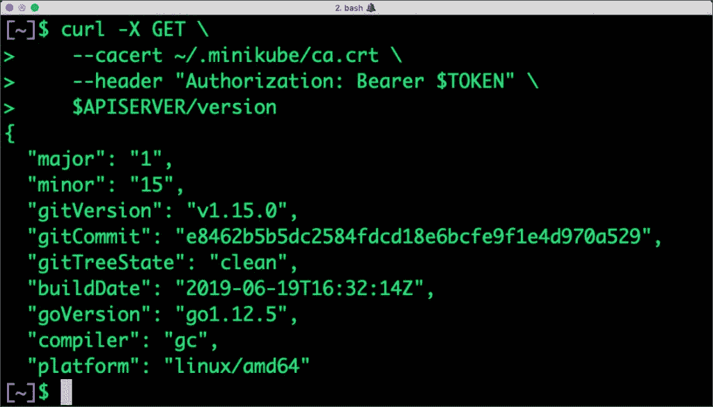
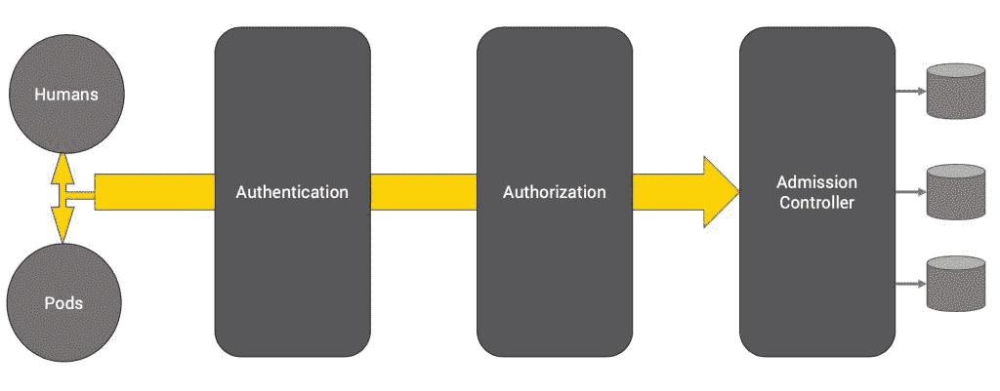

# Kubernetes 访问控制入门

> 原文：<https://thenewstack.io/a-primer-on-kubernetes-access-control/>

随着 Kubernetes 的普及，许多开发人员和管理员都熟悉了部署、扩展和管理容器化应用程序的概念。Kubernetes 对生产部署至关重要的一个领域是安全性。了解平台如何管理用户和应用程序的认证和授权非常重要。

本系列将从实际出发，研究 Kubernetes 外部用户的身份验证和授权，以及平台内部的 pods。我还将解释如何使用角色和角色绑定来允许或限制对资源的访问。

为了遵循演练中解释的步骤，您需要在您的机器上运行最新版本的 [Minikube](https://kubernetes.io/docs/setup/learning-environment/minikube/) 和 [kubectl](https://kubernetes.io/docs/tasks/tools/install-kubectl/) 。

## **API 服务器 Kubernetes 的网关**

Kubernetes 完全是关于对象和提供对这些对象的访问的 API。节点、标签、pod、部署、服务、机密、配置映射、入口以及更多资源都被视为对象。这些对象通过简单的 REST API 公开，通过它可以执行基本的 CRUD 操作。

Kubernetes 的核心构件之一是 API 服务器，它充当平台的网关。内部组件(如 kubelet、调度器和控制器)通过 API 服务器访问 API 进行编排和协调。分布式键/值数据库 etcd 只能通过 API 服务器访问。

[](https://thenewstack.io/a-primer-on-kubernetes-access-control/k8s-auth-1/)

Kubectl 是管理 Kubernetes 的瑞士军刀，它只是一个与 API 服务器对话的漂亮工具。从 kubectl 发送的任何东西最终都会到达 API 服务器。多个其他工具和插件直接或间接使用相同的 API。

甚至在 Kubernetes 集群中访问或操作对象之前，请求就需要由 API 服务器进行身份验证。REST 端点使用基于 X.509 证书的 TLS 来保护和加密流量。Kubectl 查找文件，~/。kube/config 在编码和发送请求之前检索 CA 证书和客户端证书。

```
apiVersion: v1
clusters:
-  cluster:
    certificate-authority: /Users/janakiramm/.minikube/ca.crt
    server: https://192.168.99.100:8443
  name: minikube
contexts:
-  context:
    cluster: minikube
    user: minikube
  name: minikube
current-context: minikube
kind: Config
preferences: {}
users:
-  name: minikube
  user:
    client-certificate: /Users/janakiramm/.minikube/client.crt
    client-key: /Users/janakiramm/.minikube/client.key

```

文件 ca.crt 代表集群使用的 ca，文件 client.crt 和 client.key 映射到用户 minikube。Kubectl 使用当前上下文中的这些证书和密钥对请求进行编码。

我们可以通过 curl 访问 API 服务器吗？绝对的！

尽管通常的做法是通过运行 kubectl 代理来使用隧道，但是我们可以通过使用机器上可用的证书来访问端点。除了 CA cert 之外，我们还需要一个嵌入头中的 base64 编码的令牌。

下面的命令显示了如何从 curl 中检索令牌和调用 API。

```
kubectl config view  -o  jsonpath='{"Cluster name\tServer\n"}{range .clusters[*]}{.name}{"\t"}{.cluster.server}{"\n"}{end}'

```

```
Cluster name Server
minikube https://192.168.99.100:8443

```

```
export CLUSTER_NAME="minikube"

```

```
APISERVER=$(kubectl config view  -o  jsonpath="{.clusters[?(@.name==\"$CLUSTER_NAME\")].cluster.server}")

```

下一件重要的事情是获取与默认服务帐户相关联的令牌。不用担心这个实体。在本系列的后面几节中，我们将对它有更好的理解。

```
TOKEN=$(kubectl get  secrets  -o  jsonpath="{.items[?(@.metadata.annotations['kubernetes\.io/service-account\.name']=='default')].data.token}"|base64  -D)

```

现在，我们有了烹饪正确卷曲要求的所有配料。

```
curl  -X  GET  \
  --cacert  ~/.minikube/ca.crt  \
  --header  "Authorization: Bearer $TOKEN"  \
  $APISERVER/version

```

[](https://thenewstack.io/a-primer-on-kubernetes-access-control/k8s-auth-0/)

## **Kubernetes 的三层访问控制**

如上所述，用户和 pod 在访问和操作对象之前都要经过 API 服务器的认证。

当一个有效的请求到达 API 服务器时，它在被允许或拒绝之前要经过三个阶段。

### [](https://thenewstack.io/a-primer-on-kubernetes-access-control/k8s-auth-2/) 
1。证明

在请求通过 TLS 之后，它将通过身份验证阶段，在这个阶段，请求负载将由一个或多个身份验证器模块进行检查。

身份验证模块由管理员在集群创建过程中进行配置。一个群集可能配置了多个身份验证模块，在这种情况下，将按顺序尝试每个模块，直到其中一个模块成功。

一些主流认证模块包括客户端证书、密码、普通令牌、引导令牌和 JWT 令牌(用于服务帐户)。使用客户端证书是默认的，也是最常见的情况。有关认证模块的详细列表，请参考 Kubernetes [文档](https://kubernetes.io/docs/reference/access-authn-authz/authentication/)。

重要的是要理解 Kubernetes 没有一个典型的用户数据库或配置文件来验证用户。相反，它使用从 X.509 证书和令牌中提取的任意字符串，并通过身份验证模块传递它们。OpenID、Github 甚至 LDAP 提供的外部认证机制可以通过其中一个认证模块与 Kubernetes 集成。

### 2.批准

一旦一个 API 请求被认证，下一步就是决定操作是否被允许。这在访问控制流水线的第二阶段完成。

为了授权一个请求，Kubernetes 考虑三个方面——请求者的用户名、请求的动作和受动作影响的对象。用户名是从嵌入在头中的令牌中提取的，动作是映射到 CRUD 操作的 HTTP 动词之一，如 GET、POST、PUT、DELETE，对象是有效的 Kubernetes 对象之一，如 pod 或 service。

Kubernetes 根据现有策略确定授权。默认情况下，Kubernetes 遵循从封闭到开放的原则，这意味着甚至访问资源都需要明确的允许策略。

与身份验证一样，授权是基于一个或多个模块进行配置的，例如 ABAC 模式、RBAC 模式和 Webhook 模式。当管理员创建集群时，他们配置与 API 服务器集成的授权模块。如果使用了多个授权模块，Kubernetes 会检查每个模块，如果有任何模块授权了请求，那么请求就可以继续进行。如果所有模块都拒绝该请求，则该请求被拒绝(HTTP 状态代码 403)。Kubernetes [文档](https://kubernetes.io/docs/reference/access-authn-authz/authorization/#authorization-modules)有一个支持的授权模块列表。

当您在默认配置下使用 kubectl 时，所有请求都会通过，因为您被认为是集群管理员。但是当我们添加新用户时，默认情况下，他们的访问是受限的。

### 3.准入控制

请求的最后一个阶段通过准入控制。像认证和授权步骤一样，准入控制是关于可插拔模块的。

与前两个阶段不同，最后一个阶段甚至可以修改目标对象。准入控制模块作用于正在被创建、删除、更新或连接(代理)的对象，而不是读取。例如，准入控制模块可用于修改创建永久卷声明(PVC)的请求，以使用特定的存储类别。模块可以实施的另一个策略是每次创建 pod 时提取图像。关于准入控制模块的详细说明，请参考 Kubernetes [文档](https://kubernetes.io/docs/reference/access-authn-authz/admission-controllers/)。

在访问控制过程中，如果任何准入控制器模块拒绝，则该请求立即被拒绝。一旦一个请求通过了所有的准入控制器，就使用相应 API 对象的验证例程对其进行验证，然后将其写入对象存储

在本系列的下一部分中，我们将更深入地了解如何创建用户并为他们配置身份验证。敬请关注。

<svg xmlns:xlink="http://www.w3.org/1999/xlink" viewBox="0 0 68 31" version="1.1"><title>Group</title> <desc>Created with Sketch.</desc></svg>