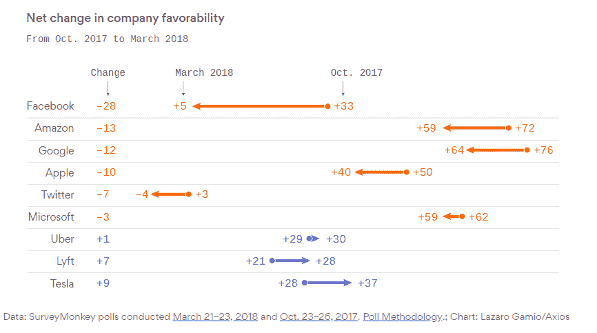

# 不讨厌脸书的一个理由:开源贡献

> 原文：<https://thenewstack.io/a-reason-to-not-hate-facebook-open-source-contributions/>

最近的报道称计算机专业的学生不想为脸书工作。基于你作为开发者的[道德观](/tech-ethics-new-years-resolution-dont-build-software-you-will-regret/)，会为脸书工作吗？如果开源是你的事情，那么也许你会给最近的脸书仇恨节带来一些爱。

对于注重隐私的人来说，过去的一年为避开这家社交媒体巨头提供了大量理由，最明显的是它模糊不清、不断变化的隐私政策，以及似乎渴望与其他公司分享用户数据，从剑桥分析公司到网飞。

但是脸书正在为领先的、广泛使用的开源项目做出重大贡献。GitHub 的年度 Octoverse 报告称，在向主要库提供贡献的公司方面，脸书在世界上排名第四。我们自己的[报道](https://thenewstack.io/week-numbers-data-lots/)显示，脸书排名第六，但仍高于其重量级。公司[的投资组合中有](https://code.fb.com/open-source/open-source-2018/) 474 个活跃的开放活动库。令人印象深刻的是，去年对这些项目的 9.4 万份承诺中，有 30%来自不在脸书工作的人。脸书项目中的佼佼者包括 React 和 Pytorch，React 有超过 10，000 名贡献者，py torch 是一个机器学习平台，根据 GitHub 的报告，py torch 是增长第二快的主要项目。

技术社区认为支持开源对于获得最好的人才是必要的。正如之前报道的，招聘经理认为开源的氛围有助于招聘。此外，根据 2017 年 GitHub [调查](https://opensourcesurvey.org/2017/)，52%的开发人员认为他们参与开源社区有助于获得目前的工作。我们自己的研究表明开源项目提供了很多好处，尽管开发者的快乐并不是它们存在的主要原因

尽管有这些发现，我们还没有找到证据证明开源政策是找工作的关键原因。相反，在考虑新工作时，薪酬仍然是首要标准，尽管根据最近的一项堆栈溢出调查，学习和使用新技术的机会几乎同样重要。在接受一份工作的理由中，多样性排在第二位。

成为开源领域的领导者并不是万能的。谷歌的贡献甚至比脸书的更值得注意，但该公司已经看到自己的道德因[性骚扰](https://www.cnbc.com/2018/11/03/google-employee-protests-as-part-of-new-tech-resistance.html)及其与[军方](https://www.nytimes.com/2018/04/04/technology/google-letter-ceo-pentagon-project.html)的合作而受到质疑。但至少谷歌仍被公众正面看待。相比之下，人们比任何其他大型科技公司都更认为脸书对社会有负面影响——这是基于 2018 年全年收到负面新闻之前进行的诚实数据调查。对其业务的影响是真实的，根据皮尤研究中心 2018 年 6 月的调查[显示，26%的成年人最近将脸书从手机中移除。](https://www.pewresearch.org/fact-tank/2018/10/24/facts-about-americans-and-facebook/)

利润至上的心态和围绕个人数据的商业模式，让脸书变得有毒。然而，矛盾的是，在开源世界里，它对待知识产权的方式让脸书走在了企业社会责任的前列。当未来和现在的员工质疑为脸书工作的道德时，不要忘记它对开源的贡献。

来源: [Axios](https://www.axios.com/exclusive-poll-facebook-favorability-plunges-1522057235-b1fa31db-e646-4413-a273-95d3387da4f2.html) 。剑桥分析公司丑闻之后，脸书的支持率直线下降。谷歌和亚马逊在这项调查和许多其他调查中的形象更好。

由 [Aaron Sneddon](https://commons.wikimedia.org/wiki/File:Balancing_act_continental_circus_berlin.jpg) 拍摄的特征图像，CCA 3.0。

<svg xmlns:xlink="http://www.w3.org/1999/xlink" viewBox="0 0 68 31" version="1.1"><title>Group</title> <desc>Created with Sketch.</desc></svg>