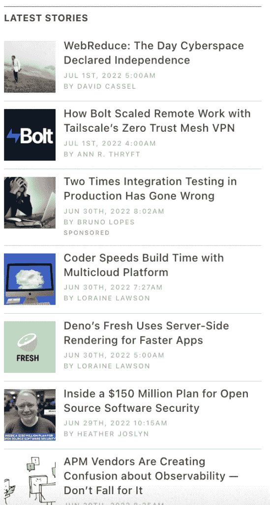

# 新堆栈的重新设计

> 原文：<https://thenewstack.io/a-redesign-for-the-new-stack/>

2014 年 4 月，我们推出了新的堆栈。从那以后网站就一直是这样。

直到今天。

欢迎来到全新的 Stack 站点重新设计，这反映了我们是谁，我们如何为您服务，以及我们为达到今天的地位而构建的基础架构。

自从我们在 2014 年 4 月 29 日发布了“[你好，世界](https://thenewstack.io/welcome-to-the-new-stack/)”帖子以来，新堆栈的重点一直保持不变。正如我们开始以来所做的那样，新的堆栈涵盖了大规模开发、部署和管理。我们的主要社区是开发人员、软件工程师以及开发和管理后端架构的人员。自 2014 年以来，新堆栈已经发布了超过 10，500 篇帖子。

“我们需要提升网站的设计，以更好地匹配内容的质量，”新堆栈的软件开发总监亚伦·班说，“在我们以前的设计中，我们发布的是顶级的技术分析，但我们对网站的感觉更像是博客。我们希望摆脱那种博客风格，更多地转向出版风格、报纸风格。”

我们与 T4 蒙奈设计公司的斯特凡·蒙奈和丽莎·齐奇合作设计了这个新网站。他们将自己作为 UX 和出版物设计师的经验带到了项目中，并从第一天起就提供了对挑战的透彻理解。其结果是一个在“网站”和“出版物”之间游走的设计，有助于提升 TNS UX。

我们所做的一些改变:

*   将更多内容移到文件夹上方，使其更容易被发现。
*   新的版式使读者更容易快速浏览标题。
*   我们增加了故事卡的尺寸，以明确什么是新内容或特色内容。
*   增加了关键概念频道，允许我们“放大”特定主题，并展示最佳表现和常青树文章。
*   在首页(和其他页面)增加了播客和事件模块，以更好地展现内容。
*   我们改进了展示赞助商联合内容的方式，使浏览更多的标题变得更快更容易。
*   我们改进了相关故事模块，使其更快、更容易地浏览更多相关标题。
*   简化了电子书下载流程，消除了一些繁琐的步骤。
*   更好的性能:新网站的性能提升了约 25%。
*   我们已经极大地改进了我们的遥测技术(对隐私没有任何影响)，因此我们可以始终有一个清晰的、有数据支持的画面，显示 UX 的哪些部分正在工作，以及我们可以继续改进的地方。

右栏现在显示我们的最新帖子，最新帖子位于页面顶部。

我们出版读者认为相关的内容。我们现在在首页增加了一个特写部分，以突出感兴趣的新闻和更深入的文章。

建筑、工程和运营是该网站的三个主要类别。每个类别都有子主题。

该网站有三个主要部分:播客，事件和关键概念。

播客:

事件:

关键概念:

网站的重新设计反映了 9 个月的工作，新堆栈的业务系统工程主任史蒂夫·奥尔布赖特说。

“其结果是一个大大改善和智能的网站，使我们的读者能够快速找到他们想要的内容，并更容易地发现新的内容，”奥尔布赖特说。“此外，我们的赞助商现在可以通过改进的赞助商说明和 RSS 博客订阅来展示他们的联合内容。新网站融入了多年来对改善新书库的读者和赞助商体验的渴望。”

<svg xmlns:xlink="http://www.w3.org/1999/xlink" viewBox="0 0 68 31" version="1.1"><title>Group</title> <desc>Created with Sketch.</desc></svg>