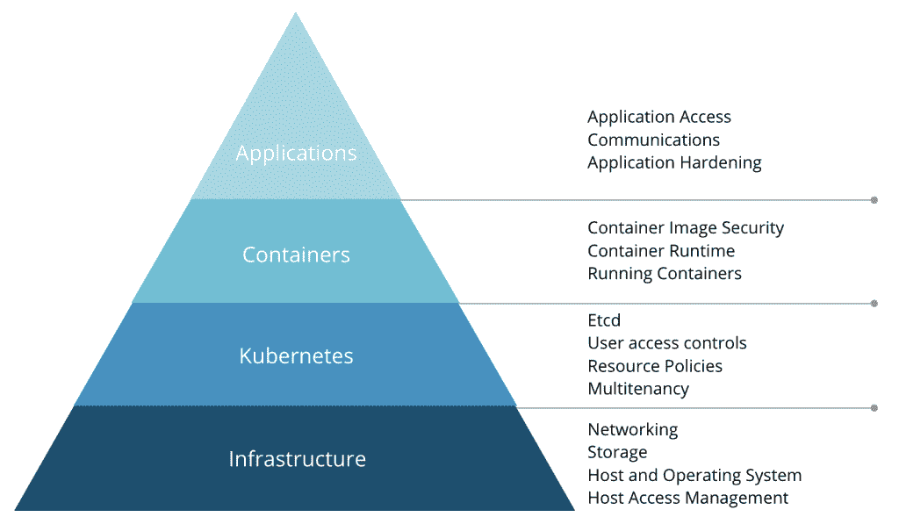
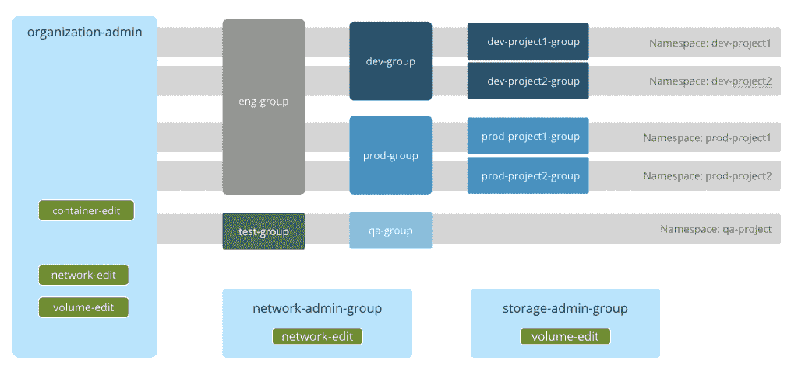

# 云本地 Kubernetes 环境的安全清单

> 原文：<https://thenewstack.io/a-security-checklist-for-cloud-native-kubernetes-environments/>

[Arvind Gupta](https://www.linkedin.com/in/guptaarvindk/)

[Arvind 是云原生专家、问题解决者和传道者，对学习和教学充满热情。Arvind 在一系列计算机学科中担任过各种技术职务。在开始他的软件测试职业生涯后，Arvind 在 Redback Networks 公司的 ASIC 行业呆了几年，随后在爱立信公司工作，在那里他构建了高级网络芯片。他于 2015 年 10 月加入 Diamanti，在负责解决方案和营销之前，他在将 Diamanti 的硬件平台投入生产方面发挥了重要作用。Arvind 拥有普渡大学的硕士学位。](https://www.linkedin.com/in/guptaarvindk/)

[Kubernetes](https://thenewstack.io/kubernetes-and-the-cloud-native-community/) 每天都在攀登新的高峰，更快的采用和来自社区的更多贡献。Kubernetes 最初阻止早期采用者的一个重要方面是安全性。与虚拟机相比，许多人怀疑容器和 Kubernetes 的安全性，并因此放弃了容器。但是慢慢地，人们开始相信容器和 Kubernetes 现在和物理机和虚拟机一样安全。

Kubernetes 中的安全性是一种实践，而不仅仅是一种特性。安全是一个多层面的问题，必须从许多不同的角度加以解决。Kubernetes 中的安全性的多个方面无法在一篇文章中涵盖，但是下面的清单涵盖了应该在整个堆栈中审查的安全性的主要方面。

安全必须是任何组织的 DevOps 过程(通常称为 DevSecOps)的一等公民。对于 DevSecOps，安全性问题从第一天起就作为 DevOps 管道的一部分嵌入。DevSecOps 实践实现了大多数安全问题的自动化，并在开发过程中提供了一系列安全检查。

由空军首席软件官 Nicolas M. Chaillan 领导的 DevSecOps 开放计划是在一个组织中采用 DevSecOps 及其重要性的一个很好的例子。细节被发布在空军网站上，所以他们可以被其他组织利用。这些 DevSecOps 实践可以为组织提供一种在 Kubernetes 基础设施中嵌入安全保护的途径。

Kubernetes 的安全性可以从四个方面来定义:

1.  基础设施
2.  库伯内特斯
3.  容器
4.  应用程序

图一。Kubernetes 安全性的多个方面

## 保护基础设施

基础设施级别的安全性通常是最基本的任务，但也是最大的任务。然而，它在开发过程中经常被忽视。在构建应用程序时，牢记基础设施的安全性非常重要，因为它会影响应用程序的设计方式。

基础设施安全本身有许多方面:

### 1.建立工作关系网

Kubernetes 部署大多是微服务，其中所有的微服务都在相互对话或与外部应用程序和服务通信。重要的是将网络流量限制在必要的范围内，同时理解微服务可能是短暂的，并且在集群中的节点之间移动。为了开发一个安全的网络，您需要考虑网络设计的各个方面。

*   **控制流量的隔离:** Kubernetes 控制平面流量必须与数据平面流量隔离，这不仅是出于安全原因，也是为了避免数据流量影响 Kubernetes 控制平面流量。如果没有隔离，来自数据平面的流量可能会盖过来自控制平面的流量，并导致暂时的服务中断。
*   **存储流量的隔离:**同样，存储流量需要与常规数据和控制流量隔离，以便基础架构的存储服务不会消耗或关闭您的应用网络，反之亦然。
*   **网络分段:** Kubernetes 对用户隐藏底层基础设施。开发人员在设计网络时应该记住这一事实以及多租户。底层网络基础设施必须支持基于第 2 层 VLAN 的分段和基于第 3 层 VXLAN 的分段，以隔离不同租户或应用之间的流量。根据需要，这两种分段技术都是有用的。
*   **服务质量:**在共享网络基础设施中，嘈杂的邻居是一个大问题。重要的是，底层网络基础架构可以保证每个单元或租户的特定服务级别，同时确保一个单元的流量不会影响其他单元。SR-IOV 等网络虚拟化技术有助于在共享基础设施上提供虚拟化隔离。
*   **网络策略、防火墙和 ACL:** 我们稍后将更详细地讨论应用程序级网络访问控制，但网络应该在硬件级具有较低级别的访问控制，以及对共享环境中的流量进行更好的控制。

### 2.储存；储备

对于任何组织来说，存储都是安全性的重要组成部分。黑客通常寻找保存在应用程序存储中的机密数据，如信用卡信息或个人身份信息(PII)。使用 Kubernetes 的开发人员应该考虑以下形式的存储级安全实现。

*   **自加密硬盘:**自加密硬盘是存储安全的一种基本形式。有了这些驱动器，加密工作就转移到了磁盘本身，数据在写入磁盘时会得到加密。这确保了如果有人实际接触到磁盘驱动器，他们将无法访问数据。
*   **卷加密:**在共享基础设施中，Kubernetes CSI 管理卷的生命周期。这将用户与底层存储基础架构隔离开来。卷加密可确保各个卷不会受到不良分子的访问。
*   **服务质量:**在共享存储基础设施中，I/O 密集型应用程序可能会影响其他应用程序的性能。重要的是，底层存储基础架构能够确保为每个单元或租户提供有保证的服务级别。同样，SR-IOV 有助于在 PCI 级别提供存储隔离，为每个租户提供单独的队列。

### 3.主机和操作系统

下一级基础架构是物理或虚拟主机本身。运营商希望通过以下方式保护基础:

*   **强化操作系统**:现场可靠性工程师(sre)应遵循一般安全准则保护主机操作系统，并强化操作系统以避免任何进一步的更改。SREs 还应该应用防火墙、端口拦截和其他标准的最佳实践安全措施。定期安全更新和补丁必须在可用后立即应用。黑客和入侵者经常利用已知的漏洞。
*   **启用内核安全:**SELinux 和 AppArmor 等内核安全模块为系统上的应用程序、进程和文件定义了访问控制。
*   **审计日志记录:**使用 Kubernetes 的组织应该实现审计日志记录，这不仅有助于监控系统，还有助于调试和发现安全漏洞的踪迹。
*   **轮换凭证:**用户凭证必须经常轮换，并且必须遵循严格的安全准则，以避免被破解或窃取。
*   **锁定节点:**一旦在 Kubernetes 集群中配置和设置了节点，就应该拆除操作系统。除了补丁和升级，不需要安装或配置任何新的东西。所有节点都必须锁定，并且只能由超级管理员访问。
*   **CIS 一致性:**CIS(互联网安全中心)提供一致性测试，以确保所有最佳实践都已实施。检查您的主机设置并通过一致性测试，以确保合规性。

### 4.主机级访问管理

闯入 Kubernetes 集群的最薄弱环节是节点本身。由于 Kubernetes 将用户与底层节点隔离开来，因此控制对节点的访问非常重要。

*   **严格访问:**组织应该小心地将对节点的 root/admin 访问权限限制在非常有限的一组可信用户。
*   **建立锁定:**即使是非根用户，开发人员的直接登录也应该受到限制，仅限于通过 Kubernetes API 服务器访问。为了避免对运行在节点上的 Kubernetes 服务的任何威胁，所有的节点都应该被锁定。
*   **隔离 Kubernetes 节点:** Kubernetes 节点必须在一个隔离的网络上，并且决不能直接暴露于公共网络。如果可能，它甚至不应该直接暴露在公司网络中。这只有在 Kubernetes 控制和数据流量被隔离时才有可能。否则，两个流量流将流经同一管道，开放对数据平面的访问意味着开放对控制平面的访问。理想情况下，节点应该配置为只接受来自指定端口上主节点的连接(通过网络访问控制列表)。
*   **主节点:**主节点的访问必须由网络访问控制列表控制，仅限于管理集群所需的 IP 地址集。

## 保护 Kubernetes

随着基础设施的锁定，下一个要保护的层是 Kubernetes 安装本身。在典型的开源 Kubernetes 安装中，许多都需要手动配置，因为它们在默认情况下并不都是打开的。

### 1.固定 [etcd](https://kubernetes.io/docs/tasks/administer-cluster/configure-upgrade-etcd/)

**etcd** 是高度可用的键值存储，用作 Kubernetes 所有集群数据的后备存储。它保存了 Kubernetes 的所有状态、秘密和信息，这意味着保护 etcd 非常重要。

*   如前所述，etcd 中的节点应该锁定，只允许最少的访问。
*   理想情况下，包含 etcd 数据的驱动器应该加密。
*   etcd 的访问权限必须仅限于主设备。
*   理想情况下，etcd 通信应通过 TLS 进行。

### 2.保护对 Kubernetes 集群的访问

Kubernetes 允许企业使用标准的身份和访问控制解决方案，但它们需要与环境集成，默认情况下不提供。访问控制可以分为以下几个部分。

*   **认证**:用户在访问 Kubernetes API 之前需要通过认证。Kubernetes 提供了各种身份验证模块，包括客户端证书、密码、普通令牌、引导令牌和 JWT 令牌(用于服务帐户)。然而，实际的用户管理和认证并不是 Kubernetes 的一部分。对于生产环境，组织将需要一个外部用户管理和认证插件或一个支持这些功能的 Kubernetes 平台。与 LDAP、Active Directory 或其他身份提供商解决方案集成非常重要。

图二。Kubernetes 中基于角色的访问控制

*   **授权**:一旦用户通过了身份验证(即被允许连接到 Kubernetes 集群)，下一步就是授权以确定对所请求资源的访问。Kubernetes 支持多种授权模块，比如基于属性的访问控制(ABAC)、基于角色的访问控制(RBAC)和 Webhooks。RBAC 是最流行的授权插件之一，因为它允许在多租户环境中对单个 Kubernetes 资源进行粒度控制。
*   **准入控制:**准入控制挂钩允许组织在用户通过身份验证并被授权访问所请求的资源之后，拦截并控制 Kubernetes 请求。准入控制的最好例子是资源配额，它让组织控制资源消耗。
*   对 Kubernetes API 服务器的访问也必须通过 TLS 进行保护。

### 3.安全策略

Kubernetes 提供了一些可以由用户定义的可配置策略。这些应该符合企业实践，但默认情况下并不“开启”。

*   一个 **Pod 安全策略**是一个准入控制插件，它确保 Pod 仅在遵循某些安全准则时才被准入。可以定义的策略包括限制特权 pod 的创建、防止容器作为根运行或限制某些名称空间、网络或卷的使用。
*   **网络策略**由容器网络接口(CNI)插件实现，该插件控制允许[pod](https://kubernetes.io/docs/concepts/workloads/pods/pod-overview/)组如何相互通信以及与其他网络端点通信。设置网络策略很重要，因为在默认情况下，pod 是非隔离的(它们接受来自任何来源的流量)。
*   Kubernetes 为计算资源(CPU 和内存)提供服务质量(QoS)保证，以避免嘈杂的邻居或资源匮乏问题，但它不为 I/O(存储和网络)提供 QoS。Diamanti 等超融合平台增加了对 for QoS 的支持。

### 4.工作负载隔离和多租户

在多租户环境中，每个租户或租户组必须有一个单独的名称空间，以将工作负载和数据相互隔离。这些分离和边界需要得到 CNI、CSI 和认证插件的支持，以便它们在整个堆栈中保持一致。

## 保护容器

容器在开发和运行时需要得到保护。有许多很好的资源可用于保护容器，包括本文[，但这里有一些关键要素:](/beyond-ci-cd-how-continuous-hacking-of-docker-containers-and-pipeline-driven-security-keeps-ygrene-secure/)

### 1.集装箱图像安全

所有运行的容器都基于一个图像文件，可以从 Docker Hub 这样的开放库下载，或者从一个团队传递到另一个团队。知道你的图片来自哪里，里面有什么是很重要的。所有这些计划都应成为组织开发运维流程的一部分，以实现自动化并确保映像安全性。

*   **映像漏洞扫描:**必须使用 Aqua、Twistlock、Sysdig 和 Clair 等工具对正在构建的容器映像进行已知漏洞扫描。这些工具解析映像中的包和依赖项，寻找已知的漏洞。
*   **图像签名:**组织还应该执行严格的准入控制策略，只允许通过公司公证人签名的图像进入。TUF 和公证人是用于签署容器图像和维护容器内容的信任系统的有用工具。
*   **限制权限:**此外，组织应该避免在容器映像中使用 root 用户，并防止权限提升。为了实现容器的目标，容器内的用户必须拥有最低级别的操作系统特权。

### 2.容器运行时

容器运行时是安装在操作系统中的程序。如今，大多数环境都使用 Docker，这里有一个可用的 [CIS 基准](https://www.cisecurity.org/benchmark/docker/)。Seccomp 可用于减少攻击面，CRI-O 等新的运行时具有额外的内置安全特性。

### 3.运行容器

许多工具，如 Twistlock、Aqua 和 Sysdig，也通过监控网络和系统调用来提供对运行时漏洞的持续监控和威胁预防。这些工具还能够拦截和阻止这些不需要的呼叫或通信，并执行安全策略。

## 保护应用程序

最后，在保护底层基础设施、Kubernetes 和容器之后，保护应用程序本身仍然很重要。

### 1.应用程序访问

*   【Kubernetes Ingress 的 TLS:将应用程序暴露给集群外部的最常见的做法是使用 Envoy 或 NGINX 之类的入口控制器。对入口控制器的所有外部访问都必须通过 TLS，入口控制器和应用程序容器之间的通信也应使用 TLS，尽管有些情况下不需要这样做——这取决于网络设计和公司安全政策。
*   **加密传输中的所有内容:**除了少数情况，默认行为应该是加密传输中的所有内容。即使在公司防火墙后面，加密容器之间的网络流量也是明智的。许多服务网格，如 Istio 和 Linkerd，提供了 mTLS 选项来自动加密 Kubernetes 集群中的流量。

### 2.通信

*   **联网:【Istio、Linkerd 和 Consul 等服务网格提供了许多第 7 层联网功能，允许限制和控制多个租户之间的流量。**
*   **端口:**只暴露应用程序/容器上对于应用程序通信绝对必要的端口，这一点很重要。

### 3.应用强化

许多 DevOp 实践应该构建到 CI/CD 管道中，以确保应用程序安全并遵循最佳实践。一些例子是:

*   定期分析源代码，以确保它遵循最佳实践来避免漏洞和威胁。有许多可用的工具，如 Veracode 和 Synopsys。
*   大多数开发者依赖第三方应用和库来构建他们的应用和微服务。定期扫描代码依赖项中的新漏洞，可以确保它们不会威胁到应用程序的安全。
*   针对常见的攻击实践，如 SQL 注入、DDoS 攻击等，持续测试您的应用程序。这里有各种动态分析工具可以提供帮助。

## 概括起来

安全性始终是组织最关心的问题。但是传统上，安全是组织中的一个独立团队，在自己的筒仓中工作，远离开发过程。开发人员通常专注于应用程序，而安全团队在开发周期的末尾参与进来。但是这可能会破坏部署，因为安全团队由于忽略关键安全策略的开发实践而阻碍了该过程。安全团队和开发团队之间这种不健康的互动不仅会导致易受攻击的软件开发，还会导致许多最后时刻的错误和生产中的意外延迟。

在容器和 Kubernetes 的新时代，拥有安全实践的健壮自动化是很重要的；和安全性应该从一开始就集成到开发周期中。DevSecOps 现在是焦点，因为安全性在 DevOps 过程中变得根深蒂固。挑战在于，上述清单中列出的许多项目必须跨多个领域手动配置。缺少其中任何一项都会使您的整个应用程序和公司面临风险。

应用程序安全性仍然是开发人员的责任。但与基础设施、平台和 Kubernetes 相关的其他安全功能可以通过现代超融合方法解决，如 [Diamanti 平台](http://www.diamanti.com)。Diamanti 平台是 Kubernetes 的一个全栈硬件和软件平台，它内置了本文中提到的许多安全特性，从而减轻了您自己为您的组织实现这些特性的痛苦。这有助于您轻松地设置 DevSecOps 管道，以便您可以专注于应用程序开发。

<svg xmlns:xlink="http://www.w3.org/1999/xlink" viewBox="0 0 68 31" version="1.1"><title>Group</title> <desc>Created with Sketch.</desc></svg>