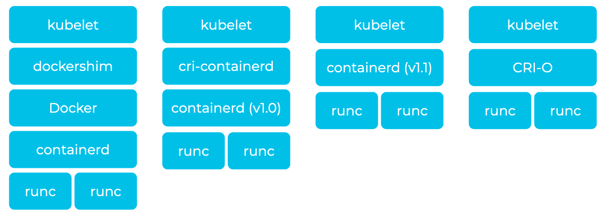
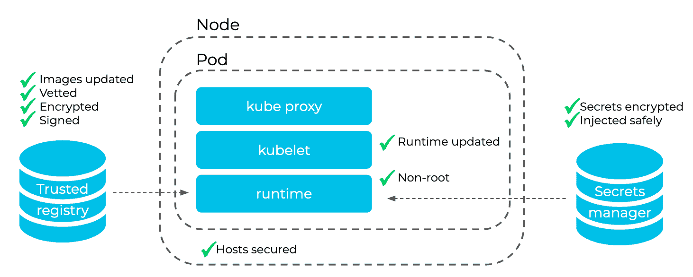

# Docker、CRI-O 和 containerd 的安全性比较

> 原文：<https://thenewstack.io/a-security-comparison-of-docker-cri-o-and-containerd/>

 [泰勒史密斯

泰勒是帕洛阿尔托网络公司的高级产品营销经理，负责左移和集装箱安全。此前，他曾在 Gremlin、Cisco 和 NetApp 担任产品营销和战略职位。](https://www.linkedin.com/in/taylorbsmith/) 

Kubernetes 1.20 中 dockershim 的贬值受到了很多媒体的关注。Kubernetes 已经达到[主流采用](https://www.cncf.io/blog/2020/11/17/cloud-native-survey-2020-containers-in-production-jump-300-from-our-first-survey/)，所以任何重大变化都会影响很多应用。Docker 是 Kubernetes 最初的容器运行时，现在仍然是非常流行的容器开发工具集和容器运行时。

许多托管 Kubernetes 产品已经转向其他容器运行时。例如，OpenShift 在 2019 年 6 月在 OpenShift 4 中切换到 [CRI-O 作为其默认运行时](https://www.redhat.com/en/blog/red-hat-openshift-container-platform-4-now-defaults-cri-o-underlying-container-engine)，Azure Kubernetes 服务[在 2020 年 1 月将其默认运行时设置为 containerd](https://docs.microsoft.com/en-us/azure/aks/cluster-configuration) 。[其他人](https://kubernetes.io/blog/2020/12/02/dockershim-faq/)已经报道了 Docker 构建的图像如何仍然能够与其他开放容器倡议(OCI)兼容的运行时一起工作，并且 Mirantis 已经宣布他们将[继续支持 dochershim](https://www.zdnet.com/article/mirantis-will-support-depreciated-kubernetes-dockershim/) 。然而，大多数用户可能会转向 Kubernetes 环境的默认运行时，而不会注意到这种切换。

事实上，对于普通用户来说，切换到新的运行时将会产生巨大的好处。

## 我们如何得到码头弃用的简史

Docker 曾经是一个单一的工具，包含了设置容器的能力以及无数的开发工具。它包含了 CLI、日志记录、存储管理、网络、构建工具和许多其他创建容器的核心能力之外的功能。然而，在 Unix 哲学的脉络中，Docker 最终将这些组件分解，并将容器运行时组件 containerd 贡献给了 CNCF。

Kubernetes 中的默认配置将 Docker 作为 containerd 之上的抽象层，container d 又是 runc 之上的抽象层。这个额外的层——以及 Docker 包含的所有额外工具——带来了维护难题、[巨大的开销](https://kubernetes.io/blog/2018/05/24/kubernetes-containerd-integration-goes-ga/#performance)以及更大的漏洞攻击面。这在团队一天多次部署代码的短暂环境中并不理想。额外的一层也引入了严重的安全隐患，我们将在后面讨论。

与此同时，其他容器运行时开始出现。Kubernetes 的维护者们提出了一个叫做容器运行时接口(CRI)的标准，它将成为 kubelets 和容器运行时之间通信的通用语言。由于 Docker 不符合这一标准，它需要一个中间层或垫层来运行。

Kubernetes 和 containerd 维护人员为 kubelets 添加了一个 CRI shim，以便与 containerd 直接对话。这使得 Kubernetes 可以省去 Docker，直接使用 containerd。这在技术上降低了容器的能力，但是这些能力从一开始就是不必要的。例如，Kubernetes 管理的容器不需要 SSH 访问。然而，CRI shim 仍然增加了复杂性和另一个攻击面，所以开发人员最终将 CRI 作为插件原生添加到 containerd 中。

2016 年，CRI-O 被开发为 Docker 的替代产品。它超越了 containerd 的发展，从一开始就包含了原生 CRI。以这种方式，kubelet 通过 CRI 直接与 CRI-O 对话，以拉取图像并启动较低级别的运行时(例如，runc ),这又设置了名称空间、cgroups、根文件系统、存储、几个 Linux 安全模块和 conmon，一个 CRI-O 特定的监视工具。CRI-O 和 containerd 之间的一个重要区别是删除了一些 Linux 功能，我们将在下一节中介绍。

不同的容器运行时

## 这些差异对安全性意味着什么？

从根本上说，所有三个运行时——Docker、CRI-O 和 container d——都会提取一个映像，然后启动一个较低级别的运行时来配置和启动容器的组件和进程。大多数攻击面都是相似的:

*   提取恶意或过时的图像
*   在图像中留下硬编码的秘密
*   向容器授予过多特权，例如共享主机命名空间、主机网络或应用特权标志
*   通过增加 CPU、RAM、网络、IOPs 或磁盘使用量来扰乱相邻容器，从而成为“吵闹的邻居”
*   利用内核漏洞

然而，基于运行时的体系结构差异，每一种都有一些独特的攻击媒介。Docker 是三人中最臃肿的。例如，它包含一个 CLI 和 SSH 守护程序，为攻击者获得对容器的访问开辟了更多途径。

Containerd 删除了许多这些特性，并显著减少了代码库。因为运营团队通过 Kubernetes 的控制平面进行交互，所以不会错过这些功能。不过 containerd 还是有几个不必要的 Linux 功能，比如 audit_write、mknod、net_raw 和 sys_chroot。这些是 Docker 维护者在开发早期定义的，当时还没有人确切知道它需要什么特性，但是这些定义是以牺牲安全性为代价的。尽管其攻击面有所下降，但 containerd 在过去几年中容易受到一些攻击，如从注册表中提取的[中毒图像](https://cve.mitre.org/cgi-bin/cvename.cgi?name=CVE-2020-15157)和主机网络容器的[容器逃逸，以及其他攻击媒介。](https://cve.mitre.org/cgi-bin/cvename.cgi?name=CVE-2020-15257)

相比之下，CRI-O[移除了那些 Linux 功能](https://www.youtube.com/watch?v=RoiIx8mcECY)以减少攻击面。尽管有这种额外的保护，CRI-O 也不是没有缺点。例如，conmon 是一个有用的监控工具，但也是一个[容器逃逸漏洞](https://access.redhat.com/security/cve/cve-2019-14891)的原因。之前的版本没有将 [TLS 与注册管理机构](https://access.redhat.com/security/cve/CVE-2019-10214)一起使用，这为中间人攻击提供了机会。

## 我能做些什么来保护我的系统？

对于大多数 Kubernetes 用户来说，最好的建议是转移到较低级别的运行时，如 containerd 和 CRI-O。它们较小的攻击面更容易保护。无论您选择哪一种，请确保:

*   尽可能频繁地更新。如果您使用的是托管 Kubernetes 提供程序，请升级到其最新版本。
*   对容器使用最小特权模型——避免以 root 用户身份运行容器，并去除不必要的 Linux 功能。
*   确保从可信的注册表中更新、加密、签名和提取图像。
*   不要因为一个图像是开源的就认为它是安全的。
*   确保机密在静态时加密并安全注入。
*   保护您的主机免受利用，如容器突破。

## 安全工具如何提供帮助

云原生安全工具可以创建护栏，帮助我们的团队遵循上述最佳实践。安全合规性工具可以检查所有节点的操作系统是否是最新的，以及软件包(如容器运行时)是否已更新和打了补丁。它们还可以帮助发现 Kubernetes 清单中创建以 root 身份运行的容器的配置，并阻止或警告这些问题。

一些全面的平台可以与 CI/CD 工具集成，在构建过程中(在注册表中或运行时)扫描易受攻击的包的映像，然后识别哪些包有可用的补丁。较新的机器学习工具可以建立集装箱流量的模型，并警告或阻止偏离正常的模式，以防止不良行为者利用零日漏洞进行攻击。

此外，诸如 Vault 之类的机密存储管理机密的分发，以便通过仅在容器需要时注入变量来实施可信访问。

容器运行时安全性

## 转向 CRI-O 和 Containerd 以提高安全性

Docker 的弃用并没有初看起来那么可怕。许多组织将从提高的性能和减少的攻击面中受益。消除不必要的膨胀并添加本机 CRI 锁定了 containerd 和 CRI-O。然而，这三者仍然存在漏洞和错误配置。

对于额外的安全措施，图像扫描和运行时保护可以保护基于 Kubernetes 的应用程序。在过渡期间，确保您的安全工具[保护您的运行时](https://blog.paloaltonetworks.com/2021/01/cloud-host-container-web-app-api-release/)，并在软件生命周期的每个阶段防范这些威胁。

<svg xmlns:xlink="http://www.w3.org/1999/xlink" viewBox="0 0 68 31" version="1.1"><title>Group</title> <desc>Created with Sketch.</desc></svg>