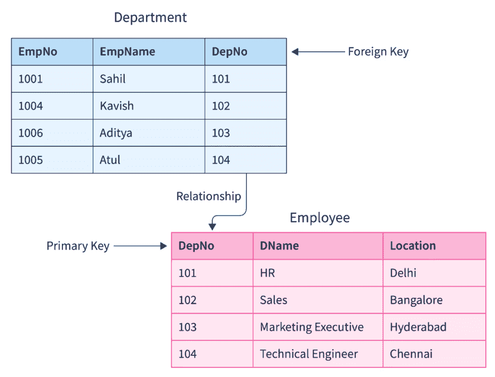

# 软件开发人员技术写作指南

> 原文：<https://thenewstack.io/a-software-developers-guide-to-technical-writing/>

《经济学人》曾刊登一则广告，征集一篇科学新闻文章，以竞争其团队中的一个实习职位。公司明确表示，宁愿要一个会写作的科学家，也不要一个懂点科学的记者。

考虑到这一点，作为一名经验丰富的软件开发人员和技术作家，以下是我写技术文章的技巧。我指的是那些受众是寻找技术产品、平台或工具的技术人士的文章。

## 习惯和工具

如果你曾经考虑过写作，并且你从事技术工作，你一定要把自己放在创作技术文章的框架中。是的，写作只有通过练习才能提高，但是你不需要拥有任何神秘的写作天赋。在社交媒体时代，几乎每个人都写作。任何编辑都知道，参与和文学不是一回事。你可能想写一篇关于你刚刚使用过的或者有兴趣使用的新技术的文章，或者你可能觉得有义务推广你现有的一项关键技术。

如果你曾在会议上发言，你就会明白这是一种障碍挑战。你选择了接受它，在你接受了一次之后，问题就是重复这个模式。写法也差不多；找到合适的工具和合适的资源，然后找到你在页面上获取单词的最佳时机。

保持习惯更难。我肯定你知道有人已经开始写小说了——但是你可能知道更少的人已经完成了一本。幸运的是，写大约 1000 字远没有那么费力。你可能开始的时候没有足够的单词，后来就有太多了。重读草稿和编辑是潦草的面包和黄油。你只有一次空白页面。

事实证明，书写工具确实很重要。技术文章将文本、图表、图像和代码混合在一起。正确地格式化它们——然后将它们导出到最终的发布平台并检查格式仍然可以——并不总是那么简单。我可能会用概念写作，用 Markdown 导出，然后推进 WordPress。如果你打算写多篇文章，那么尽早让这个过程顺利进行是必要的。

## 做汽车喇叭

另一个要避开的禁忌是，如果你不完全理解一项技术，你就不可能写关于它的文章。大多数技术帖子的目的是成为一个汽车喇叭——宣布你写的东西在这里，相关，应该被注意到。你也可以阐明技术背后的东西，是什么样的思想使它成为现实，以及它如何帮助今天的人们。

当然，你想避免错误，但要记住:你是汽车喇叭，不是白纸。用自己的声音重新解释事情也可以。一般来说，你只会学到你几乎已经知道的东西，所以阅读同一件事的不同解释通常很有启发性。

试着根据你第一次遇到的方式来介绍概念，而不仅仅是谷歌对它们的看法。将自己置身于一个故事中不仅仅是可以接受的——事实上，这可能是所需要的独特角度。

引入内部术语或习语，除非它们实际上表达了没有进一步上下文的东西，否则会使事情更难理解。例如，Rails 被描述为“固执己见”——这既是真实的，也很好地描述了以后会发生什么。然而说 Java 有“垃圾收集”并不能真正帮助理解语言本身。尽一切可能向人们展示通往地窖的台阶，但不要自己消失在其中。

## 一个例子

下面是一个方法示例。作为文章的一部分，你如何在一段文字中解释 SQL 的基础知识？

你应该从解释 SQL 是 DSL(领域特定语言——是的，除非它们很明显，否则你还应该拼写出缩写)开始吗？是的，因为知道你可以用有限的命令集做所有的事情会有坚定的结果。你应该解释甲骨文的历史吗？不，但是也许你可以提及你第一次使用表格数据的时间，以帮助设置上下文。应该探索关系数据库吗？当然，您必须解释一下表和模式。“主键和外键”呢？最初尽量避免使用内部术语本身；从“指”或“索引”这样的术语开始

放到图和代码清单上。显然，表格非常容易可视化和绘制(这就是为什么它是如此普遍的习语),您可以轻松地显示查询和它所处理的表格:

**餐桌水果**

**表民族**

我们怎么问 SQL 苹果源自哪个洲？

```

>select fruit.name,  nation.continent 
from fruit,  nation  
where fruit.origin  =  nation.name and fruit.name  =  'apple';

+-------+-----------------------+
|  name  |  continent |
+-------+-----------------------+
|  apple  |  Europe  /  Central Asia  |
+-------+-----------------------+

```

这是一个薄弱的模式和琐碎的查询，*但是*它指出了 SQL 的目的和用途，并且暗示了可能的问题，如果相关的话，你可以接着讨论。请注意，一对格式更好的表可能不是这样一个简单的例子。值得重复这一点——非常高效的代码可能比使用熟悉结构的简单代码更难理解。

此外，图表比讨论主键和外键更有效:



但是，请注意，没有理由将您的示例局限于员工、部门和办公地点！当然，用你关心的例子更好。

## 专注于旅程(和其他最后的提示)

你自然会使用修辞手段来说服你的听众接受你的观点。

当比较匹配的商品时，以面对面的方式比较产品是可以的，但是对于仅仅相似的技术就没那么有用了。一旦选定，你通常必须从头到尾使用一项技术——所以展示完整的用户旅程更有用。比较有助于进行电梯推介(“Sharknado 就像大白鲨遇上龙卷风”)，但从那时起，要专注于旅程。安装它，遵循文档，尝试例子。你在哪里绊倒的？

我喜欢使用网站作为技术的沙箱。例如，当查看 regex 时，用 [regexr](https://regexr.com/) 显示直接的例子是有用的。这不仅更容易解释——看看我的沙堡！—这也证明了该技术足够灵活，可以用多种方式表达。

将技术放入时间线(出生、成长、可能的死亡)是给出背景的自然方法，但它对于发现不断变化的需求和可能的内在问题更有用。“它是在云计算之前开始的”含蓄地告诉你的观众一个新的方向可能在哪里。

我想补充的最后一点是，长期以来的生活建议是:不要害怕最初的平庸。这对飞行员来说可能是致命的，但如果你的第一篇技术文章没有正确着陆，你可能不会引起太大的恐慌。在得出任何结论之前，至少要尝试几次。

<svg xmlns:xlink="http://www.w3.org/1999/xlink" viewBox="0 0 68 31" version="1.1"><title>Group</title> <desc>Created with Sketch.</desc></svg>