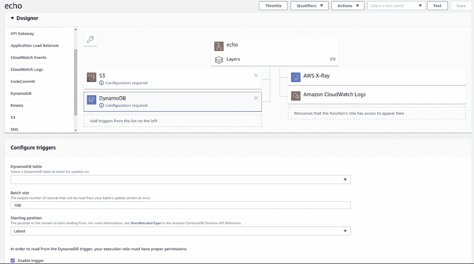
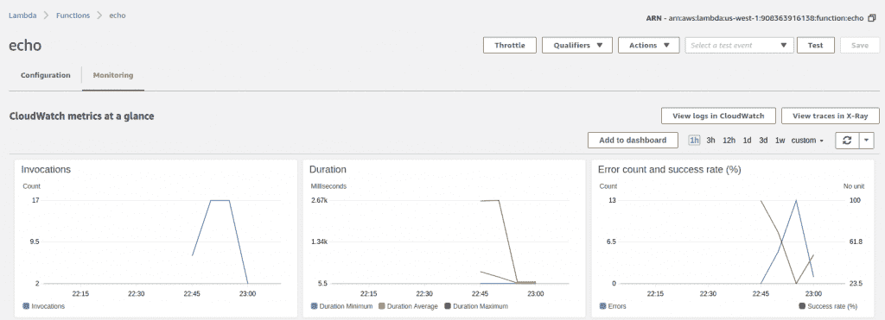
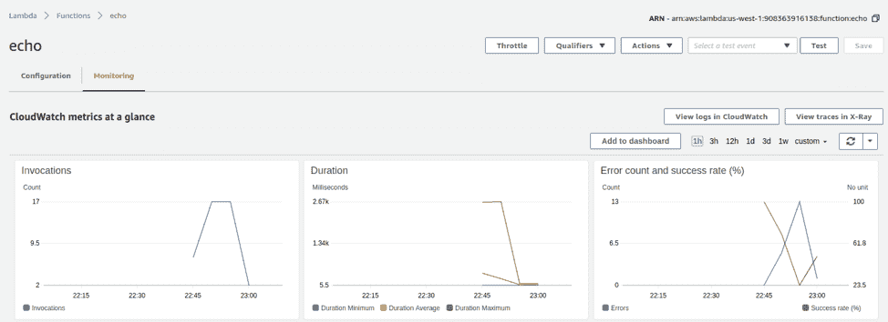
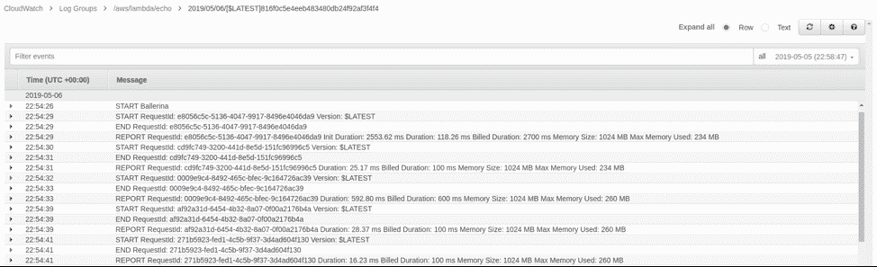

# 芭蕾舞演员 AWS Lambda 部署分步指南

> 原文：<https://thenewstack.io/a-step-by-step-guide-for-aws-lambda-deployments-with-ballerina/>

[WSO2](https://wso2.com/) 赞助本帖。

 [安亚娜·费尔南多

Anjana 是 WSO2 的一名主管，通过领导 WSO2 的几项产品计划，他进一步发展了自己在数据分析和企业集成方面的专业知识。他还帮助了许多客户实施他们的集成策略。他最近的冒险是他在芭蕾舞演员项目中的角色，在那里他广泛参与了语言及其运行时的设计和实现。](https://ballerina.io/) 

Ballerina 是一种编程语言，面向寻求在云原生应用的单一界面中创建和集成微服务应用的开发人员。除了确保在部署应用程序之前满足安全标准之外，开源语言还支持 API、事件流、分布式应用程序和其他功能。

在这篇文章中，我们展示了由 [WSO2](https://wso2.com/) 开发的[芭蕾舞演员](https://ballerina.io/)如何在 AWS Lambda 无服务器环境中部署功能。

什么时候应该使用无服务器？

无服务器计算被称赞为我们寻求去中心化架构的下一个发展。这基于按需计算的概念，在这种情况下，我们不会让计算资源总是等待可能的处理完成，因此必须为这些资源预先分配资源。但是过分依赖这种特定的架构模式好吗？。毕竟，如果你唯一拥有的东西是一把锤子，你会把一切都看成钉子。

因此，最重要的问题之一是，何时使用无服务器？尽管人们开始看到无服务器被用于一切，但这不一定是真的。无服务器用于特定场景。如果你有一个经常被请求击中的服务，这可能不是无服务器的好选择。使用无服务器的主要思想是，执行一些偶尔使用的逻辑，所以有时，我们可以卸载服务所需的资源，并且只在我们需要时，加载它并执行逻辑。当我们有基于事件的系统时，这种行为是理想的，在这种系统中，事件被触发，与这些事件相关联的逻辑被异步执行。异步特性在这里很重要，因此，无服务器逻辑卸载/加载行为不会成为障碍，因为没有人直接等待它执行完毕。如果我们有同步处理，比如服务调用中的请求/响应模式，就会出现这种情况。由于加载未加载的无服务器单元而导致的延迟被称为冷启动，这对于同步服务调用来说是不期望的行为，但对于基于事件的系统来说是完全可以接受的。

事件处理场景的一个示例是，如果您有一个由于数据库触发器而要执行的无服务器函数，其中数据库触发器的执行和函数的执行没有任何可察觉的时间保证，因此它可以在合理的时间内执行逻辑，即使它有冷启动。在我们的无服务器函数加载后，如果它定期收到请求，它将保持活动状态并快速响应，经过一段空闲时间后，它将被卸载并释放其资源。

## 在 AWS Lambda 中部署芭蕾舞演员功能

现在我们已经有了一些定义和用例，让我们看看如何用 Ballerina 和 AWS Lambda 快速编写一些无服务器函数。AWS Lambda 是领先的无服务器平台，它为用许多编程语言创作无服务器功能提供了丰富的支持，并提供了许多事件源来触发它们。

Ballerina 是一种云原生编程语言，它内置了对网络原语的支持以及对许多部署模型的语言集成，从而使编写分布式网络应用成为一种自然的体验。芭蕾舞演员专注于拥有正确的结构，以便只编写你的工作绝对需要的代码，例如你的程序逻辑。AWS Lambda 支持也遵循同样的理念，编写 AWS Lambda 函数就像编写典型的芭蕾舞演员函数一样简单。没有任何特殊的回调、特殊的错误处理操作等等，而是像在普通的函数调用中一样进行处理。

以下是芭蕾舞演员中一个简单的 AWS Lambda 函数的代码:

```
import ballerinax/awslambda;

@awslambda:Function
public function echo(awslambda:Context ctx,  json input)  returns json|error  {
    return input;
}

```

```
$  ballerina build demo.bal
Compiling source
    demo.bal
Generating executable
    demo.balx
  @awslambda:Function:  echo

```

芭蕾舞演员 AWS Lambda 图层信息可在此处找到。

运行以下命令部署每个 Ballerina AWS Lambda 功能:

```
aws lambda create-function  --function-name  --zip-file fileb://aws-ballerina-lambda-functions.zip --handler demo. --runtime provided --role  --timeout 10 --memory-size 1024
aws lambda update-function-configuration  --function-name  --layers

```

运行以下命令来重新部署更新的 Ballerina AWS Lambda 功能:

```
aws lambda update-function-code  --function-name  --zip-file fileb://aws-ballerina-lambda-functions.zip

```

芭蕾舞演员 AWS Lambda 图层信息可在此处找到。

运行以下命令来部署每个 Ballerina AWS Lambda 功能:

```
aws lambda update-function-code  --function-name  --zip-file fileb://aws-ballerina-lambda-functions.zip

```

运行以下命令来重新部署更新的 Ballerina AWS Lambda 功能:

```
aws lambda update-function-code   --function-name
  --zip-file
  fileb://aws-ballerina-lambda-
functions.zip

```

对于作为 AWS Lambda 函数公开的 Ballerina 函数，它需要具有类似于上述示例的函数签名。这由一个函数组成，该函数接受一个上下文对象和一个 JSON 值，并返回一个错误或 JSON 值。这种返回类型我们称之为联合类型，它可以表示多种类型的运行时值。创建函数后，您需要用“awslambda:Function”来注释函数，以便通知编译器生成 awslambda 相关的工件，它只是一个 zip 文件，其中嵌入了编译后的二进制文件，采用 AWS Lambda 运行时期望的格式。

构建代码时，编译器会打印出将代码部署到 AWS Lambda 需要遵循的步骤。这些只是需要用于部署的 AWS CLI 命令。第一个命令实际上用于在 AWS 中创建实际的 lambda 函数。

```
$  aws lambda create-function  --function-name echo  --zip-file fileb://aws-ballerina-lambda-functions.zip --handler demo.echo --runtime provided --role arn:aws:iam::908363916138:role/lambda-role --timeout 10 --memory-size 1024
{
    "FunctionName":  "echo",
    "FunctionArn":  "arn:aws:lambda:us-west-1:908363916138:function:echo",
    "Runtime":  "provided",
    "Role":  "arn:aws:iam::908363916138:role/lambda-role",
    "Handler":  "demo.echo",
    "CodeSize":  4456,
    "Description":  "",
    "Timeout":  10,
    "MemorySize":  1024,
    "LastModified":  "2019-05-06T21:08:06.504+0000",
    "CodeSha256":  "EFCAjtAkKYS5bsAOI+DXGZTL8ln8lBKjLFgzsf/wGvQ=",
    "Version":  "$LATEST",
    "TracingConfig":  {
        "Mode":  "PassThrough"
    },
    "RevisionId":  "9ee098ac-e007-4cc5-8277-5d0a167cc922"
}

```

在上面的命令中，您必须提供您自己的 AWS 用户角色 ARN。创建的用户角色应至少具有“AWSLambdaBasicExecutionRole”权限。

第二步是你必须把芭蕾舞演员运行层和 lambda 函数联系起来。这是特定芭蕾舞演员运行时间与功能相关联的点。如前面的构建输出中所述，可以通过在此导航来查找 ARN 图层。这里，您需要为正在使用的各个芭蕾舞演员版本选择 ARN 值。此外，这个值有一个 AWS 区域值的占位符，应该由您为要使用的相应区域填充。让我们来看一个这样的示例命令，用于芭蕾舞女演员 v0.991.0 和“美国-西方-1”地区:

```
$  aws lambda update-function-configuration  --function-name echo  --layers arn:aws:lambda:us-west-1:141896495686:layer:ballerina-0-991-0:2
{
    "FunctionName":  "echo",
    "FunctionArn":  "arn:aws:lambda:us-west-1:908363916138:function:echo",
    "Runtime":  "provided",
    "Role":  "arn:aws:iam::908363916138:role/lambda-role",
    "Handler":  "demo.echo",
    "CodeSize":  4456,
    "Description":  "",
    "Timeout":  10,
    "MemorySize":  1024,
    "LastModified":  "2019-05-06T21:08:38.102+0000",
    "CodeSha256":  "EFCAjtAkKYS5bsAOI+DXGZTL8ln8lBKjLFgzsf/wGvQ=",
    "Version":  "$LATEST",
    "TracingConfig":  {
        "Mode":  "PassThrough"
    },
    "RevisionId":  "b59220af-c245-42c2-b6c9-a8552d089307",
    "Layers":  [
        {
            "Arn":  "arn:aws:lambda:us-west-1:141896495686:layer:ballerina-0-991-0:2",
            "CodeSize":  68609786
        }
    ]
}

```

此时，该函数已正确初始化，并且可以作为 AWS 支持的任何事件源的触发器，如 S3、SNS 和 DynamoDB。



图 01:将 Lambda 函数配置为触发器。

图 1 显示了 AWS Lambda 控制台将 Lambda 函数配置为 DynamoDB 的触发器。

在我们的演示中，让我们直接从 AWS CLI 调用该函数来测试该函数。

```
$  aws lambda invoke  --function-name echo  --payload  '{"msg":"hello"}'  out.txt
{
 "StatusCode":  200,
 "ExecutedVersion":  "$LATEST"
}

$  cat out.txt
{"msg":"hello"}

```

我们看到了这个简单的函数是如何执行的，并返回我们作为输入传递给它的有效载荷。由于该函数是在 AWS Lambda 中初始化的，我们还可以通过简单地使用“ballerina build”重新构建 Ballerina 源代码，然后运行以下 AWS CLI 命令来快速重新部署该函数:

```
$  aws lambda update-function-code  --function-name uuid  --zip-file fileb://aws-ballerina-lambda-functions.zip

```

## 执行上下文

Ballerina AWS Lambda 函数的第一个参数“awslambda:Context”对象包含查询 Lambda 运行时的附加元信息的功能。比如函数调用的剩余时间等等。支持的所有操作的列表可以在这里查看。

## 错误处理和调试

错误处理只需从 Ballerina 函数返回一个*错误*值即可。由于 union 返回类型，用户可以返回一个有效的 JSON 值，也可以返回一个表示已经发生的错误情况的错误值。

让我们看看如何从我们的 Ballerina 函数返回一个错误。

```
import ballerinax/awslambda;
import ballerina/math;
import ballerina/io;

type  MyErrorData  record  {
 int id;
};

type MyError error&lt;string,  MyErrorData&gt;;

@awslambda:Function
public function echo(awslambda:Context ctx,  json input)  returns json|error  {
    if  (math:random()  &lt;  0.5)  {
        MyErrorData reason  =  {  id:  100  };
        MyError err  =  error("Random Error",  reason);
        return err;
    }
    return input;
}

```



图 2: demo.bal

下面是 demo.bal 的更新版本，随机返回一个错误。我们可以通过运行以下命令来重新部署代码:

```
$  ballerina build demo.bal

$  aws lambda update-function-code  --function-name echo  --zip-file fileb://aws-ballerina-lambda-functions.zip

```

现在，执行几次该功能:

```
$  aws lambda invoke  --function-name echo  --payload  '{"msg":"hello"}'  out.txt  &amp;&amp;  cat out.txt  
{
 "StatusCode":  200,
 "FunctionError":  "Unhandled",
 "ExecutedVersion":  "$LATEST"
}
{"errorReason":"Random Error",  "errorDetail":{"id":100}}

$  aws lambda invoke  --function-name echo  --payload  '{"msg":"hello"}'  out.txt  &amp;&amp;  cat out.txt  
{
 "StatusCode":  200,
 "ExecutedVersion":  "$LATEST"
}
{"msg":"hello"}

```

可以从 AWS Lambda 控制台查看错误日志和统计数据，还可以查看应用程序日志及其 CloudWatch 功能。



图 03:函数调用统计



图 04: CloudWatch 日志

## 结论

在本文中，我们了解了什么是无服务器，何时在您的架构中应用它，以及如何使用 AWS Lambda 和 Ballerina 编程语言快速轻松地创建无服务器解决方案。这是通过给予开发人员最大的控制权，以完成工作所需的最低编码开销来实现的，我们相信这已经通过 Ballerina 的编程基础及其可扩展性而成为可能。

通过 Pixabay 的特征图像。

<svg xmlns:xlink="http://www.w3.org/1999/xlink" viewBox="0 0 68 31" version="1.1"><title>Group</title> <desc>Created with Sketch.</desc></svg>