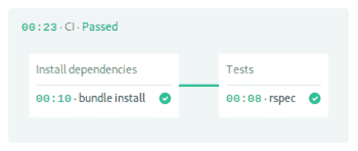
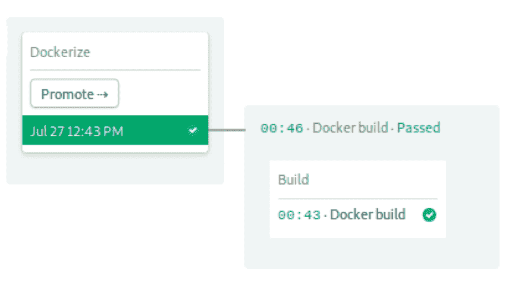
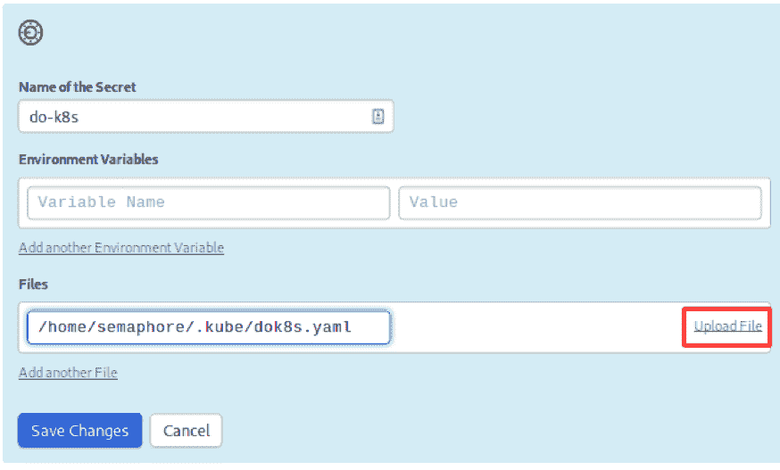
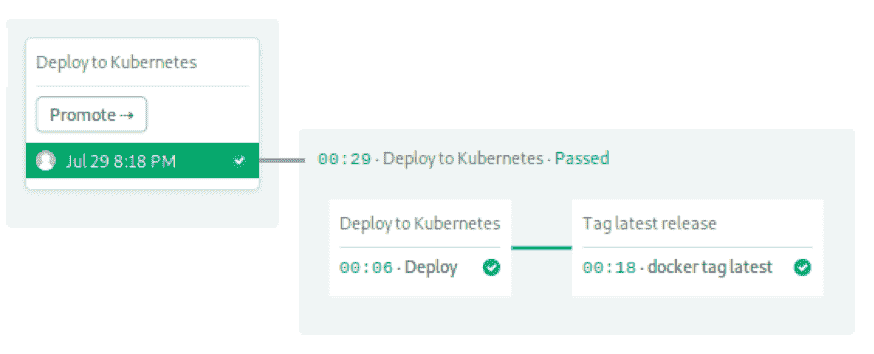
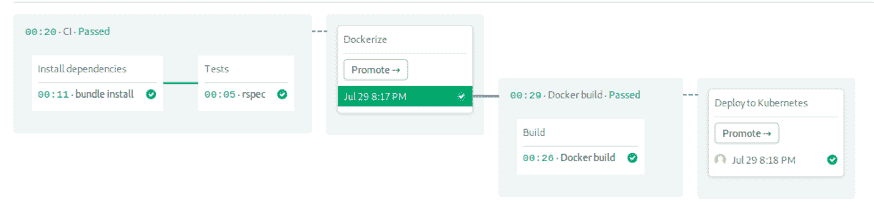
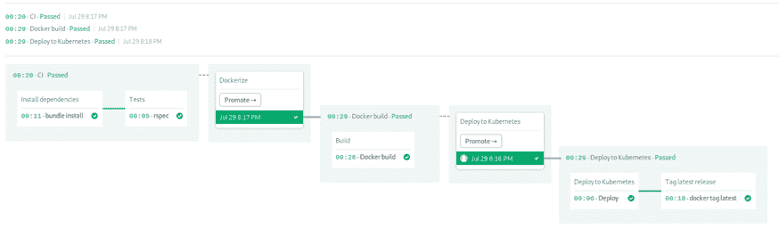

# Kubernetes 上持续部署的分步指南

> 原文：<https://thenewstack.io/a-step-by-step-guide-to-continuous-deployment-on-kubernetes/>

[](https://semaphoreci.com/)

 [托马斯·费尔南德斯

托马斯是 Semaphore 的独立开发者和作家。他在布宜诺斯艾利斯大学学习电子工程。在加入 Semaphore 之前，他做过 18 年的 web 开发人员、系统管理员和数据库管理员。当他不工作时，他喜欢阅读、游泳和航海。](https://semaphoreci.com/) [](https://semaphoreci.com/)

很久以前，在一份很远很远的工作中，我的任务是把我们老派的灯堆换成 Kubernetes。我当时的老板总是对新技术充满幻想，他宣布这种改变应该只需要几天时间——考虑到我们甚至还没有掌握容器是如何工作的，这是一个大胆的声明。

在阅读了官方文件并在谷歌上搜索后，我开始感到不知所措。有太多的新概念需要学习:有豆荚、容器和复制品。对我来说，Kubernetes 似乎是为一群老练的开发者保留的。

然后，我做了我在这种情况下经常做的事情:边做边学。通过一个简单的例子对理解复杂的主题大有帮助。所以，我独自完成了部署过程。

最终，我们做到了，尽管离规定的一周还差得很远——我们花了将近一个月的时间创建了三个集群，包括它们的开发、测试和生产)。当你考虑到我所在的升级团队由三个完全的 Kubernetes 新手组成时，这并不是那么糟糕。这很难，但很值得努力。

这篇文章是我当时想读的:一个关于如何在 Kubernetes 上部署一个应用程序的详细的一步一步的描述。到本文结束时，您将拥有一个有效的 Kubernetes 部署和连续交付工作流。

## 持续集成和交付

持续集成(CI)是在每次更新时构建和测试应用程序的实践。通过小增量工作，可以更早地发现错误并及时解决。

一旦集成完成并且通过了所有测试，我们就可以添加连续交付(CD)来自动化发布和部署过程。使用 CI/CD 的项目可以更频繁和更可靠地发布。

我们将使用[信号量](https://semaphoreci.com)，一个快速、强大且易于使用的持续集成和交付(CI/CD)平台来自动化整个过程:

1.  安装项目依赖项。
2.  运行单元测试。
3.  建立码头工人形象。
4.  将图像推送到 Docker Hub。
5.  提供一键 Kubernetes 部署。

对于应用程序，我们有一个 [Ruby Sinatra](http://sinatrarb.com/) 微服务，它公开了一些 HTTP 端点。该项目已经包含了部署所需的一切，但是还需要一些组装。

### 做好准备

在做任何事情之前，你需要注册一个 [GitHub](https://github.com) 和一个信号量账户。此外，为您的 Docker 图像创建一个 [Docker Hub](https://hub.docker.com) 登录。

接下来，您还应该在您的机器上安装一些工具:

*   [Git](https://git-scm.com) :处理代码。
*   [卷曲](https://curl.haxx.se):联网的瑞士军刀。
*   [kubectl](https://kubernetes.io/docs/tasks/tools/install-kubectl/) :远程控制你的集群。

当然，我们不要忘记 Kubernetes。大多数云提供商以这样或那样的形式提供这项服务，所以货比三家，看看什么适合你的需求。最低端的机器和集群大小足以运行我们的示例应用程序。我喜欢从三个节点的集群开始，但是您也可以只使用一个节点。

集群就绪后，从您的提供商处下载 [kubeconfig](https://kubernetes.io/docs/concepts/configuration/organize-cluster-access-kubeconfig/) 文件。有些让你直接从他们的网络控制台下载，而另一些需要一个助手程序。我们将需要此文件来连接到集群。

这样一来，我们就可以开始了。首先要做的是派生存储库。

### 派生存储库

分叉的演示应用程序，我们将在这篇文章中使用。

1.  进入[semaphore-demo-ruby-kubernetes](https://github.com/semaphoreci-demos/semaphore-demo-ruby-kubernetes)库，点击右上角的 **Fork** 按钮。
2.  点击**克隆或下载**按钮，复制地址。
3.  克隆存储库:`$ git clone https://github.com/your_repository_path…`

要用信号量连接您的新存储库:

1.  登录你的[信号量](https://semaphoreci.com)
2.  按照边栏中的链接创建一个新项目。
3.  单击存储库旁边的**添加存储库**按钮。

### 用信号量测试

[持续集成](https://semaphoreci.com/continuous-integration)再次让测试变得有趣而有效。一个经过深思熟虑的 CI 渠道会创建一个简短的反馈循环，在错误造成任何伤害之前及早发现它们。我们的项目带有一些现成的测试。

打开位于的初始[管道](https://semaphoreci.com/blog/cicd-pipeline)文件。semaphore/semaphore.yml 快速浏览一下。这个管道描述了 Semaphore 构建和测试应用程序必须遵循的所有步骤。它以一个名字和版本开始:

接下来是代理，它是驱动作业的虚拟机。我们有三种[类型](https://docs.semaphoreci.com/article/20-machine-types)可供选择:

```
agent:
  machine:
    type:  e1-standard-2
    os_image:  ubuntu1804

```

模块、任务和作业定义了流水线的每一步要做什么。在 Semaphore 上，块按顺序运行，而块内的作业并行运行。管道包含两个块——一个用于库安装，另一个用于运行测试。



第一块下载并安装 [Ruby gems](https://rubygems.org/) 。

```
-  name:  Install dependencies
  task:
    jobs:
      -  name:  bundle install
        commands:
          -  checkout
          -  cache restore gems-$SEMAPHORE_GIT_BRANCH-$(checksum Gemfile.lock),gems-$SEMAPHORE_GIT_BRANCH,gems-master
          -  bundle install  --deployment  --path  .bundle
          -  cache store gems-$SEMAPHORE_GIT_BRANCH-$(checksum Gemfile.lock)  .bundle

```

[Checkout](https://docs.semaphoreci.com/article/54-toolbox-reference#checkout) 从 GitHub 克隆代码。由于每个作业都在完全隔离的机器上运行，我们必须依靠[缓存](https://docs.semaphoreci.com/article/54-toolbox-reference#cache)在作业运行之间存储和检索文件。

```
blocks:
  -  name:  Install dependencies
    task:
      jobs:
        -  name:  bundle install
          commands:
            -  checkout
            -  cache restore gems-$SEMAPHORE_GIT_BRANCH-$(checksum Gemfile.lock),gems-$SEMAPHORE_GIT_BRANCH,gems-master
            -  bundle install  --deployment  --path  .bundle
            -  cache store gems-$SEMAPHORE_GIT_BRANCH-$(checksum Gemfile.lock)  .bundle

```

第二块用于测试。请注意，我们重复签出和缓存来将初始文件放入作业中。最后一个命令启动 RSpec 测试套件。

```
-  name:  Tests
  task:
    jobs:
      -  name:  rspec
        commands:
          -  checkout
          -  cache restore gems-$SEMAPHORE_GIT_BRANCH-$(checksum Gemfile.lock),gems-$SEMAPHORE_GIT_BRANCH,gems-master
          -  bundle install  --deployment  --path  .bundle
          -  bundle exec rspec

```

最后一部分声明提升。[提升](https://docs.semaphoreci.com/article/67-deploying-with-promotions)可以有条件地连接管道，创建复杂的工作流。一旦所有作业完成，我们使用 *auto_promote_on* 来启动下一个流水线。

```
promotions:
  -  name:  Dockerize
    pipeline_file:  docker-build.yml
    auto_promote_on:
      -  result:  passed

```

工作流程继续下一个管道。

### 构建 Docker 图像

我们可以在 Kubernetes 中运行任何东西——只要它已经打包在 Docker 映像中。在本节中，我们将学习如何构建它。

我们的 Docker 映像将包括 Ruby、应用程序代码及其所有库。看一看文档:

```
FROM ruby:2.5

RUN apt-get update  -qq  &amp;&amp;  apt-get install  -y  build-essential

ENV APP_HOME  /app
RUN mkdir  $APP_HOME
WORKDIR  $APP_HOME

ADD Gemfile*  $APP_HOME/
RUN bundle install  --without development test

ADD  .  $APP_HOME

EXPOSE  4567

CMD  ["bundle",  "exec",  "rackup",  "--host",  "0.0.0.0",  "-p",  "4567"]

```

docker 文件就像一个菜谱，包含构建容器映像所需的所有步骤和命令:

1.  从预先构建的 ruby 映像开始。
2.  用 apt-get 安装构建工具。
3.  复制 Gemfile，因为它有所有的依赖项。
4.  用捆绑包安装它们。
5.  复制 app 源代码。
6.  定义监听端口和启动命令。

我们将在信号量环境中烘焙我们的生产映像。但是，如果您希望在您的机器上进行快速测试，请键入:

```
$  docker build  .  -t  test-image

```

要在本地启动服务器，使用 docker run 并暴露内部端口 4567:

```
$  docker run  -p  4567:4567  test-image

```

您现在可以测试一个可用的 HTTP 端点:

```
$  curl  -w  "\n"  localhost:4567
hello world  :))

```

### 将 Docker Hub 帐户添加到信号量

信号量提供了一种安全的机制来存储敏感信息，如密码、令牌或密钥。为了将图像推送到 Docker Hub 注册表，使用您的用户名和密码创建一个[秘密](https://docs.semaphoreci.com/article/66-environment-variables-and-secrets):

1.  打开你的旗语。
2.  在左侧导航栏的**配置**下，点击**机密**。
3.  点击**创建新的秘密**
4.  这个秘密的名字应该是 dockerhub。如图所示输入您的登录信息，然后**保存**。

### 码头流水线建造

这个管道构建并把图像推送到 Docker Hub。它只有一个块和一个作业:


这一次，我们可以使用多一点的功率，因为 Docker 趋向于更加资源密集型。我们将选择四个 CPU、8GB 内存和 35GB 磁盘的中端机 E1-standard-4:

```
version:  v1.0
name:  Docker build
agent:
  machine:
    type:  e1-standard-4
    os_image:  ubuntu1804

```

构建模块从登录 Docker Hub 开始。用户名和密码是从我们刚刚创建的密码中导入的。登录后，Docker 可以直接访问注册表。

下一个命令是 docker pull，它尝试提取图像的最新图像。如果找到了图像，Docker 可能能够重用它的一些层，并加快构建速度。如果没有任何最新的图像，这很好。只是需要多一点时间来构建。

最后，我们推新形象。注意这里我们使用 SEMAPHORE_WORKFLOW_ID 变量来惟一地标记图像:

```
blocks:
  -  name:  Build
    task:
      secrets:
        -  name:  dockerhub
      jobs:
      -  name:  Docker build
        commands:
          -  echo  "${DOCKER_PASSWORD}"  |  docker login  -u  "${DOCKER_USERNAME}"  --password-stdin
          -  checkout
          -  docker pull  "${DOCKER_USERNAME}"/semaphore-demo-ruby-kubernetes:latest  ||  true
          -  docker build  --cache-from  "${DOCKER_USERNAME}"/semaphore-demo-ruby-kubernetes:latest  -t  "${DOCKER_USERNAME}"/semaphore-demo-ruby-kubernetes:$SEMAPHORE_WORKFLOW_ID  .
          -  docker images
          -  docker push  "${DOCKER_USERNAME}"/semaphore-demo-ruby-kubernetes:$SEMAPHORE_WORKFLOW_ID

```

图像准备好了，我们进入项目的交付阶段。我们将通过手动升级来扩展我们的信号量管道:

```
promotions:
  -  name:  Deploy to Kubernetes
    pipeline_file:  deploy-k8s.yml

```

要进行您的第一次自动化构建，进行推送:

```
$  touch test-build
$  git add test-build
$  git commit  -m  "initial run on Semaphore“
$  git push origin master

```

准备好映像后，我们可以进入部署阶段。

### 部署到 Kubernetes

自动部署是 Kubernetes 的强项。我们需要做的就是告诉集群我们最终想要的状态，然后它会处理剩下的事情。

然而，在进行部署之前，您必须将 kubeconfig 文件上传到 Semaphore。

### 将 Kubeconfig 添加到信号量

我们需要第二个秘密:集群的 kubeconfig。该文件授予对它的管理访问权限。因此，我们不希望将文件签入存储库。

创建一个名为 do-k8s 的秘密，并将 kubeconfig 文件上传到/home/semaphore/。kube/dok8s.yaml:



### 部署清单

尽管 Kubernetes 是一个容器编排平台，但我们并不直接管理容器。事实上，部署单位是*吊舱*。pod 就像一群快乐的朋友，他们总是一起去相同的地方。pod 中的容器保证在同一个节点上运行，并且具有相同的 IP。它们总是一致地启动和停止，因为它们运行在同一台机器上，所以它们可以共享它的资源。

pod 的问题是它们可以随时启动和停止，我们无法确定它们将被分配到什么 IP。为了路由来自用户的 HTTP 流量，我们还需要一个负载平衡服务；它将负责跟踪 pod 并转发传入的连接，因此从客户端的角度来看，始终只有一个公共 IP。

打开位于 deployment.yml 的文件。这是用于部署我们的应用程序的清单。它有两个由三个破折号分隔的资源。一、部署:

```
apiVersion:  apps/v1
kind:  Deployment
metadata:
  name:  semaphore-demo-ruby-kubernetes
spec:
  replicas:  1
  selector:
    matchLabels:
      app:  semaphore-demo-ruby-kubernetes
  template:
    metadata:
      labels:
        app:  semaphore-demo-ruby-kubernetes
    spec:
      containers:
        -  name:  semaphore-demo-ruby-kubernetes
          image:  $DOCKER_USERNAME/semaphore-demo-ruby-kubernetes:$SEMAPHORE_WORKFLOW_ID

```

这里有几个概念需要解开:

*   资源可以有一个名字和几个标签，方便整理东西。
*   规格定义了所需的最终状态，模板是用于创建 pod 的模型。
*   副本设置要创建多少个 pod 副本。我们通常将它设置为集群中的节点数。由于我使用三个节点，我将把这一行改为 replicas: 3。

第二个资源是服务。它绑定到端口 80，并将 HTTP 流量转发到部署中的 pod:

```
---

apiVersion:  v1
kind:  Service
metadata:
  name:  semaphore-demo-ruby-kubernetes-lb
spec:
  selector:
    app:  semaphore-demo-ruby-kubernetes
  type:  LoadBalancer
  ports:
    -  port:  80
      targetPort:  4567

```

Kubernetes 将选择器与标签匹配起来，将服务与 pod 连接起来。因此，我们可以在同一个集群中拥有许多服务和部署，并根据需要连接它们。

### 部署管道

我们正在进入 CI/CD 配置的最后阶段。此时，我们在 semaphore.yml 中定义了一个 CI 管道，在 docker-build.yml 中定义了 Docker 管道。

打开位于的部署管道。semaphore/deploy-k8s.yml .照常启动:

```
version:  v1.0
name:  Deploy to Kubernetes
agent:
  machine:
    type:  e1-standard-2
    os_image:  ubuntu1804

```

两项工作构成了最后一条流水线。

工单编号 1 开始调配。导入 kubeconfig 文件后，envsubst 用实际值替换 deployment.yml 中的占位符变量。然后，kubectl apply 将清单发送到集群。

```
blocks:
  -  name:  Deploy to Kubernetes
    task:
      secrets:
        -  name:  do-k8s
        -  name:  dockerhub

      env_vars:
        -  name:  KUBECONFIG
          value:  /home/semaphore/.kube/dok8s.yaml

      jobs:
      -  name:  Deploy
        commands:
          -  checkout
          -  kubectl get nodes
          -  kubectl get pods
          -  envsubst  &lt;  deployment.yml  |  tee deployment.yml
          -  kubectl apply  -f  deployment.yml

```

第二个任务将图像标记为最新，这样我们可以在下次运行时将其用作缓存。

```
-  name:  Tag latest release
  task:
    secrets:
      -  name:  dockerhub
    jobs:
    -  name:  docker tag latest
      commands:
        -  echo  "${DOCKER_PASSWORD}"  |  docker login  -u  "${DOCKER_USERNAME}"  --password-stdin
        -  docker pull  "${DOCKER_USERNAME}"/semaphore-demo-ruby-kubernetes:$SEMAPHORE_WORKFLOW_ID
        -  docker tag  "${DOCKER_USERNAME}"/semaphore-demo-ruby-kubernetes:$SEMAPHORE_WORKFLOW_ID  "${DOCKER_USERNAME}"/semaphore-demo-ruby-kubernetes:latest
        -  docker push  "${DOCKER_USERNAME}"/semaphore-demo-ruby-kubernetes:latest

```

这是工作流程的结尾。我们准备尝试一下。

### 部署应用程序

让我们教我们的 Sinatra 应用程序唱歌。在 app.rb 的 App 类中添加以下代码:

```
get  "/sing"  do
  "And now, the end is near
   And so I face the final curtain..."
end

```

将修改后的文件推送到 GitHub:

```
$  git add  .semaphore/*
$  git add deployment.yml
$  git add app.rb
$  git commit  -m  "test deployment”
$  git push origin master

```

等待 docker 构建管道完成；您可以在信号量上检查进度:



是时候部署了。点击**提升**按钮。成功了吗？



我们有了一个好的开始。现在轮到 Kubernetes 了。我们可以使用 kubectl 检查部署状态。初始状态是需要三个 pod，零个可用:

```
$  kubectl get deployments
NAME DESIRED CURRENT UP-TO-DATE AVAILABLE AGE
semaphore-demo-ruby-kubernetes 3 0 0            0 15m

```

几秒钟后，pod 已启动，协调完成:

```
$  kubectl get deployments
NAME DESIRED CURRENT UP-TO-DATE AVAILABLE AGE
semaphore-demo-ruby-kubernetes 3 3 3            3 15m

```

要获得集群的一般状态，请使用 get all。它显示了 pod、服务、部署和副本:

```
$  kubectl get all
NAME                                                  READY STATUS    RESTARTS AGE
pod/semaphore-demo-ruby-kubernetes-7d985f8b7c-454dh 1/1 Running 0          2m
pod/semaphore-demo-ruby-kubernetes-7d985f8b7c-4pdqp 1/1 Running 0          119s
pod/semaphore-demo-ruby-kubernetes-7d985f8b7c-9wsgk 1/1 Running 0          2m34s

NAME                                        TYPE CLUSTER-IP    EXTERNAL-IP    PORT(S)        AGE
service/kubernetes                          ClusterIP      10.12.0.1              443/TCP        24m
service/semaphore-demo-ruby-kubernetes-lb LoadBalancer 10.12.15.50 35.232.70.45 80:31354/TCP 17m

NAME DESIRED CURRENT UP-TO-DATE AVAILABLE AGE
deployment.apps/semaphore-demo-ruby-kubernetes 3 3 3            3 17m

NAME                                                        DESIRED CURRENT READY AGE
replicaset.apps/semaphore-demo-ruby-kubernetes-7d985f8b7c 3 3 3 2m36s

```

服务 IP 显示在 pod 之后。对我来说，负载平衡器被分配了外部 IP 35.232.70.45。请用您的提供商为您指定的号码替换它。让我们试试新的服务器。

你能为我们唱首歌吗？

```
$  curl  -w  "\n"  http://YOUR_EXTERNAL_IP/sing

```

现在，末日即将来临…所以我面临着最后的落幕…

## 末日即将来临

部署到 Kubernetes 并不一定困难或痛苦，如果有正确的 CI/CD 解决方案作为后盾，就不会那么困难或痛苦。你现在有了一个全自动的连续输送管道。

在您的 kubernetes 实例上随意使用[semaphore-demo-ruby-Kubernetes](https://github.com/semaphoreci-demos/semaphore-demo-ruby-kubernetes)。以下是一些想法:

*   创建临时集群。
*   构建一个开发容器并在其中运行测试。
*   用更多的微服务扩展项目。

<svg xmlns:xlink="http://www.w3.org/1999/xlink" viewBox="0 0 68 31" version="1.1"><title>Group</title> <desc>Created with Sketch.</desc></svg>