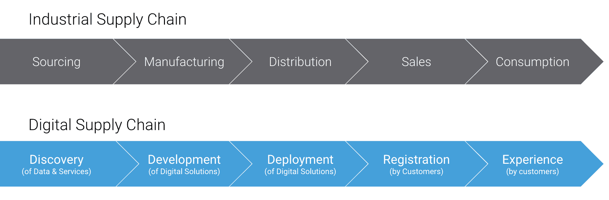
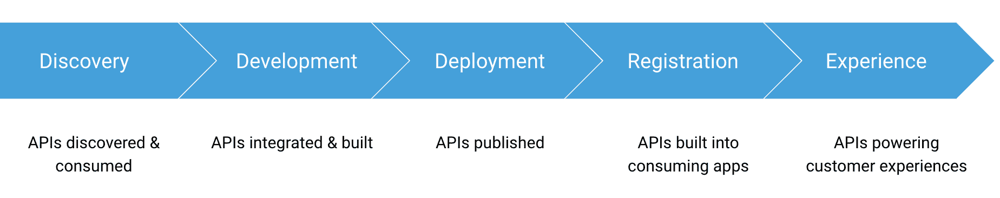

# 成功的 API 战略需要数字供应链和繁荣的生态系统

> 原文：<https://thenewstack.io/a-successful-api-strategy-needs-a-digital-supply-chain-and-a-thriving-ecosystem/>

 [马特·麦克拉蒂

马特·麦克拉蒂负责 Salesforce 公司 MuleSoft 的 API 战略。他与组织密切合作，设计和实施创新的企业级 API 和微服务解决方案。作为一名经验丰富的软件架构师，Matt 在软件供应商和客户的集成和实时事务处理领域有着广泛的工作经验。他是 O'Reilly 的微服务架构和保护微服务 API 的合著者。](https://twitter.com/mattmclartybc) 

软件继续[吃天下](https://www.wsj.com/articles/SB10001424053111903480904576512250915629460)。

2019 年第二季度，最有价值的五家全球公司都是以软件为中心的:微软、亚马逊、苹果、谷歌(Alphabet)和脸书。全球组织要想在一切即服务的时代生存下去，迫切需要数字化。根据最近的一项调查，97%的组织已经开始或正在启动数字化转型计划。但是，很多公司还在纠结如何入门。

数字巨头成功的要素之一是使用 web APIs。亚马逊转向以 API 为中心的架构为其 AWS 的推出铺平了道路，AWS 现在贡献了数十亿美元的年收入。API 为苹果应用商店中的应用提供支持，其中许多应用嵌入了第三方 API，如谷歌地图。脸书的“喜欢”和“分享”功能是其发展的基础，通过使用 API 与第三方网站和应用程序相链接。术语“API 经济”甚至作为一种指代 API 的商业影响的方式而流行起来。

正如亚马逊、谷歌和脸书已经证明的那样，API 是当今创新的重要基石。将他们的[API 作为可外部化的产品](/turning-apis-products-next-stage-business-growth/)来构建和处理的组织——这是 [43%的组织](https://www.mulesoft.com/lp/reports/connectivity-benchmark)说他们已经在做的——将会赢得胜利。但是“把 API 当产品”到底是什么意思呢？在深入研究 API 产品之前，首先从总体上更深入地了解数字产品是有帮助的。

## 数字产品和数字供应链

社交网络、视频游戏和智能手表都可以归类为数码产品。尽管它们有许多不同的形式，但正是它们的底层软件提供了它们与众不同的价值。因此，毫不奇怪，许多组织将他们的数字产品管理实践集中在相对成熟的软件工程领域——尤其是敏捷和精益思想流派。然而，在转向数字经济时，还有另一个以产品为中心的管理领域同样重要。

“产品”——生产出来的东西——是 20 世纪工业经济的核心。在这一时期的高潮，[供应链管理](https://www.economist.com/news/2009/04/06/supply-chain-management)作为生产实体商品的组织的一个关键学科出现，帮助他们最小化生产成本和延迟。典型的供应链由五个阶段组成，说明了产品的生命周期，从原材料到客户消费:

这种供应链的顺序性和终端性已经通知了许多成功的产品组织的开发和交付思想。当组织开始开发数字产品时，他们的生产方法也随之而来。这就是为什么软件项目的瀑布方法——漫长的、连续的需求收集、设计、构建、测试和实现阶段——在企业中扎根，并且至今仍在许多公司中根深蒂固。同样，我们可以设想一个“数字供应链”,它包含了数字产品交付的五个阶段。这些阶段中的每一个都对应着工业供应链中的一个阶段:

尽管数字和工业供应链有类似的阶段，但每个阶段都有根本的不同:

这些关键差异说明了为什么需要一种不同的方法来管理数字供应链，而不是它的工业前身。尽管实物产品的材料采购和分销通常需要昂贵且耗时的流程，但数字部分(数据、服务和代码)是可以即时访问的，并且数字分销是即时和可复制的。此外，尽管实体产品一经销售就不可改变，但数字产品即使到了消费者手中也是可塑的。最后，尽管物理制造中使用的部件受到它们必须包含在最终产品中这一事实的限制，但软件的分形性质意味着数字产品可以使用具有无限能力和复杂性的部件来组装。这些差异将数字经济中供应链管理的视角从内部转移到外部。

## 优化数字供应链

在工业经济中，供应链中最大的障碍通常是与产品公司直接控制之外的活动相关的时间和成本:从供应商那里获得原材料和零件，并通过分销商将产品推向市场。一些组织通过端到端的供应链所有权克服了这些障碍。例如，工业先驱福特建立了经销商网络，甚至建立了自己的[橡胶种植园](https://www.thehenryford.org/collections-and-research/digital-resources/popular-topics/brazilian-rubber-plantations/)来加快轮胎生产。鉴于获取数字零件和材料所需的时间和成本大幅降低，拥有整个供应链不再是一种制胜策略。

相反，创造数字产品的组织有一个新的机会，通过关注数字供应链的两个端点:发现和体验来区分自己。首先，他们可以优化从组织内部或外部发现和集成数字“部件”的能力。其次，他们可以优化数字产品的用户体验。

尽管数字生产始于数字部件的发现，但最成功的数字公司是从供应链的另一端推动产品设计的:通过客户体验。这种从供应方到用户需求的重心转移为企业的数字化转型提供了最大的机遇。[根据麦肯锡](https://www.mckinsey.com/business-functions/digital-mckinsey/our-insights/the-platform-play-how-to-operate-like-a-tech-company)的说法，成功的数字组织“需要通过设计思维和数字化/自动化完全专注于用户体验。”那么 API 如何以这种方式帮助组织优化他们的数字供应链呢？

## 使用 API 进行拆分和重新捆绑

尽管工业供应链是单向流动的，但数字供应链作为一组全方位的相互关联的业务功能发挥得最好。今天的数字企业有机会利用和营销自己的核心竞争力，同时比以往任何时候都更容易利用第三方的专业化。这些模块化功能可以以多种方式组合，提供新的客户体验、产品甚至平台。数字经济中的公司必须学会在更加多变的供应链中运营，而不是像福特多年前那样优化固定产品的静态供应链。为了获得数字经济的好处，公司将可重复使用的部件包装成产品，然后将这些相同的部件提供给第三方，以建立新的价值链。

但是在这些产品可以捆绑或对外提供之前，公司首先需要[拆分](https://hbr.org/2014/06/how-to-succeed-in-business-by-bundling-and-unbundling)他们的技术构建模块，使它们易于访问和重用。拆分业务功能的最佳方式是通过 API。

想象一下，如果优步或 Lyft 不得不建立自己的地理定位服务，以便让他们的创业公司起步。想象一下，如果 Instagram 或网飞不得不提供所有必要的基础设施来支持他们的快速增长。这些创业公司不可能在如此陡峭的斜坡上取得成功。然而，分别使用谷歌地图和 AWS 的 API，他们能够迅速进入市场，扰乱整个行业。加速数字供应链的发现阶段使他们能够专注于重塑形象和增强客户体验。与此同时，谷歌和亚马逊从这种额外的使用中获益。通过 API 提供业务能力的公司处于最有利的位置，不仅能在颠覆中生存，还能在数字经济的高度专业化环境中茁壮成长。

## 培养 API 生态系统

API 影响到数字供应链的每个阶段，如下图所示:

API 经济中最成功的公司是那些认识到支撑其 API 产品的生态系统的重要性的公司。数字供应链有助于确定这个生态系统中的关键要素:提供用于构建复合 API 产品的 API 的合作伙伴、集成和组装这些产品的内部团队、可以发现 API 产品的目录和市场、构建使用 API 产品的应用程序的开发人员，以及受益于通过 API 公开的业务功能的客户。

主动培养 API 生态系统是将 API 作为数字产品管理的一个重要部分。为了最大化 API 的商业价值，组织应该支持生态系统的所有方面。为了利用其他 API 提供商的核心能力，组织应该探索数字产品的第三方[合作机会](https://blogs.mulesoft.com/biz/api/api-economy-patterns/)。为了提高速度和敏捷性，他们可能需要重新定义软件交付的[原则和实践](https://blogs.mulesoft.com/biz/api/api-products-not-api-projects/)。推动 API 的采用需要关注开发人员的生产力和[开发人员社区的培养](https://blogs.mulesoft.com/biz/api/api-ecosystem-developers/)。为了充分利用数字产品带来的商业机会，组织必须重新想象客户体验和支持客户体验的 API。

已经有一些成熟的企业使用这种 API 生态系统方法在数字化方面取得了进展。为了应对顾客不断变化的偏好，麦当劳通过与优步的 API 连接的优步 Eats 合作，加快了他们进入食品配送领域的步伐。[联合利华](https://videos.mulesoft.com/watch/FtZKLAjZRein4cwJxcw15m)使用基于 API 的交付方法来提供跨品牌运营模式并加快项目交付。如今，新计划的部署速度比[快了 3-4 倍](https://www.mulesoft.com/case-studies/api/unilever)，从几个月缩短到几天。在交通行业， [Hertz](https://www.businessobserverfl.com/article/hertz-holds-fifth-annual-hackathon-for-college-students) 已经培养了一个新的开发者社区，他们来自佛罗里达州大量的中学后学生群体。在所有行业中，使用这种面向 API 生态系统的数字化转型方法的成功案例越来越多。

## 走吧

数字化转型涉及的不仅仅是改变技术。为了在数字时代蓬勃发展，老牌企业必须改变他们的经营方式，甚至他们的思维方式。了解从最初的工业供应链到今天的数字供应链的转变，可以帮助组织通过数字产品优化其核心业务能力的交付。API 是这一制胜策略的基础。通过将 API 作为数字产品进行生产和管理，并为这些 API 维持一个生态系统，企业可以以一种动态满足不断发展的数字经济需求的方式对其业务能力进行拆分和重组。

*感谢 Stephen Fishman 对本文的贡献。*

通过 Pixabay 的特征图像。

<svg xmlns:xlink="http://www.w3.org/1999/xlink" viewBox="0 0 68 31" version="1.1"><title>Group</title> <desc>Created with Sketch.</desc></svg>