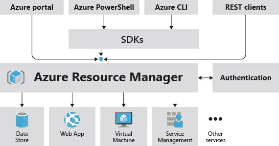
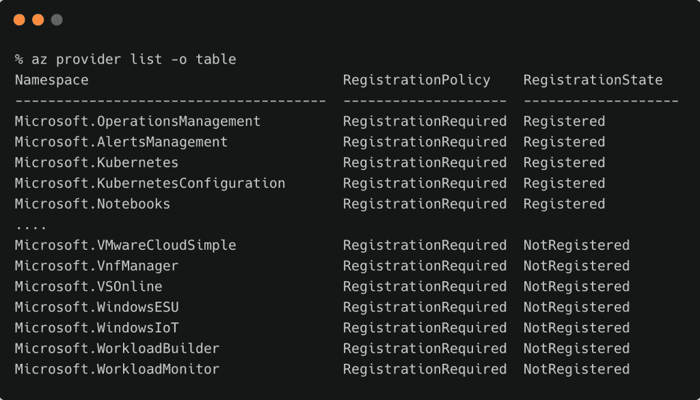
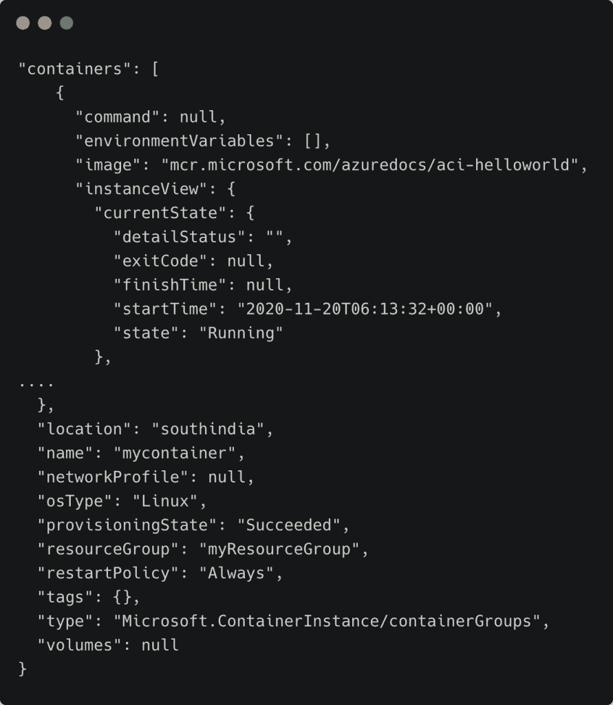
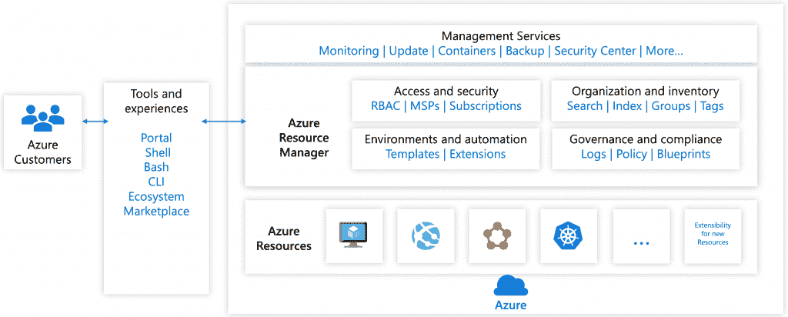
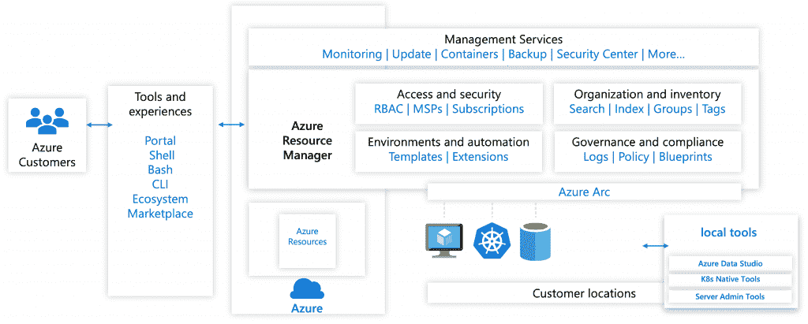
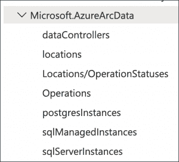

# 微软 Azure Arc 技术介绍

> 原文：<https://thenewstack.io/a-technical-introduction-to-microsoft-azure-arc/>

这篇文章是本周探索微软 Arc 系列文章的第一篇，也是如何将它作为一个控制平面来管理服务。请从每天到周四查看后续部分: (

[Part 2](https://thenewstack.io/tutorial-register-and-manage-linux-servers-with-azure-arc/)

), (

[Part 3](https://thenewstack.io/tutorial-register-and-configure-kubernetes-clusters-with-azure-arc/)

).

在过去十年中，公共云已经发展成熟，成为现代基础架构的基础。Amazon Web Services、微软和谷歌等超大规模提供商已经构建了强大的控制平面和流程编排引擎，来处理虚拟机、容器、功能数据库、大数据集群、物联网和边缘设备等托管服务的生命周期。

超大规模提供的一项关键服务是可扩展的可观察性堆栈，它可以分析基础架构指标、应用程序日志、事件和跟踪。当控制平面编排托管服务时，可观察性平台提供对整个堆栈的深入了解。

公共云提供商，包括 Amazon、Google 和 Microsoft，现在正在将控制平面和可观察性堆栈扩展到在各自云之外提供和运行的资源。这一趋势支持管理虚拟机、Kubernetes 集群、数据库、在内部数据中心运行的数据仓库，甚至不同的公共云环境。

Google 的 Anthos 和 Azure Arc 是运行公共云的控制平面的例子，它们协调和管理部署在不同环境中的资源。这项投资正成为实现混合云和多云技术承诺的关键。例如，部署在谷歌计算引擎(GCE)中的 Linux VM 由 Azure 管理。来自虚拟机的日志和指标被接收到 Azure 监控和日志分析中。类似地，BigQuery 的多云版本 BigQuery Omni 可以部署在 AWS 中。Anthos 可以控制 Azure Kubernetes 集群(AK)并向其部署工作负载。随着控制平面和可观测性产品的扩展，所有这些都是可能的。

## Azure 资源管理器——可扩展的控制平面

微软公共云 Windows Azure 的最初化身是平台即服务(PaaS ),仅限于少数几个用例。当微软将其公共云从 Windows Azure 转变为 Azure 以提供 IaaS 并使 Linux 成为一等公民时，它需要一个新的控制平面。

Azure Resource Manager (ARM)是作为一个可扩展的控制平面和编排引擎从头开始构建的，不仅适用于 IaaS，还适用于其他托管服务。最终，ARM 成为微软云战略的前沿和中心。ARM 的可扩展性使得将 Red Hat OpenShift 和 Databricks 等第三方服务引入 Azure 并像管理原生服务一样管理它们成为可能。

ARM 带来了一种定义明确、清晰的方法来定义、提供和管理 Azure 服务的生命周期。Microsoft 为每个托管服务创建和管理资源提供程序。

Azure 的构建块，如计算、存储和网络，充当资源提供者。当我们使用 Azure Portal 或 CLI 时，我们实际上是从一个可用的资源提供者创建一个资源实例。ARM 模板为配置资源提供了一种声明性机制。不管资源是如何声明的，它们都是由 Azure 资源管理器提供和管理的。

如果你有一个有效的 Azure 订阅，命令 `az provider`会列出所有可用的提供者。

每当发布 Azure 托管服务时，微软都会添加一个与之关联的新资源提供者。例如，当你提供 Azure 容器实例(ACI)资源时，你依赖于**微软。ContainerInstance** 资源提供者。

从创建新 ACI 实例的`az` CLI 的输出中，注意资源的类型是 **Microsoft。container instance/container groups**，这是一个有效的 ARM 资源类型。

Azure 中的资源组充当相关资源的逻辑分组。例如，一个资源组可能包含一个虚拟机、连接到该虚拟机的磁盘、IP 地址、网卡、防火墙规则以及与该虚拟机相关联的其他资源。资源组充当共享相同上下文的一组资源的安全边界。

ARM 的概念使微软能够无缝地将控制平面扩展到基于 Azure Stack 家族的私有云。即使在处理基于 Azure Stack Hub 或 Azure Stack HCI 的私有云中运行的资源时，客户也使用熟悉的工具。

ARM、资源组和 ARM 模板的设计为客户提供了终极的自动化和可管理性。毫无疑问，ARM 是微软云战略的差异化因素之一。

### azure Arc——混合云和多云场景的延伸臂

在 Ignite 2019 上发布的 Azure Arc 是一个控制平面，可以管理虚拟机、Kubernetes 集群和高可用的数据库服务器。

Azure Arc 建立在 Azure 资源管理器可扩展性特性的基础上。它使客户能够注册运行在 Azure 之外的 Linux/Windows 服务器和 Kubernetes 集群。Arc 还使得在满足要求的 Kubernetes 集群中运行 SQL 和 PostgreSQL 数据库实例成为可能。

Azure Arc 是 ARM 的扩展，支持额外的资源，如服务器、Kubernetes 集群和数据库。

外部资源，包括服务器、集群和数据库，由 ARM 的新资源提供商管理。Linux/Windows 服务器由**微软管理。HybridCompute** 资源提供商。**微软的提供商。Kubernetes** 和**微软。KubernetesConfiguration** ，负责管理 Kubernetes 集群及其配置。**微软。azureacdata**提供程序管理 SQL 和 PostgreSQL 数据库的 Arc 数据控制器。

Arc 有三个具体的重点领域:

### 面向服务器的 Azure Arc

Azure Arc 支持的服务器允许客户管理 Azure 外部、企业网络或其他云提供商托管的 Windows 和 Linux 机器，类似于他们管理原生 Azure 虚拟机的方式。

当外部服务器连接到 Azure 时，它就成为一台连接的机器，并被视为 Azure 中的资源。每台连接的机器都有一个资源 ID，它包含在资源组中。它受益于标准的 Azure 构造，如 Azure 策略和应用标签。

向 Azure Arc 注册机器的过程会导致运行一个代理来维护与 Arc 控制平面的连接。代理每五分钟向服务发送一次常规心跳消息。

在本系列接下来的部分，我将带您完成向 Azure Arc 注册服务器的步骤。

### 天蓝色弧形启用 Kubernetes

客户可以使用支持 Azure Arc 的 Kubernetes 在 Azure 内部或外部附加和配置 Kubernetes 集群。当 Kubernetes 集群连接到 Azure Arc 时，它将出现在 Azure 门户中。它将有一个 Azure 资源管理器 ID 和一个托管身份。集群附加到标准 Azure 订阅，位于资源组中，可以像任何其他 Azure 资源一样接收标签。

向 Azure Arc 注册的 Kubernetes 集群可以通过集群配置代理加入 GitOps。基于开源 flux 连续部署工具，Arc 使得大规模部署管理变得容易。

Azure Arc 支持的 Kubernetes 服务可与任何符合云本地计算基金会(CNCF)的发行版配合使用。微软已经用一些流行的 Kubernetes 发行版测试了 Arc，包括 RedHat OpenShift 4.3、Rancher RKE 1.0.8、Canonical Charmed Kubernetes 1.18 和运行在 Azure Stack Hub 上的 AKS Engine。

本系列的第三部分将详细介绍如何注册 Kubernetes 集群和配置 GitOps。

### Azure Arc 支持的数据服务

Azure Arc enabled 数据服务组件将 SQL 托管实例和 PostgreSQL 超大规模等托管数据服务引入基于 Kubernetes 集群的混合和多云环境。

由于它们是托管服务，因此会定期从 Microsoft 接收更新、补丁和新功能。这样，内部数据库可以保持最新，同时确保客户保持控制。由于 Azure Arc 支持的数据服务是一种订阅服务，客户将不再面临支持终止的情况。

值得注意的是，运行 Azure 数据服务的 Kubernetes 集群不需要向 Arc 控制平面注册。数据服务可以部署在任何满足要求的 Kubernetes 集群上。

本系列的最后一部分将详细介绍 Azure Arc 支持的数据服务。

在下一部分的[中，我将带您完成向 Azure Arc 注册运行在其他云环境中的 Linux 虚拟机的步骤。敬请期待！](https://thenewstack.io/tutorial-register-and-manage-linux-servers-with-azure-arc/)

*贾纳基拉姆·MSV 的网络研讨会系列“机器智能和现代基础设施(MI2)”提供了涵盖前沿技术的信息丰富、见解深刻的会议。在 [http://mi2.live](http://mi2.live) 注册即将到来的 MI2 网络研讨会。*

<svg xmlns:xlink="http://www.w3.org/1999/xlink" viewBox="0 0 68 31" version="1.1"><title>Group</title> <desc>Created with Sketch.</desc></svg>