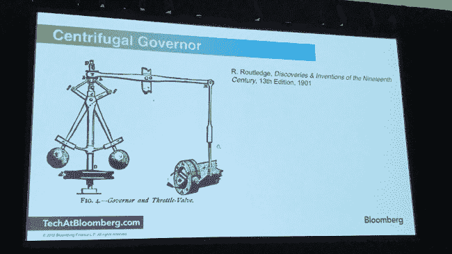
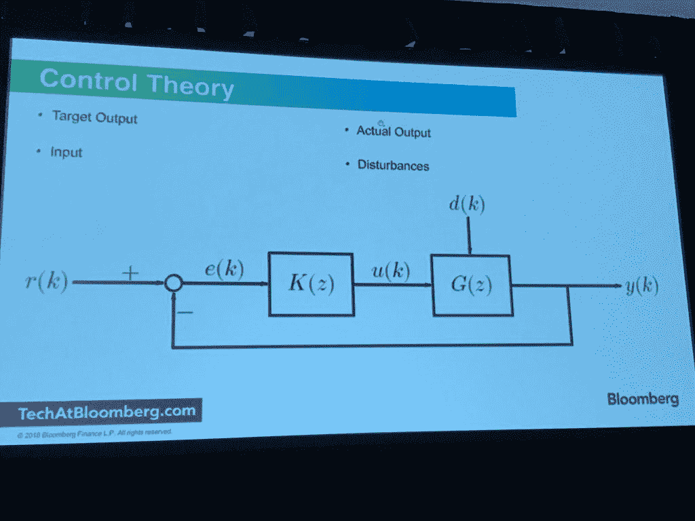

# 来自机械工程的一个提示:使用控制理论改进自动缩放系统

> 原文：<https://thenewstack.io/a-tip-from-mechanical-engineering-use-control-theory-to-better-auto-scale-systems/>

想要更高效地自动扩展和缩减您的 IT 系统吗？仔细看看控制理论的传统实践，建议 [Allan Espinosa](http://espinosa.io/) ，彭博的 DevOps 工程师和《 [Docker High Performance](https://www.packtpub.com/networking-and-servers/docker-high-performance) 》的作者，上周[在波斯顿云铸造峰会的一个会议](https://github.com/aespinosa/control-theory)上发言。

尽管控制理论已经在机械工程中广泛应用了几个世纪，但它还没有被广泛应用于自动调整分布式 IT 系统的性能。考虑到从 Kubernetes 到无服务器的可伸缩服务在很大程度上依赖于尽可能准确地根据可用资源快速调整工作负载需求的能力，这是令人惊讶的。

那些可能想钻研机器学习的晦涩艺术以寻求改进的工程师们可能会很高兴地发现控制理论是多么容易使用。Espinosa 指出，这些算法可以应用于任何可以自动伸缩的功能，不仅可以用于负载平衡，还可以用于判断自动超时的理想时间，或者估计应该分配给每个工作连接的内存量。

## 控制狂

简而言之，借用 Wolfram Alpha 的定义，控制理论是“关于如何操纵影响系统行为的参数以产生期望或最佳结果的数学研究”。“控制理论允许我们拥有一个自我调节系统的架构，它根据反馈进行操作，”埃斯皮诺萨说。

埃斯皮诺萨展示了控制理论应用的一个早期例子:詹姆斯·瓦特在 1788 年发明的离心调速器，它调节蒸汽机的速度。随着发动机产生更多的动力，一组旋转的球体将通过其引力的变化来捕捉这种力的变化，这反过来又被用于调整发动机的油门控制:

“有了线性模型，你就可以模拟输入和输出之间的关系，”他说。IT 系统并不完全是线性的——系统行为中总会有一些噪声或随机变化。但是线性模型对于描述系统的状态有很大的帮助。

在这次会议上，Espinosa 展示了如何使用他的控制理论方程来提高 Cloud Foundry 的原生自动缩放组件 [Scale](https://cli.cloudfoundry.org/en-US/cf/scale.html) 的性能。Espinosa 的算法模拟 CPU 活动变化的快慢，并根据最近的性能进行平衡。

该算法计算 CPU 工作负载的变化速度，无论是通过工作负载的增加还是减少。正如所料，如果工作负载超过某个阈值，可以添加更多的 CPU。如果工作负载下降，那么 CPU 就会离线。对于控制理论模型，可以考虑的其他因素包括系统在任何给定点离目标有多远(“精度”)，以及达到理想水平所花费的时间(“恢复时间”)。

Espinosa [用运行在 Cloud Foundry 上的 Node.js 应用程序和运行在 Kubernetes 上的模拟负载生成器演示了这个原理。当他将流量增加四倍时，Cloud Foundry 控制器会通过添加更多 CPU 来做出响应。该响应比通常伴随传统自动缩放算法的资源的急剧振荡要平滑得多。](https://cli.cloudfoundry.org/en-US/cf/scale.html)

一家公司正在调查控制理论在云原生系统中的应用，该公司一直是关键人物。公司研究人员目前正在研究如何将控制理论的元素添加到公司的反馈控制器中，用于其 [Riff](https://tanzu.vmware.com/) 无服务器“功能即服务”(FaaS)软件。像许多实现一样，当前的自动调整方法在本质上更加特别。

演讲结束后，Pivotal 高级软件工程师 [Jacques Chester](https://github.com/jchesterpivotal) 指出，从冷启动开始自动缩放 FaaS 可能有点难以编码，因为您希望第一个实例零延迟，尽管您希望后续实例有更传统的控制措施。Riff 本身是围绕流作为主要用例而构建的，因此传统的指标(如 CPU 使用率)实际上没有什么帮助。切斯特解释说，相反，Riff 依赖于观察消费者和生产者的活动和补偿。

[Cloud Foundry](https://www.cloudfoundry.org/) 和 [Pivotal](https://tanzu.vmware.com/) 是新堆栈的赞助商。

<svg xmlns:xlink="http://www.w3.org/1999/xlink" viewBox="0 0 68 31" version="1.1"><title>Group</title> <desc>Created with Sketch.</desc></svg>