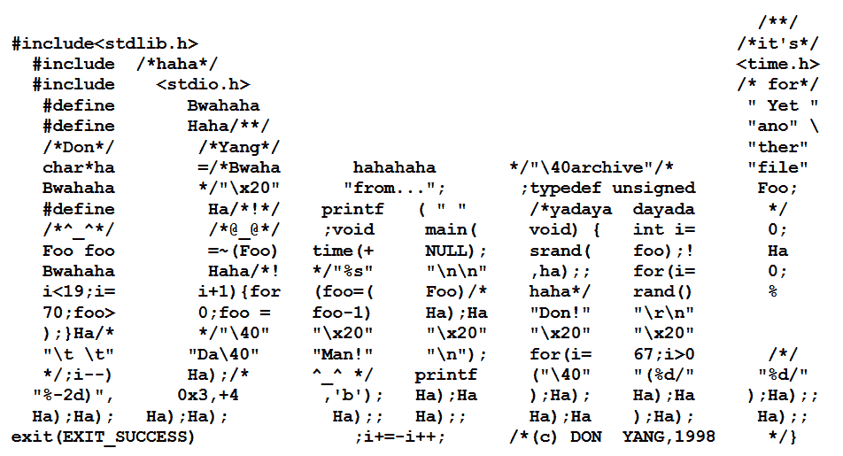
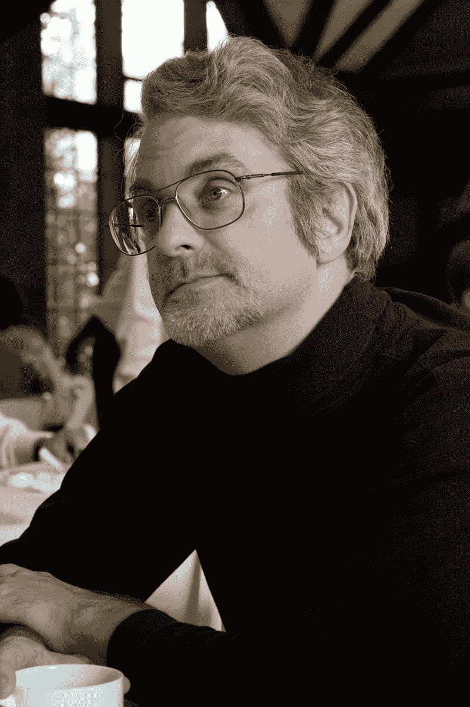

# 一个传统在延续:国际混淆 C 代码竞赛

> 原文：<https://thenewstack.io/a-tradition-continues-the-international-obfuscated-c-code-contest/>

唐·杨混乱的 C 代码拼出了他自己的名字

极客文化很少有持续了 34 年的。但是早在 1984 年，两个过度工作的程序员建立了一个长期的传统，这个传统似乎是从他们共同的痛苦中有机涌现出来的。它逐渐滚雪球般变成一个社区，一个传奇，一个偶然的教育努力，总是既不可预测又非常有趣。

因此，我们在 2018 年享受了另一个版本的国际混淆 C 代码竞赛。

愚人节那天，评委们公布了今年 13 位获奖者的名字。现在，互联网屏息等待他们的混淆代码杰作的揭幕。

但是在竞赛的网站上，你总是可以细读上一次竞赛的代码(2015 年举行，但获胜的源代码在 6 个月后公布)——事实上，*前几年竞赛中每一个获奖的模糊 C 代码。所以总有很多东西可以看。*

虽然你可能会很难理解它…

## 巨大的困惑

竞赛的目标包括“以讽刺的方式展示编程风格的重要性”它的其他目标？为了展示这种语言的微妙之处，为了编写混乱的代码，为了给不可靠的 C 编译器施加压力，为了“为糟糕的 C 代码提供一个安全的论坛”

虽然这些条目可能很难理解，但它们并不总是很难读懂。一个 1990 年的参赛作品获得了“最佳布局”奖，它将一些 C 语法如`char*`和`for`拼接成一个名为`(char*)(lie=`的潜在追求者和他的爱慕对象`(*((char*)&lotte)^=`之间的模拟通信。该代码在执行时会打印出由您的命令行参数选择的对话摘录。

今年的获奖者中有“代码艺术家”唐·杨，他只用源代码就画出了令人难以置信的 ASCII 艺术图像。

早在 1994 年，麻省理工学院的学生 Szymon Rusinkiewicz 甚至提交了一个传奇程序，赢得了那一年备受瞩目的“最严重的规则滥用”奖。二十多年后，法官们仍然在他们的官方问答中向人们推荐它。他们警告那些试图提交一个令人印象深刻的小程序，其输出是程序自己的源代码的人，“不要在没有看到它的情况下声称你的程序是最小的程序。”Rusinkiewicz 只是提交了一个空白文件——C 编译器仍然会处理它——当然生成了“一个什么都不做的程序”最棒的是，这个程序的*输出*…因此具有重新创建所有原始源代码的特点。

几十年来，这种令人费解的竞赛积累了更多的知识和传说，据报道，早在 1993 年，它甚至出现在比尔·盖茨主持的一次电脑问答比赛中。时任微软首席执行官的他问道:

“自 1984 年以来，新闻组一直在举办一场竞赛，评选最不可读、最有创意、最古怪但最有效的 C 程序。这个大赛叫什么？”

“Windows！”有人回应。

但更令人惊讶的是，有人将这一集*融入了他们同年参加的国际模糊 C 语言竞赛。克里斯·米尔斯(Chris Mills)在“提示”文件中引用了一份关于该事件的报纸报道，然后贡献了一个“让你的 windows 和他们的 windows 一样有用”的程序*

## 制作文件

那么这一切疯狂是如何开始的呢？回到 1984 年，根据竞赛的官方常见问题，国家半导体公司的两名员工都试图修复“一些非常糟糕的代码”，碰巧同时走进大厅。两位程序员——24 岁的 Landon Curt Noll 和一个名叫 Larry Bassel 的人——有了灵感，你仍然可以在一个关于 C 编程语言的讨论组中阅读[《新闻组邮报》开创了这一切](https://groups.google.com/groups?q=Obfuscated&hl=en&lr=&ie=UTF-8&as_drrb=b&as_mind=1&as_minm=1&as_miny=1983&as_maxd=18&as_maxm=4&as_maxy=1984&selm=789%40nsc.UUCP&rnum=3&filter=0)。

*“我敢肯定，你们以前都见过恶心的，或者结构上下流的 C 源代码。一些与 UN*X 源代码的各个部分打交道的人想知道，是否有些人非常努力地编写出如此糟糕的代码。现在你有机会通过发送你自己的混淆的 C 程序来与周围最坏的 C 黑客竞争…*

"参赛作品将被判定为:违反结构化编程，不清晰，和使用“由 K&R 书”c . "

第一条规则规定源文件不能超过 512 字节，由于帖子承诺这是“第一届年度”比赛，两位程序员感到有义务在 1985 年举行第二次比赛。剩下的就是历史了。

诺尔回忆道:“当我们开始收到来自美国以外的信息时，拉里和我决定在名字中加入国际。”现在 IOCCC 官方网站解释说，直到今天，“这项传统仍然是互联网上持续时间最长的比赛。”

竞赛的第一名获胜者之一是拉里·沃尔，他在 1986 年和 1987 年连续获胜后，编写了自己的编程语言 Perl。(他获得的奖项是“最迷惑的圆”和“最有用的迷惑”。)

早在 2002 年，这场比赛也激发了一名程序员创造出了令人困惑的微型 C 编译器。16 年后，他重返竞争，赢得了今年的“最具通胀性”奖。

34 年后，现年 57 岁的诺尔仍然是比赛的评委之一。

## 今天的代码

2007 年，在硅谷计算机历史博物馆举行的老式计算机节上宣布了竞赛的获胜者。但是今年的获胜者显然是在 Reddit 和 Twitter 上收到通知的。

Reddit 上有人想知道是否有人提交过恶意软件——这提醒了人们，这是一场不为人知的 C 竞赛。

对于混淆的 C 竞赛，参赛作品的数量从来没有透露过——“按照传统，”FAQ 解释道。但是今年有 13 个不同的获胜者。这场比赛是真正的国际性比赛，获胜者来自七个不同的国家。有趣的是，今年有两个人获得了两个奖项——日本的远藤佑介和美国的戴夫·伯顿(这似乎是远藤第四年获奖了——事实上，在这几年中，他每年都至少获得两个奖项，包括 2013 年的“最能发微博的单句俏皮话奖”)

其他五名美国人也获得了奖项，还有来自澳大利亚、中国、波兰、瑞典、芬兰和法国的获奖作品。

“最不稳定”奖授予了一位名叫…“匿名作者”的澳大利亚人(谁不想自己的真名与获奖的不稳定联系在一起呢？)但重要的是要记住，每年评委们都是在审查提交的作品后才给出类别。

今年颁发的其他奖项包括“最佳黄鼠狼用语”和“最狡猾”…

但是潜伏在竞赛背后的是现实世界中糟糕代码的幽灵。比赛的官方概述(写于 1999 年)特别提到了《谍影重重》源代码中的`finger`命令代码是比赛的部分灵感来源。“如果这是一些人声称的合理编程实践的结果，那么如果人们真的试图编写糟糕的代码，质量会下降到什么程度？”

但这似乎也表明，这场竞赛最终可能是在为公众服务。诺尔写道:“通过比赛，我试图向人们灌输两件事。“首先是对糟糕的编码风格的厌恶。第二个概念是，当一个程序以非结构化的方式编写时，会损失多少效用。”为了证明这一点，他引用了讽刺的定义。

"为了揭露和揭露罪恶或愚蠢而进行的敏锐或积极的思想活动."

他以一个有益的提醒结束了他的讲话。

“真正的程序员不会编写混淆程序，除非他们提交的是竞赛参赛作品！:-)"

## 拉开窗帘

在这场竞赛的背后，显然有许多脑力劳动者。除了诺尔本人，今年的评委还包括西蒙·库珀(Simon Cooper)，他是奥莱利出版公司(O'Reilly publishing)技术书籍的合著者，这是一项罕见的殊荣。(*建立互联网防火墙:互联网和网络安全*)和俄罗斯程序员 Leonid A. Broukhis 保持了比赛的国际风味——并且也是以前比赛的两个获胜者。1993 年，他以一个奇怪的锯齿状程序赢得了“最佳游戏”奖，这个程序玩的是猜颜色游戏“智多星”。他还在 1995 年获得了“混淆最佳应用”奖，因为他的一个程序似乎可以用化学图创建一个屏幕保护程序。

评委是竞赛真正的无名英雄，因为 FAQ 解释说，浏览所有参赛作品需要“相当多的时间”——以及与竞赛相关的一切。“这需要几个周末和几个晚上的学习和工作……这很难，因为我们还忙于许多其他活动。”

例如，在 19 岁时，诺尔[发现了一个新的梅森素数](https://en.wikipedia.org/wiki/Mersenne_prime)。

诺尔似乎也是一个秘密教育家。他的个人网页重新发布了他发给某人的鼓励回复，询问如何成为一名专业的 C 程序员。经过一些实用的技巧——为其他人编写程序，在线发布你的代码并支持它——他补充道,“编写一个有效的程序还是比较容易的。编写可以维护和支持的代码需要实践和努力。赢得 IOCCC 的程序不是好程序。虽然它们可以工作，而且有些工作得非常好，但是它们不能被维护或改进…

"通常，即使是它们的原作者也不能对它们进行维护或改进."

在文章的更深处，诺尔添加了一个近乎伤感的注解。“总是，总是，总是编写代码，就好像它可以持续 30 年…

"你的一些代码可以存在那么长时间."

* * *

# WebReduce

特征图像由 Quince Creative 通过 Pixabay 提供的 [3D 图形图像提供。](https://quincemedia.com/)

<svg xmlns:xlink="http://www.w3.org/1999/xlink" viewBox="0 0 68 31" version="1.1"><title>Group</title> <desc>Created with Sketch.</desc></svg>