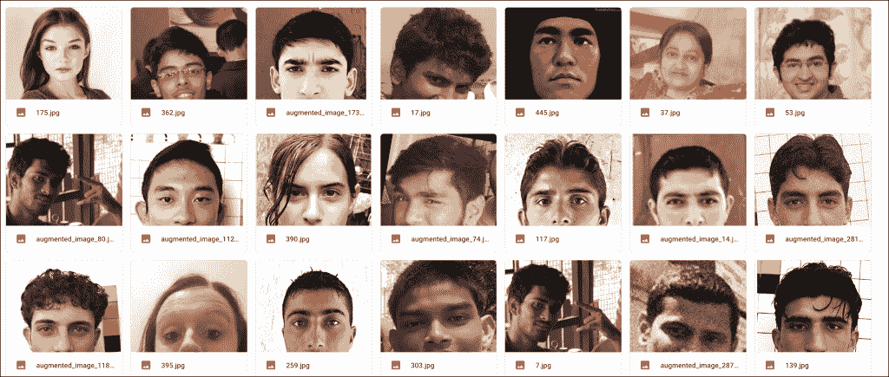
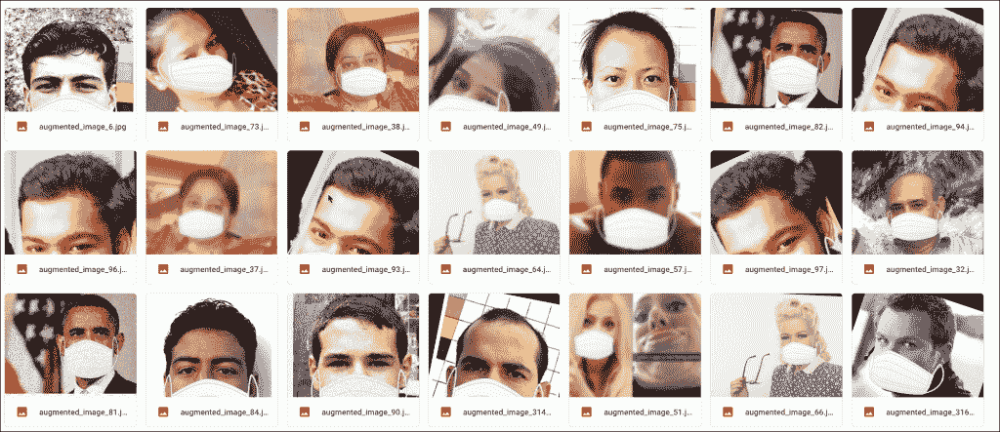
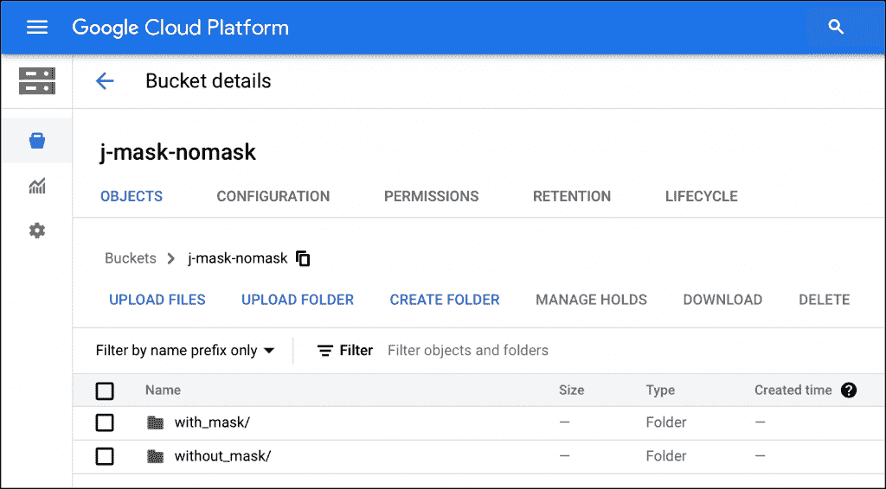
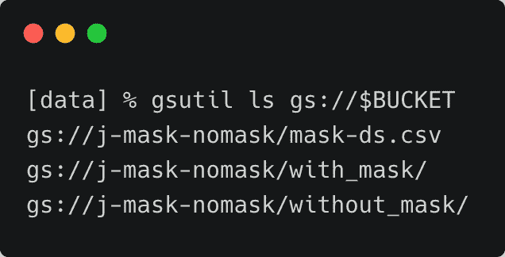
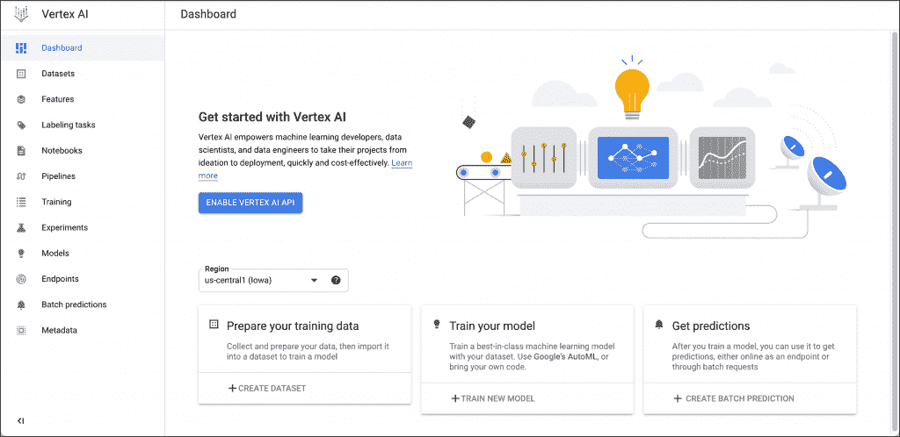
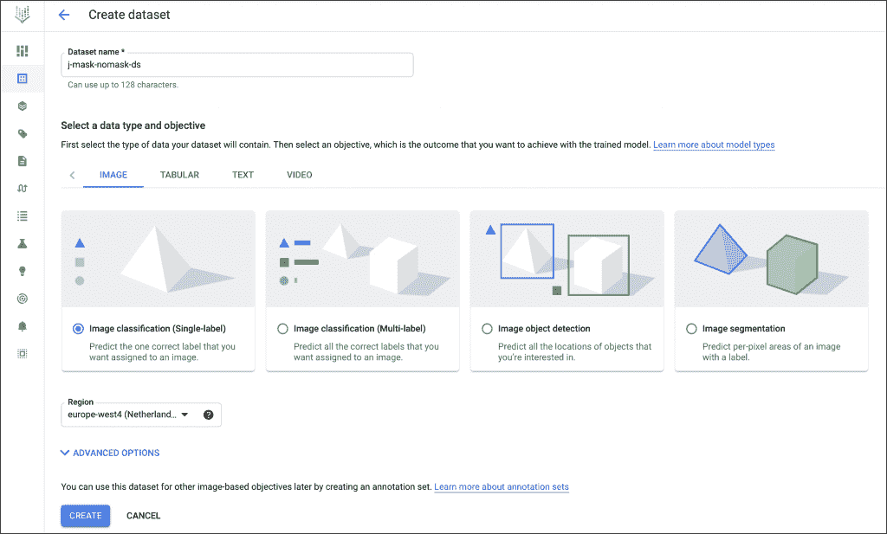
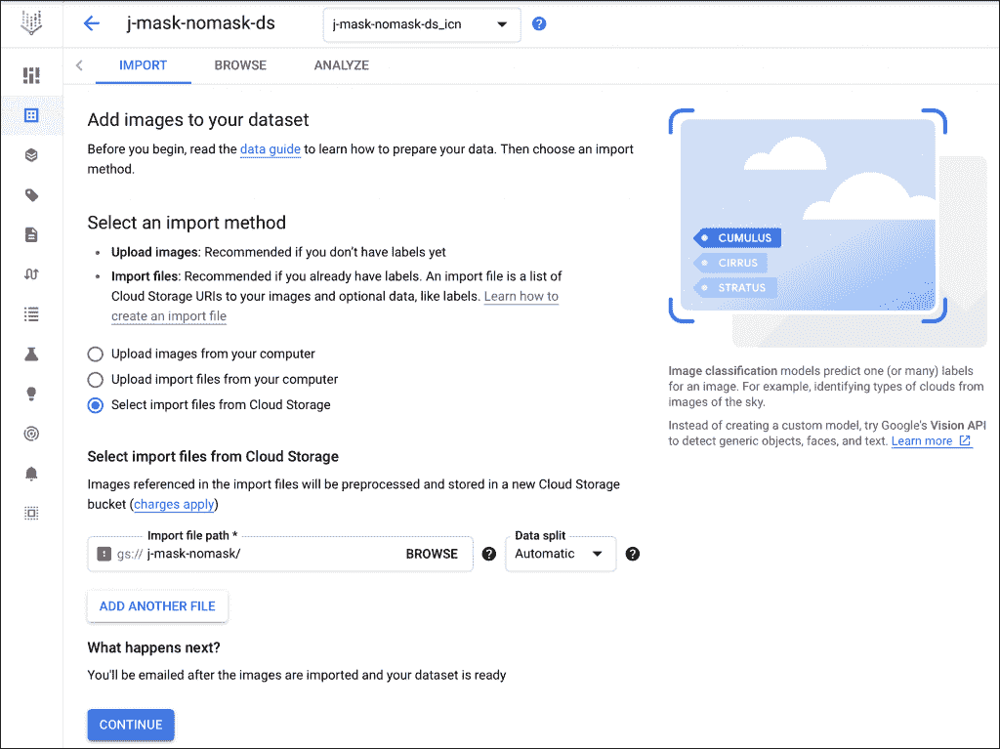
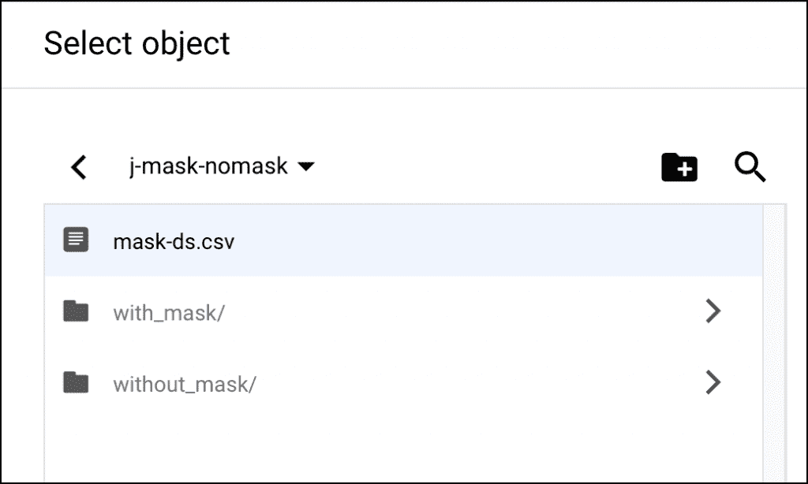
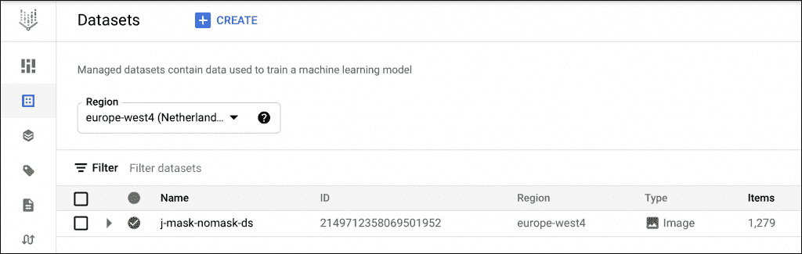
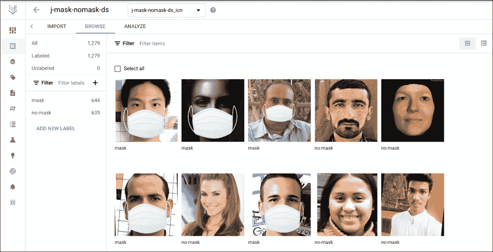

# 谷歌顶点人工智能汽车教程介绍:数据准备

> 原文：<https://thenewstack.io/a-tutorial-introduction-to-google-vertex-ai-automl-data-preparation/>

这篇文章是探索谷歌新推出的 Vertex AI 的两部分系列的第一部分，Vertex AI 是一个统一的机器学习和深度学习平台。这篇文章深入探讨了数据准备。周一回来查看关于训练和推理过程的第二部分。

谷歌的 [Vertex AI](https://cloud.google.com/vertex-ai) 是一个统一的机器学习和深度学习平台，支持 AutoML 模型和定制模型。在本教程中，我们将训练一个图像分类模型，用顶点人工智能自动检测人脸面具。关于 Vertex AI 的介绍，请阅读我上周在 New Stack 发表的这篇[文章](https://thenewstack.io/a-close-look-at-cloud-based-machine-learning-platforms-microsoft-azure-ml-google-vertex-ai/)。

要完成本教程，您需要在您的工作站上安装有效的 [Google Cloud 订阅](https://cloud.google.com/)和 [Google Cloud SDK](https://cloud.google.com/sdk/) 。

训练该模型涉及三个步骤:数据集创建、训练和推理。

数据集创建包括上传图像并对其进行标注。由于我们使用 AutoML，培训需要最少的干预。我们不需要编写代码或执行超参数调整之类的步骤。训练完成后，我们可以下载该模型以部署在边缘设备中或托管它以执行推理。

在本教程的第一部分，我们将重点关注数据集的创建。对于本教程，我们将使用[原始数据集](https://github.com/prajnasb/observations/tree/master/experiements/data)由[般若班达瑞](https://www.linkedin.com/in/prajna-bhandary-0b03a416a/?originalSubdomain=in)创建的带面具和不带面具的人脸。



她使用图像增强技术为每个班级生成了 600 多张图像。



虽然这不是最全面的数据集，但它是 AutoML 的一个很好的选择，因为 AutoML 可以使用较少数量的图像来训练模型。

我们将用两个文件夹— *`mask`* 和 *`no-mask`* 将这些图片上传到 Google 云存储桶。带有每个图像路径和标签的 CSV 文件将被上传到同一个桶中，该桶将成为顶点 AI 的输入。

让我们创建 Google 云存储桶。

```
BUCKET=j-mask-nomask
REGION=EUROPE-WEST4

```

您可以随意更改这些值，以反映您的时段名称和地区。在推出时，Vertex AI AutoML 仅在美国中部 1(爱荷华州)和欧洲西部 4(荷兰)地区提供。

```
gsutil mb  -l  $REGION  -c  STANDARD gs://$BUCKET

```

我们现在开始上传图片到上面的桶。

在本地机器上克隆 GitHub 存储库。

```
git clone https://github.com/prajnasb/observations.git

```

导航到`data`目录并运行以下命令:

```
gsutil cp  -r  with_mask gs://$BUCKET

```

```
gsutil cp  -r  without_mask gs://$BUCKET

```

要同时从两个目录上传图像，请在两个不同的终端窗口中运行命令。

查看谷歌云控制台，浏览文件夹。



一旦上传了图像，我们需要生成一个包含每个图像的路径和标签的 CSV 文件。

我们将为此任务运行一个简单的 BASH 脚本。

```
for filename in with_mask/*.jpg;  do
    [  -e  "$filename"  ]  ||  continue
    echo  "gs://$BUCKET/$filename,mask"  >>  mask-ds.csv
done

```

这将使用类似于
的条目填充文件`mask-ds.csv`

```
gs://j-mask-nomask/with_mask/0-with-mask.jpg,mask
gs://j-mask-nomask/with_mask/1-with-mask.jpg,mask
gs://j-mask-nomask/with_mask/10-with-mask.jpg,mask
gs://j-mask-nomask/with_mask/100-with-mask.jpg,mask

```

让我们对第二个文件夹重复此操作，以生成无掩码的路径和标签。

```
for filename in without_mask/*.jpg;  do
    [  -e  "$filename"  ]  ||  continue
    echo  "gs://$BUCKET/$filename,no-mask"  >>  mask-ds.csv
done

```

这将在 CSV 文件中添加不带遮罩的图像路径行。

```
gs://j-mask-nomask/without_mask/0.jpg,no-mask
gs://j-mask-nomask/without_mask/1.jpg,no-mask
gs://j-mask-nomask/without_mask/10.jpg,no-mask
gs://j-mask-nomask/without_mask/100.jpg,no-mask
gs://j-mask-nomask/without_mask/101.jpg,no-mask

```

最后，我们需要将 CSV 文件上传到 bucket。

```
gsutil cp mask-ds.csv gs://$BUCKET

```

CSV 文件成为 Vertex AI AutoML 创建最终数据集的关键输入。

运行命令，`gsutil ls gs://$BUCKET`确认 CSV 文件成功上传到 Google 云存储桶。



随着数据上传到云存储，让我们把它变成一个顶点人工智能数据集。

在谷歌云控制台中访问 Vertex AI 仪表板，并启用 API。选择区域并单击创建数据集:



为数据集命名，选择带有单个标签的影像分类，然后单击创建:



在下一部分中，选择选择从云存储中导入文件:



浏览云存储桶，选择之前上传的 CSV 文件，点击继续:



导入过程需要几分钟时间。完成后，您将进入下一页，该页显示了从数据集中识别的所有图像，包括已标记和未标记的图像:



由于 Vertex AI 发现了重复的图像，您可能会在导入过程中看到一些警告和错误。可以安全地忽略它们。



我们现在准备开始训练。请继续关注教程的[下一部分](https://thenewstack.io/an-introduction-to-google-vertex-ai-automl-training-and-inference/)，了解训练和推理过程。

<svg xmlns:xlink="http://www.w3.org/1999/xlink" viewBox="0 0 68 31" version="1.1"><title>Group</title> <desc>Created with Sketch.</desc></svg>