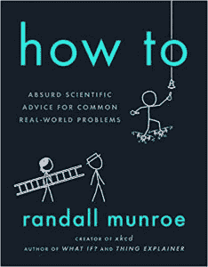
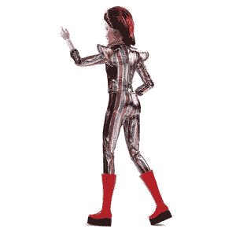

# 一个非常古怪的圣诞节:给你生活中的程序员的四个礼物点子

> 原文：<https://thenewstack.io/a-very-geeky-christmas-four-gift-ideas-for-the-programmer-in-your-life/>

每个极客都知道这种感觉:得到一份礼物，咬紧牙关，努力微笑，而你却在暗暗想:“他们就是不理解我……”

所以今年我特别精心准备了一份礼物指南。这是一套四个特别的礼物，提供了记住一些特别的极客朋友的机会——或者体验为一个好的事业或一个有需要的极客组织捐款的快乐。所以今年在所有的蛋奶酒被消费之后，随着圣诞晚会越来越晚，真相最终被告知…

这是我们真正想要的假期礼物。

### **1:拯救自由软件(基础)**

对于[自由软件基金会](https://www.fsf.org/)的年度会员活动来说，这将是重要的一年。这是该组织创始人[理查德·斯托尔曼在 32 年后从 501(c)(3)非营利组织](https://www.fsf.org/news/richard-m-stallman-resigns)辞职以来的第一次活动，但 FSF 仍然坚持他们的原则，并邀请你加入他们。“从一开始，自由软件运动就由一群支持正义的热情的人组成，”[运动的网页](https://www.fsf.org/appeal)解释道。“从那以后，一切都没有改变。”

它的使命是推广自由软件——是的，你可以为别人购买该组织的“礼物会员”。会员资格自动赋予幸运的接收者[利益](https://www.fsf.org/associate/benefits)——外加当他们在 IRC 上聊天时，在 *fsf/member/username* “斗篷”后面隐藏他们的 ip 地址的能力。还可以免费参加在波斯顿举行的年度 LibrePlanet 大会，另外在 FSF 商店购买的所有商品可以享受为期一年的 20%的折扣，这是一个超级极客商品的宝库，比如“自由软件，自由社会”连帽衫和可爱的 the gnu 填充娃娃(为了纪念 GNU 操作系统)。

最近的一篇博客文章指出，他们的组织在四个不同的数据中心保持着 120 台虚拟服务器的运行，而[只有两名高级系统管理员、一名兼职首席技术官和一名 web 开发人员](https://www.fsf.org/blogs/sysadmin/the-fsf-tech-team-doing-more-for-free-software)。他们每天提供 1.5TB 的数据，并向自由软件社区的邮件列表发送超过 50 万条消息。“我们不外包任何日常软件需求，因为我们需要确保他们只使用自由软件。

“记住，没有‘云’，只有别人的电脑。”

### **2:XKCD 创作者不切实际的建议**

这里有一个礼物的想法，提供了一种让下一代保持科学乐趣的方法。它已经是亚马逊在[“科学论文和评论”类别](https://www.amazon.com/gp/bestsellers/books/3045861/ref=pd_zg_hrsr_books)的第一畅销书，甚至击败了尼尔·德格拉斯·泰森的[来自天体物理学家的信](https://www.amazon.com/Letters-Astrophysicist-Neil-deGrasse-Tyson/dp/1324003316)但是“[如何](https://www.penguinrandomhouse.com/books/576760/how-to-by-randall-munroe/)”的前几页公然向读者承诺这是“一本糟糕想法的书”在第一章“如何跳得很高”中，作者兰道尔·门罗指出，要打败职业跳高运动员，你要么需要花一生的时间进行体育训练，要么……作弊。如果你选择了第一个选项，“那么你可能读错了书。”

但这位前美国国家航空航天局机器人专家转行漫画家进入了用各种方式让你的身体离开地面的物理学领域——撑杆跳、骑滑板上坡道——偶尔停下来看一部漫画，在那里简笔画将他的想法发挥到了古怪的极致。这一切都是令人愉快的恶作剧，但有一种亲切的精神，欢迎所有年龄的无畏的探究者进入门罗自己独特的假设科学品牌。长达六小时的有声读物甚至由在《星际迷航:下一代》中扮演年轻的韦斯利·克拉舍的极客名人威尔·惠顿朗读

门罗没有向他的粉丝们提供一系列来自他的在线漫画《XKCD》的不可预测的简笔画，而是给了他们他所描述的“一本非常无用的自助书”,仍然管理着一些真正令人兴奋甚至鼓舞人心的时刻。“这本书探索了完成普通任务的不寻常的方法，”介绍认真地解释道，“并且看看如果你尝试了会发生什么。

“弄清楚它们为什么会或不会起作用可能很有趣，也能增长见识，有时还会带你去意想不到的地方。”

### **3:安保衬衫**

如果你想体验捐赠给慈善事业的礼物，开源技术改进基金是一个非营利组织，试图将开源安全项目与资金和后勤支持联系起来。“现在，世界比以往任何时候都更加意识到对强大的开源安全软件的需求，”[解释其使命宣言](https://ostif.org/the-ostif-mission/)。该组织雇佣专业审计员来审查代码的漏洞，并提出加强漏洞的方法，它还提供 bug 奖金，甚至向“有价值的”项目拨款，“以促进代码更改，从而对现有项目进行改进或升级。”

现在他们请求你的帮助——但是是以一种独特而有创造性的方式。该组织希望众筹一台服装打印机的一半成本，这样它就可以生产自己的极客主题 t 恤。“用衬衫建设更美好的互联网！”解释了 Kickstarter 上的活动页面。

该活动的贡献者可以收到一个定制的 [RFID 屏蔽钱包](https://twitter.com/OSTIFofficial/status/1202288069371715584)，上面有他们选择的信息——或者是由特别委托的艺术家设计的三十多件极客 t 恤中的一件。Linux 粉丝可能想要一件衬衫，将他们钟爱的内核的官方吉祥物融入到以太空为主题的“银河礼服”衬衫设计中。

一件 t 恤甚至纪念了 OSTIF 在 OpenVPN 2.4.0 中发现的关键缺陷——通过重新发布完整的错误代码。

这些不会在圣诞节到来。事实上，只有在竞选活动于 1 月 7 日达到资金目标时，它们才可能存在。但是你仍然可以体验到为一个试图建设一个更好的互联网的团体做贡献的美好感觉。

或许一路上还能得到一声轻笑…

### **4:芭比星尘**

我一直认为大卫·鲍依是流行文化的大书呆子之一。他是唯一一个推出自己的 [品牌 ISP](https://www.theguardian.com/technology/2016/jan/11/david-bowie-bowienet-isp-internet) (从 1998 年运营到 2006 年)的摇滚明星。他[演唱关于外太空的歌曲](https://www.youtube.com/watch?v=iYYRH4apXDo)，扮演从外太空来的人*，他最令人心酸的歌曲之一甚至以“火星上有生命吗？”SpaceX 用它作为其鼓舞人心的视频的背景音乐，该视频讲述了特斯拉跑车目前[载着一个名叫 Starman 的人体模型在永无止境的绕太阳轨道上](https://thenewstack.io/star-man-headed-towards-mars-asteroid-belt/) …*

**“Wonder if he’ll ever know / he’s in the best-selling show…”*

显然，我不是唯一一个对“齐格·星尘”怀有深深敬意的书呆子，这是音乐、媒体甚至性别流动性的先驱。虽然鲍伊在将近四年前离开了我们，但不知何故，这神奇地让他更接近了许多人的文化生活。所以，如果圣诞节是举起一杯善意的酒来纪念老朋友的时候，那么是的，我非常愿意

*do*

想以此开始新的一年吗

[a David Bowie Barbie doll](https://barbie.mattel.com/shop/en-us/ba/barbie-david-bowie-doll-fxd84)

在我的桌子上。

美泰将其描述为“[两位流行文化偶像](https://barbie.mattel.com/shop/en-us/ba/buzz/barbie-david-bowie-doll-celebrates-pioneer-of-sound-vision)的权威庆典。”

如果你想让这个玩具感觉更像一个极客的圣诞礼物，你可以在重新观看鲍伊和宾·克罗斯比合唱的 1977 年视频时打开它。

https://www.youtube.com/watch?v=n9kfdEyV3RQ

祝你和你的家人节日快乐，世界和平！

<svg xmlns:xlink="http://www.w3.org/1999/xlink" viewBox="0 0 68 31" version="1.1"><title>Group</title> <desc>Created with Sketch.</desc></svg>*