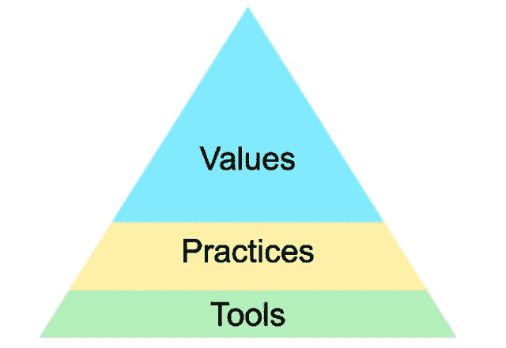

# 埃森哲:DevOps 将在 5 年内变得毫无意义

> 原文：<https://thenewstack.io/accenture-devops-will-be-moot-in-5-years/>

[埃森哲:DevOps 将在 5 年后被搁置](https://thenewstack.simplecast.com/episodes/accenture-devops-will-be-moot-in-5-years)

关于 DevOps 的公开讨论将在五年内减弱，甚至可能更早。devo PS 是一场运动，旨在使组织能够鼓励 IT 部门之间的协作，以实现自动化和加快业务目标。这是全球 IT 咨询公司[埃森哲](https://www.accenture.com)的 DevOps 架构高级经理 Keith Pleas 在旧金山 2018 年 DevOps World 上接受 [The New Stack Makers](https://thenewstack.io/podcasts/makers) 播客采访时所说的。

Pleas 承认，每个人都想成为组织 IT 运营部门的“奇迹工作者”,扭转局面，按时完成项目。“但挑战在于，技术正朝着相反的方向发展。

“‘连续’意味着什么？自动化，”他继续说道。“自动化正在为自动化而到来。在接下来的一年、两年、三年、五年、十年里，DevOps 将成为配置设置，仅此而已。”

[去年，在他的埃森哲博客](https://www.accenture.com/us-en/blogs/blogs-keith-pleas-software-delivery)中，普莱斯介绍了一个他描述为“自上而下的方法”的图表:一个三条纹的三角形*显示在*的上方，**值**在顶部，**实践**在中间，**工具**在底部。这显然是为了引发讨论，因为他把它印在了名片的背面，并确保我在打开麦克风之前看到了它。(我在采访中称它为“这个小家伙”。)这个模型的特别之处在于对它的描述是如此之少。博客文章告诉我们，顺序很重要，而**重视**领先意味着一切。

但是，正如我们的讨论所发现的那样，一切都只是如此，特别是考虑到它与 DevOps 这个主题的关系。一个人对开发运维的策略似乎是一个指标，表明该组织是否将其价值观或基础设施视为基础。

Pleas 亲自参与了一个名为“DevSecOps”的运动，他将这个运动描述为将安全性的“非功能性需求”分层到 DevOps 组合中。他断言，DevOps 是通过一个能够随着需求的增加而被委派新的职责的系统来增长的，这反过来又使系统增长。

然而，不可避免的是，他继续说道，这个受 Dev + Ops 启发的系统至少会消耗掉它的一条尾巴。

“如果你只是一个简单地配置如何编译某个东西，将它移到另一个不同的东西上，运行一个测试，得到一个结果，然后连接起来的男人或女人，那将是短期的。我认为其中 80%将在五年内消失。”

在最近在旧金山举行的 DevOps World 2018 大会期间录制的本期**新堆栈制造商**中，了解更多关于 Keith Pleas 对转型浪潮的预测。

## 在这个版本中:

[4:28:](https://thenewstack.simplecast.com/episodes/accenture-devops-will-be-moot-in-5-years?t=4:28)“devo PS”一词的发明
[10:41:](https://thenewstack.simplecast.com/episodes/accenture-devops-will-be-moot-in-5-years?t=10:41) “工具是一种结构”这句话及其曲解。
[12:40:](https://thenewstack.simplecast.com/episodes/accenture-devops-will-be-moot-in-5-years?t=12:40) 重新定义目标与协作周期。
[17:39:](https://thenewstack.simplecast.com/episodes/accenture-devops-will-be-moot-in-5-years?t=17:39) 一旦重新应用到自动化流，失败的值。
[23:09:](https://thenewstack.simplecast.com/episodes/accenture-devops-will-be-moot-in-5-years?t=23:09) DevOps 作为一个人的命根子和分化的假象。
[26:31:](https://thenewstack.simplecast.com/episodes/accenture-devops-will-be-moot-in-5-years?t=26:31) 支持，测试，把测试人员和开发人员放在基座上的概念。

<svg xmlns:xlink="http://www.w3.org/1999/xlink" viewBox="0 0 68 31" version="1.1"><title>Group</title> <desc>Created with Sketch.</desc></svg>