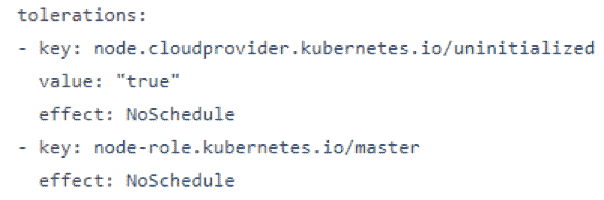
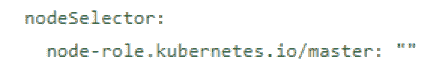
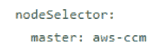
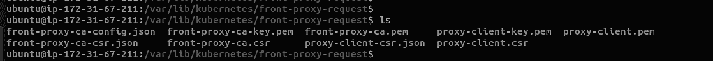
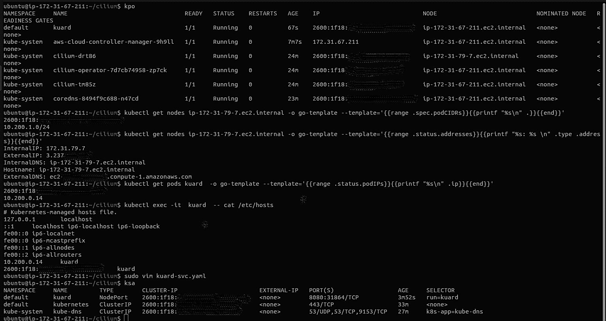
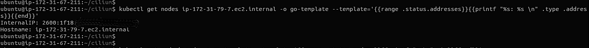
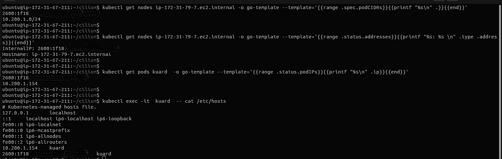
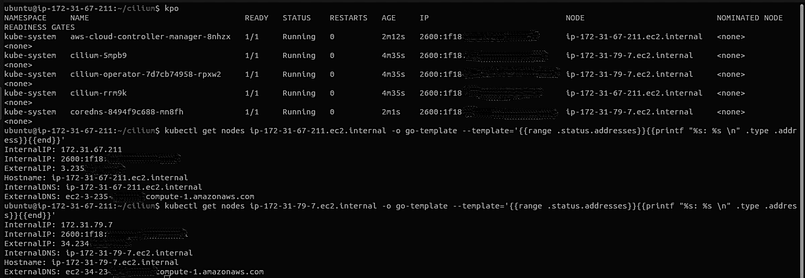

# 通过 Kubernetes 双栈集群访问 AWS 服务

> 原文：<https://thenewstack.io/access-aws-services-through-a-kubernetes-dual-stack-cluster/>

[](https://github.com/Lakers817)

[Saurabh Modi](https://github.com/Lakers817)

[Saurabh Modi 是一名 IT 专业人士，拥有十多年的工作经验，从商业智能、统计分析、应用程序开发到生产支持和 Kubernetes 云基础设施。他曾与大型金融科技公司和企业的咨询公司合作，使用独特和创造性的解决方案来解决问题。](https://github.com/Lakers817)

[](https://github.com/Lakers817)[](https://github.com/Lakers817)

本系列文章将重点关注使用`AWS-cloud-controller-manager`将 Kubernetes 双 IPv4/IPv6 堆栈与 [Amazon Web Services](https://aws.amazon.com/?utm_content=inline-mention) 服务 API 连接起来(在整篇文章中，我将`AWS-Cloud-Controller-Manager`称为“AWS-ccm”，将 Kubernetes 称为 K8s)。根据 AWS 文档，AWS-ccm“允许 Kubernetes 集群提供、监控和删除集群运行所需的 AWS 资源”。

首先，我将讨论 AWS 云提供商存储库中的清单和我用来使它工作的一个黑客，在本教程的第二部分(将在下周运行)，我将介绍如何使用 systemd 服务运行 AWS-ccm。

我不会详细讨论如何在 Kubernetes 上建立 AWS 集群，也不会讨论 AWS 和 Kubernetes 的[定价，而是将重点放在`aws-cloud-controller-manager`的细节上。互联网上有很多非常好的文章、博客和项目可以用来在 AWS cloud 上建立 Kubernetes 集群。](https://thenewstack.io/7-tips-for-cutting-down-your-aws-kubernetes-bill/)

我在 AWS Cloud Ubuntu-20.04 实例镜像和 Kubernetes 版本 1.21.2 和 1.22.1 上测试过。在这篇文章中，我使用了 Kelsey Hightower 启发的关于如何建立集群的指南。

***免责声明** **:** AWS 云控制器管理器正在大量开发中，仍处于 ALPHA 阶段，在它变得成熟和稳定之前，您不应该在生产中使用它。*

## 先决条件

在开始之前，您需要启动并运行一个双栈集群，这意味着 [AWS vpc](https://docs.aws.amazon.com/vpc/latest/userguide/vpc-ip-addressing.html) 被配置为在启用 K8s 双栈功能 的情况下接收 IPv4/IPv6 流量。

**注意:**如果您有一个仅支持 IPv4 的集群(典型的 K8s 集群)，那么您也必须经历我们将要经历的相同练习，但是，您不需要启用双堆栈功能。

## 关于云控制器管理器

[云控制器管理器](https://kubernetes.io/docs/concepts/architecture/cloud-controller/)是一个 Kubernetes [控制平面](https://kubernetes.io/docs/reference/glossary/?all=true#term-control-plane)组件，它嵌入了特定于云的控制逻辑。云控制器管理器允许您将集群链接到云提供商的 API，并将与该云平台交互的组件与仅与集群交互的组件分开。

K8s 树内云提供商代码已经基本停止接受新功能，树内插件将在未来的 [Kubernetes](https://thenewstack.io/category/kubernetes/) 版本中移除。

Kubernetes Github 上有非常好的信息[，告诉你从 K8s v1.20 开始不应该做什么。](https://github.com/kubernetes/kubernetes/tree/master/cmd/cloud-controller-manager)

在 1.20 之前，AWS-ccm 是核心 Kubernetes API 的一部分，我们使用它来启用 API 服务器、控制器管理器和 kubelet 服务文件中的标志`–cloud-provider=aws`,以连接到 AWS 资源——但现在不是了。

[您不应该在`kube-apiserver`和 AWS-ccm 中指定`--cloud-provider`标志。这确保它不会运行任何特定于云的循环，而这些循环将由云控制器管理器运行。将来，此标志将被弃用并删除。](https://kubernetes.io/docs/tasks/administer-cluster/running-cloud-controller/)

kubelet 必须与`--cloud-provider=external`一起运行。这是为了确保 kubelet 知道它必须由云控制器管理器在为任何工作进行调度之前进行初始化。

我在哪里可以找到 AWS-ccm？

这是目前 AWS-ccm 的 [所在地，AWS 云提供商](https://github.com/kubernetes/cloud-provider-aws) [的未来发展应该在这里继续。](https://cloud-provider-aws.sigs.k8s.io/)

## 让我们开始吧

首先，我为 EC2 实例创建了 [IAM 策略](https://cloud-provider-aws.sigs.k8s.io/prerequisites/) ，以便 AWS-ccm 能够与 AWS 的 API 进行通信。

我如何测试清单？在控制平面节点上，一旦它启动并运行，我就设置了一个 kubelet 和 kube-proxy，启动并取消对它的着色。

我们在这里变通了一些规则。

`kubectl taint nodes <node-name>`

然后，我从`aws-daemonset`中移除了容错，并对其进行了标记，使其仅部署在控制平面节点上。



`kubectl label nodes ip-172-31-67-211.ec2.internal master=aws-ccm`

然后，我们更改了节点选择器键值:



到



**注意:**如果您正在使用 kubeadm 或任何其他使用清单进行部署的项目，那么您不应该删除清单中节点和节点选择器部分上的污点，并根据您的项目需求进行更改。

之后，我部署了纤毛 CNI 插件和核心域名系统。

然后，我从 AWS-cloud provider repository manifest 文件夹部署了 RBAC 和 AWS-ccm 清单。manifest 文件夹里有一堆文件，除了 **kustomization.yaml** 我用了所有的文件来部署。

它不工作，并且错误地输出了许多信息。

现在我们有了一个难题。我们该怎么办？

解决方案就在日志中。

那是我第一次破解它的地方。我开始挖掘日志，一个接一个地测试每个出错的标志，以及它们的用途。

注意:我已经将错误合并到一个日志文件中，以便于阅读，因为每次出现错误都会生成一个很大的日志文件。

`kubectl logs aws-cloud-controller-manager-bdnj5 -n kube-system`

```
I0329  11:44:27.679102           1  flags.go:59]  FLAG:  --add-dir-header="false"

I0329  11:44:27.679144           1  flags.go:59]  FLAG:  --address="0.0.0.0"

I0329  11:44:27.679156           1  flags.go:59]  FLAG:  --allocate-node-cidrs="false"

I0329  11:44:27.679162           1  flags.go:59]  FLAG:  --allow-untagged-cloud="false"

I0329  11:44:27.679167           1  flags.go:59]  FLAG:  --alsologtostderr="false"

I0329  11:44:27.679172           1  flags.go:59]  FLAG:  --authentication-kubeconfig=""

I0329  11:44:27.679177           1  flags.go:59]  FLAG:  --authentication-skip-lookup="false"

I0329  11:44:27.679182           1  flags.go:59]  FLAG:  --authentication-token-webhook-cache-ttl="10s"

I0329  11:44:27.679191           1  flags.go:59]  FLAG:  --authentication-tolerate-lookup-failure="false"

I0329  11:44:27.679196           1  flags.go:59]  FLAG:  --authorization-always-allow-paths="[/healthz]"

I0329  11:44:27.679206           1  flags.go:59]  FLAG:  --authorization-kubeconfig=""

I0329  11:44:27.679211           1  flags.go:59]  FLAG:  --authorization-webhook-cache-authorized-ttl="10s"

I0329  11:44:27.679216           1  flags.go:59]  FLAG:  --authorization-webhook-cache-unauthorized-ttl="10s"

I0329  11:44:27.679221           1  flags.go:59]  FLAG:  --bind-address="0.0.0.0"

I0329  11:44:27.679225           1  flags.go:59]  FLAG:  --cert-dir=""

I0329  11:44:27.679233           1  flags.go:59]  FLAG:  --cidr-allocator-type="RangeAllocator"

I0329  11:44:27.679238           1  flags.go:59]  FLAG:  --client-ca-file=""

I0329  11:44:27.679243           1  flags.go:59]  FLAG:  --cloud-config=""

I0329  11:44:27.679247           1  flags.go:59]  FLAG:  --cloud-provider="aws"

I0329  11:44:27.679251           1  flags.go:59]  FLAG:  --cluster-cidr=""

I0329  11:44:27.679256           1  flags.go:59]  FLAG:  --cluster-name="kubernetes"

I0329  11:44:27.679261           1  flags.go:59]  FLAG:  --concurrent-service-syncs="1"

I0329  11:44:27.679269           1  flags.go:59]  FLAG:  --configure-cloud-routes="true"

I0329  11:44:27.679274           1  flags.go:59]  FLAG:  --contention-profiling="false"

I0329  11:44:27.679288           1  flags.go:59]  FLAG:  --controller-start-interval="0s"

I0329  11:44:27.679293           1  flags.go:59]  FLAG:  --controllers="[*]"

I0329  11:44:27.679298           1  flags.go:59]  FLAG:  --external-cloud-volume-plugin=""

I0329  11:44:27.679303           1  flags.go:59]  FLAG:  --feature-gates=""

I0329  11:44:27.679310           1  flags.go:59]  FLAG:  --help="false"

I0329  11:44:27.679314           1  flags.go:59]  FLAG:  --http2-max-streams-per-connection="0"

I0329  11:44:27.679323           1  flags.go:59]  FLAG:  --kube-api-burst="30"

I0329  11:44:27.679328           1  flags.go:59]  FLAG:  --kube-api-content-type="application/vnd.kubernetes.protobuf"

I0329  11:44:27.679333           1  flags.go:59]  FLAG:  --kube-api-qps="20"

I0329  11:44:27.679340           1  flags.go:59]  FLAG:  --kubeconfig=""

I0329  11:44:27.679345           1  flags.go:59]  FLAG:  --leader-elect="true"

I0329  11:44:27.679350           1  flags.go:59]  FLAG:  --leader-elect-lease-duration="15s"

I0329  11:44:27.679354           1  flags.go:59]  FLAG:  --leader-elect-renew-deadline="10s"

I0329  11:44:27.679362           1  flags.go:59]  FLAG:  --leader-elect-resource-lock="leases"

I0329  11:44:27.679366           1  flags.go:59]  FLAG:  --leader-elect-resource-name="cloud-controller-manager"

I0329  11:44:27.679371           1  flags.go:59]  FLAG:  --leader-elect-resource-namespace="kube-system"

I0329  11:44:27.679376           1  flags.go:59]  FLAG:  --leader-elect-retry-period="2s"

I0329  11:44:27.679381           1  flags.go:59]  FLAG:  --log-backtrace-at=":0"

I0329  11:44:27.679389           1  flags.go:59]  FLAG:  --log-dir=""

I0329  11:44:27.679397           1  flags.go:59]  FLAG:  --log-file=""

I0329  11:44:27.679402           1  flags.go:59]  FLAG:  --log-file-max-size="1800"

I0329  11:44:27.679407           1  flags.go:59]  FLAG:  --log-flush-frequency="5s"

I0329  11:44:27.679417           1  flags.go:59]  FLAG:  --logtostderr="true"

I0329  11:44:27.679422           1  flags.go:59]  FLAG:  --master=""

I0329  11:44:27.679426           1  flags.go:59]  FLAG:  --min-resync-period="12h0m0s"

I0329  11:44:27.679432           1  flags.go:59]  FLAG:  --node-monitor-period="5s"

I0329  11:44:27.679436           1  flags.go:59]  FLAG:  --node-status-update-frequency="5m0s"

I0329  11:44:27.679444           1  flags.go:59]  FLAG:  --node-sync-period="0s"

I0329  11:44:27.679451           1  flags.go:59]  FLAG:  --one-output="false"

I0329  11:44:27.679456           1  flags.go:59]  FLAG:  --permit-port-sharing="false"

I0329  11:44:27.679460           1  flags.go:59]  FLAG:  --port="0"

I0329  11:44:27.679465           1  flags.go:59]  FLAG:  --profiling="true"

I0329  11:44:27.679469           1  flags.go:59]  FLAG:  --requestheader-allowed-names="[]"

I0329  11:44:27.679481           1  flags.go:59]  FLAG:  --requestheader-client-ca-file=""

I0329  11:44:27.679489           1  flags.go:59]  FLAG:  --requestheader-extra-headers-prefix="[x-remote-extra-]"

I0329  11:44:27.679495           1  flags.go:59]  FLAG:  --requestheader-group-headers="[x-remote-group]"

I0329  11:44:27.679502           1  flags.go:59]  FLAG:  --requestheader-username-headers="[x-remote-user]"

I0329  11:44:27.679509           1  flags.go:59]  FLAG:  --route-reconciliation-period="10s"

I0329  11:44:27.679515           1  flags.go:59]  FLAG:  --secure-port="10258"

I0329  11:44:27.679520           1  flags.go:59]  FLAG:  --skip-headers="false"

I0329  11:44:27.679525           1  flags.go:59]  FLAG:  --skip-log-headers="false"

I0329  11:44:27.679532           1  flags.go:59]  FLAG:  --stderrthreshold="2"

I0329  11:44:27.679537           1  flags.go:59]  FLAG:  --tls-cert-file=""

I0329  11:44:27.679542           1  flags.go:59]  FLAG:  --tls-cipher-suites="[]"

I0329  11:44:27.679548           1  flags.go:59]  FLAG:  --tls-min-version=""

I0329  11:44:27.679553           1  flags.go:59]  FLAG:  --tls-private-key-file=""

I0329  11:44:27.679557           1  flags.go:59]  FLAG:  --tls-sni-cert-key="[]"

I0329  11:44:27.679563           1  flags.go:59]  FLAG:  --use-service-account-credentials="true"

I0329  11:44:27.679571           1  flags.go:59]  FLAG:  --v="2"

I0329  11:44:27.679576           1  flags.go:59]  FLAG:  --version="false"

I0329  11:44:27.679582           1  flags.go:59]  FLAG:  --vmodule=""

I0329  11:44:28.321932           1  serving.go:331]  Generated self-signed cert in-memory

I0329  11:44:29.005705           1  requestheader_controller.go:244]  Loaded  a  new request header values for RequestHeaderAuthRequestController

W0329  11:44:29.006928           1  client_config.go:614]  Neither  --kubeconfig nor  --master was specified.   Using the inClusterConfig.   This might not work.

I0329  11:44:29.011659           1  aws.go:1251]  Building AWS cloudprovider

I0329  11:44:29.011835           1  aws.go:1211]  Zone not specified in configuration file;  querying AWS metadata service

I0329  11:44:29.270952           1  tags.go:79]  AWS cloud filtering on ClusterID:  kubernetes

I0329  11:44:29.272035           1  aws.go:802]  Setting up informers for Cloud

configmap_cafile_content.go:243]  kube-system/extension-apiserver-authentication failed with  :  missing content for CA bundle  "client-ca::kube-system::extension-apiserver-authentication::requestheader-client-ca-file"

4830  client_builder_dynamic.go:154]  serviceaccounts  "aws-cloud-provider"  is forbidden:  User  "system:cloud-controller-manager"  cannot get resource  "serviceaccounts"  in API group  ""  in the namespace  "kube-system"

E0630  02:58:22.309173           1  node_controller.go:354]  Specified Node IP not found in cloudprovider for node  "ip-172-31-67-211.ec2.internal"

error syncing  'ip-.ec2.internal':  failed to get node modifiers from cloud provider          

 ip-172-31-67-211  aws-cloud-controller-manager[4807]:  E0715  13:27:56.043296      4807  reflector.go:138]  pkg/mod/k8s.io/client-go@v0.21.0/tools/cache/reflector.go:167:  Failed to watch *v1.Node:  failed to list 

*v1.Node:  nodes is forbidden:  User  "cloud-controller-manager"  cannot list resource  "nodes"  in API group  ""  at the cluster scope

eflector.go:219]  Starting reflector *v1.Secret  (0s)  from pkg/mod/k8s.io/client-go@v0.20.0/tools/cache/reflector.go:167

E0808  13:01:06.222970           1  reflector.go:138]  pkg/mod/k8s.io/client-go@v0.20.0/tools/cache/reflector.go:167:  Failed to watch *v1.Secret:  failed to list 

*v1.Secret:  secrets is forbidden:  User  "system:serviceaccount:kube-system:cloud-controller-manager"  cannot list resource  "secrets"  in API group  ""  in the namespace  "kube-system"

```

Kubernetes 在发展过程中经历了许多变化。较新的版本通常需要一个叫做 API 服务器的东西。

kube-apiserver 必须启用一个聚合层。

聚合层配置使 Kubernetes API 服务器能够用不属于 Kubernetes API 核心的其他 API 进行扩展。

因为在最新的 Kubernetes 版本中，AWS-ccm 不是核心 API 的一部分。不同的云提供商维护各自的云存储库。

在像 kubeadm 这样的项目中，它已经为您连接好了，但是在这个设置中，您将需要添加它。

您需要对您的 kube-apiserver 服务文件进行以下更改，并添加这些标志(如果您还没有这样做的话)—

 `--requestheader-client-ca-file=front-proxy-ca.pem \`

`  --requestheader-allowed-names=front-proxy-client \`

`  --requestheader-extra-headers-prefix=X-Remote-Extra- \`

`  --requestheader-group-headers=X-Remote-Group \`

`  --requestheader-username-headers=X-Remote-User \`

`  --proxy-client-cert-file=proxy-client.pem \`

`  --proxy-client-key-file=proxy-client-key.pem \`

如果没有在运行 API 服务器的主机上运行 kube-proxy，则必须确保系统启用了以下 kube-apiserver 标志:

`--enable-aggregator-routing=true`

让我们为上述标志创建所需的证书，并为[前端代理](https://github.com/Lakers817/aws-cloud-controller-manager/blob/main/front-proxy-certificate.txt)创建一个新的证书。不要使用我们用于 API 服务器的那个。

将创建一组证书:



不要忘记重新加载文件 kube-apiserver 服务文件。

`sudo systemctl daemon-reload`

现在我们正准备探索 [AWS-ccm](https://github.com/kubernetes/cloud-provider-aws) 。

我们现在要干嘛？

1)我们需要为`--client-ca`文件和`--requestheader-client-ca`文件创建一个秘密

这里的`ca.pem`证书与 kube-apiserver、kube-controller-manager 和 kubelet 中使用的证书相同。

`kubectl create secret generic -n kube-system mysecret \`

`--from-file=ca.pem `

`kubectl create secret generic -n kube-system proxy-secret \`

`       --from-file= front-proxy-ca.pem  `

2)然后为 **cloud-config.conf** 创建一个配置图或主机路径，只要对你有用。

有两个云配置文件:一个用于 K8s AWS-ccm 1.21.0 版本，另一个用于 K8s 1.22.0 版本。

对于 1.22.0 版本[使用此文件](https://github.com/Lakers817/aws-cloud-controller-manager/blob/main/cloud-config.conf)。

对于 AWS-ccm 1.21.0 版本[，使用此文件](https://github.com/Lakers817/aws-cloud-controller-manager/blob/main/cloud-config-v1.21.0-ccm.conf)。

您需要根据您的 AWS-ccm 版本对您的云配置文件进行调整。否则，如果您将 1.22.0 版本的云配置文件用于 1.21.0 版本，将会出现错误:

```
F0914  11:48:57.630238           1  main.go:97]  Cloud provider could not be initialized:  could not init cloud provider  "aws":  unable to read AWS cloud provider config file:  warnings:
can't store data at section "Global", variable "NodeIPFamilies"
can't  store data at section  "Global",  variable  "NodeIPFamilies"

```

我已经用主机路径文件和配置图测试了清单。

如果您想使用配置映射，那么[让我们创建一个](https://github.com/Lakers817/aws-cloud-controller-manager/blob/main/aws-cloud-with-hack-configmap.yaml)。

`kubectl create configmap aws-config --from-file=cloud-config.yaml=cloud-config.conf -n kube-system`

下一步是 [基于角色的访问控制](https://kubernetes.io/docs/reference/access-authn-authz/rbac/) 和服务账户部署。

pod 内容器中的流程使用服务帐户令牌与 Kubernetes API 服务器通信。他们被认证为一个特定的[服务帐户](https://kubernetes.io/docs/tasks/configure-pod-container/configure-service-account/)(例如，默认)，但是在某种程度上并且进一步扩展它——访问额外的集群 API 资源的能力将需要基于角色的访问控制(RBAC)。

服务帐户是 AWS-ccm 中的一个关键。确保为其分配了适当的角色和权限，以执行特定的任务。

我们修改了服务帐户的 AWS-ccm 清单，以访问额外的信息，如机密、节点、服务、节点/状态。我们需要将更多资源添加到当前 clusterrole.yaml 文件的集群角色中的 API 组，以避免任何错误，例如:

1) ``Serviceaccounts "aws-cloud-provider"`被禁止:用户“系统:云控制器-管理器”无法获取  命名空间“kube-系统”`中 API 组“”的资源“serviceaccounts”

2) `Failed to watch *v1.Secret: failed to list *v1.Secret: secrets is forbidden: User "system:serviceaccount:kube-system:cloud-controller-manager" cannot list resource "secrets" in API group "" in the namespace "kube-system"`

让我们讨论一下我们用过的`–args`标志。

*   **云提供商** —在我们的例子中是 `--cloud-provider=aw` s，在 K8s 1.20 之前，我们曾经在 kube-apiserver、kube-controller-manager 和 kubelet 中启用该标志，但现在它是 AWS-ccm 的一部分。
*   **Cloud-config** —我们指定云配置文件，在该文件中我们提供了全局变量、集群区域、RoleARN 和 NodeIPFamilies。我们需要创建一个角色，并为其附加一个 IAM 策略，以便 AWS-cloud-controller-manager 能够与 AWS APIs 进行通信。
*   **Client-ca-file** —授权控制平面组件和最终用户。
*   **Use-service-account-credentials**—我们已经将该值设置为 true，因为我们已经为该服务帐户创建了一个服务帐户— cloud-controller-manager 和 RBAC，以访问集群 API 资源。
*   **Allocate-node-cidrs** —如果您已经在`kube-controller-manager`中启用了此标志来设置节点上的 podCIDR，那么您应该将其设置为 true，否则不设置。
*   **配置-云-路线** —我们不需要 AWS 云提供商来创建路线，因为我们正在使用容器网络接口(在我的情况下是 Cilium)，除非您的 CNI 要求。
*   **request header-client-ca-file**—授权聚合 API 服务器请求。
*   **request header-allowed-names**——在我们的例子中，`requestheader-client-ca-file`中的常用名`CN="front-proxy-client"`是由`--requestheader-allowed-names`标志提供的列表中的一个名字。如果名称被允许，则请求被批准；如果不是，则请求不是。

总结一下`--requestheader-client-ca-file`和`--requestheader-allowed-names`，Kubernetes API 服务器将使用`--proxy-client-*-file`指示的文件向 AWS-ccm 认证，为了让 AWS-ccm 认为请求有效，还记得[聚合层](https://kubernetes.io/docs/tasks/extend-kubernetes/configure-aggregation-layer/)吗？

必须满足以下条件:

1)必须使用由证书在`--requestheader-client-ca-file`中的 CA 签名的客户端证书进行连接。

2)必须使用客户端证书进行连接，该证书的通用名称(CN)是`--requestheader-allowed-names`中列出的名称之一。

Kubernetes API 服务器将在 kube-system 名称空间中创建一个名为**extension-API server-authentic ation**的配置映射，其中将放置 CA 证书和允许的 cn。这些反过来可以被扩展 API 服务器检索以验证请求。

`kubectl get configmap extension-apiserver-authentication  -n kube-system -o yaml`

用于测试的图像:

`gcr.io/k8s-staging-provider-aws/cloud-controller-manager:v1.20.0-alpha.0`

不知何故，我试图为 K8s 1.21 运行的 AWS-ccm 映像给了我一个映像提取错误:

`gcr.io/k8s-staging-provider-aws/cloud-controller-manager:v1.21.0-alpha.0`

对此有[个未决问题](https://github.com/kubernetes/cloud-provider-aws/issues/244)，建议使用下图:

`gcr.io/k8s-staging-provider-aws/cloud-controller-manager:v20210510-v1.21.0-alpha.0`

对于 K8s 1.22 版本:

`us.gcr.io/k8s-artifacts-prod/provider-aws/cloud-controller-manager:v1.22.0-alpha.0`

让我们首先讨论在 K8s 1.21 版本的双栈上测试运行 AWS-ccm 的几个场景，然后我们将继续讨论 K8s 1.22，看看这两个版本之间 AWS-ccm 有什么变化。

**注意:**kube let systemd 服务文件中的`--node-ip`标志只允许一个 IP 地址(IPv4 或 IPv6)。

## 场景 1

如果您在 kubelet 系统服务文件中指定了`--node-ip=::`,那么它将正常工作，PreferDualStack 将遵循顺序列表，但是主机将选择 IPv4 地址，内部 IP 将是 IPv4 地址，但是 pods 将具有 IPv6。

这是我用过的“Kubernetes Up and Running(kuard)[服务文件](https://github.com/Lakers817/aws-cloud-controller-manager/blob/main/kuard-dualstack.yaml)。

而对于 kuard app，可以参考 [这个链接](https://github.com/kubernetes-up-and-running/kuard) 。

对于双栈验证，我使用了 [这个 K8s 文档](https://kubernetes.io/docs/tasks/network/validate-dual-stack/) 。



## 场景 2

如果您在 **kubelet.service** 文件中指定`--node-ip=<ipv6-address>`作为节点 IPv6 地址，那么它将出错，因为节点控制器不知道 IPv6 地址，它期望它是 ipv4 或监听所有地址— `0.0.0.0`或`::`。

```
1  node_controller.go:354]  Specified Node IP not found in cloudprovider for node  "ip-172-31-67-211.ec2.internal"

node_controller.go:354]  Specified Node IP not found in cloudprovider for node  "ip-172-31-79-7.ec2.internal"

error syncing  'ip-.ec2.internal':  failed to get node modifiers from cloud provider<span class="Apple-converted-space">          </span>

```

如果我们运行下面的命令来获取关于节点的信息:

`kubectl get nodes ip-172-31-79-7.ec2.internal -o go-template --template='{{range .status.addresses}}{{printf "%s: %s \n" .type .address}}{{end}}'`



我们没有看到任何其他 AWS 信息，如- InternalDNS、ExternalDNS、ExternalIP，所以看起来我们无法获取 AWS 节点信息。



## 场景 3

当您部署 AWS-ccm 清单时，但是如果您在 kubelet 服务文件中根本没有使用`--node-ip`标志，那么它将默认为 IPv4，并且它将工作，但是即使您在服务文件中有 PreferDualStack，并且列表中有 IPv6 作为首选 IP 地址，pods 也会有 IPv4 地址。

那么我们这些测试的目的是什么呢？

这就是我决定联系 AWS-cloud-provider 维护者和贡献者来讨论 AWS-ccm 双栈的原因。

我从讨论中了解到的是，在我测试之前，直到 v1.21.0-alpha.0 才发布支持 IPv6 的 AWS-ccm 版本。但是在新的 AWS-ccm v1.22.0-alpha.0 版本中，将提供 IPv6 支持。(感谢致力于 IPv6 特性的 AWS-ccm 项目的贡献者之一 Ciprian Hacman，我能够从他的内部报告中测试 AWS-ccm `v1.22.0-alpha.0`映像)。

瞧啊。



如果我在 kubelet 服务文件中使用`--node-ip=<node-ipv6-address>`并再次运行，错误消失，节点与节点控制器同步，我们有两个内部 IP 地址— IPV4 和 IPV6。

如果我们运行下面的命令，我们可以在上图中看到，它现在可以获取 AWS 资源。当我们使用 K8s AWS-CCM v 1 . 21 . 0-α0
进行测试时，情况并非如此

```
kubectl get nodes ip-172-31-79-7.ec2.internal  -o  go-template  --template='{{range .status.addresses}}{{printf "%s: %s \n" .type .address}}{{end}}'

```

我们之前讨论的**场景-2** 现在已经解决了。

现在让我们来谈谈 K8s 1.22 的 AWS-ccm v1.22.0-alpha.0，我们讨论过的更改已经[合并，现在正在](https://github.com/kubernetes/cloud-provider-aws/pull/251)工作。

我们需要对 AWS-ccm v1.22.0-alpha.0 版本的 **cloud-config.conf** 文件进行的唯一更改是——我们需要添加这两个全局变量:

```
NodeIPFamilies  =  ipv6

NodeIPFamilies  =  ipv4

```

在讨论 configmap 和 hostpath 文件时，我已经提供了不同版本的云配置文件。

第一部分到此结束，其中我们讨论了如何使用清单设置来部署 AWS-ccm。下一次，我们将讨论如何使用 systemd 服务部署 AWS-ccm。

*感谢 AWS-ccm 维护人员 Nick Turner 和供稿人 Yang Yang 和 Ciprian Hacman 的宝贵时间，非常感谢他们的帮助和提供的信息，并感谢 Duffie Cooley [@mauilion](https://twitter.com/mauilion?lang=en) 在起草本文时提供的宝贵投入和时间。*

<svg xmlns:xlink="http://www.w3.org/1999/xlink" viewBox="0 0 68 31" version="1.1"><title>Group</title> <desc>Created with Sketch.</desc></svg>