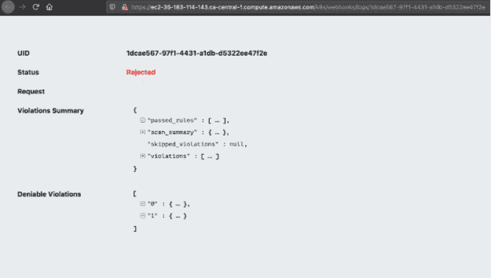
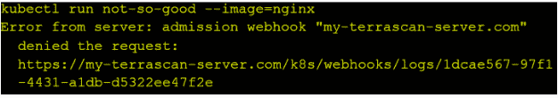

# Accurics 将 Terrascan 漏洞检测扩展到 Kubernetes 运行时

> 原文：<https://thenewstack.io/accurics-extends-terrascan-vulnerability-detection-into-the-kubernetes-runtime/>

基于[云本地计算基金会](https://cncf.io/?utm_content=inline-mention) (CNCF) [【开放策略代理(OPA)】](https://www.openpolicyagent.org/)[terras can 开源静态代码分析器](https://github.com/accurics/terrascan)旨在开发周期内扫描基础设施 as 代码(IaC)部署的漏洞和安全合规性问题。

然而，仍然缺少的是一个准入控制，以便在运行时跨 Kubernetes 集群通过单个 IaC 源扩展扫描。为此，云原生安全提供商 [Accurics](https://www.accurics.com/?utm_content=inline-mention) 发布了一个准入控制器来完成这一任务，用于 Kubernetes 集群，以及用 [Helm](https://helm.sh/) 和 [Kustomize](https://kustomize.io/) 管理的代码层。

 在 Terrascan 准入控制器发布之前，DevOps 团队可以使用 Terrascan 和其他 IaC 安全扫描器来发现开发和构建过程中的漏洞，但他们必须为他们的 Kubernetes 集群单独部署不同的准入控制器，[accu RICS 开源负责人 Amir Benvenisti](https://www.linkedin.com/in/amir-benvenisti) 告诉新堆栈。他说，这些工具必须单独配置，并且可能使用不同的安全策略。

Benvenisti 说，自从 Terrascan 的准入控制器发布以来，DevOps 团队“能够使用相同的工具和配置来实施安全控制，从开发到运行时都是如此”。在使用 Terrascan 扫描正在开发的 IaC 之前，团队还可以使用 Terrascan 的一套 Kubernetes 策略，或创建自己的策略，“快速修复漏洞”。

Benvenisti 说，使用单个准入控制器来扫描整个开发管道中的 IaC 代码，一旦部署在运行时环境中，当然就消除了操作负担。此外，没有任何扫描是 100%万无一失的，因为一旦部署了代码，漏洞就会暴露出来，或者遵从性策略会发生变化。运行时环境中也可能会无意中引入不安全的映像，而攻击者会试图注入代码来组成基础设施和网络。

Benvenisti 说，Terrascan 准入控制器因此可以对运行时集群环境实施策略，以确保“通过使用 Terrascan 作为准入控制器，不会意外或恶意地接纳错误配置的资源”。

Terrascan 准入控制器的发布也是对 [Kubernetes Auth 特殊利益集团](https://github.com/kubernetes/community/blob/master/sig-auth/README.md)决定反对其 [PodSecurityPolicy](https://kubernetes.io/docs/concepts/policy/pod-security-policy/) 的回应。Accurics 指出，这使得 Kubernetes 集群容易受到常见错误配置或过度权限的攻击。在…期间

PodSecurityPolicy 是一个集成的准入控制器，有几个缺陷，集群上的代码执行策略仍然继续“在确保集群安全方面发挥着至关重要的作用，”Benvenisti 说。PodSecurityPolicy 的反对只是承认需要一种不同的方法来在群集级别实施安全策略。虽然 PSP 的替代品来自 Kubernetes 社区，但这可能会提供一个最小的‘默认安全’配置，”Benvenisti 说。“我们认为 Terrascan 的准入控制器是另一种不同的方法。我们相信许多团队会发现这是一种更简单的方式来实施强大的安全控制，特别是因为它包含了我们庞大且不断增长的策略集。”

将 Terrascan 准入控制器用于 IaC 安全扫描现在从生产管道扩展到运行时环境也代表了不可变基础设施的潜在进步。正如[德勤咨询](https://www.linkedin.com/in/michael-liedike-3791b531/)创新与平台团队经理[迈克·李代克](https://www2.deloitte.com/global/en/services/consulting-deloitte.html)在最近一期 [The New Stack Makers](https://thenewstack.io/why-well-oiled-devops-rides-on-immutable-infrastructure/) 播客中所描述的，不可变基础设施有助于创建一个更一致的环境，“在你的整个系统舰队中，这给你一个更简单、更可预测的部署，”李代克说。

为了安全起见，Terrascan 准入控制器等工具有助于提高部署的一致性，从而使基础设施更加“不可改变”

Liedike 说:“不可变的基础设施允许你更一致地进行测试，并从开发到测试再到生产提升你的环境。”

<svg xmlns:xlink="http://www.w3.org/1999/xlink" viewBox="0 0 68 31" version="1.1"><title>Group</title> <desc>Created with Sketch.</desc></svg>