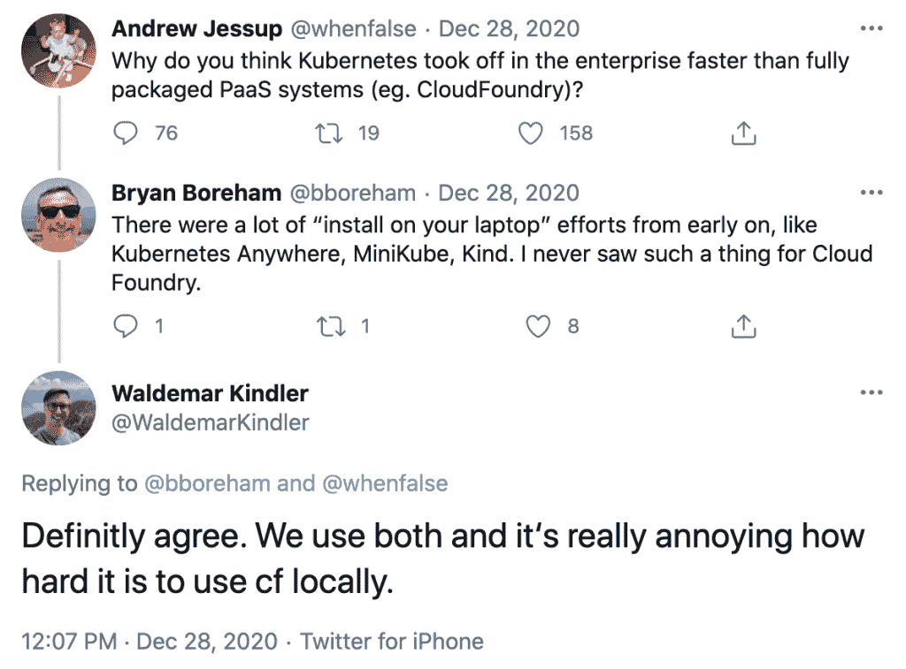
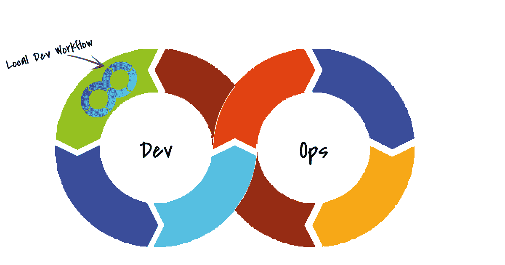
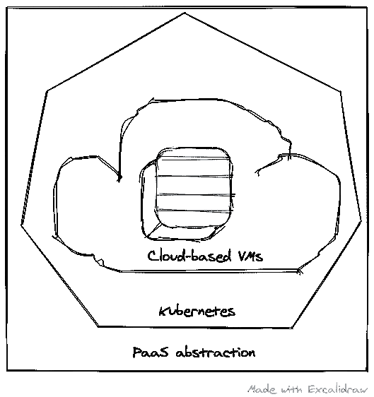

# 利用 Kubernetes 在 Cloud Foundry 上实现生产平价和本地开发工作流

> 原文：<https://thenewstack.io/achieving-production-parity-and-local-development-workflows-on-cloud-foundry-with-kubernetes/>

在一个非常多事的 2020 年接近尾声时，社交媒体上的一段自发对话引起了我的注意。在随后的戏谑中，许多关于云铸造厂的有趣方面浮出水面，但有一个特别的方面触动了神经。

【T2

 [拉姆·艾扬格

Ram 实际上是一名工程师，本质上是一名教育家。在他作为一名开发人员的旅程中，他被推上了技术福音传道者的位置，并且从那以后再也没有回头看！他喜欢帮助世界各地的工程团队发现新的和创造性的工作方式。](https://www.linkedin.com/in/ramanujank/) 

那个[交换](https://twitter.com/WaldemarKindler/status/1343332641844690944)指的是在本地使用 [Cloud Foundry](https://www.cloudfoundry.org/?utm_content=inline-mention) 并在开发者机器上测试带有 cf 推送体验的应用。这篇文章是对这些人的回应。我们将承认这些观察的有利位置，展示 Cloud Foundry 如何发展来解决这个问题，以及解决方案是什么样子的。

但是首先:什么是“本地使用”和“安装在你的笔记本电脑上”？

任何开发人员——企业或其他——都希望得到关于他们刚刚编写的软件的反馈。在本地运行他们的应用程序提供了即时的满足感，从关闭反馈回路和确保应用程序工作的角度来看，这是非常重要的。

虽然这些短语在微观层面上只是指在开发机器上本地运行应用程序的方式，但它们代表了一个更大、更重要的目标，即生产奇偶校验。让开发环境尽可能地与生产环境保持一致在很多方面都有帮助，从根本上来说就是防止了著名的“它在我的机器上工作”的问题。

12 因素方法学[提倡开发/生产对等](https://12factor.net/dev-prod-parity),还确定了开发环境脱离生产环境的许多方式。概括的三个原因是:时间差距、人员差距、工具差距。工程团队从保持开发环境与生产环境相同中受益匪浅。在创建上述反馈循环的过程中，有时开发人员倾向于绕过工具的规则，为了建立一个快速的(更)反馈循环，最终创建了一个与上游运行的环境非常不同的环境。

几个 PaaS 工具已经采用了不同的方式来帮助提供本地开发和生产环境之间的对等性。一些例子是 OpenShift 和 MiniShift， [Lando](https://lando.dev/) ， [Kalabox](https://kalabox.io/) (Nanobox)，PHP 专用的[vagger](https://www.vagrantup.com/)，还有很多。Cloud Foundry(基于 BOSH)也有一个 cf dev 形式的[解决方案，但是与生产环境的相似性相当低。尽管使用了这些 PaaS 工具，但 dev 和 prod 之间的相似性仍然有很多不足之处。](https://github.com/cloudfoundry-incubator/cfdev)

通过提供底层基础设施的完整抽象，Kubernetes 为开发人员提供了简洁的优势。当应用程序被部署到运行在任何基础设施上的 Kubernetes 时，它们的行为都是一样的。在开发、试运行、测试和生产环境中使用 Kubernetes 对开发/生产奇偶校验有很大帮助。另一方面，这在部署应用程序时引入了一些复杂性。这在很大程度上影响了小团队。基于 Kubernetes 的部署越来越复杂的例子不胜枚举。

Kubernetes 和 PaaS 工具都在一定程度上单独解决了这些问题。总之，似乎有一种融合的体验，可能是完美的开发人员体验，开发和生产之间接近 100%的均等。

Cloud Foundry 将 Kubernetes 整合到其架构中的[演变是一次范式转变。通过连接到 Kubernetes 端点，Cloud Foundry 现在可以在更广泛的基础设施上提供其久经考验的开发人员体验。这项工作已经成型为](https://www.cloudfoundry.org/blog/cloud-foundry-helps-developers-overcome-kubernetes-challenges/) [cf-for-k8s 项目](https://www.cloudfoundry.org/technology/cf-for-k8s/)，并且最近通过了重要的 2.0 里程碑。通过 **cf-for-k8s** ，开发者可以使用 cf push 将他们的应用部署到基于 Kubernetes 的基础设施上。这个跋将保持真实，不管他们使用什么目标实例。

统一的 cf 推送体验可以在 CI/CD 管道中实现，因此测试、试运行、预生产和生产环境都将使用相同的命令集进行部署；并使用相同的底层工具构建不可变的工件，从而提供最佳的开发/生产奇偶校验。

在不忽略基于 cf 的本地部署问题的情况下，这里有一个快速入门指南，可以帮助那些有兴趣使用 **cf push** 体验基于 Kubernetes 的本地部署的人。

## 先决条件

您将需要以下工具来完成 **cf-for-k8s** 的本地安装。安装说明已链接到列出的每个工具。

主要地，安装说明遵循与你安装到任何基于云的 Kubernetes 集群(GKE、数字海洋、Azure)相同的过程。有一些细微的变化，这些变化在下面适当地指出。

这将为您提供一个本地 Kubernetes 集群，它将在其上提供云铸造 PaaS 体验。我们相信这种组合非常强大、简单，并提供了完整的开发人员体验——包括开发人员工作流程中至关重要的开发/生产对等。它还解决了拥有本地云铸造部署的历史难题。

**cf-for-k8s** 让各类开发者的本地开发变得简单。这种在本地开发机器上安装 **cf-for-k8s** 的方法得到了我们的开源贡献者社区、商业云铸造厂商(如 [VMWare Tanzu](https://tanzu.vmware.com/developer/guides/kubernetes/cf4k8s-gs/) )以及我们的[系统集成商](https://www.starkandwayne.com/blog/running-cf-for-k8s-on-minikube/)的认可。

*加入我们的 [Slack 社区](https://slack.cloudfoundry.org/)，与我们的贡献者直接合作。您也可以通过我们的 [Twitter](https://twitter.com/cloudfoundry) 和 [LinkedIn](https://www.linkedin.com/company/cloud-foundry) 账号联系我们。*

通过 Pixabay 引导图像。

<svg xmlns:xlink="http://www.w3.org/1999/xlink" viewBox="0 0 68 31" version="1.1"><title>Group</title> <desc>Created with Sketch.</desc></svg>