# Acorn，一个适用于 Kubernetes 的轻量级便携式 PaaS

> 原文：<https://thenewstack.io/acorn-a-lightweight-portable-paas-for-kubernetes/>

Rancher 创始人推出的新应用程序部署框架 Acorn 非常接近我对运行在 Kubernetes 之上的开发环境的期望。

很长一段时间以来，我一直倡导一种简化的方法来开发和部署针对 [Kubernetes](https://thenewstack.io/category/kubernetes/) 的应用程序。我已经[强调了](https://thenewstack.io/azure-container-apps-do-we-need-yet-another-managed-container-service/)对可移植的、透明的、开源的应用层的需求，该应用层将在开发人员的笔记本电脑中部署的 Minikube 集群或公共云中提供的大规模多节点集群中持续运行。

Acorn 由最受欢迎的 Kubernetes 发行版 [K3s](https://k3s.io) 的创作者 Darren Shepherd 和他的团队设计，它遵循了一些使 Rancher 的产品受到云本地社区欢迎的相同原则。它是开源的、简单的、轻量级的、可移植的框架，可以在 Kubernetes 上部署和扩展微服务。

使用 Acorn 的开发人员和操作人员不需要了解 Kubernetes 的具体细节。如果他们了解卷、秘密、配置图和入口等内部信息，这将是一个额外的奖励。但是 Acorn 用自己的类似 JSON 的领域特定语言(DSL)抽象了 Kubernetes 的复杂性，以描述基于[微服务设计模式](https://thenewstack.io/category/microservices/)的现代应用。

像 Cloud Foundry 这样的 PaaS 的承诺是将代码推送到运行时，然后带着 URL 离开。Acorn 恰恰专注于接受源代码或容器映像并发布端点的工作流。在幕后，它完成了与 Kubernetes API 协商的繁重工作，以创建连接它们所需的资源和管道。

虽然已经有了像[亚马逊网络服务](https://aws.amazon.com/?utm_content=inline-mention)’[App Runner](https://aws.amazon.com/apprunner/)、 [Azure 容器应用](https://azure.microsoft.com/en-us/services/container-apps/)和[谷歌云运行](https://cloud.google.com/run)这样的努力，来带来类似 PaaS 的体验来部署容器化的工作负载，但它们仅限于公共云环境，并且不可移植。Acorn 是少数几个可以从运行在开发者笔记本电脑上的[类](https://kind.sigs.k8s.io/)集群无缝扩展到云中多节点集群的框架之一。

本文分析了 Acorn 的架构，并深入幕后了解 Acorn 部署如何转化为 Kubernetes 对象。

让我们详细地看一下架构。

### 在 Minikube 中设置环境

在 Mac 上安装 [Minikube](https://minikube.sigs.k8s.io/docs/) 并在其上启用 Nginx Ingress。入口是 Acorn 最重要的先决条件之一。

```
minikube addons enable ingress

```


用家酿安装 Acorn CLI，并检查其版本，以确保它已安装。

```
brew install acorn-io/cli/acorn

```


我们现在准备在 Minikube 中安装 Acorn。运行 `acorn init` 来配置 Minikube。

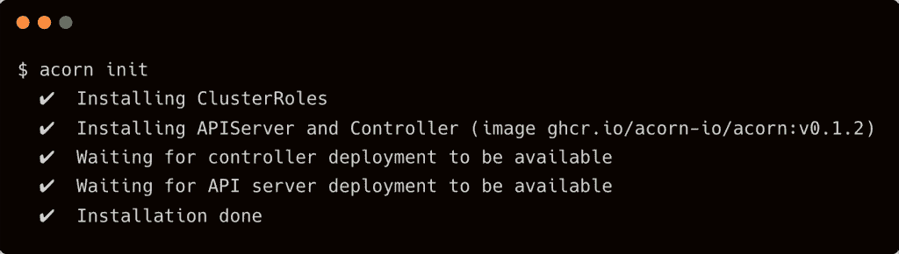

在 Kubernetes 集群中安装 Acorn 会创建一组资源来处理应用程序的构建时间和运行时需求。让我们从名称空间开始。

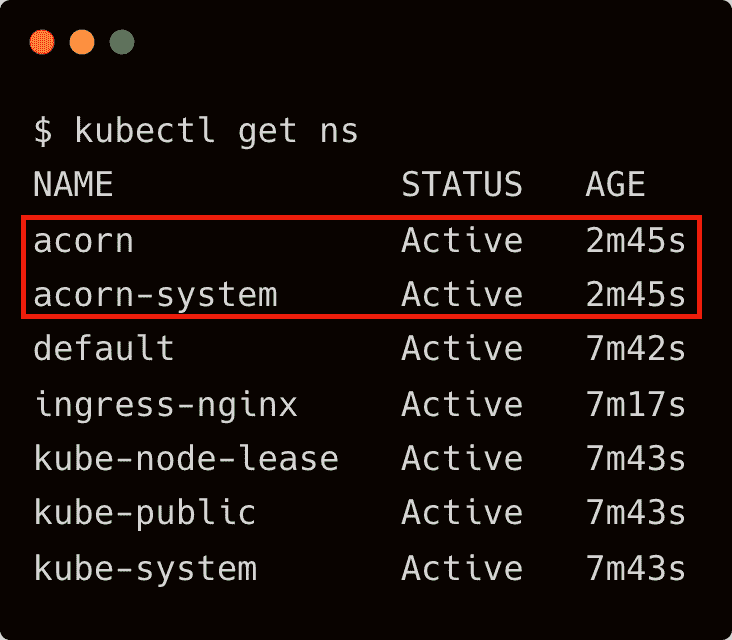

名称空间包含 API 和控制器，它们是运行时环境的组件。当在开发环境中运行时，相同的命名空间可以选择性地运行图像构建器和图像注册表。另一个名称空间`acorn`是为应用程序保留的，我们将在下一节中探讨。

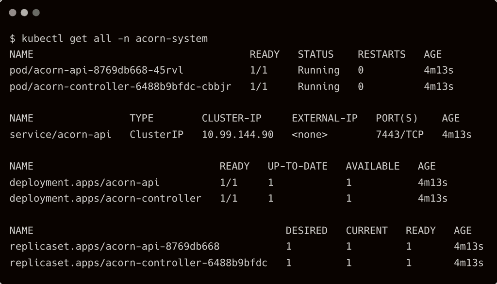

安装程序在集群中只创建一个自定义资源定义(CRD)。CRD，`AppInstance.internal.acorn.io`映射到集群中运行的 Acorn 应用程序。

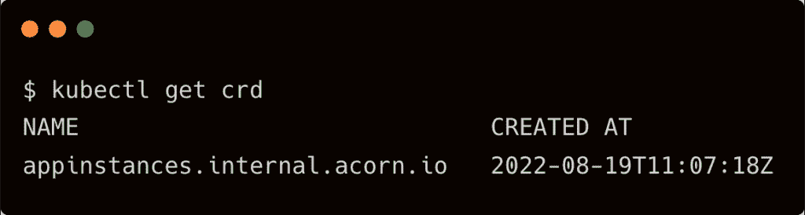

Acorn API 服务器通过聚合与 Kubernetes API 服务器相关联。Acorn CLI 与 API 服务器`api.acorn.io`对话。由于 Acorn 利用 Kubernetes API 聚合，CLI 只需要 Acorn API 组的 RBAC 权限。

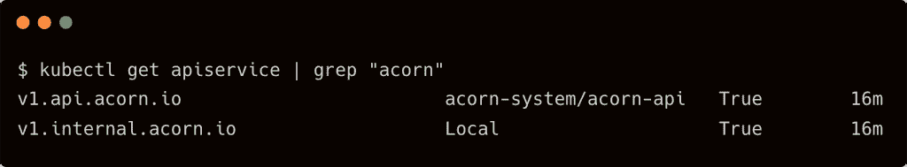

API 服务器将入站请求传递给 acorn 控制器，acorn 控制器将应用程序定义转换成适当的 Kubernetes 资源，如部署、配置映射、机密和卷。控制器负责通过创建和终止下游 Kubernetes 资源来管理 Acorn 应用程序的生命周期。

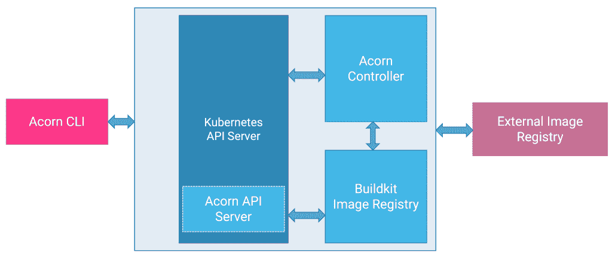

### 部署 Acorn 应用程序

让我们从创建一个最简单的 Acorn 应用程序开始，它只有一个基于 Nginx 映像的 web 服务器。

在空目录下创建一个`Acornfile`，内容如下:

```
containers:  {
  web:  {
  image:  "nginx"
  ports:  {
  publish:  "80/http"
  }
  }
}

```

定义不言自明。我们基于 Docker 注册表中的 Nginx 映像启动了一个名为“web”的容器，并使其在端口 80 上可用。

用下面的命令运行 acorn file:

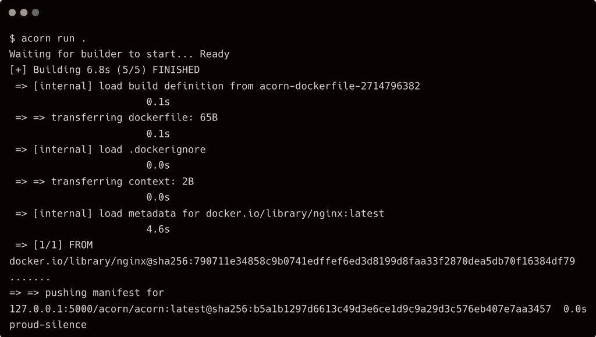

由于我们没有为应用程序提供名称，Acorn 分配了一个随机的名称，proud-silence。

当我们调用 run 命令时，Acorn 创建了一个 OCI 清单，并将其推送到运行在`acorn-system`名称空间内的内部注册服务。也可以为这些 OCI 工件使用外部注册表。

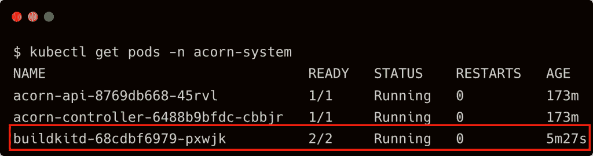

让我们通过运行以下命令来获取访问应用程序的 URL:


让我们访问 web 服务器来测试应用程序。

```
curl  -H  "host: web.proud-silence.local.on-acorn.io"  `minikube ip`

```

现在，让我们看看这个简单的应用程序对我们的 Kubernetes 集群做了什么。

首先，我们注意到有一个新的名称空间作为应用程序的边界。

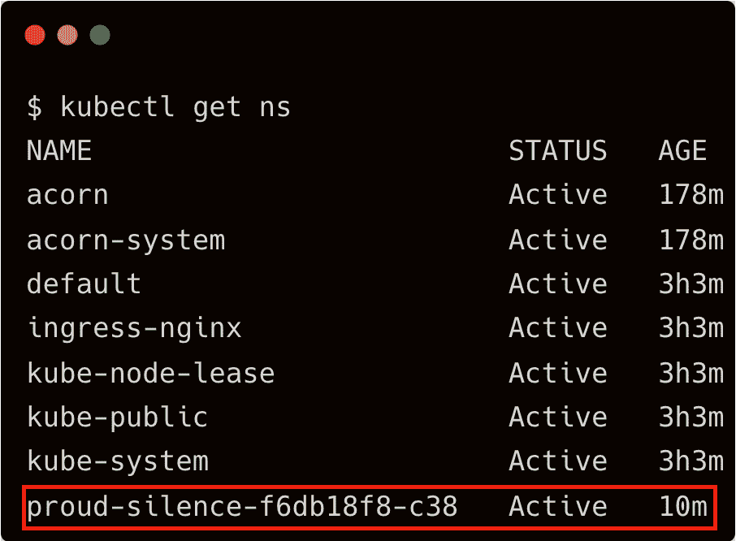

让我们检查一下这个名称空间。正如预期的那样，app run 命令创建了一个 Kubernetes 部署、replicaset、pod 和一个集群 IP 服务。

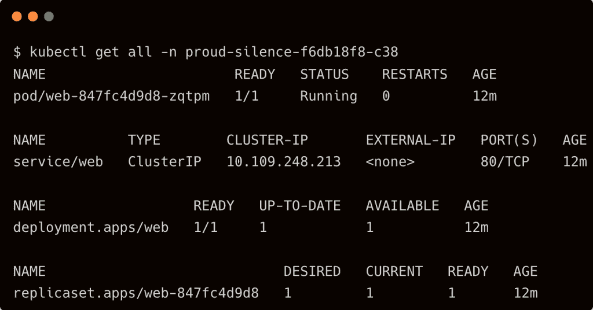

集群 IP 服务通过入口资源向外界公开，我们稍后将对此进行探讨。

当我们检查`acorn`名称空间时，我们发现了 CRD 的实例 AppInstance。

`kubectl get appinstances -n acorn`

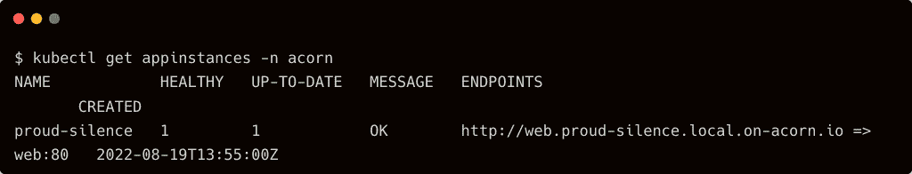

重新回顾入口的概念来公开 web 应用程序，让我们看看是否可以在应用程序名称空间中找到入口资源。

```
kubectl get ingress  -n  proud-silence-f6db18f8-c38

```

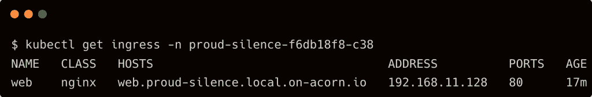

每个“发布”端口的 Acorn 应用程序都有一个在 Kubernetes 中创建的相关入口对象。

由于应用程序按预期运行，它现在可以被标记并推送到外部注册表。管理工作负载的运营团队可以将其部署到生产集群，而无需了解应用程序的任何内部信息。

Acorn 让我着迷的是它的简单性和可移植性。它将 Kubernetes 视为部署、扩展和运行应用程序的理想运行时环境，没有任何假设。它不会篡改集群并部署最少的资源，仅够运行微服务。当我们从开发集群上下文切换到另一个上下文并部署应用程序时，它被推送到生产集群，从这个意义上说，它是真正可移植的。

Acorn 深受 Docker 的影响，并遵循一些熟悉的模式来运行多容器应用程序。和 Cloud Foundry 一样，它也支持绑定其他 app 中部署的数据库、缓存等现有服务。

一旦 Acorn 支持从包含 Acornfile 的 Git repo 直接部署的能力，DevOps 管理基于微服务的应用程序就变得极其容易。

在本系列的下一部分中，我将展示一个基于 Acorn 的微服务应用程序的真实示例，该应用程序跨开发环境和生产集群运行。敬请关注。

<svg xmlns:xlink="http://www.w3.org/1999/xlink" viewBox="0 0 68 31" version="1.1"><title>Group</title> <desc>Created with Sketch.</desc></svg>