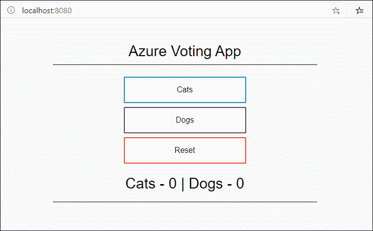

# Docker Compose 用户眼中的橡子

> 原文：<https://thenewstack.io/acorn-from-the-eyes-of-a-docker-compose-user/>

在我们关于为 Kubernetes 提供服务的 [Acorn 平台系列的](https://acorn.io/)[最后一篇文章](https://thenewstack.io/acorn-a-lightweight-portable-paas-for-kubernetes/)中，我介绍了 Acorn 部署框架的架构和设计。本教程将比较 Acorn 与 Docker Compose 和 Kubernetes 对象定义。

在继续下一步之前，请确保您遵循了上一教程中解释的在 Minikube 上安装 Acorn 的步骤。

## 步骤 1:探索 Azure Vote 微服务应用程序

让我们选择一个受 Docker 开发人员欢迎的简单容器化应用程序 Azure Vote 应用程序。

该应用程序由两层组成——Python Flask 前端和 Redis 后端。这个微服务应用程序的每一层都被部署为一个容器。

为了探索部署工件，克隆 [GitHub 存储库](https://github.com/Azure-Samples/azure-voting-app-redis.git)并打开文件[azure-vote-all-in-one-redis . YAML](https://github.com/Azure-Samples/azure-voting-app-redis/blob/master/azure-vote-all-in-one-redis.yaml)

```
git clone https://github.com/Azure-Samples/azure-voting-app-redis.git

```

```
cd azure-voting-app-redis

```

该目录由所有资产组成，包括 Docker 合成文件和源代码。

 `azure-voting-app-redis
│ azure-vote-all-in-one-redis.yaml
│ docker-compose.yaml
│ LICENSE
│ README.md
│
├───azure-vote
│ │ app_init.supervisord.conf
│ │ Dockerfile
│ │ Dockerfile-for-app-service
│ │ sshd_config
│ │
│ └───azure-vote
│ │ config_file.cfg
│ │ main.py
│ │
│ ├───static
│ │ default.css
│ │
│ └───templates
│ index.html
│
└───jenkins-tutorial
config-jenkins.sh
deploy-jenkins-vm.sh` 

使用 Docker Compose 启动应用程序并访问 web 应用程序。



现在我们有了一个工作的 Docker Compose 应用程序，让我们将概念映射到 Acorn。

## 步骤 2:将 Azure Vote 应用程序移植到 Acorn

从技术上讲，我们不需要移植应用程序。因为 Docker Compose、Acorn 和 Kubernetes 的构建块是容器映像，所以我们将重点关注如何将定义映射到 Acorn。

打开 Docker Compose 文件，查看一下服务定义。


第 3 行到第 9 行定义了 Redis 服务，方法是提取映像，设置环境变量以启用空白密码，并暴露端口。剩下的几行从驻留在`azure-vote`目录中的 Dockerfile 构建容器映像，将 web 应用程序连接到 [Redis 后端](https://redis.com/?utm_content=inline-mention)，并在端口 8080 上公开它。

现在让我们为同一个应用程序创建 Acorn 定义。创建一个名为 Acorn 的目录，其中包含 Acorn 文件。

```
mkdir Acorn  &amp;&amp;  cd Acorn

```

```
containers:  {
  "azure-vote-back":  {
  image:  "mcr.microsoft.com/oss/bitnami/redis:6.0.8"
  ports:  {
  expose:  "azure-vote-back:6379/tcp"
  }
  env:  {
  "ALLOW_EMPTY_PASSWORD":  "yes"  
  }
  }
  "azure-vote-front":  {
  build:  "../azure-vote"  
  ports:  {
  publish:  "80/http"
  }
  env:  {
  "REDIS":  "azure-vote-back"  
  }

  }  
}

```

使用下面的命令运行应用程序:


通过运行`acorn apps`命令获取应用程序的 URL。


在[修改主机头](https://modheader.com/)之后访问 minikube IP，在浏览器中显示 Azure Vote 应用程序。


很明显，Acornfile 类似于 Docker Compose 文件。


除了部署目标之外，定义和结构是相似的。Docker Compose 在 Docker 引擎的上下文中运行，而 Acorn 的目标是 Kubernetes 集群。

请随意比较和对比 Kubernetes YAML 文件和 Acornfile。Acorn 简化了多容器工作负载的定义，同时将其转换为相应的 Kubernetes 对象。

当您探索为 Acorn 应用程序创建的名称空间时，您可以看到 Acorn 如何将定义转换成 Kubernetes 对象。


## 步骤 3:用 Acorn 链接资源

诸如 Cloud Foundry 等 PaaS 实现[支持将数据库和缓存等有状态资源与一个或多个无状态服务绑定。这种方法使得重用服务成为可能，而无需重新创建服务或处理复杂的跨资源同步。](https://thenewstack.io/when-to-choose-cloud-foundry-over-kubernetes/)

Acorn 通过一种简化的方法为 Kubernetes 应用程序带来了绑定。它在绑定现有服务方面模仿 Cloud Foundry。在 Acornfile for Azure Vote 应用程序中，我们有一个 Redis 服务，可以绑定到部署在另一个应用程序中的服务。


为了探索这个概念，创建一个新目录和一个 Acornfile，内容如下:

```
containers:  {
  "redis-cli":  {
  image:  "redis:6.2.7"
  }
}

```

该文件基于 Redis 映像创建一个带有单个微服务的 Acorn 应用程序。这个想法是利用这个应用程序中的 Redis 客户端 CLI 来访问运行在 Azure Vote 应用程序中的 Redis 服务器。

使用下面的命令启动应用程序:

```
acorn run  --name redis-client  --link silent-sun:azure-vote-back  .

```

注意开关`--link`，它将当前应用程序(redis-client)与 silent-sun Acorn 应用程序的 azure-vote-back 服务链接起来。

使用`acorn exec`命令访问容器。


让我们连接到 Redis 主机来访问 Azure Vote 应用程序存储的键/值数据。


我们现在能够为多个客户端重用一个 Redis 后端。有趣的是，Redis 客户端可以使用 Azure Vote Acornfile 中提到的主机名连接到服务器。

在幕后，Acorn 创建了一个带有 redis-client 应用程序名称空间的服务。这个服务的独特之处在于它属于 ExternalName 类型。根据 Kubernetes [文档](https://kubernetes.io/docs/concepts/services-networking/service/#externalname)，ExternalName 服务是服务的一个特例，它没有选择器，而是使用 DNS 名称。在这种情况下，DNS 名称 azure-vote-back 简单地指向驻留在 Azure Vote 应用程序名称空间 silent-sun 中的服务。


使用 ExternalName service 跨应用程序绑定服务是利用 Kubernetes 原语模仿 PaaS 功能的一种聪明方式。

在本系列的下一部分中，我们将探索在开发环境中迭代代码以及将 Acorn 应用程序迁移到生产环境中所涉及的工作流。敬请关注。

<svg xmlns:xlink="http://www.w3.org/1999/xlink" viewBox="0 0 68 31" version="1.1"><title>Group</title> <desc>Created with Sketch.</desc></svg>