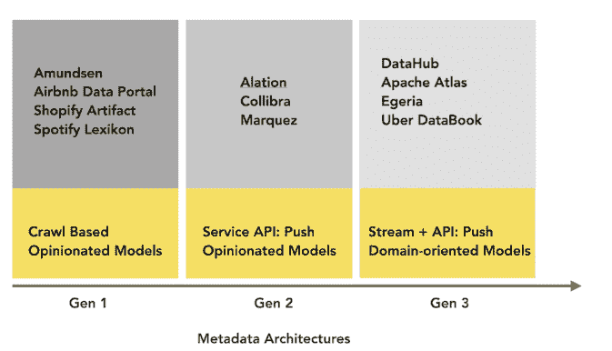

# 丙烯数据提供实时元数据管理

> 原文：<https://thenewstack.io/acryl-data-offers-real-time-metadata-management/>

Acryl Data 的创始人在 LinkedIn 和 Airbnb 工作时了解到的一件事是，元数据是不断变化的，依赖批处理的流程无法跟上今天的动态数据工作量。

“当我(在 LinkedIn)领导一系列此类项目时，我解决了这个问题一次、两次、三次。我认为，我们花了三次时间才把它做好，”Acryl Data 首席执行官[希尔山卡·达斯](https://github.com/shirshanka)说。

“关键的观察结果是，元数据基础架构的构建方式必须与数据基础架构保持一致。因此，老派的元数据基础设施，以及在许多情况下，市场上的许多当前技术，都是非常面向爬行的，就像你连接到系统中，然后你只是试图理解这一切。它是面向批量的，但这不是今天的真实世界。”

他和来自 Airbnb 的 [Swaroop Jagadish](https://www.linkedin.com/in/swaroopjagadish/) ，也曾在 LinkedIn 工作过，开始围绕[数据中心](https://datahubproject.io/)建立一家公司，LinkedIn 于 2020 年 2 月开放了元数据搜索和发现平台。

他们与许多公司进行了交谈，这些公司在其堆栈中使用了许多不同的工具，而有关其数据的元数据却在不断变化。所以你必须不断地监听事件，达斯说。

他们采用流优先、开发者优先的方法来收集元数据。

该平台不是观察随后发生的事情，而是测量所有的原始点和数据转换的位置，以创建一个全面的实时元数据图表。

该公司首席技术官贾加迪什(Jagadish)表示:“然后，你将有能力在所有数据生态系统中推动真正令人愉快的搜索和发现体验。”。“无论是 API、摄取管道、仓库、机器学习模型、仪表盘，您关心的一切都在这个保持新鲜的综合图表中。”

### **流媒体加 API 优先**

Das 是 LinkedIn 大数据的总设计师。其团队创建了数据中心和其他数据项目。Jagadish 是 Airbnb 数据平台和搜索基础设施的负责人，创建了[数据门户](https://medium.com/airbnb-engineering/democratizing-data-at-airbnb-852d76c51770)，之前也在 LinkedIn 工作。

除了 DataHub，该平台还采用了 Apache Gobblin，这是一个分布式数据集成框架，也是 LinkedIn 开发的。它是面向事件的，可以接收和存储任何种类的大型元数据模型。它是开放的、灵活的和可定制的。

Expedia、Saxo Bank、Klarna 都是 DataHub 的用户，他们将 data hub 作为构建自己的元数据图的框架，以连接和编译他们的各种数据源。

通过基于 Apache Kafka 的流架构，Acryl 数据平台提供了跨不同数据工具的公共元数据基础。该平台正处于私人测试阶段，正如该公司的数据目录一样，这是一个企业级 SaaS 产品，使数据专业人员能够搜索和探索他们的整个多云数据生态系统。

根据 Das 的说法，凭借该平台的 API 优先设计，公司可以在其数据架构中实施数据运营实践，为其分析和人工智能(AI)工件提供安全、可重复的进化。用户还可以在元数据的基础上构建策略。策略是提供给引擎的程序性指令，描述元数据上的谓词，表示数据集的某个类别。

例如，一个机器学习模型根据从外部合作伙伴获取的数据集中的某些属性来预测抵押贷款的批准情况。

“事情可以在任何时候发生，并且可以以各种方式发生:数据集的模式可能会以意想不到的方式改变，或者数据的形状可能会以意想不到的方式改变。贾加迪什指出:“数据集的所有者可能已经不在了。

他说，如果数据集的特征发生变化，从而改变了你的机器学习功能，而不是训练管道继续进行，那么工作流可能会被设置为中断这个过程，并触发人们用来采取行动的警报。

在合规和治理方面，类似于 Airbnb 为其数据堆栈分配[青铜、黄金和白银](https://medium.com/airbnb-engineering/data-infrastructure-at-airbnb-8adfb34f169c)称号的方式，你可以创建一个管道来分配元数据规范，以分配隐私分类，并为机器学习模型分配关于这些注释是否实际正确的置信度分数。

“我们是合规平台吗？我们是数据生产力平台吗？我们实际上是一个元数据基底，你可以通过向元数据分配策略，在它的基础上建立一系列与合规性或治理相关的工作流，”Das 说。

### 规模、成熟度

因为开源 DataHub 已经存在好几年了，主要企业在生产中使用它，他们对平台的规模和成熟度充满信心。Das 说，该项目在 GitHub 上有超过 3300 颗星，自今年年初以来，在 Slack 频道上关注该公司的人数翻了两番。

该公司专注于提供一种易于消费的 SaaS 产品，并在此基础上构建通用的工作流程:数据科学家如何验证一个指标是可靠的？在上下文中提供什么样的正确过程信号？贾加迪什说，如何将上下文融入搜索体验，而不会让用户不知所措。

总部位于加州山景城的公司[6 月宣布](https://techcrunch.com/2021/06/23/acryl-data-commercializing-linkedins-metadata-tool-datahub-emerges-from-stealth-with-9m-from-8vc-linkedin-and-insight/)获得由 8VC 领投的 900 万美元融资，LinkedIn 和 Insight 也参与其中。

“现代的数据堆栈需要从根本上重新思考元数据的管理方式。Insight Partners 董事总经理乔治·马休(George Mathew)在谈到这笔资金时说:“我们相信我们需要下一代实时元数据平台，而 Acryl Data 是领导这一转型的最佳团队，因为他们与 Data Hub 进行了开创性的工作。”。(Insight Partners 也在 6 月份收购了新的堆栈。)

### 第三代架构

Das 和 Jagadish 认为 [Collibra](https://www.collibra.com/) 和 [Alation](https://www.alation.com/) 是他们最接近的竞争对手，尽管在一篇关于元数据基础设施演变的博客文章中，Das 将这两个产品列为第二代产品，写道:

“在我们调查的所有系统中，唯一拥有第三代元数据架构的是 [Apache Atlas](https://atlas.apache.org/) 、 [Egeria](https://egeria.odpi.org/) 、[优步数据手册](https://eng.uber.com/metadata-insights-databook/)和[数据中心](https://github.com/linkedin/datahub)。”

他继续说道:

“导致第三代元数据架构的关键见解是，基于‘中央服务’的元数据解决方案难以跟上企业对元数据用例的需求。为了解决这个问题，有两个需求必须得到满足。首先，元数据本身需要是自由流动的、基于事件的和可实时订阅的。第二，元数据模型必须支持随着新的扩展和添加的出现而不断发展——而不会被中央团队所阻止。这将允许多种类型的消费者大规模地消费和丰富元数据。”

盛宝银行的数据整合负责人 Sheetal Pratik 称其使用 DataHub 作为盛宝数据网格架构的现代数据目录非常合适。

“它的第三代可扩展架构已经显示出大规模采用的好处，因为我们加入了新的领域，并将数据管理的各个方面纳入一个有凝聚力的单元，”她在一篇博客文章中写道。

“我们看到了生产效率的提高，因为人们能够在生产前环境中发现模式，然后再将其部署到生产环境中，使他们能够在发生变化之前就意识到变化。”

<svg xmlns:xlink="http://www.w3.org/1999/xlink" viewBox="0 0 68 31" version="1.1"><title>Group</title> <desc>Created with Sketch.</desc></svg>