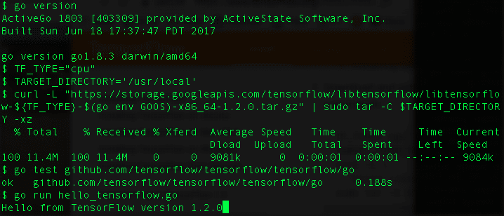
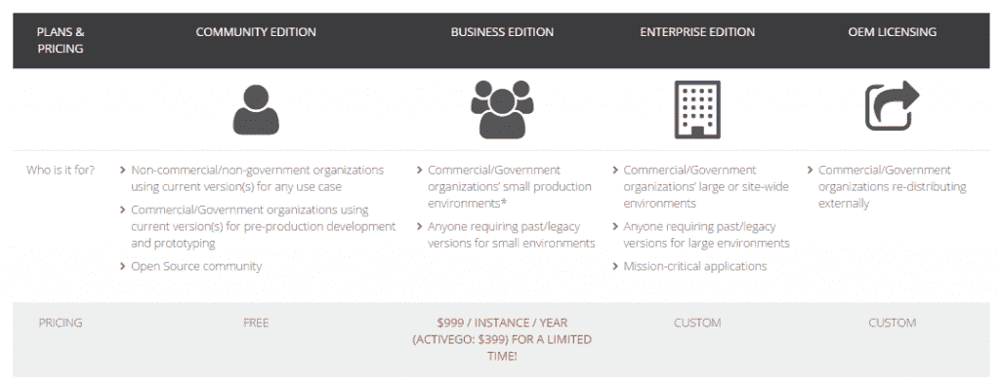
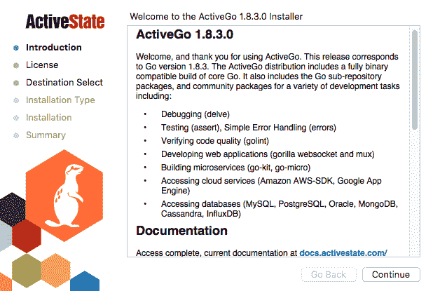

# ActiveGo，来自 ActiveState 的一个新的商业 Go 发行版

> 原文：<https://thenewstack.io/activestate-reveals-commercial-go-distribution-activego/>

开源语言公司 [ActiveState](https://www.activestate.com/) 发布了[围棋编程](/tag/golang/)语言的商业发行版，名为 [ActiveGo](https://www.activestate.com/activego) 。

ActiveGo 旨在通过提供跨平台一致性、商业支持、安全和许可审查以及法律保障，让企业更容易采用 Go。本质上，它是一个来自开源世界的流行 Go 包的企业就绪包，还包括商业支持和许可。

尽管 Go 最初是由 Google 设计的，主要是作为一种系统语言，但它已经为许多 Web 应用程序提供了基础，提供了易部署性和快速性能的最佳组合。

虽然 Go 应用程序是作为静态链接的二进制文件在本地分发的，但是商业分发仍然是企业采用 Go 的一个进步。公司需要保证开源项目在投入生产之前是有效和稳定的。鉴于开源在 Go 开发中扮演着如此重要的角色，以一种安全、许可和受支持的方式发布包含开源库的发行版是非常方便的。

微服务，云集成，机器学习，这些在组装 ActiveGo 的时候都被牢记在心。ActiveGo 已经与超过 70 个集成包捆绑在一起[，允许开发人员快速连接到 Cassandra、Kafka、PostgreSQL、Redis、Oracle、MySQL、SQL Server、Google App Engine、AWS、Memcached 和 TensorFlow 等。](https://www.activestate.com/activego/golang-packages)

ActiveGo 的发布是在该公司能够确定 Go 中伴随企业发展的关键挑战之后。ActiveState 产品管理总监[杰夫·劳斯](https://www.linkedin.com/in/jeffrouse/?ppe=1)说:“首先，让企业开发人员根据需要直接从 GitHub 获取代码并不可行。

“我们的客户希望在他们可以消费的时间范围内获得更新。许多项目每周都在变化，很少有组织能以这样的速度应对变化，”Rouse 说。

无论技术看起来有多好，ActiveState 的客户在进入 Go 之前都在寻求公司的支持。此外，他们需要一家公司在实施之前审查软件包和许可证。ActiveGo 计划解决所有这些问题，包括商业支持、许可和安全性。

现在，客户可以通过商业和企业订阅服务获得 ActiveGo。不过，如果你是一名开发人员，想尝试一下 ActiveGo，你可以在这里下载社区版[，并将其用于内部测试和开发。](https://www.activestate.com/activego)

ActiveState 成立于 1997 年，已经为许多当今最流行的开源语言提供了商业发行版，包括 ActivePerl、ActivePython 和 ActiveTcl。该公司还提供了 [Komodo](https://www.activestate.com/komodo-ide) 集成开发环境。据该公司称，ActiveState 软件被 200 多万开发人员和 97%的财富 1000 强企业使用。

<svg xmlns:xlink="http://www.w3.org/1999/xlink" viewBox="0 0 68 31" version="1.1"><title>Group</title> <desc>Created with Sketch.</desc></svg>